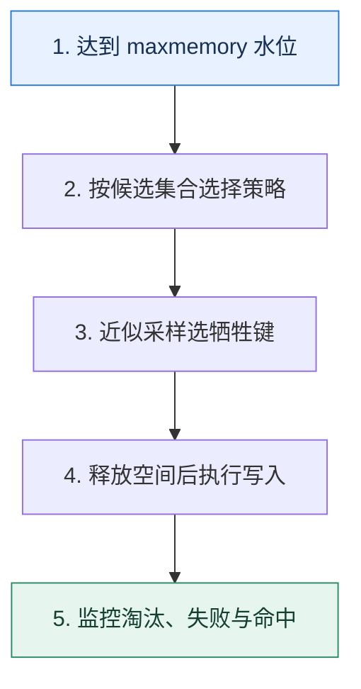

# 缓存淘汰｜内存满时决定牺牲谁

> 本课只回答一个问题：Redis 达到内存上限后，应该拒绝写入还是淘汰某些键？

这是一份独立学习稿。来源资料用于核对知识范围；下面的解释、推演、边界和图示均按工程学习路径重新组织，不依赖原页面也能完整阅读。

## 先补齐：建立正确的心智模型

过期解决键何时失效，淘汰解决内存不足时如何腾空间，两者不能混为一谈。策略选择取决于哪些键可丢、是否都设置 TTL，以及访问频率能否代表未来价值。

读这一课时，始终把“组件名字”换成三个可追踪对象：**谁发起动作、状态存在哪里、失败后由谁收敛**。这样遇到不同产品或版本，仍能用同一套模型判断。

## 本节精讲：机制是怎样一步步工作的

`noeviction` 保留现有数据并让会增加内存的写入失败，适合不能默默丢键的场景；`allkeys-*` 在全部键中选择，适合纯缓存；`volatile-*` 只从有 TTL 的键中选择，若候选不足仍可能写失败。LRU 倾向最近少用，LFU倾向频率低，random 简单，TTL 类策略偏向更早到期。Redis 的 LRU/LFU 是近似策略，抽样和元数据开销换取速度。大对象即使热门也可能挤走许多小对象，因此还要治理对象大小。

下面这张图只表达本课最重要的状态推进，蓝色是入口，绿色是可验收的终点；任一箭头失败，都要回到上文寻找重试、回退或人工处理的位置。

### 一次带数字的完整推演

实例上限 20GB，热数据 12GB、偶发数据 15GB。若使用 allkeys-lru，访问波动后会逐步保留近期集合；若业务键中混有不可丢的分布式锁或队列状态，任何全局淘汰都可能破坏正确性，应拆实例并对关键状态使用 noeviction 和持久化设计。

数字的作用不是制造精确感，而是暴露容量和时间关系。把例子中的流量、延迟、分片数或版本号替换成自己的真实数据，方案可能会随之改变。

## 误区与失效边界

策略名字不能替代容量模型。高命中率下仍可能发生写失败或延迟抖动；把缓存与关键协调状态混在同一淘汰域是常见风险。`volatile-lru` 在几乎没有 TTL 键时并不会神奇地从所有键腾空间。

判断一个结论是否可靠，可以追问两次：**它依赖什么前提？前提失效后系统留下了什么状态？** 如果回答只能停在“框架会自动处理”，就还没有走到工程边界。

## 按讲解顺序重建知识链

来源稿覆盖的论证主线在这里被重建成四步，保留问题、推导、反例和收束，不沿用原页面措辞：

1. 先分清过期与淘汰的触发条件。
2. 按 allkeys、volatile 和 noeviction 划定候选集合。
3. 再比较 LRU、LFU、随机与 TTL 倾向的工作负载假设。
4. 最后把关键状态隔离，并用对象大小和命中率验证选择。

把四步连起来后，本课不是一个孤立结论，而是一条可以复演的因果链。需要回查课程覆盖范围时，可打开文末的来源稿；学习时以本页模型为主。

## 工程验证：把理解变成证据

对候选策略回放一天真实访问轨迹，统计命中率、evicted_keys、写失败、P99 和大对象占比。策略切换前确保 maxmemory 有安全余量，并准备在淘汰激增时限流回源。

### 状态检查表

| 步骤 | 状态或动作 | 需要留下的证据 |
| ---: | --- | --- |
| 1 | 达到 maxmemory 水位 | 记录耗时、结果与异常分支，确认状态能进入下一步 |
| 2 | 按候选集合选择策略 | 记录耗时、结果与异常分支，确认状态能进入下一步 |
| 3 | 近似采样选牺牲键 | 记录耗时、结果与异常分支，确认状态能进入下一步 |
| 4 | 释放空间后执行写入 | 记录耗时、结果与异常分支，确认状态能进入下一步 |
| 5 | 监控淘汰、失败与命中 | 记录耗时、结果与异常分支，确认状态能进入下一步 |

检查表不是要求生产系统逐字采用这些字段，而是强迫设计者为每一步提供可观测结果。只有入口、没有终态的流程，最终都会形成无法解释的中间状态。

## 自我检查

为什么把 `volatile-lru` 简单理解为“内存满了就淘汰最久未访问的任意键”是错的？

volatile 策略只在设置了过期时间的键中选择；无 TTL 键不在候选集合。若候选不足，写入仍可能失败。

再做一次闭卷练习：不看上文画出状态图，并为其中任意两个箭头注入超时、进程崩溃或重复请求。如果你能预测最终状态和观测信号，这一课才真正从“听懂”变成“会用”。

## 来源与版本校准

- [查看来源稿（16 页资料整理）](../content/32-cache-eviction.md)

来源稿只用于追溯知识范围，不是本学习稿的正文。具体产品的默认值、命令与内部实现会随版本变化；落地前应使用目标版本官方文档和故障演练再次确认。

本课涉及的产品行为以这些官方资料为校准入口：

- [Redis · Key eviction](https://redis.io/docs/latest/develop/reference/eviction/)
