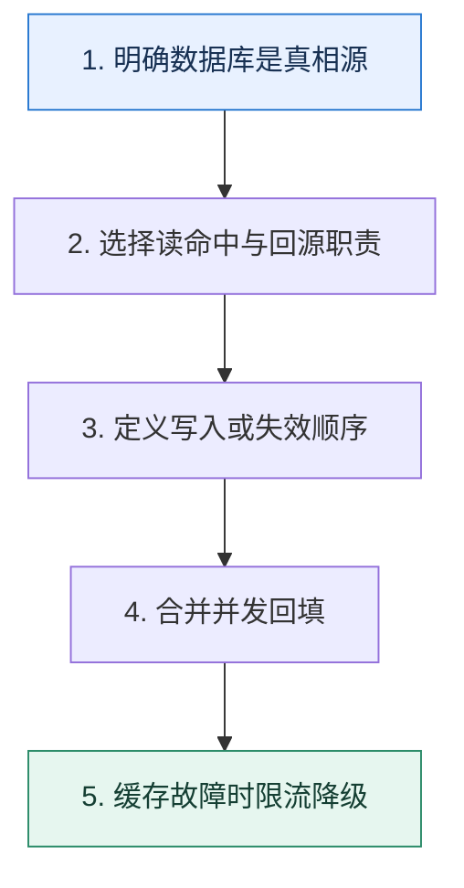

# 缓存读写模式｜把数据所有权与更新路径说清楚

> 本课只回答一个问题：应用、缓存和数据库之间，谁负责读取、回源与写回？

这是一份独立学习稿。来源资料用于核对知识范围；下面的解释、推演、边界和图示均按工程学习路径重新组织，不依赖原页面也能完整阅读。

## 先补齐：建立正确的心智模型

缓存模式描述职责边界，而不是某个固定产品。选择前要确认数据库是否是真相源、能容忍多旧的数据，以及失败时读写应该怎样退化。

读这一课时，始终把“组件名字”换成三个可追踪对象：**谁发起动作、状态存在哪里、失败后由谁收敛**。这样遇到不同产品或版本，仍能用同一套模型判断。

## 本节精讲：机制是怎样一步步工作的

Cache Aside 由应用先读缓存，未命中再读数据库并回填；写入通常先改数据库再失效缓存，简单且常见。Read/Write Through 把回源或同步写交给缓存抽象层，应用更轻但实现复杂；Write Back 先写缓存后异步落库，写入快却把缓存升级为关键数据层；Refresh Ahead 在过期前主动刷新热门键，降低突发未命中。回填时应用 singleflight 或互斥，防止同一键并发击穿。

下面这张图只表达本课最重要的状态推进，蓝色是入口，绿色是可验收的终点；任一箭头失败，都要回到上文寻找重试、回退或人工处理的位置。

### 一次带数字的完整推演

商品详情读 10 万 QPS、更新每分钟一次。Cache Aside 命中时直接返回；未命中首个请求拿回填锁，读数据库后写 60 秒 TTL，其余请求等待或返回旧值。价格更新先提交数据库，再删除缓存；下一次读回填新价格。若允许最多旧 5 秒，也可后台刷新并在短窗口返回旧值。

数字的作用不是制造精确感，而是暴露容量和时间关系。把例子中的流量、延迟、分片数或版本号替换成自己的真实数据，方案可能会随之改变。

## 误区与失效边界

模式本身不保证一致性。Write Back 若缓存节点永久丢失会丢未落库数据；Cache Aside 的并发读写仍可能把旧值回填；缓存层故障时无限回源会压垮数据库。

判断一个结论是否可靠，可以追问两次：**它依赖什么前提？前提失效后系统留下了什么状态？** 如果回答只能停在“框架会自动处理”，就还没有走到工程边界。

## 按讲解顺序重建知识链

来源稿覆盖的论证主线在这里被重建成四步，保留问题、推导、反例和收束，不沿用原页面措辞：

1. 从数据所有权开始，区分缓存副本和主数据。
2. 比较 Cache Aside、Through、Back 与提前刷新的调用路径。
3. 用商品读多写少场景推演命中、失效和回填。
4. 最后补上并发竞态、缓存故障与回源保护。

把四步连起来后，本课不是一个孤立结论，而是一条可以复演的因果链。需要回查课程覆盖范围时，可打开文末的来源稿；学习时以本页模型为主。

## 工程验证：把理解变成证据

为每种模式画失败表：缓存读失败、数据库读失败、缓存写失败、数据库写失败、进程崩溃。每个格子写清返回什么、是否重试、数据会旧多久和怎样修复。

### 状态检查表

| 步骤 | 状态或动作 | 需要留下的证据 |
| ---: | --- | --- |
| 1 | 明确数据库是真相源 | 记录耗时、结果与异常分支，确认状态能进入下一步 |
| 2 | 选择读命中与回源职责 | 记录耗时、结果与异常分支，确认状态能进入下一步 |
| 3 | 定义写入或失效顺序 | 记录耗时、结果与异常分支，确认状态能进入下一步 |
| 4 | 合并并发回填 | 记录耗时、结果与异常分支，确认状态能进入下一步 |
| 5 | 缓存故障时限流降级 | 记录耗时、结果与异常分支，确认状态能进入下一步 |

检查表不是要求生产系统逐字采用这些字段，而是强迫设计者为每一步提供可观测结果。只有入口、没有终态的流程，最终都会形成无法解释的中间状态。

## 自我检查

Cache Aside 中数据库更新成功、删除缓存失败后，为什么不能只依赖下一次读自动恢复？

缓存仍命中旧值，下一次读不会回源，旧数据可能一直保留到 TTL。需要重试失效、变更事件、较短 TTL 或版本校验。

再做一次闭卷练习：不看上文画出状态图，并为其中任意两个箭头注入超时、进程崩溃或重复请求。如果你能预测最终状态和观测信号，这一课才真正从“听懂”变成“会用”。

## 来源与版本校准

- [查看来源稿（25 页资料整理）](../content/33-cache-patterns.md)

来源稿只用于追溯知识范围，不是本学习稿的正文。具体产品的默认值、命令与内部实现会随版本变化；落地前应使用目标版本官方文档和故障演练再次确认。

本课涉及的产品行为以这些官方资料为校准入口：

- [Redis · Key eviction](https://redis.io/docs/latest/develop/reference/eviction/)
- [Redis · Distributed locks](https://redis.io/docs/latest/develop/clients/patterns/distributed-locks/)
