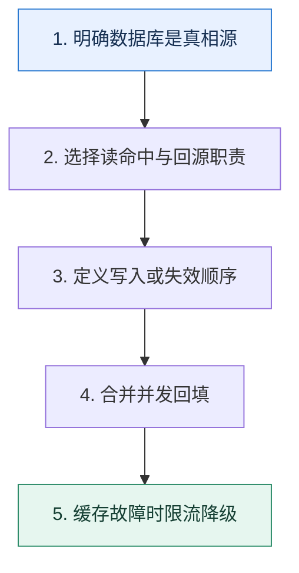

# 缓存读写模式｜把数据所有权与更新路径说清楚

> 本课只解决一个问题：应用、缓存和数据库之间，谁负责读取、回源与写回？

这不是原页面的缩写，也不是一组孤立结论。下面先建立一个能推演的最小世界，再把状态、数字和失败分支摊开，最后按来源讲解顺序覆盖全部知识线索。读完后，你应当能从 `明确数据库是真相源` 一直解释到 `缓存故障时限流降级`，并说明中途任意一步失败会留下什么状态。

## 零基础入口：先建立本课的心智画面

缓存模式描述职责边界，而不是某个固定产品。选择前要确认数据库是否是真相源、能容忍多旧的数据，以及失败时读写应该怎样退化。

先不要急着记组件名。只抓住四个问题：**现在手里有什么输入？下一步只做什么动作？哪个状态发生变化？变化后的结果交给谁？** 之后遇到新框架，只要这四个答案不变，核心机制就没有变。

### 放进一个足够小、可以手算的世界

商品详情读 10 万 QPS、更新每分钟一次。Cache Aside 命中时直接返回；未命中首个请求拿回填锁，读数据库后写 60 秒 TTL，其余请求等待或返回旧值。价格更新先提交数据库，再删除缓存；下一次读回填新价格。若允许最多旧 5 秒，也可后台刷新并在短窗口返回旧值。

这个小世界故意只保留本课必需的对象。生产系统会有更多节点、线程、分片和异常，但数量增加不会改变这里的因果关系。先确认你能手算这个例子，再把数字替换成真实系统数据。

### 先预测，不要马上看结论

**Cache Aside 中数据库更新成功、删除缓存失败后，为什么不能只依赖下一次读自动恢复？**

先写下自己的判断，并指出你依赖的前提。文末自我检查会揭示答案；如果答案不同，回到下面的状态表找出第一个分叉点。

## 本节精讲：让机制一步一步发生

Cache Aside 由应用先读缓存，未命中再读数据库并回填；写入通常先改数据库再失效缓存，简单且常见。Read/Write Through 把回源或同步写交给缓存抽象层，应用更轻但实现复杂；Write Back 先写缓存后异步落库，写入快却把缓存升级为关键数据层；Refresh Ahead 在过期前主动刷新热门键，降低突发未命中。回填时应用 singleflight 或互斥，防止同一键并发击穿。

### 可见状态推进

| 当前步 | 现在发生的动作 | 下一步拿到什么 |
| ---: | --- | --- |
| 1 | 明确数据库是真相源 | 选择读命中与回源职责 |
| 2 | 选择读命中与回源职责 | 定义写入或失效顺序 |
| 3 | 定义写入或失效顺序 | 合并并发回填 |
| 4 | 合并并发回填 | 缓存故障时限流降级 |
| 5 | 缓存故障时限流降级 | 得到可核对的终态 |

图只承担一个任务：让你看清状态如何向前移动。它不意味着每一步必然成功；网络超时、进程退出、重复执行和数据竞争都可能让箭头停在中间，因此后面必须继续讨论失效边界。

### 一次带数字的完整推演

商品详情读 10 万 QPS、更新每分钟一次。Cache Aside 命中时直接返回；未命中首个请求拿回填锁，读数据库后写 60 秒 TTL，其余请求等待或返回旧值。价格更新先提交数据库，再删除缓存；下一次读回填新价格。若允许最多旧 5 秒，也可后台刷新并在短窗口返回旧值。

数字不是装饰。它迫使我们回答容量、顺序、时间窗口或版本选择问题。若换一个数字就得出不同结论，真正的设计依据就是那个阈值，而不是某个中间件名称。

## 按讲解顺序重建知识链：完整来源讲解

下面按来源资料的教学顺序重新编排完整内容。转换页码、来源图片、推广信息、水印和个人宣传已经删除；原本围绕求职问答的角色与措辞改写为工程学习、方案评审和故障复盘语境。机制、算法、例子、反例、事故线索、评论补充和限制条件仍然保留。这里的作用是补齐知识覆盖，不取代前面的独立推演。

今天我们来学习缓存的另外一个热点——缓存模式。

缓存模式在技术讨论中属于高频问题，但是大部分人的解释都会有两个缺陷：一个是不够完整，也就是只知道一部分缓存模式；另外一个是不够深入，也就是只能泛泛而谈。尤其是有些技术评审者会故意问你怎么用缓存模式来解决一致性问题，你就有可能上当。

那么这节课我就带你深入分析每一个缓存模式，并且讨论它的优缺点以及在数据一致性方面的表现。

让我们直接从工程表达准备开始。

### 把知识转成可验证的工程判断

缓存模式你首先要确保自己能够记住这些模式，其次要在公司内部收集一些信息。

你们公司有没有使用缓存模式，使用了哪些，有没有遇到过缓存一致性的问题，最终是如何解决的？你的业务中使用了缓存之后，你是如何更新缓存和数据库中的数据的？有没有一致性问题？

缓存模式用得好可以有效缓解数据一致性的问题，也可以用于解决缓存穿透、击穿和雪崩的问题。这两个话题我们课程后面会进一步讨论，你要结合在一起理解。

为了便于你理解，我们用一个简化模型来解释缓存模式，也就是你的系统里面有缓存和数据库，你读写数据都要操作这两者。

### 基本思路

在最开始技术讨论的时候，你可以在自我介绍的时候提起缓存模式的话题。

我对缓存模式有比较深刻的理解，平时会用缓存模式来解决很多问题，比如说缓存穿透、雪崩和击穿。

在这段话里面，你还提到了缓存穿透、雪崩和击穿，这一部分内容我们后面会学习。在后续技术讨论过程中，技术评审者就会直接问，你了解哪些缓存模式或者用过哪些缓存模式。你就可以这么解释：

缓存模式有 Cache Aside、Read Through、Write Through、Write Back、Singleflight。除此之外，我还用过删除缓存和延迟双删。

严格意义上来说，删除缓存、延迟双删不能算是缓存模式，但是在技术讨论中还是很常见的，所以你可以顺便提一下。

### Cache Aside

Cache Aside 我个人认为都很难说是一种缓存模式，毕竟我们什么也不做的时候，就是Cache Aside。这个模式，就是把缓存看作一个独立的数据源。当写入的时候，业务方来控制写入顺序。

当读取的时候，也是由业务方来控制。

你先简单介绍读写的基本操作。

Cache Aside 是最基本的缓存模式，在这个模式下，业务代码就是把缓存看成是和数据库一样的独立的数据源，然后业务代码控制怎么写入缓存，怎么写入数据库。一般来说，都是优先写入数据库的。

最后一句你提到了优先写入数据库，那么技术评审者就会追问为什么要先写入数据库。

先写数据库是因为大多数业务场景下数据都是以数据库为准的，也就是说如果写入数据库成功了，就可以认为这个操作成功了。即便写入缓存失败，但是缓存本身会有过期时间，那么它过期之后重新加载，数据就会恢复一致。

最后你要加一句总结。

不管是先写数据库还是先写缓存，Cache Aside 都不能解决数据一致性问题。

这一句总结很重要，你可以看下面的图，如果技术评审者追问为什么都不能解决，或者有什么不一致的场景，你按照图里面的内容来解释就可以。

我教你一个简单的记忆方法，就是你注意观察图里的线程 2，它一定是后面才开始执行，但是最先结束的。

### Read Through

这个缓存模式也叫做读穿透。它的核心是当缓存里面没有数据的时候，缓存会代替你去数据库里面把数据加载出来，并且缓存起来。

而写入的时候，就和 Cache Aside 一样。

Read Through 也是一个很常用的缓存模式。Read Through 是指在读缓存的时候，如果缓存未命中，那么缓存会代替业务代码去数据库中加载数据。

这种模式有两个异步变种，一种是异步写回缓存，一种是完全异步加载数据，然后写回缓存。当然，不管是什么变种，Read Through 都不能解决缓存一致性的问题。

你可以注意到，Read Through 只管了读的部分，而写的部分是完全没有管的，所以它的写过程和 Cache Aside 是一样的。因此，它一样有缓存一致性的问题。要是技术评审者追问，你就用Cache Aside 中的分析来解释。

最后我们提到异步加载数据，也就是为了引出进阶推导。

进阶推导：异步方案

Read Through 模式在发现缓存里面没有数据的时候，加载数据、缓存起来这两个步骤是可以考虑异步执行的。所以你可以先解释第一个变种。

缓存可以在从数据库加载了数据之后，立刻把数据返回给业务代码，然后开启一个线程异步更新缓存。

既然缓存数据这个步骤可以异步，那么从数据库中加载数据也完全可以异步。

第二个变种是直接让整个加载和回写缓存的过程都异步执行。也就是说，如果缓存未命中，那么就直接返回一个错误或者默认值，然后缓存异步地去数据库中加载，并且回写缓存。和第一个变种比起来，这种变种的缺陷是业务方在当次调用中只能拿到错误或者默认值。

然后你可以总结一下什么场景可以使用这两个变种。

如果业务方对响应时间的要求非常苛刻，那么就可以考虑使用变种二。代价就是业务方会收到错误响应或者默认值。而变种一其实收益很小，只有在缓存操作很慢的时候才会考虑。比如说缓存大对象，又或者要把一个大对象序列化之后再存储到缓存里面。

如果你在实践中用过这些变种，那么你就可以用自己的实际业务来举例子。

### Write Through

这个也叫做写穿透，是指当业务方写入数据的时候，只需要写入缓存。缓存会代替业务方去更新数据库。

Write Through 读数据的步骤就跟 Cache Aside 是一样的。

Write Through 就是在写入数据的时候，只写入缓存，然后缓存会代替我们的去更新数据库。但是，Write Through 没有要求先写数据库还是先写缓存，不过一般也是先写数据库。

其次，Write Through 也没有讨论如果缓存中原本没有数据，那么写入数据的时候，要不要更新缓存。一般来说，如果预计写入的数据很快就会读到，那么就要刷新缓存中的数据。

Write Through 也有对应的异步变种方案。当然，这些变种也都没有解决缓存一致性的问题。

在刚刚的解释中，你提到了写入顺序的问题，那么技术评审者就可能追问写入一致性的问题。显然，Write Through 也没有解决一致性的问题，你同样可以参考 Cache Aside 中的分析。

进阶推导：异步方案

类似地，Write Through 也是可以考虑异步的。也就是在写入缓存之后，缓存立刻返回结果。

但这种模式是有可能丢数据的，也就是当业务代码收到成功响应之后，缓存崩溃了，那么数据其实并没有写入到数据库中。

另外一个比较可行的变种是同步写入到数据库中，但是会异步刷新缓存。

在缓存收到写请求之后，可以直接返回成功响应，然后异步写入数据库和刷新缓存。但是这种方案比较危险，存在数据丢失的风险。

缓存也可以考虑只写入数据库，然后返回成功响应，后面可以异步刷新缓存。基本上前者很少用，要用也是用一个和它很像的 Write Back 方案。变种二则适合用于缓存写入操作且代价高昂的场景。比如说前面提到的，写入大对象或者需要序列化大对象再写入缓存。

### Write Back

Write Back 这个模式的特色非常鲜明。在这个模式下，当你写入数据的时候，你只是写到了缓存。当缓存过期的时候，才会被刷新到数据库。

Write Back 模式是指我们在更新数据的时候，只把数据更新到缓存中就返回。后续会有一个组件监听缓存中过期的 key，在过期的时候将数据刷新到数据库中。显然，只是监听过期key 的话还是会有问题，比如说关闭缓存的时候还是需要把缓存中的数据全部刷新到数据库里。

但是你应该也注意到了，如果数据还在缓存中的时候，缓存突然崩溃了，那数据就直接丢了。

Write Back 有一个硬伤，就是如果缓存突然宕机，那么还没有刷新到数据库的数据就彻底丢失了。这也限制了 Write Back 模式在现实中的应用。不过要是缓存能够做到高可用，也就不容易崩溃，也可以考虑使用。

到这里，你还可以进一步刷进阶推导，深入讨论 Write Back 和数据一致性的问题。所以你可以稍微总结一下。

Write Back 最大的优点是排除数据丢失这一点，它能解决数据一致性的问题。

### 进阶推导：能否解决数据一致性问题

这里你要分成两种情况来讨论，使用本地缓存还是使用 Redis 这种缓存。你可以肯定的是，如果使用的是本地缓存，那么 Write Back 也会有不一致的问题，毕竟你的数据缓存在多个节点上。但是如果你用的是 Redis，那么在不考虑缓存丢失的情况下，你就可以做到数据一致性了。

这个稍微有点绕，为了让技术评审者理解，你要一步步引导。

首先，在使用 Redis 更新数据的时候业务代码只更新缓存，所以对于业务方来说必然是一致的。也就是说，虽然数据库的数据和缓存的数据不一致，但是对于业务方来说，它只能读写到缓存的数据，对业务方来说，数据是一致的。

这是第一个前提，也就是写操作不会带来不一致的问题。紧接着你要解释读操作。

当业务方读数据的时候，如果缓存没有数据，就要去数据库里面加载。这个时候，就有可能产生不一致的问题。比如说，数据库中 a=3，读出来之后还没写到缓存里面。这个时候来了一个写请求，在缓存中写入了 a = 4。如果这时候读请求回写缓存，就会用数据库里的老数据覆盖缓存中的新数据。

紧接着补充解决方案。

解决这个问题的思路也很简单，当读请求回写的时候，使用 SETNX 命令。也就是说，只有当缓存中没有数据的时候，才会回写数据。而如果回写失败了，那么读请求会再从缓存中读取到数据。

最后你一锤定音，总结一下。

因此 Write Back 除了有数据丢失的问题，在缓存一致性的表现上，比其他模式要好。

这句话其实有一点强词夺理，所以你要酌情使用。如果你觉得说 Write Back 解决了一致性问题有点夸张，你可以说 Write Back 极大地缓解了数据不一致的问题。

激进的观点会让你留下深刻的印象，但是如果技术评审者不认同就可能否定你。保守的观点没有风险，但是也没有对应的收益。

### Refresh Ahead

Refresh Ahead 是指利用 CDC（Capture Data Change）接口异步刷新缓存的模式。这种模式在实践中也很常见，比如说利用 Canal 来监听数据库的 binlog，然后 Canal 刷新Redis。这种模式也有缓存一致性的问题，也是出在缓存未命中的读请求和写请求上。

实际上，这个缓存一致性问题是可以解决的，也就是参考 Write Back 里面的策略。

如果读请求在回写缓存的时候，使用了 SETNX 命令，那么就没有什么大的不一致问题了。唯一的不一致就是数据写入到了数据库，但是还没刷新到缓存的那段时间。

### Singleflight

Singleflight 主要是为了控制住加载数据的并发量。

你先简单介绍 Singleflight 的原理，再补充它的优缺点。

Singleflight 模式是指当缓存未命中的时候，访问同一个 key 的线程或者协程中只有一个会去真的加载数据，其他都在原地等待。

这个模式最大的优点就是可以减轻访问数据库的并发量。比如说如果同一时刻有 100 个线程要访问 key1，那么最终也只会有 1 个线程去数据库中加载数据。这个模式的缺点是如果并发量不高，那么基本没有效果。所以热点之类的数据就很适合用这个模式。

### 删除缓存

这算是在业务中比较常见的用法，也就是在更新数据的时候先更新数据库，然后将缓存删除。

删除缓存本身没有规定必须是业务代码来删除缓存，所以实际上也可以结合 Write Through模式，让缓存去更新数据库，然后缓存自己删除自己的数据。

这个模式依旧没有解决数据一致性的问题，但是它的一致性问题不是源自两个线程同时更新数据，而是源自一个线程更新数据，一个线程缓存未命中回查数据库。

你在解释的时候要注意答出这一点。

删除是最常用的更新缓存的模式，它是指在更新数据库之后，直接删除缓存。这种做法可以是业务代码来控制删除操作，也可以结合 Write Through 使用。而且删除缓存之后会使缓存命中率下降，也算是一个隐患。如果偶尔出现写频繁的场景，导致缓存一直被删除，那么就会使性能显著下降。缓存未命中回查数据库叠加写操作，数据库压力会很大。

删除缓存和别的模式一样，也有一致性问题。但是它的一致性问题是出在读线程缓存未命中和写线程冲突的情况下。

然后你补充一句总结。

为了避免这种缓存不一致的问题，又有了延迟双删模式。

### 延迟双删

从名字上你大概就能知道延迟双删是有两次删除操作的。

延迟双删类似于删除缓存的做法，它在第一次删除操作之后设定一个定时器，在一段时间之后再次执行删除。

紧接着你解释一下第二次删除的动机。

第二次删除就是为了避开删除缓存中的读写导致数据不一致的场景。

那么是不是就不会有数据不一致的问题了？从理论上来说是可能的。第一个不一致出现在上图写入 a = 3 到第二次删缓存之间，还有一种不一致的可能如下图。

但是这种可能性只是存在理论中，因为两次删除的时间间隔很长，不至于出现图片里的这种情况。所以你补充说明一下就可以了。

在这种形态之下，只需要考虑在回写缓存和第二次删除之间，数据可能不一致的问题。

紧接着再次说明这种模式的缺点。

延迟双删因为存在两次删除，所以实际上缓存命中率下降的问题更加严重。

### 选用什么模式？

我觉得到这一步你已经非常困惑了，万一技术评审者问你应该使用哪个模式要怎么解释呢？坦白说，任何一种缓存模式都有各自的缺陷，所以你实际上选哪个都有好处，也都有问题。技术讨论的时候你就可以根据自己的偏好来选择，只要分析清楚优劣，并解释清楚数据一致性问题就可以了。

如果你确实需要一个标准答案，那么你就解释延迟双删。

这么多模式里面，我比较喜欢延迟双删，因为它的一致性问题不是很严重。虽然会降低缓存的命中率，但是我们的业务并发也没有特别高，写请求是很少的。命中率降低一点点是完全可以接受的。

### 进阶推导方案：用装饰器模式实现缓存模式

这个进阶推导你可以考虑是否要使用，我建议你在实践中落地之后再拿去技术讨论。但是你不需要把所有的模式都实现一遍，实现一下你项目中用到的就可以。

前面的缓存模式中，除了 Refresh Ahead 和 Cache Aside，其他的模式都可以使用装饰器模式来实现。我举一个使用缓存模式中 Read Through 模式的例子。你可以参考我给出的伪代码。

复制代码1 type Cache interface {2 Get(key string) any

3 Set(key string, val any)4 }5 6 type ReadThroughCache struct {7 c Cache 8 fn func(key string) any 9 }10 11 func (r *ReadThroughCache) Get(key string) any {12 val := r.c.Get(key)13 if val == nil {14 val = r.fn(key)15 r.c.Set(key, val)16 }17 return val 18 }

你抓住关键词装饰器模式来描述这个解决方案。

我在某个线上系统利用装饰器模式，无侵入式地实现了其中的大部分模式。以 Read Through为例，装饰器模式只需要在已有的缓存实现的基础上，为 Get 方法添加一个缓存中没有找到就去加载数据的额外逻辑就可以。

而且，如果你平时在公司的项目经历比较平淡，那么你完全可以在公司内部定义一个统一的Cache 接口，提供基于 Redis 和本地内存的实现，同时提供这些缓存模式的实现，那么也算是一个比较有特色的项目了。

你就可以这样介绍你的项目。

我在公司里面因为经常用到缓存，也经常使用缓存模式，所以我抽象了一个缓存接口，提供了基于 Redis 和本地内存的实现。在这个基础上，我还用装饰器模式实现了大部分缓存模式。对于开发者来说，他们只要会初始化装饰器就可以应用这个缓存模式。

后续你就可以和技术评审者讨论每一个缓存模式的细节。Beego 的缓存模块中有类似的实现，你可以参考。

### 本节原始知识线索收束

这一节课我带你学习了缓存模式，包括 Cache Aside、Read Through、Write Through、Write Back、Refresh Ahead 和 Singleflight 几种。此外还有删除缓存和延迟双删，这两个虽然不叫缓存模式，但是技术讨论中可以提一提。

缓存模式数量众多，但是你都需要记住，尤其是每一种缓存模式下，什么情况下会出现数据不一致的问题。此外，我建议你实践一下这些缓存模式，比如说你可以参考我给出的代码用装饰器模式来实现它们。

### 继续推演

最后请你来思考两个问题。

1. 缓存模式那么多，你用过哪些？有没有遇到过缓存一致性的问题？
2. 假如说现在你用了 singleflight 模式，那么落到数据库上的查询数量会跟什么因素有关？

### 补充讨论与边界校准

#### 全部留言 (8)

补充讨论： Aside的第一个图，写入数据库的时候，为什么缓存返回OK？Q2：SingleFlight模式，谁来控制线程？根据什么来选择一个访问的线程？

讲解补充：啊啊，画图事务，我联系小编改改！

补充讨论： aside基础上将一些操作封装成一个函数了，但本质上没啥区别。可以这么理解吗

讲解补充：对。本身这些缓存模式都差不多。

补充讨论：

write through 我看网上更新缓存和数据库是在一个事务中，这样应该没有一致性问题吧？

讲解补充：有。你更新缓存成功了，但是数据库事务提交失败了，怎么办？

补充讨论： Through模式中让缓存自己去更新数据库这个操作，是如何实现的呀？

讲解补充：调用一下 DB 就可以。如果你想设计良好的，你可能需要有一个 Store(key, val) 的接口，然后这个接口的实现就是 DB 插入到数据库。

补充讨论：

讲解补充：这个在 GO 里面有一个自带的，还是很好用的。在 JAVA 那边的话，得找找开源框架，我几年没写 JAVA，已经不太记得了。

补充讨论：

讲解补充：这个是为了避免一台实例有多个线程去抢分布式锁。就好比，你高三这一个年级有十个班。现在有一种比赛，如果你说任何人都可以报名参加，那么就是十个班的所有学生一起去抢夺金牌。引入 singleflight 的意思就是，你每个班先自己内部比一比，选出一个，那么在整个年级上，就是十个人在抢夺金牌。

补充讨论： 这个怎么实现的,没这么玩儿过. 缓存里面没有菜做的空间呀,一般都是业务里面才能写代码,发指令吗? redis怎么更新db? 监听相关事件? 还是怎么地. 老师求指点

讲解补充：你的缓存中间件帮你封装，我在 Beego 的 Cache 里面让我的小伙伴实现了。你可以去看看

补充讨论： Aside有文中这种广义的定义吗？facebook论文和网上提到的Cache Aside策略都非常具体：更新时，先更新DB，再删除缓存。

讲解补充：我不觉得，Aside 这里面包含了一定要删除缓存。

个人认为，Aside 强调的是，我缓存也是作为一个独立的数据源。

## 把完整讲解收束成一条因果链

1. 从数据所有权开始，区分缓存副本和主数据。
2. 比较 Cache Aside、Through、Back 与提前刷新的调用路径。
3. 用商品读多写少场景推演命中、失效和回填。
4. 最后补上并发竞态、缓存故障与回源保护。

把这几步连接起来时，不要省略“为什么”。最终结论只有在前提、状态变化和失败代价都说得清楚时才可靠。

## 误区与失效边界

模式本身不保证一致性。Write Back 若缓存节点永久丢失会丢未落库数据；Cache Aside 的并发读写仍可能把旧值回填；缓存层故障时无限回源会压垮数据库。

再加一条通用但必须落实到本课对象上的边界：机制只能处理它看得见的信号。若输入指标失真、状态没有持久化、错误被吞掉，或者补偿没有幂等保护，再成熟的框架也只能基于错误证据作决定。

### 三种故障注入方式

| 故障 | 要观察什么 | 不能接受的解释 |
| --- | --- | --- |
| 在第 2 步前让依赖超时 | 是否停在可重试状态，是否消耗完上游预算 | “框架稍后会处理” |
| 在状态写入后让进程退出 | 重启后能否识别已完成与待继续动作 | “再执行一次应该没事” |
| 对同一输入并发执行两次 | 是否出现重复副作用、顺序颠倒或覆盖 | “概率很低” |

## 工程验证：把理解变成可以复查的证据

为每种模式画失败表：缓存读失败、数据库读失败、缓存写失败、数据库写失败、进程崩溃。每个格子写清返回什么、是否重试、数据会旧多久和怎样修复。

| 步骤 | 状态或动作 | 最少应留下的证据 |
| ---: | --- | --- |
| 1 | 明确数据库是真相源 | 开始时间、结束时间、输入标识、结果状态、异常原因 |
| 2 | 选择读命中与回源职责 | 开始时间、结束时间、输入标识、结果状态、异常原因 |
| 3 | 定义写入或失效顺序 | 开始时间、结束时间、输入标识、结果状态、异常原因 |
| 4 | 合并并发回填 | 开始时间、结束时间、输入标识、结果状态、异常原因 |
| 5 | 缓存故障时限流降级 | 开始时间、结束时间、输入标识、结果状态、异常原因 |

验证时同时记录成功路径和失败路径。只证明“正常时能跑通”不能说明设计可靠；至少要让一次超时、一次进程退出和一次重复请求可重现，并能根据日志或指标解释最后状态。

## 学完检查：闭卷画出本课

你现在应该能独立完成四件事：

1. 用自己的话说出本课唯一问题，不使用产品名也能解释。
2. 复算上面的具体例子，并指出哪个输入改变会让结论改变。
3. 沿 Mermaid 图注入一次失败，预测系统停在哪里以及由谁收敛。
4. 说出本课机制不保证什么，并给出一个反例。

## 自我检查

Cache Aside 中数据库更新成功、删除缓存失败后，为什么不能只依赖下一次读自动恢复？

缓存仍命中旧值，下一次读不会回源，旧数据可能一直保留到 TTL。需要重试失效、变更事件、较短 TTL 或版本校验。

怎样证明自己不是只记住了名词？

把 `明确数据库是真相源` 的一个真实输入写出来，逐步记录到 `缓存故障时限流降级`。然后在中间任意一步制造失败；如果你能解释当前状态、下一责任方、可观测证据和恢复边界，就已经拥有可以迁移的工程模型。

## 来源与事实校准

- [查看完整来源稿（本地 25 页资料）](../content/33-cache-patterns.md)

### 当前事实校准

Cache-Aside、Read-Through、Write-Through 与 Write-Behind 首先区别在谁负责读写真相源、何时确认成功。Redis 的客户端缓存和失效通知可以帮助减少远程读取，但通知链路、断线重连和本地副本过期仍必须纳入一致性边界。

- [Redis · Client-side caching](https://redis.io/docs/latest/develop/clients/client-side-caching/)
- [Redis · Keyspace notifications](https://redis.io/docs/latest/develop/pubsub/keyspace-notifications/)

来源稿用于核对覆盖范围，不随公开站点发布。产品默认值和具体内部行为可能随版本变化；落地时应使用目标版本的官方文档、可运行实验和故障演练校准。本学习稿中的零基础入口、状态推演、故障矩阵和工程验证属于编辑补充，不冒充来源讲解者的原话。
