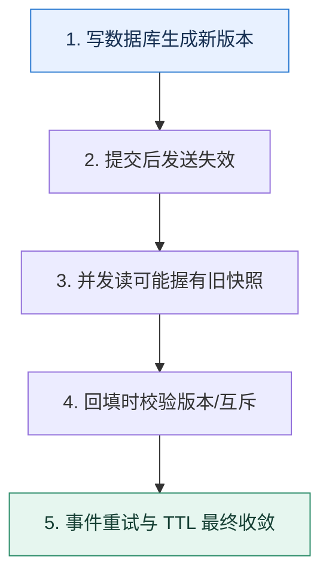

# 缓存一致性｜用时间线找出旧值重新出现的窗口

> 本课只回答一个问题：数据库和缓存无法原子更新时，怎样限制不一致持续时间？

这是一份独立学习稿。来源资料用于核对知识范围；下面的解释、推演、边界和图示均按工程学习路径重新组织，不依赖原页面也能完整阅读。

## 先补齐：建立正确的心智模型

一致性问题来自两个独立存储的操作顺序与并发交错。先定义允许的数据陈旧时间，再画读写时间线；没有一致性目标，就无法判断删缓存、更新缓存或版本控制是否足够。

读这一课时，始终把“组件名字”换成三个可追踪对象：**谁发起动作、状态存在哪里、失败后由谁收敛**。这样遇到不同产品或版本，仍能用同一套模型判断。

## 本节精讲：机制是怎样一步步工作的

常见路径是先提交数据库，再失效缓存，因为直接更新缓存容易遗漏多种派生键。失败的失效要进入可靠重试或由 CDC/变更事件补发。并发读可能在写提交前读到旧库值、又在删除缓存后把旧值回填，因此可用带版本的缓存值、延迟二次失效、互斥回填或只允许新版本覆盖旧版本。强一致读应绕过缓存或等待版本，而不是让所有普通读付出同样代价。

下面这张图只表达本课最重要的状态推进，蓝色是入口，绿色是可验收的终点；任一箭头失败，都要回到上文寻找重试、回退或人工处理的位置。

### 一次带数字的完整推演

初始数据库版本 10、缓存为空。读 R 在写 W 提交前查到版本 10；W 提交版本 11并删除缓存；随后 R 才把版本 10 回填，旧值复活。若缓存写采用“仅当目标版本不大于 10 时写入”仍无法知道数据库已是 11；更稳妥的是回填前二次检查、按键互斥覆盖写，或由版本 11 的变更事件再次失效。

数字的作用不是制造精确感，而是暴露容量和时间关系。把例子中的流量、延迟、分片数或版本号替换成自己的真实数据，方案可能会随之改变。

## 误区与失效边界

延迟双删不是严格证明：延迟多久取决于真实读耗时、队列和故障。TTL 只限定旧值上界，无法满足写后立刻可见。任何方案都应说明失败重试与对账，而不是宣称绝对一致。

判断一个结论是否可靠，可以追问两次：**它依赖什么前提？前提失效后系统留下了什么状态？** 如果回答只能停在“框架会自动处理”，就还没有走到工程边界。

## 按讲解顺序重建知识链

来源稿覆盖的论证主线在这里被重建成四步，保留问题、推导、反例和收束，不沿用原页面措辞：

1. 先画数据库更新与缓存操作的先后，不从口号选方案。
2. 用旧读晚回填复现最隐蔽的竞态。
3. 再组合版本、失效事件、互斥和 TTL 限制窗口。
4. 最后为强一致请求设计绕过或版本等待。

把四步连起来后，本课不是一个孤立结论，而是一条可以复演的因果链。需要回查课程覆盖范围时，可打开文末的来源稿；学习时以本页模型为主。

## 工程验证：把理解变成证据

并发测试用屏障精确控制：读到旧数据库值后暂停，写入新值并删除缓存，再释放旧读回填。断言最终缓存不能长期停在旧版本，并记录从写提交到收敛的最大时间。

### 状态检查表

| 步骤 | 状态或动作 | 需要留下的证据 |
| ---: | --- | --- |
| 1 | 写数据库生成新版本 | 记录耗时、结果与异常分支，确认状态能进入下一步 |
| 2 | 提交后发送失效 | 记录耗时、结果与异常分支，确认状态能进入下一步 |
| 3 | 并发读可能握有旧快照 | 记录耗时、结果与异常分支，确认状态能进入下一步 |
| 4 | 回填时校验版本/互斥 | 记录耗时、结果与异常分支，确认状态能进入下一步 |
| 5 | 事件重试与 TTL 最终收敛 | 记录耗时、结果与异常分支，确认状态能进入下一步 |

检查表不是要求生产系统逐字采用这些字段，而是强迫设计者为每一步提供可观测结果。只有入口、没有终态的流程，最终都会形成无法解释的中间状态。

## 自我检查

为什么“先更新数据库，再删除缓存”仍不能单独证明最终不会出现旧缓存？

并发读可能在数据库提交前读到旧值，却在删除发生后才回填。还需要互斥、版本、二次失效或变更事件来封住这个交错。

再做一次闭卷练习：不看上文画出状态图，并为其中任意两个箭头注入超时、进程崩溃或重复请求。如果你能预测最终状态和观测信号，这一课才真正从“听懂”变成“会用”。

## 来源与版本校准

- [查看来源稿（24 页资料整理）](../content/34-cache-consistency.md)

来源稿只用于追溯知识范围，不是本学习稿的正文。具体产品的默认值、命令与内部实现会随版本变化；落地前应使用目标版本官方文档和故障演练再次确认。

本课涉及的产品行为以这些官方资料为校准入口：

- [Redis · Key eviction](https://redis.io/docs/latest/develop/reference/eviction/)
- [Redis · Distributed locks](https://redis.io/docs/latest/develop/clients/patterns/distributed-locks/)
