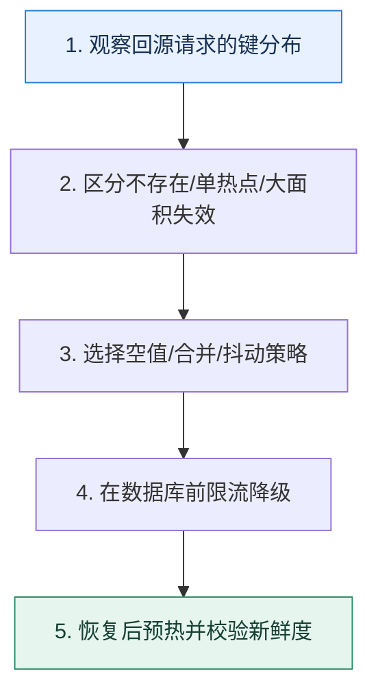

# 缓存三类失效压力｜穿透、热点击穿与雪崩要分开治理

> 本课只回答一个问题：大量请求越过缓存打向数据库时，先判断是哪一种失效模式？

这是一份独立学习稿。来源资料用于核对知识范围；下面的解释、推演、边界和图示均按工程学习路径重新组织，不依赖原页面也能完整阅读。

## 先补齐：建立正确的心智模型

三种现象都表现为回源上升，但根因不同：穿透反复查询不存在的数据；击穿是少数热点键同时失效；雪崩是大量键或整个缓存服务在同一窗口失效。治理必须对准请求分布。

读这一课时，始终把“组件名字”换成三个可追踪对象：**谁发起动作、状态存在哪里、失败后由谁收敛**。这样遇到不同产品或版本，仍能用同一套模型判断。

## 本节精讲：机制是怎样一步步工作的

穿透用参数校验、空值短缓存、布隆过滤器和频率控制，最终仍以真相源为准；热点击穿用 singleflight、互斥回填、逻辑过期返回旧值或预热；雪崩用 TTL 抖动、多级缓存、集群隔离、回源限流和降级。缓存整体故障时，数据库保护优先于维持全部功能，非核心请求应快速失败或返回可接受的旧快照。

下面这张图只表达本课最重要的状态推进，蓝色是入口，绿色是可验收的终点；任一箭头失败，都要回到上文寻找重试、回退或人工处理的位置。

### 一次带数字的完整推演

商品 404 查询每秒 5 万次属于穿透，可缓存 30 秒空结果并限流；超级商品键在 12:00 到期、10 万请求并发属于击穿，只允许一个回填；100 万商品统一 TTL 在 12:00 到期属于雪崩，加入 0–10 分钟抖动并限制回源到数据库安全的 3000 QPS。

数字的作用不是制造精确感，而是暴露容量和时间关系。把例子中的流量、延迟、分片数或版本号替换成自己的真实数据，方案可能会随之改变。

## 误区与失效边界

布隆过滤器有误判，不能证明数据存在；空值缓存过长会让刚创建的数据暂时不可见；分布式锁失效时仍要有数据库限流。把所有键设置永不过期会把新鲜度和内存问题转移成更难发现的陈旧数据。

判断一个结论是否可靠，可以追问两次：**它依赖什么前提？前提失效后系统留下了什么状态？** 如果回答只能停在“框架会自动处理”，就还没有走到工程边界。

## 按讲解顺序重建知识链

来源稿覆盖的论证主线在这里被重建成四步，保留问题、推导、反例和收束，不沿用原页面措辞：

1. 先用键基数与热点集中度给三类问题分类。
2. 分别解释不存在、单键到期和批量失效的压力路径。
3. 为每类选择缓存内策略和数据库保护策略。
4. 最后演练缓存集群不可用，确认系统不会把全部流量直灌数据库。

把四步连起来后，本课不是一个孤立结论，而是一条可以复演的因果链。需要回查课程覆盖范围时，可打开文末的来源稿；学习时以本页模型为主。

## 工程验证：把理解变成证据

故障看板同时显示请求总量、缓存命中、唯一未命中键数、Top Key、数据库 QPS 和拒绝量。唯一键数暴涨偏向穿透，单键占比极高偏向击穿，命中率整体骤降偏向雪崩或集群故障。

### 状态检查表

| 步骤 | 状态或动作 | 需要留下的证据 |
| ---: | --- | --- |
| 1 | 观察回源请求的键分布 | 记录耗时、结果与异常分支，确认状态能进入下一步 |
| 2 | 区分不存在/单热点/大面积失效 | 记录耗时、结果与异常分支，确认状态能进入下一步 |
| 3 | 选择空值/合并/抖动策略 | 记录耗时、结果与异常分支，确认状态能进入下一步 |
| 4 | 在数据库前限流降级 | 记录耗时、结果与异常分支，确认状态能进入下一步 |
| 5 | 恢复后预热并校验新鲜度 | 记录耗时、结果与异常分支，确认状态能进入下一步 |

检查表不是要求生产系统逐字采用这些字段，而是强迫设计者为每一步提供可观测结果。只有入口、没有终态的流程，最终都会形成无法解释的中间状态。

## 自我检查

缓存命中率同样从 95% 跌到 20%，为什么不能直接套用同一个修复方案？

要看未命中的键分布和原因。单个热点、海量不存在键、批量 TTL 与缓存集群故障的控制点不同，错误方案可能放大回源。

再做一次闭卷练习：不看上文画出状态图，并为其中任意两个箭头注入超时、进程崩溃或重复请求。如果你能预测最终状态和观测信号，这一课才真正从“听懂”变成“会用”。

## 来源与版本校准

- [查看来源稿（18 页资料整理）](../content/35-cache-failures.md)

来源稿只用于追溯知识范围，不是本学习稿的正文。具体产品的默认值、命令与内部实现会随版本变化；落地前应使用目标版本官方文档和故障演练再次确认。

本课涉及的产品行为以这些官方资料为校准入口：

- [Redis · Key eviction](https://redis.io/docs/latest/develop/reference/eviction/)
- [Redis · Distributed locks](https://redis.io/docs/latest/develop/clients/patterns/distributed-locks/)
