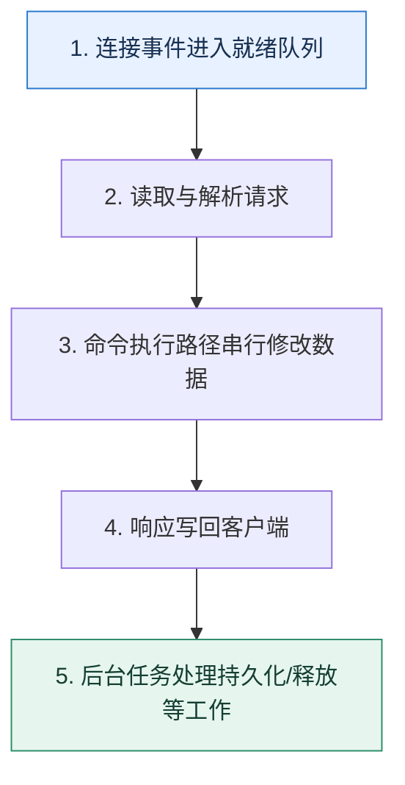

# Redis 执行模型｜命令串行不等于整个进程只有一个线程

> 本课只回答一个问题：Redis 常被称为单线程，它究竟串行了什么，又为什么仍会出现阻塞？

这是一份独立学习稿。来源资料用于核对知识范围；下面的解释、推演、边界和图示均按工程学习路径重新组织，不依赖原页面也能完整阅读。

## 先补齐：建立正确的心智模型

对经典 Redis 工作负载，关键数据结构操作主要在一个命令执行路径中串行，避免了大量细粒度锁；但网络 I/O、持久化、异步释放等能力可使用其他线程或子进程，具体边界随版本和配置变化。

读这一课时，始终把“组件名字”换成三个可追踪对象：**谁发起动作、状态存在哪里、失败后由谁收敛**。这样遇到不同产品或版本，仍能用同一套模型判断。

## 本节精讲：机制是怎样一步步工作的

事件循环监听连接、读取请求、执行就绪命令并写回响应。内存访问快、数据结构经过优化，加上少锁竞争，使短命令吞吐很高；多路复用只是让一个执行路径同时管理很多连接，不会让一条慢命令自动并行。大键删除、复杂集合操作、长 Lua 脚本、阻塞式系统调用或内存换页都会占住执行路径，让其他请求排队。性能诊断应看命令耗时、慢日志、大键、事件循环延迟和 CPU，而不是背“单线程所以快”。

下面这张图只表达本课最重要的状态推进，蓝色是入口，绿色是可验收的终点；任一箭头失败，都要回到上文寻找重试、回退或人工处理的位置。

### 一次带数字的完整推演

每秒 8 万个 GET 平均 50 微秒时，执行路径可顺畅轮转；若一个集合运算持续 200 毫秒，这期间到达的约 1.6 万个请求都会等待，P99 突然升高。把大集合拆批、改异步释放或预计算，往往比盲目增加客户端连接更有效。

数字的作用不是制造精确感，而是暴露容量和时间关系。把例子中的流量、延迟、分片数或版本号替换成自己的真实数据，方案可能会随之改变。

## 误区与失效边界

单命令原子只覆盖该实例内该命令的执行，不等于跨多个命令、多个键槽或外部数据库的业务事务原子。连接越多也不会突破单个热点分片的 CPU 上限，反而可能增加排队和内存。

判断一个结论是否可靠，可以追问两次：**它依赖什么前提？前提失效后系统留下了什么状态？** 如果回答只能停在“框架会自动处理”，就还没有走到工程边界。

## 按讲解顺序重建知识链

来源稿覆盖的论证主线在这里被重建成四步，保留问题、推导、反例和收束，不沿用原页面措辞：

1. 先限定“单线程”指的执行边界，避免绝对化。
2. 再解释事件循环和内存操作为何适合短命令。
3. 用一个 200ms 慢命令推导所有连接的排队。
4. 最后列出大键、慢脚本、换页和后台任务的观测方法。

把四步连起来后，本课不是一个孤立结论，而是一条可以复演的因果链。需要回查课程覆盖范围时，可打开文末的来源稿；学习时以本页模型为主。

## 工程验证：把理解变成证据

实验分别执行短 GET、渐增集合运算和大键删除，记录事件循环延迟与 P99。若单个命令耗时与全局延迟峰值同步，就能直接看到串行路径的队头阻塞。

### 状态检查表

| 步骤 | 状态或动作 | 需要留下的证据 |
| ---: | --- | --- |
| 1 | 连接事件进入就绪队列 | 记录耗时、结果与异常分支，确认状态能进入下一步 |
| 2 | 读取与解析请求 | 记录耗时、结果与异常分支，确认状态能进入下一步 |
| 3 | 命令执行路径串行修改数据 | 记录耗时、结果与异常分支，确认状态能进入下一步 |
| 4 | 响应写回客户端 | 记录耗时、结果与异常分支，确认状态能进入下一步 |
| 5 | 后台任务处理持久化/释放等工作 | 记录耗时、结果与异常分支，确认状态能进入下一步 |

检查表不是要求生产系统逐字采用这些字段，而是强迫设计者为每一步提供可观测结果。只有入口、没有终态的流程，最终都会形成无法解释的中间状态。

## 自我检查

为什么把客户端连接从 100 增加到 1000，未必能解决单个 Redis 分片 CPU 已满的问题？

连接增加的是排队与并发请求来源，不会让串行命令执行路径获得更多核心。应减少单命令成本、拆热点或水平分片。

再做一次闭卷练习：不看上文画出状态图，并为其中任意两个箭头注入超时、进程崩溃或重复请求。如果你能预测最终状态和观测信号，这一课才真正从“听懂”变成“会用”。

## 来源与版本校准

- [查看来源稿（19 页资料整理）](../content/36-redis-single-thread.md)

来源稿只用于追溯知识范围，不是本学习稿的正文。具体产品的默认值、命令与内部实现会随版本变化；落地前应使用目标版本官方文档和故障演练再次确认。

本课涉及的产品行为以这些官方资料为校准入口：

- [Redis · Diagnosing latency issues](https://redis.io/docs/latest/operate/oss_and_stack/management/optimization/latency/)
