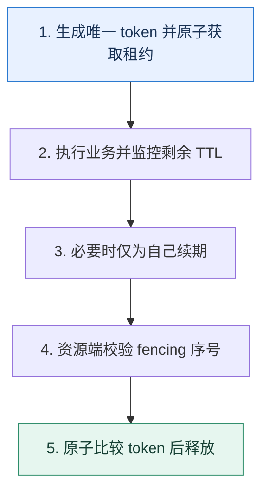

# Redis 分布式锁｜从互斥租约走到过期与旧持有者风险

> 本课只回答一个问题：多个进程竞争同一资源时，怎样用 Redis 建立有期限、可验证归属的互斥？

这是一份独立学习稿。来源资料用于核对知识范围；下面的解释、推演、边界和图示均按工程学习路径重新组织，不依赖原页面也能完整阅读。

## 先补齐：建立正确的心智模型

分布式锁不是一个永久布尔值，而是带唯一持有者标识和有效期的租约。获取、释放、续期与业务副作用之间都存在故障窗口；目标不仅是“多数时候互斥”，还要阻止过期旧持有者继续写坏数据。

读这一课时，始终把“组件名字”换成三个可追踪对象：**谁发起动作、状态存在哪里、失败后由谁收敛**。这样遇到不同产品或版本，仍能用同一套模型判断。

## 本节精讲：机制是怎样一步步工作的

单实例常用 `SET lock_key token NX PX ttl` 原子获取，token 每次唯一。释放必须原子比较 token 再删除：新版本 Redis 可用条件删除能力，兼容旧版本常用 Lua 脚本。TTL 防止持有者崩溃后永久占锁，续期只能延长仍属于自己的租约。若业务执行可能超过 TTL，旧持有者在暂停后恢复会与新持有者并行；关键资源应由递增 fencing token 在数据库或存储端拒绝旧序号。多节点 Redlock 需要评估时钟、网络和故障模型，不能替代资源端约束。

下面这张图只表达本课最重要的状态推进，蓝色是入口，绿色是可验收的终点；任一箭头失败，都要回到上文寻找重试、回退或人工处理的位置。

### 一次带数字的完整推演

进程 A 获取 token=`a7`、TTL 10 秒和 fencing=41，随后暂停 15 秒。锁过期后 B 获取 token=`b9`、fencing=42 并写库存。A 恢复时即使还以为自己持锁，库存服务看到 41 小于已接受的 42，拒绝它的写入。若只有 token 比较删除，A 不会误删 B 的锁，但仍可能在过期后执行副作用。

数字的作用不是制造精确感，而是暴露容量和时间关系。把例子中的流量、延迟、分片数或版本号替换成自己的真实数据，方案可能会随之改变。

## 误区与失效边界

锁的 TTL 不能凭平均耗时设定，应覆盖尾延迟并有续期/中止策略。主从故障切换、时钟跳变与网络分区会改变安全假设；对资金、库存等关键写入，最终正确性必须由数据库条件更新、唯一约束或 fencing 保护。

判断一个结论是否可靠，可以追问两次：**它依赖什么前提？前提失效后系统留下了什么状态？** 如果回答只能停在“框架会自动处理”，就还没有走到工程边界。

## 按讲解顺序重建知识链

来源稿覆盖的论证主线在这里被重建成四步，保留问题、推导、反例和收束，不沿用原页面措辞：

1. 从 `NX+TTL+唯一 token` 建立最小租约模型。
2. 解释为什么释放必须比较归属，续期也必须验证持有者。
3. 用进程暂停超过 TTL 复现双持有者风险。
4. 最后加入 fencing 与资源端条件，说明多节点方案的故障假设。

把四步连起来后，本课不是一个孤立结论，而是一条可以复演的因果链。需要回查课程覆盖范围时，可打开文末的来源稿；学习时以本页模型为主。

## 工程验证：把理解变成证据

故障测试在获取后、业务中、过期后和释放前暂停进程，并模拟 Redis 故障切换。验收条件是：不会误删新锁；过期旧持有者的副作用被资源端拒绝；锁等待与持有时长有上界和告警。

### 状态检查表

| 步骤 | 状态或动作 | 需要留下的证据 |
| ---: | --- | --- |
| 1 | 生成唯一 token 并原子获取租约 | 记录耗时、结果与异常分支，确认状态能进入下一步 |
| 2 | 执行业务并监控剩余 TTL | 记录耗时、结果与异常分支，确认状态能进入下一步 |
| 3 | 必要时仅为自己续期 | 记录耗时、结果与异常分支，确认状态能进入下一步 |
| 4 | 资源端校验 fencing 序号 | 记录耗时、结果与异常分支，确认状态能进入下一步 |
| 5 | 原子比较 token 后释放 | 记录耗时、结果与异常分支，确认状态能进入下一步 |

检查表不是要求生产系统逐字采用这些字段，而是强迫设计者为每一步提供可观测结果。只有入口、没有终态的流程，最终都会形成无法解释的中间状态。

## 自我检查

唯一 token 已能防止 A 误删 B 的锁，为什么仍可能需要 fencing token？

唯一 token 只保护 Redis 中的释放。A 的租约过期后仍可能继续写外部资源；递增 fencing 让资源端识别并拒绝旧持有者。

再做一次闭卷练习：不看上文画出状态图，并为其中任意两个箭头注入超时、进程崩溃或重复请求。如果你能预测最终状态和观测信号，这一课才真正从“听懂”变成“会用”。

## 来源与版本校准

- [查看来源稿（22 页资料整理）](../content/37-redis-distributed-lock.md)

来源稿只用于追溯知识范围，不是本学习稿的正文。具体产品的默认值、命令与内部实现会随版本变化；落地前应使用目标版本官方文档和故障演练再次确认。

本课涉及的产品行为以这些官方资料为校准入口：

- [Redis · Distributed locks](https://redis.io/docs/latest/develop/clients/patterns/distributed-locks/)
