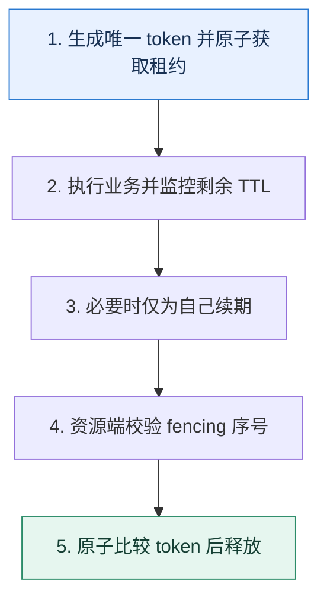

# Redis 分布式锁｜从互斥租约走到过期与旧持有者风险

> 本课只解决一个问题：多个进程竞争同一资源时，怎样用 Redis 建立有期限、可验证归属的互斥？

这不是原页面的缩写，也不是一组孤立结论。下面先建立一个能推演的最小世界，再把状态、数字和失败分支摊开，最后按来源讲解顺序覆盖全部知识线索。读完后，你应当能从 `生成唯一 token 并原子获取租约` 一直解释到 `原子比较 token 后释放`，并说明中途任意一步失败会留下什么状态。

## 零基础入口：先建立本课的心智画面

分布式锁不是一个永久布尔值，而是带唯一持有者标识和有效期的租约。获取、释放、续期与业务副作用之间都存在故障窗口；目标不仅是“多数时候互斥”，还要阻止过期旧持有者继续写坏数据。

先不要急着记组件名。只抓住四个问题：**现在手里有什么输入？下一步只做什么动作？哪个状态发生变化？变化后的结果交给谁？** 之后遇到新框架，只要这四个答案不变，核心机制就没有变。

### 放进一个足够小、可以手算的世界

进程 A 获取 token=`a7`、TTL 10 秒和 fencing=41，随后暂停 15 秒。锁过期后 B 获取 token=`b9`、fencing=42 并写库存。A 恢复时即使还以为自己持锁，库存服务看到 41 小于已接受的 42，拒绝它的写入。若只有 token 比较删除，A 不会误删 B 的锁，但仍可能在过期后执行副作用。

这个小世界故意只保留本课必需的对象。生产系统会有更多节点、线程、分片和异常，但数量增加不会改变这里的因果关系。先确认你能手算这个例子，再把数字替换成真实系统数据。

### 先预测，不要马上看结论

**唯一 token 已能防止 A 误删 B 的锁，为什么仍可能需要 fencing token？**

先写下自己的判断，并指出你依赖的前提。文末自我检查会揭示答案；如果答案不同，回到下面的状态表找出第一个分叉点。

## 本节精讲：让机制一步一步发生

单实例常用 `SET lock_key token NX PX ttl` 原子获取，token 每次唯一。释放必须原子比较 token 再删除：新版本 Redis 可用条件删除能力，兼容旧版本常用 Lua 脚本。TTL 防止持有者崩溃后永久占锁，续期只能延长仍属于自己的租约。若业务执行可能超过 TTL，旧持有者在暂停后恢复会与新持有者并行；关键资源应由递增 fencing token 在数据库或存储端拒绝旧序号。多节点 Redlock 需要评估时钟、网络和故障模型，不能替代资源端约束。

### 可见状态推进

| 当前步 | 现在发生的动作 | 下一步拿到什么 |
| ---: | --- | --- |
| 1 | 生成唯一 token 并原子获取租约 | 执行业务并监控剩余 TTL |
| 2 | 执行业务并监控剩余 TTL | 必要时仅为自己续期 |
| 3 | 必要时仅为自己续期 | 资源端校验 fencing 序号 |
| 4 | 资源端校验 fencing 序号 | 原子比较 token 后释放 |
| 5 | 原子比较 token 后释放 | 得到可核对的终态 |

图只承担一个任务：让你看清状态如何向前移动。它不意味着每一步必然成功；网络超时、进程退出、重复执行和数据竞争都可能让箭头停在中间，因此后面必须继续讨论失效边界。

### 一次带数字的完整推演

进程 A 获取 token=`a7`、TTL 10 秒和 fencing=41，随后暂停 15 秒。锁过期后 B 获取 token=`b9`、fencing=42 并写库存。A 恢复时即使还以为自己持锁，库存服务看到 41 小于已接受的 42，拒绝它的写入。若只有 token 比较删除，A 不会误删 B 的锁，但仍可能在过期后执行副作用。

数字不是装饰。它迫使我们回答容量、顺序、时间窗口或版本选择问题。若换一个数字就得出不同结论，真正的设计依据就是那个阈值，而不是某个中间件名称。

## 按讲解顺序重建知识链：完整来源讲解

下面按来源资料的教学顺序重新编排完整内容。转换页码、来源图片、推广信息、水印和个人宣传已经删除；原本围绕求职问答的角色与措辞改写为工程学习、方案评审和故障复盘语境。机制、算法、例子、反例、事故线索、评论补充和限制条件仍然保留。这里的作用是补齐知识覆盖，不取代前面的独立推演。

今天我们来学习一个技术讨论中热度极高的话题——分布式锁。

分布式锁和分布式事务，可以说是分布式系统里面两个又热又难的话题。从理论上来说，分布式锁和分布式事务都涉及到了很多分布式系统里面的基本概念，所以我们不愁找不到切入点。从实践上来说，分布式锁和分布式事务都是属于一不小心就会出错的技术手段。

在技术讨论分布式锁的过程中，我发现大部分人只知道很基础的几个点，比如说只能解释出使用SETNX 命令，又或者能答出要设置超时时间。当进一步追问的时候，就不知道了。

那么今天我就带你全方位学习分布式锁的知识点，确保你在这个话题之下能够赢得竞争优势。

### 能用于实现分布式锁的中间件

这一节课的主题是用 Redis 来实现一个分布式锁，但是并不意味着分布式锁只能使用 Redis来实现。

简单来说，支持排他性操作的中间件都可以作为实现分布式锁的中间件，例如 ZooKeeper、Nacos 等，甚至关系型数据库也可以，比如说利用 MySQL 的 SELECT FOR UPDATE 语法是可以实现分布式锁的。

### 把知识转成可验证的工程判断

你在公司里面要收集一些信息。

你们公司有没有使用分布式锁的场景？不用分布式锁行不行？你们使用的分布式锁是怎么实现的？性能怎么样？你使用的分布式锁有没有做什么性能优化？你使用的分布式锁是如何加锁、释放锁的？有没有续约机制？在使用分布式锁的时候，各个环节收到超时响应，你会怎么办？

分布式锁是一个通用的业务解决方案。也就是说，你完全可以研发一个独立的分布式锁，提供给各个业务线使用。所以你在简历中或者自我介绍的时候就可以强调自己开发了一个独立的分布式锁框架，不仅实现了基本功能，还做了一定的性能优化。

当然，讨论到下面这些话题的时候，你也可以尝试把话题引导到分布式锁上。

你和技术评审者聊到了 ZooKeeper 等适合用来实现分布式锁的中间件的时候，可以提起你利用Redis 实现了一个分布式锁。你和技术评审者聊到了 singltflight 模式，可以提起你用 Singleflight 来优化过分布式锁的性能。你和技术评审者聊到了过期时间，可以提起在分布式锁里也要设置一个合适的过期时间。你和技术评审者聊到了租约之类的机制，可以提起分布式锁也要实现类似的机制，防止锁持有者崩溃，无法释放锁。

### 技术推理路径

整个技术推理路径就是层层深入，将分布式锁的各个点都讨论清楚。

### 加锁

要使用 Redis 实现分布式锁，首先要明确一个分布式锁在 Redis 上究竟意味着什么。答案也很简单，所谓的分布式锁在 Redis 上就是一个普通的键值对。

那么为什么一个普通的键值对也可以看成 Redis 的分布式锁呢？奥妙就在于分布式锁的本质——排他性，就是只要你能够借助 Redis 达成排他的效果就可以了。

而在 Redis 上怎么能够达到这种排他的效果？用 SETNX 命令就可以做到。也就是说，如果一个线程能够用 SETNX 成功地在 Redis 上设置好一个键值对，那么在它删除这个键值对之前，别的线程都没办法再设置同样的键值对。

所以，加锁就是调用 SETNX 命令，而释放锁就是执行 DEL 命令。你在技术讨论的过程中要先简明扼要地说清楚锁的实质，还有加锁和释放锁是什么。

利用 Redis 来实现分布式锁的时候，所谓的锁就是一个普通的键值对。而加锁就是使用SETNX 命令，排他地设置一个键值对。如果 SETNX 命令设置键值对成功了，那么说明加锁成功。如果没有设置成功，说明这个时候有人持有了锁，需要等待别人释放锁。而相应地，释放锁就是删除这个键值对。

接下来你可以等技术评审者主动询问这个过程中的细节。

进阶推导 1：等待时间

在前面解释中，你提到加锁失败了，就要等一段时间，等别人释放锁。那么技术评审者可能问你，究竟该等多长时间？理论上来说，是尽可能在等待的这段时间内拿到锁。因此等待的时间就是一个锁会被持有的时间。

当加锁失败的时候，这个等待时间是要根据锁的持有时间来设置的。比如说如果预计 99%的锁持续时间是一秒钟，那么我们就可以把这个等待时间设置成一秒钟。

在说完了如何确定等待时间之后，接下来就可以讨论怎么实现这种等待机制。

进阶推导 2：如何实现等待机制

技术评审者大概率会进一步追问，你说的等待究竟是怎么实现的？这也有两种方案，轮询和监听删除事件。

等待也有两种实现方式。第一种方式就是轮询，比如说在加锁失败之后，每睡眠 100 毫秒就尝试加锁一次，直到成功或者整个等待时间超过一秒钟。第二种方式是监听删除事件，也就是在加锁失败之后立刻订阅这个键值对。当键值对被删除的时候就说明锁被释放了，这个时候再次尝试加锁。监听删除事件总的来说，实时性比较好，但是实现起来比较麻烦。

这个示意图只是为了方便你理解，而在实际的实现中，发现锁被人设置了和订阅是要做成一个整体的，不然就会有并发问题。

进阶推导 3：加锁重试

就算是正常的加锁也有可能遇到超时的问题，怎么办？这个问题棘手之处在于你也不知道出现超时的时候，究竟有没有加锁成功。

按照之前我们遇到超时的一般思路，就是直接重试。但是重试的逻辑比较复杂，分成几种情况。

1. 第一次调用的时候，并没有成功。

2. 第一次调用的时候，加锁成功了。
3. 第一次调用的时候，加锁失败了，并且现在别的线程持有锁。

你在这三张图里应该注意到了，重试的一个核心是要知道自己究竟有没有加锁成功。所以，你在加锁的时候，键值对里的值应该可以标识锁是谁加的。比如说，使用 UUID。也就是你重试的时候还带着上次的 UUID，如果 Redis 里键值对存在，并且值正好是你的 UUID，那就说明是你的锁。

所以你可以这么介绍你的方案。

分布式锁也可以考虑提供重试功能。比如说加锁的时候收到了超时响应，就可以发起重试。假如说我要给 key1 加分布式锁，随机生成了一个 UUID value1 作为值，那么重试的基本逻辑是这样的：

1. 检查一下 Redis 里是否存在 key1。如果 key1 不存在，那么说明上一次调用没有加锁成功。
2. 如果 key1 存在，检查值是不是 value1。如果是 value1，那么说明我上一次加锁成功了。考虑到距离重试的时候已经过去了一段时间，所以需要重置一下过期时间。
3. 值并不是 value1，这个时候说明已经有别人拿着锁了，也就说明加锁失败了。

在实践中，因为 Redis 本身性能很好，所以最多重试一两次。但是，如果从理论上分析，就有重试一直都超时的可能。这时候会发生什么？

如果重试一直都超时，这个时候也不需要额外处理。因为如果之前加锁已经成功了，那么无非就是过期时间到了，锁自然失效。如果之前没有加锁成功，就更没事了，别的线程需要的时候就可以拿到锁。

在这个解释里面，你就提到了一个概念：过期时间。为什么分布式锁需要一个过期时间呢？

### 锁过期时间

如果你的机器永远不会出问题，网络也永远不会出问题，那么分布式锁用 Redis 的 SETNX 和DEL 命令就足够了。然而，现实中这个假设显然是不成立的，所以你就要考虑这么一个问题，万一你加锁的那个线程崩溃了呢？比如说，它所在的机器整个崩溃了，应该怎么办？

你抓住关键词没人释放来解释。

在使用分布式锁的时候，分布式锁的持有者有可能宕机，这会导致整个锁既没有人能够获得，也没有人能够释放。在这种情况下，就可以考虑给分布式锁加一个过期时间。

进阶推导 1：过期时间应该多长

只要涉及这种过期时间的问题，技术评审者肯定会问，这个过期时间应该设置成多长？

这个过期时间应该根据业务来设置。比如说，如果在拿到锁之后，99% 的业务都可以在 1秒内完成，那么就可以把过期时间设置得比 1 秒长一些，比如说设置成 2 秒。保险起见，设置成 10 秒甚至一分钟也没多大关系。

过期时间主要是为了防止系统宕机而引入的，而大部分情况下，锁都能被正常释放掉，所以把过期时间设置得长一些也没什么问题。

我注意到，很多公司的分布式锁也就是实现到了这一步。所以你可以考虑进一步刷进阶推导。

总的来说，不管过期时间设置成多长，都可能遇到业务没能在持有分布式锁期间完成的情况。

这也是为了引导技术评审者发问。这种情况究竟该怎么解决呢？答案是续约。

进阶推导 2：续约机制

所谓续约是指设置了过期时间之后，在快要过期的时候，再次延长这个过期时间。

为了防止出现总有业务不能在锁过期时间内结束的问题，可以考虑引入续约机制。也就是在分布式锁快要过期的时候就重置一下过期时间。比如说一开始过期时间设置的是 1 分钟，那么可以在 50 秒之后再次把过期时间重置为 1 分钟。理论上来说，只需要确保在剩余过期时间内能够续约成功，就可以了。比如说这里预留了 10 秒，那么就算第一次续约失败，也有足够的时间进行重试。

这时候又会出现新的问题，如果重试之后，续约都失败了怎么办？这就要看你的业务特性了。

如果不断重试之后，续约都失败了，那么这个时候就要根据业务来决定采取保守策略还是激进策略了。如果你对排他性要求得非常严格，那么这个时候你只能考虑中断业务。因为你可能续约失败了，那么接下来就会有人拿到分布式锁。所以你的业务不能继续执行，这也就是保守策略。

如果你觉得这种非常偶然的续约失败是可以接受的，那么你还是可以继续执行业务，当然这可能引起数据不一致的问题，这也就是激进方案。

这里你提到了中断业务，这也就是你接下来要刷的另外一个进阶推导，如何中断业务。

进阶推导 3：中断业务

之前你已经在超时控制里面接触过中断业务了，分布式锁其实也面临着一样的困境。

在分布式锁出了问题的时候，中断业务也是一个很困难的事情。分布式锁并不能直接帮你中断业务，它只能给你发一个信号，告诉你发生了什么糟糕的事情。比如说分布式锁在续约失败的时候，给你发了一个信号。这个时候是否中断业务完全是看你的业务代码是如何实现的。举个例子来说，如果你的业务是一个大循环，那么你可以在每个循环开始的时候，检测一下有没有收到什么信号。如果收到了需要中断的信号，那么就退出循环。

伪代码：

复制代码1 for condition {2 // 中断业务执行3 if interrupted {

4 break;5 }6 // 你的业务逻辑7 DoSomething()8 }

如果你的业务没有循环，那么你可以在每一个关键步骤之后都检测一下有没有收到信号，然后考虑要不要中断业务。

伪代码：

复制代码1 step1()2 if interrupted {3 return 4 }5 step2()6 if interrupted {7 return 8 }

最后你要总结拔高一下。

这种中断业务的问题，在微服务超时控制里面也会遇到，不过也是无解的问题，因为微服务框架也做不到帮你自动中断业务。

### 释放锁

正常来说，释放锁都不会有什么问题。但是在一些特殊场景下，释放锁也可能会有问题。比如说线程 1 加了锁，结果 Redis 崩溃了又恢复过来，这时候线程 2 也加了同一把锁。

当线程 1 执行完毕之后，去释放锁就会把线程 2 的锁也释放掉。

所以在释放锁的时候，都要确认这个锁是不是自己的。

在释放锁的时候，要先确认锁是不是自己加的，防止因为系统故障或者有人手动操作了Redis 导致锁被别人持有了。确认锁的方法也很简单，就是比较一下键值对里的值是不是自己设置的。这也要求在加锁设置键值对的时候使用唯一的值，比如说用 UUID。

### 其他进阶推导

这里我再补充三个进阶推导，一个是非常热门的话题 Redlock，另外两个是性能优化的方案。你可以尝试把性能优化的进阶推导纳入到你优化整个系统性能的方案中。

Redlock

在实现分布式锁的时候，有一个问题必须要考虑：如果 Redis 崩溃了怎么办？在释放锁那里，你已经看到，如果 Redis 崩溃了再恢复过来的时候，锁就有可能被别人拿走。怎么解决这种问题呢？

首先，Redis 的主从切换机制是解决不了这个问题的，因为 Redis 的主从同步是异步的。也就是说当你拿到一个分布式锁的时候，这个锁还没有同步到从节点，主节点就可能崩溃了。这个时候从节点被提升成主节点，里面并没有你的分布式锁，所以别人就可以拿到分布式锁。

为了解决这个问题，就有了 Redlock 算法。你只需要掌握 Redlock 的基本概念就可以，不需要深入去研究。原因也很简单，就是目前绝大部分公司使用的分布式锁，都没有按照 Redlock算法来实现，因为 Redlock 成本高，性能也比较差。

Redlock 的思想说起来也很简单，用一句话概括就是多数原则。也就是说，你加锁的时候要在多个独立的 Redis 节点上同时加锁。当大多数节点都告诉你加锁成功的时候，就说明你加锁成

功了。举例来说，如果你同时在 5 个节点上加锁，那么大多数就意味着至少 3 个节点成功才算加锁成功。

在这个过程中，假设说你的锁过期时间是 10 秒，加锁花了 1 秒钟，那么你就只剩下 9 秒钟。如果加锁失败，还要在所有的节点上释放锁。比如说 4 个节点告诉你成功了，1 个节点超时了，这种时候你需要在 5 个节点上一起释放锁。

这个问题一般会在分布式锁技术讨论的最后出现，技术评审者可能会随口问一下，看看你知不知道Redlock 这回事。

性能优化

其实分布式锁能够做的优化不多。一个思路是优化 Redis 本身的性能，另外一个思路是减少分布式锁的竞争。在高并发的环境下，可以考虑使用 Singleflight 模式来优化分布式锁。

Singleflight 模式我们前面已经接触过了。在缓存模式里，Singleflight 模式可以确保同一个key 在一个实例上，只有一个线程去回查数据库。类似地，在分布式锁中应用 Singleflight 模式则是为了确保针对同一个锁一个实例只有一个线程去获取分布式锁。

要想优化分布式锁的性能，一方面是考虑优化 Redis 本身的性能，比如说启用单独的Redis 集群，这可以有效防止别的业务操作 Redis，影响加锁和释放锁的性能。另外一方面则是可以考虑减少分布式锁的竞争，比如说使用 Singleflight 模式。也就是针对同一把锁，每个实例内部先选出一个线程去获得锁。

假设有 2 个实例，每个实例上各有 10 个线程要去获得 key1 上的分布式锁。在不使用Singleflight 模式的情况下，总共有 20 个线程会去竞争分布式锁。但是在使用Singleflight 模式之后，最终只有 2 个线程去竞争分布式锁。竞争越激烈，这种方案的效果越好。如果没什么并发的话，那么就基本没什么效果。

这里还有一种更加激进的优化方案。

在实例拿到了分布式锁之后，释放锁之前先看看本地有没有别的线程也需要同一把分布式锁。如果有，就直接转交给本地的线程，进一步减少加锁和释放锁的开销。这种优化手段同样是在竞争越激烈的场景，效果越好。

最后不要忘了补充一下，也就是分布式锁不到逼不得已，就不要使用。

分布式锁不管怎么优化，都有性能损耗。所以原则上来说，能不用分布式锁就不用分布式锁。

这句话也是为了引出下一个进阶推导，去分布式锁。

去分布式锁

在一些场景下是可以考虑去掉分布式锁的。严格来说，应该是原本这些场景就不该用分布式锁，现在是回归本源了。

那究竟怎么去分布式锁呢？第一种思路：用数据库乐观锁来取代分布式锁。

第一种思路就是可以尝试用数据库乐观锁来取代分布式锁。比如说一些场景是加了分布式锁之后执行一些计算，最后更新数据库。在这种场景下，完全可以抛弃分布式锁，直接计算，最后计算完成之后，利用乐观锁来更新数据库。缺点就是没有分布式锁的话，可能会有多个线程在计算。但是问题不大，因为只要最终更新数据库控制住了并发，就没关系。

还有另外一种思路。

第二种思路是利用一致性哈希负载均衡算法。在使用这种算法的时候，同一个业务的请求肯定发到同一个节点上。这时候就没必要使用分布式锁了，本地直接加锁，或者用Singleflight 模式就可以。

### 本节原始知识线索收束

这一节课我们聊到了实现一个分布式锁要考虑的各种细节。一个分布式锁在 Redis 上就是一个普通的键值对。加锁的时候使用 SETNX 命令，并且要考虑如果加锁没成功要等多久，是轮询等待还是监听锁释放，加锁超时怎么重试等问题。

为了防止锁持有者崩溃导致没有人释放锁，都会给锁设置一个过期时间，这里你要考虑怎么确定合理的过期时间。不过就算是充分考虑到了各种异常情况，业务都还是有可能在过期时间到了的时候都还没执行完，所以需要考虑续约。而续约本身也有可能失败，那么就要根据业务要求来决定是继续执行还是中断。中断业务一直是一个老大难的问题，目前也只能是靠人在代码里面主动检测。

在释放锁的时候，要考虑到中间 Redis 崩溃又恢复导致分布式锁被别人拿到了的情况，所以在释放锁之前，也要先检测是不是自己的锁。

最后我还给出了三个进阶推导内容，第一个是 Redlock，这个你只需要有一个基本概念就可以了。另外两个都是尝试优化性能，优化分布式锁的性能主要是用 Singleflight 来减少竞争。而优化系统本身的性能，也就是尝试把分布式锁去掉，可以考虑使用数据库乐观锁或者一致性哈希负载均衡来取代分布式锁。

### 继续推演

最后请你来思考两个问题。

分布式锁释放锁的时候也可以考虑重试，那么这个阶段在重试的时候要考虑什么情况？你还有没有优化过分布式锁的案例？可以是优化分布式锁本身，也可以是去除业务中的分布式锁。

### 补充讨论与边界校准

#### 全部留言 (5)

补充讨论：

讲解补充：在 GO 里面自带了，JAVA 里面也有开源的实现，其它语言就不清楚了。不过总的来说，还是一个比较复杂的事情，对并发要求比较高。

有隐患，隐患就是你真的去执行的线程执行了很长时间。所以你可以考虑一个结合了超时机制的 sing leflight（大部分开源实现不支持）。而别的线程等待超时了，也有两个选择：1. 不再等，直接返回；

2. 自己直接去取。
目前我倒是还没遇到过线上因为 singleflight 导致线程长时间阻塞的问题。

归根结底，还是得确保业务要能短时间结束。

1

补充讨论： 加锁多数原则 ，5台机器为啥加锁4个成功，有一个超时失败要把其他四个解锁尼，不是已经超过半数了吗

讲解补充：我后面释放锁的那里，是指执行业务之后，释放锁的时候不要忘了释放这个超时的节点上的锁。

补充讨论： 模式 来优化竞争，感觉需要处理很多复杂问题：选择哪个线程去竞争？获取锁过程中，如果这个线程奔溃，如何通知其他线程？获取锁过程中，其他线程如何自处（直接失败？等待失败? 等待成为竞争者？）感觉不玩这个奇技淫巧，大开大合，以力破巧更实在，要不然被技术评审者绕进去，那就尴尬啦...

讲解补充：哈哈哈，这个在 Go 里面倒是不需要我们烦恼，因为 Go 自身就提供了一个 singleflight。

我个人觉得线程崩溃倒是不太需要考虑，一般来说线程崩溃，都是整个应用崩溃了。就 singleflght 的“标准实现”来说，其他线程都是等待。而使用者可以决定在等待之后，要不要继续尝试新一轮。

补充讨论： key1 存在，检查值是不是 value1。如果是 value1，那么说明我上一次加锁成功了。考虑到距离重试的时候已经过去了一段时间，所以需要重置一下过期时间。” 如果 key 1 都存在了，不就代表上资源被占用了吗，这次加锁应该算失败吧，还继续操作干嘛?

讲解补充：因为 key1 的值是 value1，也就是你当时加锁成功了（value1是你生成的，且是唯一的，比如说是 uuid），只不过你很不幸拿到了超时响应。

补充讨论：

Q3：释放锁的时候，线程1为什么能把线程2的锁释放掉？两个锁应该是不同的锁啊。Q4：释放锁的时候，比较value，是谁比较？Redis比较吗？

讲解补充：1. 如果你不用 NX 命令的话，是可以成功的

2. 已经有了，你可以了解一下 Redis 的订阅功能
3. 对同一个 key 加的分布式锁
4. 就是和 redis 里面存储的值比较

## 把完整讲解收束成一条因果链

1. 从 `NX+TTL+唯一 token` 建立最小租约模型。
2. 解释为什么释放必须比较归属，续期也必须验证持有者。
3. 用进程暂停超过 TTL 复现双持有者风险。
4. 最后加入 fencing 与资源端条件，说明多节点方案的故障假设。

把这几步连接起来时，不要省略“为什么”。最终结论只有在前提、状态变化和失败代价都说得清楚时才可靠。

## 误区与失效边界

锁的 TTL 不能凭平均耗时设定，应覆盖尾延迟并有续期/中止策略。主从故障切换、时钟跳变与网络分区会改变安全假设；对资金、库存等关键写入，最终正确性必须由数据库条件更新、唯一约束或 fencing 保护。

再加一条通用但必须落实到本课对象上的边界：机制只能处理它看得见的信号。若输入指标失真、状态没有持久化、错误被吞掉，或者补偿没有幂等保护，再成熟的框架也只能基于错误证据作决定。

### 三种故障注入方式

| 故障 | 要观察什么 | 不能接受的解释 |
| --- | --- | --- |
| 在第 2 步前让依赖超时 | 是否停在可重试状态，是否消耗完上游预算 | “框架稍后会处理” |
| 在状态写入后让进程退出 | 重启后能否识别已完成与待继续动作 | “再执行一次应该没事” |
| 对同一输入并发执行两次 | 是否出现重复副作用、顺序颠倒或覆盖 | “概率很低” |

## 工程验证：把理解变成可以复查的证据

故障测试在获取后、业务中、过期后和释放前暂停进程，并模拟 Redis 故障切换。验收条件是：不会误删新锁；过期旧持有者的副作用被资源端拒绝；锁等待与持有时长有上界和告警。

| 步骤 | 状态或动作 | 最少应留下的证据 |
| ---: | --- | --- |
| 1 | 生成唯一 token 并原子获取租约 | 开始时间、结束时间、输入标识、结果状态、异常原因 |
| 2 | 执行业务并监控剩余 TTL | 开始时间、结束时间、输入标识、结果状态、异常原因 |
| 3 | 必要时仅为自己续期 | 开始时间、结束时间、输入标识、结果状态、异常原因 |
| 4 | 资源端校验 fencing 序号 | 开始时间、结束时间、输入标识、结果状态、异常原因 |
| 5 | 原子比较 token 后释放 | 开始时间、结束时间、输入标识、结果状态、异常原因 |

验证时同时记录成功路径和失败路径。只证明“正常时能跑通”不能说明设计可靠；至少要让一次超时、一次进程退出和一次重复请求可重现，并能根据日志或指标解释最后状态。

## 学完检查：闭卷画出本课

你现在应该能独立完成四件事：

1. 用自己的话说出本课唯一问题，不使用产品名也能解释。
2. 复算上面的具体例子，并指出哪个输入改变会让结论改变。
3. 沿 Mermaid 图注入一次失败，预测系统停在哪里以及由谁收敛。
4. 说出本课机制不保证什么，并给出一个反例。

## 自我检查

唯一 token 已能防止 A 误删 B 的锁，为什么仍可能需要 fencing token？

唯一 token 只保护 Redis 中的释放。A 的租约过期后仍可能继续写外部资源；递增 fencing 让资源端识别并拒绝旧持有者。

怎样证明自己不是只记住了名词？

把 `生成唯一 token 并原子获取租约` 的一个真实输入写出来，逐步记录到 `原子比较 token 后释放`。然后在中间任意一步制造失败；如果你能解释当前状态、下一责任方、可观测证据和恢复边界，就已经拥有可以迁移的工程模型。

## 来源与事实校准

- [查看完整来源稿（本地 22 页资料）](../content/37-redis-distributed-lock.md)

### 当前事实校准

单实例锁应使用带唯一令牌和 TTL 的条件写入，并且只允许持有同一令牌的客户端释放。TTL 只是有期限的租约：执行超时或停顿后，旧持有者仍可能继续操作，需要下游接受 fencing token 或条件版本。异步复制切主也可能破坏单实例互斥，锁的故障模型必须显式说明。

- [Redis · Distributed Locks](https://redis.io/docs/latest/develop/clients/patterns/distributed-locks/)
- [Redis · SET command](https://redis.io/docs/latest/commands/set/)

来源稿用于核对覆盖范围，不随公开站点发布。产品默认值和具体内部行为可能随版本变化；落地时应使用目标版本的官方文档、可运行实验和故障演练校准。本学习稿中的零基础入口、状态推演、故障矩阵和工程验证属于编辑补充，不冒充来源讲解者的原话。
