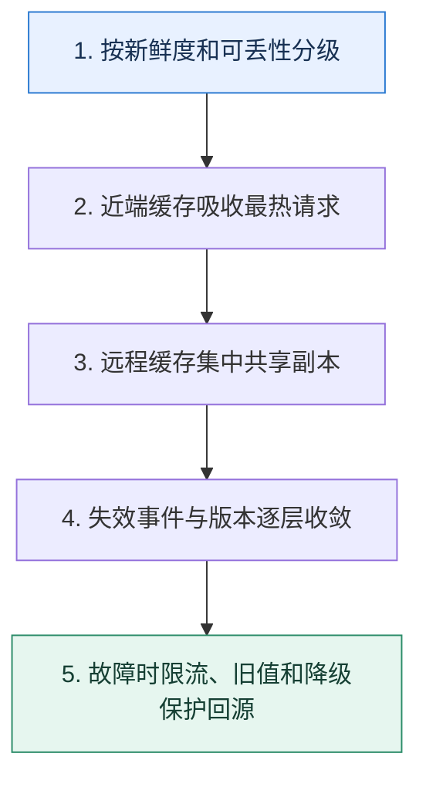

# 缓存架构全景｜按数据新鲜度与故障半径设计多级防线

> 本课只回答一个问题：从进程本地到 Redis 集群，怎样组合多级缓存而不让一致性失控？

这是一份独立学习稿。来源资料用于核对知识范围；下面的解释、推演、边界和图示均按工程学习路径重新组织，不依赖原页面也能完整阅读。

## 先补齐：建立正确的心智模型

多级缓存把热点挡在更靠近请求的位置，但每多一层就多一个副本、失效路径和容量边界。先给数据分类：是否可丢、最大陈旧时间、热点分布、对象大小和回源代价。

读这一课时，始终把“组件名字”换成三个可追踪对象：**谁发起动作、状态存在哪里、失败后由谁收敛**。这样遇到不同产品或版本，仍能用同一套模型判断。

## 本节精讲：机制是怎样一步步工作的

请求可依次经过浏览器/CDN、网关、进程本地缓存和远程缓存，再回到数据库。近端层延迟低但副本多，本地失效通常依赖短 TTL 或广播；远程层便于集中治理，可用分片和副本扩展。读路径要防穿透与击穿，写路径用版本/失效事件收敛；集群故障时由限流、旧值降级和非核心功能关闭保护数据库。预热只加载真正热点，并设置容量水位，避免启动时制造雪崩。

下面这张图只表达本课最重要的状态推进，蓝色是入口，绿色是可验收的终点；任一箭头失败，都要回到上文寻找重试、回退或人工处理的位置。

### 一次带数字的完整推演

商品详情允许旧 10 秒：进程本地缓存 TTL 2 秒，Redis TTL 60 秒并带版本，数据库是真相源。更新后发送版本 18 的失效事件；本地层最晚 2 秒自然收敛，Redis 删除失败由事件重试。Redis 全部不可用时，网关把回源限制到 3000 QPS，热点可返回带“数据可能稍旧”标记的快照。

数字的作用不是制造精确感，而是暴露容量和时间关系。把例子中的流量、延迟、分片数或版本号替换成自己的真实数据，方案可能会随之改变。

## 误区与失效边界

多级命中率不能简单相加，也不能只看总体命中率；本地层可能长期保存旧值，Redis 热点分片可能单点饱和。缓存中若混入不可丢状态，需要拆分故障域和淘汰策略。

判断一个结论是否可靠，可以追问两次：**它依赖什么前提？前提失效后系统留下了什么状态？** 如果回答只能停在“框架会自动处理”，就还没有走到工程边界。

## 按讲解顺序重建知识链

来源稿覆盖的论证主线在这里被重建成四步，保留问题、推导、反例和收束，不沿用原页面措辞：

1. 先按数据语义分层，而不是按中间件堆叠。
2. 逐层计算延迟、容量、命中与最大陈旧窗口。
3. 把更新事件、TTL 和版本串成失效路径。
4. 最后演练某一层和全缓存故障，验证回源限流与降级。

把四步连起来后，本课不是一个孤立结论，而是一条可以复演的因果链。需要回查课程覆盖范围时，可打开文末的来源稿；学习时以本页模型为主。

## 工程验证：把理解变成证据

架构表为每层填写 `容量、P99、命中率、TTL、可接受旧值、淘汰策略、故障回退、所有者`。再计算在各层同时失效时数据库接到的最大 QPS，必须小于压测安全水位。

### 状态检查表

| 步骤 | 状态或动作 | 需要留下的证据 |
| ---: | --- | --- |
| 1 | 按新鲜度和可丢性分级 | 记录耗时、结果与异常分支，确认状态能进入下一步 |
| 2 | 近端缓存吸收最热请求 | 记录耗时、结果与异常分支，确认状态能进入下一步 |
| 3 | 远程缓存集中共享副本 | 记录耗时、结果与异常分支，确认状态能进入下一步 |
| 4 | 失效事件与版本逐层收敛 | 记录耗时、结果与异常分支，确认状态能进入下一步 |
| 5 | 故障时限流、旧值和降级保护回源 | 记录耗时、结果与异常分支，确认状态能进入下一步 |

检查表不是要求生产系统逐字采用这些字段，而是强迫设计者为每一步提供可观测结果。只有入口、没有终态的流程，最终都会形成无法解释的中间状态。

## 自我检查

为什么增加进程本地缓存后，远程缓存 QPS 降了，一致性却可能更难？

每个进程多了一份独立副本，集中删除 Redis 不能自动清掉它们。需要短 TTL、版本校验或可靠广播，并接受明确的新鲜度窗口。

再做一次闭卷练习：不看上文画出状态图，并为其中任意两个箭头注入超时、进程崩溃或重复请求。如果你能预测最终状态和观测信号，这一课才真正从“听懂”变成“会用”。

## 来源与版本校准

- [查看来源稿（17 页资料整理）](../content/38-cache-architecture.md)

来源稿只用于追溯知识范围，不是本学习稿的正文。具体产品的默认值、命令与内部实现会随版本变化；落地前应使用目标版本官方文档和故障演练再次确认。

本课涉及的产品行为以这些官方资料为校准入口：

- [Redis · Key eviction](https://redis.io/docs/latest/develop/reference/eviction/)
- [Redis · Distributed locks](https://redis.io/docs/latest/develop/clients/patterns/distributed-locks/)
