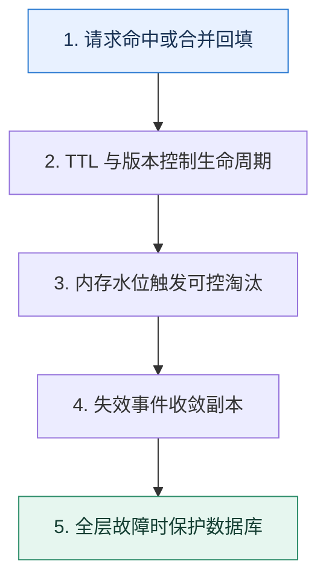

# 缓存专题复盘｜从一次热点失效推演到数据库保护

> 本课只回答一个问题：怎样把过期、淘汰、读写模式、一致性和故障治理连成一次完整推演？

这是一份独立学习稿。来源资料用于核对知识范围；下面的解释、推演、边界和图示均按工程学习路径重新组织，不依赖原页面也能完整阅读。

## 先补齐：建立正确的心智模型

缓存专题的主线不是命令，而是副本生命周期：何时创建、何时过期、内存不足时谁被牺牲、写入后怎样失效、缓存不可用时谁保护真相源。

读这一课时，始终把“组件名字”换成三个可追踪对象：**谁发起动作、状态存在哪里、失败后由谁收敛**。这样遇到不同产品或版本，仍能用同一套模型判断。

## 本节精讲：机制是怎样一步步工作的

读请求先经过近端与 Redis，未命中由合并回填控制并发；TTL 加随机抖动，淘汰策略只作用在明确可丢的缓存实例。更新先提交数据库并发出版本化失效事件，失败可重试。热点过期时允许一个请求回源，其他请求等待或读旧值；集群故障时限流、降级和静态快照共同保护数据库。

下面这张图只表达本课最重要的状态推进，蓝色是入口，绿色是可验收的终点；任一箭头失败，都要回到上文寻找重试、回退或人工处理的位置。

### 一次带数字的完整推演

商品 S9 平时 50k QPS，Redis TTL 到期时 2 万并发到达。singleflight 只允许一个数据库查询，其他请求最多等 100ms 后读取上一版；更新事件版本 31 到达后，只允许 31 或更高版本写缓存。此时 Redis 节点又触发淘汰，监控发现大对象挤压，团队将不可丢锁状态迁出缓存实例并限制对象大小。

数字的作用不是制造精确感，而是暴露容量和时间关系。把例子中的流量、延迟、分片数或版本号替换成自己的真实数据，方案可能会随之改变。

## 误区与失效边界

复盘不能把所有保护都默认开启。互斥会增加等待，旧值会牺牲新鲜度，空值可能遮住新建数据，短 TTL 会增加回源；每个选择都要对应具体 SLO。

判断一个结论是否可靠，可以追问两次：**它依赖什么前提？前提失效后系统留下了什么状态？** 如果回答只能停在“框架会自动处理”，就还没有走到工程边界。

## 按讲解顺序重建知识链

来源稿覆盖的论证主线在这里被重建成四步，保留问题、推导、反例和收束，不沿用原页面措辞：

1. 先跟踪一个键从数据库回填到过期或淘汰。
2. 插入并发更新，画出旧值晚回填的竞态。
3. 再注入热点过期和缓存节点故障，说明合并、旧值与限流。
4. 最后检查关键状态是否被错误放入可淘汰域。

把四步连起来后，本课不是一个孤立结论，而是一条可以复演的因果链。需要回查课程覆盖范围时，可打开文末的来源稿；学习时以本页模型为主。

## 工程验证：把理解变成证据

选择一个 Top Key 做演练，收集每层命中、回源并发、锁等待、缓存版本、淘汰原因和数据库 QPS。只有当缓存完全旁路时数据库仍被限制在安全水位，故障预案才算闭环。

### 状态检查表

| 步骤 | 状态或动作 | 需要留下的证据 |
| ---: | --- | --- |
| 1 | 请求命中或合并回填 | 记录耗时、结果与异常分支，确认状态能进入下一步 |
| 2 | TTL 与版本控制生命周期 | 记录耗时、结果与异常分支，确认状态能进入下一步 |
| 3 | 内存水位触发可控淘汰 | 记录耗时、结果与异常分支，确认状态能进入下一步 |
| 4 | 失效事件收敛副本 | 记录耗时、结果与异常分支，确认状态能进入下一步 |
| 5 | 全层故障时保护数据库 | 记录耗时、结果与异常分支，确认状态能进入下一步 |

检查表不是要求生产系统逐字采用这些字段，而是强迫设计者为每一步提供可观测结果。只有入口、没有终态的流程，最终都会形成无法解释的中间状态。

## 自我检查

缓存专题中最先要确定的为什么不是 TTL 应设多少秒？

应先确定数据所有权、允许陈旧时间、峰值回源能力和故障回退。TTL 只是这些约束下的一根控制杆，脱离语义没有统一正确值。

再做一次闭卷练习：不看上文画出状态图，并为其中任意两个箭头注入超时、进程崩溃或重复请求。如果你能预测最终状态和观测信号，这一课才真正从“听懂”变成“会用”。

## 来源与版本校准

- [查看来源稿（6 页资料整理）](../content/38a-mock-cache.md)

来源稿只用于追溯知识范围，不是本学习稿的正文。具体产品的默认值、命令与内部实现会随版本变化；落地前应使用目标版本官方文档和故障演练再次确认。

本课涉及的产品行为以这些官方资料为校准入口：

- [Redis · Key eviction](https://redis.io/docs/latest/develop/reference/eviction/)
- [Redis · Distributed locks](https://redis.io/docs/latest/develop/clients/patterns/distributed-locks/)
