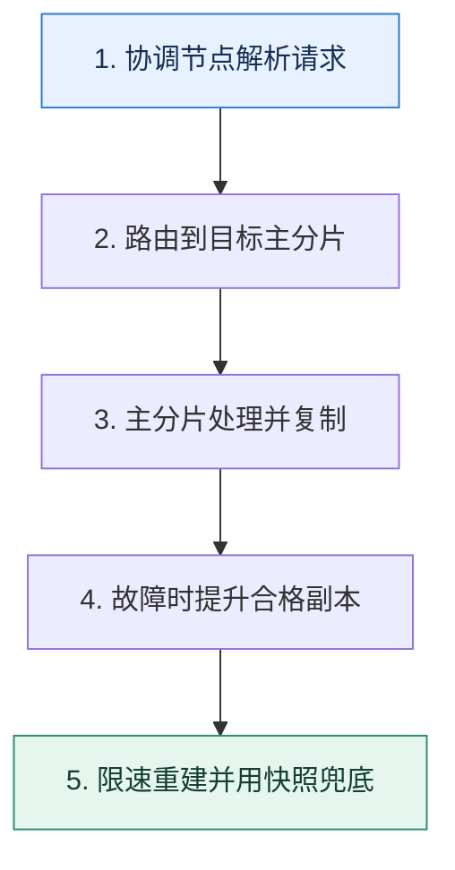

# Elasticsearch 高可用｜让分片副本、写入确认与恢复策略互相匹配

> 本课只回答一个问题：节点故障时，Elasticsearch 怎样继续读写，并避免恢复流量拖垮在线请求？

这是一份独立学习稿。来源资料用于核对知识范围；下面的解释、推演、边界和图示均按工程学习路径重新组织，不依赖原页面也能完整阅读。

## 先补齐：建立正确的心智模型

索引被拆成主分片和副本分片，节点承载分片，集群管理角色维护元数据与分配。高可用不是多放几台机器，而是让副本分散、选主可达、确认语义和容量余量同时成立。

读这一课时，始终把“组件名字”换成三个可追踪对象：**谁发起动作、状态存在哪里、失败后由谁收敛**。这样遇到不同产品或版本，仍能用同一套模型判断。

## 本节精讲：机制是怎样一步步工作的

请求先到协调节点，写入按路由找到主分片；主分片处理后复制到副本，并按确认条件回复。节点离开后，符合条件的副本可提升，集群重新分配缺失副本。跨可用区部署要平衡故障隔离与网络延迟，专用管理节点避免数据压力干扰集群决策。恢复时应限制作业并发和带宽，优先保持搜索与写入 SLO；快照用于应对误删和集群级灾难，因为副本会同步逻辑错误。

下面这张图只表达本课最重要的状态推进，蓝色是入口，绿色是可验收的终点；任一箭头失败，都要回到上文寻找重试、回退或人工处理的位置。

### 一次带数字的完整推演

一个索引 6 个主分片、每个 1 个副本，均匀分布在 3 个数据节点。节点 N2 故障后，其上的主分片由其他节点副本接替，但副本数暂时不足，集群处于可服务却冗余降低的状态。若立刻全速重建 2TB 数据，磁盘和网络可能挤压查询，因此按在线负载限速，并先恢复关键索引。

数字的作用不是制造精确感，而是暴露容量和时间关系。把例子中的流量、延迟、分片数或版本号替换成自己的真实数据，方案可能会随之改变。

## 误区与失效边界

有副本不等于任何故障都不丢数据；确认边界、节点同时故障和未完成复制都影响结果。把管理、协调和数据角色绝对固定也不是通用答案，应按规模和负载决定。副本更不是防误删备份。

判断一个结论是否可靠，可以追问两次：**它依赖什么前提？前提失效后系统留下了什么状态？** 如果回答只能停在“框架会自动处理”，就还没有走到工程边界。

## 按讲解顺序重建知识链

来源稿覆盖的论证主线在这里被重建成四步，保留问题、推导、反例和收束，不沿用原页面措辞：

1. 先建立集群、节点、索引、分片四层关系。
2. 沿一次写入说明路由、主分片与副本确认。
3. 再推演节点故障、分片提升和冗余恢复。
4. 最后加入容量余量、恢复限速、跨区延迟和快照。

把四步连起来后，本课不是一个孤立结论，而是一条可以复演的因果链。需要回查课程覆盖范围时，可打开文末的来源稿；学习时以本页模型为主。

## 工程验证：把理解变成证据

演练关停一个数据节点，记录集群状态、不可分配分片、写入/查询 P99、提升时间和恢复带宽。验收不仅是“最终变绿”，还要确认故障窗口无超出目标的数据损失和在线延迟。

### 状态检查表

| 步骤 | 状态或动作 | 需要留下的证据 |
| ---: | --- | --- |
| 1 | 协调节点解析请求 | 记录耗时、结果与异常分支，确认状态能进入下一步 |
| 2 | 路由到目标主分片 | 记录耗时、结果与异常分支，确认状态能进入下一步 |
| 3 | 主分片处理并复制 | 记录耗时、结果与异常分支，确认状态能进入下一步 |
| 4 | 故障时提升合格副本 | 记录耗时、结果与异常分支，确认状态能进入下一步 |
| 5 | 限速重建并用快照兜底 | 记录耗时、结果与异常分支，确认状态能进入下一步 |

检查表不是要求生产系统逐字采用这些字段，而是强迫设计者为每一步提供可观测结果。只有入口、没有终态的流程，最终都会形成无法解释的中间状态。

## 自我检查

为什么一个索引配置了副本，仍必须做快照？

副本面向节点故障并同步当前索引状态，误删、错误写入或整个集群损坏可能传播到所有副本；快照提供独立恢复点。

再做一次闭卷练习：不看上文画出状态图，并为其中任意两个箭头注入超时、进程崩溃或重复请求。如果你能预测最终状态和观测信号，这一课才真正从“听懂”变成“会用”。

## 来源与版本校准

- [查看来源稿（19 页资料整理）](../content/39-elasticsearch-ha.md)

来源稿只用于追溯知识范围，不是本学习稿的正文。具体产品的默认值、命令与内部实现会随版本变化；落地前应使用目标版本官方文档和故障演练再次确认。

本课涉及的产品行为以这些官方资料为校准入口：

- [Elasticsearch · Clusters, nodes and shards](https://www.elastic.co/docs/deploy-manage/distributed-architecture/clusters-nodes-shards)
- [MongoDB · Replication](https://www.mongodb.com/docs/manual/replication/)
- [MongoDB · Sharded cluster components](https://www.mongodb.com/docs/manual/core/sharded-cluster-components/)
- [MongoDB · ESR guideline](https://www.mongodb.com/docs/manual/tutorial/equality-sort-range-guideline/)
