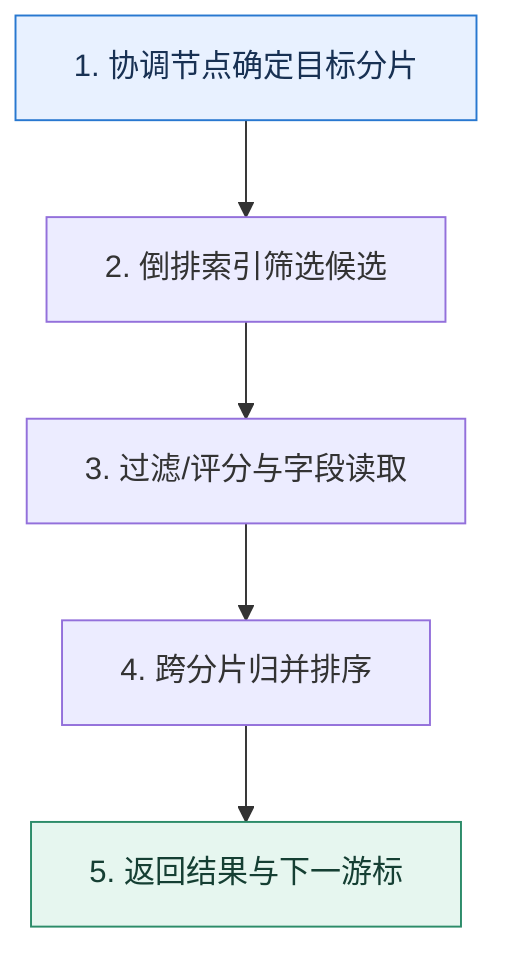

# Elasticsearch 查询优化｜从倒排索引、分片扇出到深分页成本

> 本课只回答一个问题：搜索变慢时，怎样判断问题在映射、查询、分片还是资源？

这是一份独立学习稿。来源资料用于核对知识范围；下面的解释、推演、边界和图示均按工程学习路径重新组织，不依赖原页面也能完整阅读。

## 先补齐：建立正确的心智模型

搜索请求先被协调节点拆到相关分片，每个分片用倒排索引找候选、计算过滤或相关性，再归并结果。慢查询可能来自单分片做太多，也可能来自分片太多导致扇出与归并。

读这一课时，始终把“组件名字”换成三个可追踪对象：**谁发起动作、状态存在哪里、失败后由谁收敛**。这样遇到不同产品或版本，仍能用同一套模型判断。

## 本节精讲：机制是怎样一步步工作的

字段映射先决定哪些内容需要分词、精确过滤、排序或聚合；精确条件优先放过滤上下文以复用结果并避免无谓评分。只取所需字段，批量写入并设置符合新鲜度要求的 refresh 策略。深分页若用 `from+size`，每个分片都要保留大量候选；稳定遍历更适合 `search_after` 配合唯一排序键，强一致翻页可结合 PIT 等机制。分片大小、数量、堆、页缓存和禁止 swap 共同影响尾延迟。

下面这张图只表达本课最重要的状态推进，蓝色是入口，绿色是可验收的终点；任一箭头失败，都要回到上文寻找重试、回退或人工处理的位置。

### 一次带数字的完整推演

20 个分片查询第 5001 页，每页 20 条，朴素方式每片可能保留 100020 个候选，协调层面对约 200 万候选再归并。改为按 `(event_time,_id)` 使用上一页游标，每片只取下一小批候选，成本不再与页码线性增长。若只查一个租户，写入时使用路由还能减少扇出。

数字的作用不是制造精确感，而是暴露容量和时间关系。把例子中的流量、延迟、分片数或版本号替换成自己的真实数据，方案可能会随之改变。

## 误区与失效边界

`search_after` 适合顺序浏览，不支持低成本任意跳页；PIT 也有资源成本和生存时间。把所有字段都设为可聚合会放大索引与内存，分片过小同样会增加元数据和协调开销。

判断一个结论是否可靠，可以追问两次：**它依赖什么前提？前提失效后系统留下了什么状态？** 如果回答只能停在“框架会自动处理”，就还没有走到工程边界。

## 按讲解顺序重建知识链

来源稿覆盖的论证主线在这里被重建成四步，保留问题、推导、反例和收束，不沿用原页面措辞：

1. 先沿查询执行路径定位单分片计算和跨分片扇出。
2. 再从 mapping、filter、字段读取和聚合减少工作量。
3. 用候选量公式解释深分页，并替换为稳定游标。
4. 最后检查分片布局、堆、页缓存、写入刷新和资源竞争。

把四步连起来后，本课不是一个孤立结论，而是一条可以复演的因果链。需要回查课程覆盖范围时，可打开文末的来源稿；学习时以本页模型为主。

## 工程验证：把理解变成证据

为慢查询保存查询体、命中分片数、每分片耗时、候选量、返回字段大小和 profile 结果。优化前后同时比较 P50/P99 与资源，避免平均值掩盖某个热点分片。

### 状态检查表

| 步骤 | 状态或动作 | 需要留下的证据 |
| ---: | --- | --- |
| 1 | 协调节点确定目标分片 | 记录耗时、结果与异常分支，确认状态能进入下一步 |
| 2 | 倒排索引筛选候选 | 记录耗时、结果与异常分支，确认状态能进入下一步 |
| 3 | 过滤/评分与字段读取 | 记录耗时、结果与异常分支，确认状态能进入下一步 |
| 4 | 跨分片归并排序 | 记录耗时、结果与异常分支，确认状态能进入下一步 |
| 5 | 返回结果与下一游标 | 记录耗时、结果与异常分支，确认状态能进入下一步 |

检查表不是要求生产系统逐字采用这些字段，而是强迫设计者为每一步提供可观测结果。只有入口、没有终态的流程，最终都会形成无法解释的中间状态。

## 自我检查

为什么把索引从 5 个分片增加到 50 个，查询不一定更快？

并行度增加的同时，每次查询的网络扇出、分片固定开销和协调归并也增加；小数据集或全索引搜索可能更慢。

再做一次闭卷练习：不看上文画出状态图，并为其中任意两个箭头注入超时、进程崩溃或重复请求。如果你能预测最终状态和观测信号，这一课才真正从“听懂”变成“会用”。

## 来源与版本校准

- [查看来源稿（19 页资料整理）](../content/40-elasticsearch-query.md)

来源稿只用于追溯知识范围，不是本学习稿的正文。具体产品的默认值、命令与内部实现会随版本变化；落地前应使用目标版本官方文档和故障演练再次确认。

本课涉及的产品行为以这些官方资料为校准入口：

- [Elasticsearch · Clusters, nodes and shards](https://www.elastic.co/docs/deploy-manage/distributed-architecture/clusters-nodes-shards)
- [MongoDB · Replication](https://www.mongodb.com/docs/manual/replication/)
- [MongoDB · Sharded cluster components](https://www.mongodb.com/docs/manual/core/sharded-cluster-components/)
- [MongoDB · ESR guideline](https://www.mongodb.com/docs/manual/tutorial/equality-sort-range-guideline/)
