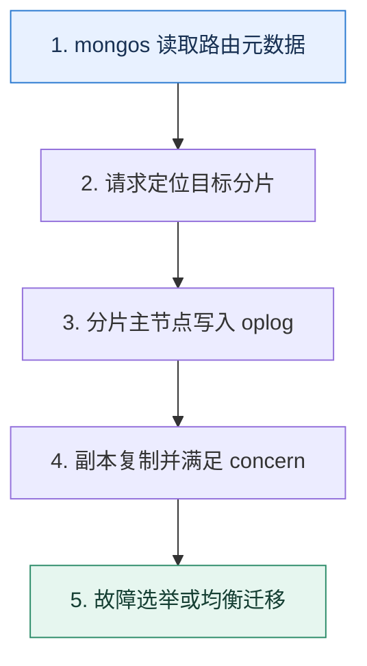

# MongoDB 高可用｜复制集负责冗余，分片集群负责水平扩展

> 本课只回答一个问题：MongoDB 中复制集、分片、配置服务和 mongos 分别承担什么状态？

这是一份独立学习稿。来源资料用于核对知识范围；下面的解释、推演、边界和图示均按工程学习路径重新组织，不依赖原页面也能完整阅读。

## 先补齐：建立正确的心智模型

复制集是一组维护同一数据副本的节点，通过选举产生主节点；分片集群把不同数据范围分给多个分片，每个分片通常又是复制集。配置服务器保存分片元数据，mongos 根据元数据路由请求。

读这一课时，始终把“组件名字”换成三个可追踪对象：**谁发起动作、状态存在哪里、失败后由谁收敛**。这样遇到不同产品或版本，仍能用同一套模型判断。

## 本节精讲：机制是怎样一步步工作的

写入主节点并进入操作日志，副本异步重放；write concern 决定客户端等待何种确认，read concern 与读偏好决定读取可见性和节点选择。多数派故障域设计要避免一个机房故障带走多数投票；仅投票的仲裁节点不保存业务数据，不能替代数据副本。分片键影响均衡与查询路由，均衡器迁移数据时要控制对在线流量的影响。备份仍独立于复制。

下面这张图只表达本课最重要的状态推进，蓝色是入口，绿色是可验收的终点；任一箭头失败，都要回到上文寻找重试、回退或人工处理的位置。

### 一次带数字的完整推演

三个数据节点分布为 A 区 1 个、B 区 1 个、C 区 1 个，任一区故障仍有两个节点形成多数。若改成 A 区 2 个、B 区 1 个，A 区故障只剩一个节点，无法选主。一个分片集群有 4 个分片，每个分片都要单独检查复制多数与容量，mongos 本身不存业务文档。

数字的作用不是制造精确感，而是暴露容量和时间关系。把例子中的流量、延迟、分片数或版本号替换成自己的真实数据，方案可能会随之改变。

## 误区与失效边界

读副本可能读到旧数据，选举期间写入会短暂不可用；提高 write concern 会改变延迟和可用性。分片不是备份，配置服务器也不是普通业务查询节点。跨地域部署必须用实测网络延迟评估多数派写入成本。

判断一个结论是否可靠，可以追问两次：**它依赖什么前提？前提失效后系统留下了什么状态？** 如果回答只能停在“框架会自动处理”，就还没有走到工程边界。

## 按讲解顺序重建知识链

来源稿覆盖的论证主线在这里被重建成四步，保留问题、推导、反例和收束，不沿用原页面措辞：

1. 先区分复制集的冗余与分片的扩展。
2. 再说明主节点、oplog、选举和多数派的关系。
3. 把配置服务器、mongos 与数据分片放入同一请求路径。
4. 最后用多可用区布局、concern、备份和迁移验证故障模型。

把四步连起来后，本课不是一个孤立结论，而是一条可以复演的因果链。需要回查课程覆盖范围时，可打开文末的来源稿；学习时以本页模型为主。

## 工程验证：把理解变成证据

故障演练分别停止 mongos、单个副本节点、当前主节点、一个可用区和配置服务器成员；记录读写是否成功、选举时间、数据新鲜度与恢复动作，避免只测试最轻的单节点故障。

### 状态检查表

| 步骤 | 状态或动作 | 需要留下的证据 |
| ---: | --- | --- |
| 1 | mongos 读取路由元数据 | 记录耗时、结果与异常分支，确认状态能进入下一步 |
| 2 | 请求定位目标分片 | 记录耗时、结果与异常分支，确认状态能进入下一步 |
| 3 | 分片主节点写入 oplog | 记录耗时、结果与异常分支，确认状态能进入下一步 |
| 4 | 副本复制并满足 concern | 记录耗时、结果与异常分支，确认状态能进入下一步 |
| 5 | 故障选举或均衡迁移 | 记录耗时、结果与异常分支，确认状态能进入下一步 |

检查表不是要求生产系统逐字采用这些字段，而是强迫设计者为每一步提供可观测结果。只有入口、没有终态的流程，最终都会形成无法解释的中间状态。

## 自我检查

为什么增加一个仲裁节点可以帮助投票，却不能等价于增加一个数据副本？

仲裁节点参与选举但不保存业务数据，不能承担读取、接替完整数据或提高数据冗余度。

再做一次闭卷练习：不看上文画出状态图，并为其中任意两个箭头注入超时、进程崩溃或重复请求。如果你能预测最终状态和观测信号，这一课才真正从“听懂”变成“会用”。

## 来源与版本校准

- [查看来源稿（18 页资料整理）](../content/41-mongodb-ha.md)

来源稿只用于追溯知识范围，不是本学习稿的正文。具体产品的默认值、命令与内部实现会随版本变化；落地前应使用目标版本官方文档和故障演练再次确认。

本课涉及的产品行为以这些官方资料为校准入口：

- [Elasticsearch · Clusters, nodes and shards](https://www.elastic.co/docs/deploy-manage/distributed-architecture/clusters-nodes-shards)
- [MongoDB · Replication](https://www.mongodb.com/docs/manual/replication/)
- [MongoDB · Sharded cluster components](https://www.mongodb.com/docs/manual/core/sharded-cluster-components/)
- [MongoDB · ESR guideline](https://www.mongodb.com/docs/manual/tutorial/equality-sort-range-guideline/)
