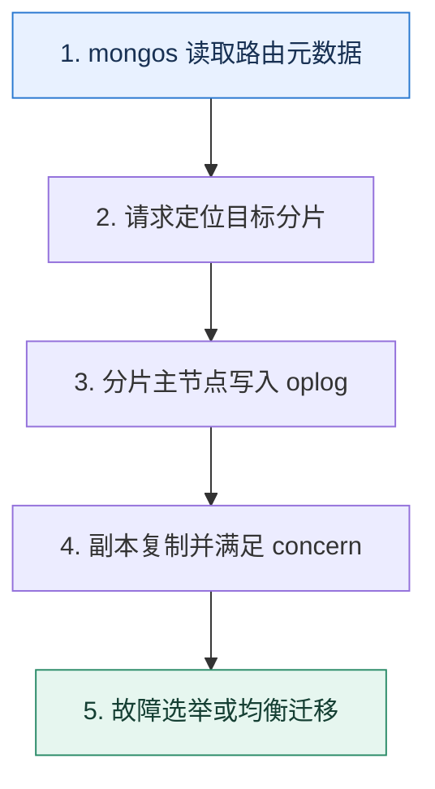

# MongoDB 高可用｜复制集负责冗余，分片集群负责水平扩展

> 本课只解决一个问题：MongoDB 中复制集、分片、配置服务和 mongos 分别承担什么状态？

这不是原页面的缩写，也不是一组孤立结论。下面先建立一个能推演的最小世界，再把状态、数字和失败分支摊开，最后按来源讲解顺序覆盖全部知识线索。读完后，你应当能从 `mongos 读取路由元数据` 一直解释到 `故障选举或均衡迁移`，并说明中途任意一步失败会留下什么状态。

## 零基础入口：先建立本课的心智画面

复制集是一组维护同一数据副本的节点，通过选举产生主节点；分片集群把不同数据范围分给多个分片，每个分片通常又是复制集。配置服务器保存分片元数据，mongos 根据元数据路由请求。

先不要急着记组件名。只抓住四个问题：**现在手里有什么输入？下一步只做什么动作？哪个状态发生变化？变化后的结果交给谁？** 之后遇到新框架，只要这四个答案不变，核心机制就没有变。

### 放进一个足够小、可以手算的世界

三个数据节点分布为 A 区 1 个、B 区 1 个、C 区 1 个，任一区故障仍有两个节点形成多数。若改成 A 区 2 个、B 区 1 个，A 区故障只剩一个节点，无法选主。一个分片集群有 4 个分片，每个分片都要单独检查复制多数与容量，mongos 本身不存业务文档。

这个小世界故意只保留本课必需的对象。生产系统会有更多节点、线程、分片和异常，但数量增加不会改变这里的因果关系。先确认你能手算这个例子，再把数字替换成真实系统数据。

### 先预测，不要马上看结论

**为什么增加一个仲裁节点可以帮助投票，却不能等价于增加一个数据副本？**

先写下自己的判断，并指出你依赖的前提。文末自我检查会揭示答案；如果答案不同，回到下面的状态表找出第一个分叉点。

## 本节精讲：让机制一步一步发生

写入主节点并进入操作日志，副本异步重放；write concern 决定客户端等待何种确认，read concern 与读偏好决定读取可见性和节点选择。多数派故障域设计要避免一个机房故障带走多数投票；仅投票的仲裁节点不保存业务数据，不能替代数据副本。分片键影响均衡与查询路由，均衡器迁移数据时要控制对在线流量的影响。备份仍独立于复制。

### 可见状态推进

| 当前步 | 现在发生的动作 | 下一步拿到什么 |
| ---: | --- | --- |
| 1 | mongos 读取路由元数据 | 请求定位目标分片 |
| 2 | 请求定位目标分片 | 分片主节点写入 oplog |
| 3 | 分片主节点写入 oplog | 副本复制并满足 concern |
| 4 | 副本复制并满足 concern | 故障选举或均衡迁移 |
| 5 | 故障选举或均衡迁移 | 得到可核对的终态 |

图只承担一个任务：让你看清状态如何向前移动。它不意味着每一步必然成功；网络超时、进程退出、重复执行和数据竞争都可能让箭头停在中间，因此后面必须继续讨论失效边界。

### 一次带数字的完整推演

三个数据节点分布为 A 区 1 个、B 区 1 个、C 区 1 个，任一区故障仍有两个节点形成多数。若改成 A 区 2 个、B 区 1 个，A 区故障只剩一个节点，无法选主。一个分片集群有 4 个分片，每个分片都要单独检查复制多数与容量，mongos 本身不存业务文档。

数字不是装饰。它迫使我们回答容量、顺序、时间窗口或版本选择问题。若换一个数字就得出不同结论，真正的设计依据就是那个阈值，而不是某个中间件名称。

## 按讲解顺序重建知识链：完整来源讲解

下面按来源资料的教学顺序重新编排完整内容。转换页码、来源图片、推广信息、水印和个人宣传已经删除；原本围绕求职问答的角色与措辞改写为工程学习、方案评审和故障复盘语境。机制、算法、例子、反例、事故线索、评论补充和限制条件仍然保留。这里的作用是补齐知识覆盖，不取代前面的独立推演。

今天我们看另外一个 NoSQL 数据库，也就是大名鼎鼎的 MongoDB。

MongoDB 是出现得比较早的文档型数据库，应该说早期我们谈到 NoSQL 的时候，第一个想到的就是 MongoDB。到现在，很多公司内部都使用了 MongoDB 来保存一些偏向文档类型的数据。

今天我们就先来学习一下 MongoDB 的基本原理，并看看 MongoDB 是如何保证高可用的。

### 为什么用 MongoDB？

在讨论之前，你要知道我们为什么要用 MongoDB？因为在很多情况下用 MongoDB 能够解决的问题，MySQL 同样也可以解决。

就我个人来说，使用 MongoDB 的决策理由第一个就是灵活性，其次是它的横向扩展能力。

MongoDB 是灵活的文档模型。也就是说，如果我预计我的数据可以被一个稳定的模型来描述，那么我会倾向于使用 MySQL 等关系型数据库。而一旦我认为我的数据模型会经常变动，比如说我很难预料到用户会输入什么数据，这种情况下我就更加倾向于使用MongoDB。MongoDB 更容易进行横向扩展。虽然关系型数据库也可以通过分库分表来达成横向扩展的目标，但是比 MongoDB 要困难很多，后期运维也要复杂很多。而这一切在 MongoDB里面都是自动的，你基本不需要操心。

当然，对于一般的中小型公司来说，MongoDB 都不是必须使用的存储中间件，大部分时候使用关系型数据库也能应付一般的文档存储需求。

### MongoDB 的分片机制

当下，跟数据存储和检索有关的中间件基本上都会支持分片。或者说我们步入了分布式时代之后诞生的中间件，基本上都会考虑分片机制。MongoDB 也不例外。

在 MongoDB 里，你可以使用所谓的分片集合（collection）。每一个分片集合都被分成若干个分片，如果按照关系型数据库分库分表的说法，那么集合就是逻辑表，而分片就是物理表。

每个分片又由多个块（chunk）组成。在最新版本的默认情况下，一个块的大小是 128 MB。

如果一个块满足了下面这两个条件里的任何一个，就会被拆分成两个块。

整个块的数据量过多了。比如说默认一个块是 128MB，但是这个块上放的数据超过了 128 MB，那么就会拆分。块上面放了太多文档，这个阈值是平均每个块包含的文档数量的 1.3 倍。也就是说，如果平均每个块可以放 1000 个文档，如果当前块上面放了超过 1300 个文档，那么这个块也会被切分。

这两个条件简单记忆就是数据太多和文档太多。

接下来就是讨论 MongoDB 的神奇的地方了。在分库分表里面，经常会遇到的一个问题是，不同的表之间数据并不均衡，有的多有的少。所以这就要求你在设计分库分表方案的时候，要尽可能准确预估每一个物理表的数据，确保均衡。

而在 MongoDB 里面，它会自动平衡不同分片的数据，尽量做到每个分片都有差不多的数据量，整个机制也叫做负载均衡。只不过一般意义上的负载均衡强调的是流量负载均衡，而这里强调的数据量负载均衡。

而发现数据不均匀之后，迁移数据的过程也叫做再平衡（rebalance）。再平衡过程本质上就是挪动块。

那么什么时候才会触发再平衡过程呢？MongoDB 设定了一些阈值，超过了这个阈值就会触发再平衡的过程。你可以看一下具体的阈值表。

举个例子，如果一个集合里面最大的分片有 9 个块，而最少的集合有 7 个块，那么就会触发再平衡过程。

那块迁移究竟是怎么进行的呢？这里假设我们要迁移块 A，这个过程就包含七个步骤。

1. 平衡器发送 moveChunk 命令到源分片上。
2. 源分片执行 moveChunk 命令，这个时候读写块 A 的操作都是源分片来负责的。
3. 目标分片创建对应的索引。
4. 目标分片开始同步块 A 的数据。

5. 当块 A 最后一个文档都同步给目标分片之后，目标分片会启动一个同步过程，把迁移过程中的数据变更也同步过来。
6. 整个数据同步完成之后，源分片更新元数据，告知块 A 已经迁移到了目标分片。
7. 当源分片上的游标都关闭之后，它就可以删除块 A 了。
应该说，这个过程和别的中间件的数据迁移过程都差不多。

### MongoDB 的配置服务器

当引入了分片机制之后，MongoDB 启用了配置服务器（config server）来存储元数据。这些元数据包括分片信息、权限控制信息，用来控制分布式锁。其中分片信息还会被负责执行查询 mongos 使用。

MongoDB 的配置服务器有一个很大的优点，就是就算主节点崩溃了， 但是它还是可以继续提供读服务。这和别的中间件不一样，大多数中间件的主从结构都是在主节点崩溃之后完全不可用，直到选举出了一个新的主节点。

但是不管怎么说，配置服务器在 MongoDB 里面是一个非常关键的组件。甚至可以说，一旦配置服务器有问题，就算只是轻微地性能抖动一下，对整个 MongoDB 集群的影响都是很大的。

### MongoDB 的复制机制

你也可以把 MongoDB 的复制机制理解成 MongoDB 的主从机制。简单来说，MongoDB 的副本也是 MongoDB 实例，它们和主实例持有一样的数据。在 MongoDB 里面，用 Primary来代表主实例，而用 Secondary 来代表副本实例。主从实例合并在一起，也叫做一个复制集（Replica Set）。

类似于数据库的读写分离机制，你也可以在 MongoDB 上进行读写分离。

既然有主从，那么肯定也有主从集群和数据同步。在 MongoDB 里面，主从之间的数据同步是通过所谓的 oplog 来实现的，从这一点来看，这个 oplog 很像 MySQL 的 binlog。

不过在 MongoDB 里面，oplog 是有一些缺陷的。第一个缺陷就是在一些特定的操作里，oplog 可能会超乎想象地大。这主要是因为 oplog 是幂等的，所以任何操作都必须转化成幂等操作。

你可以简单一点儿来理解，任何对 MongoDB 里数据的操作，最后都会被转化成一个 set 操作。所以可以预计的是，就算你只是更新了数据的一小部分，但是生成的 oplog 还是 set 整个数据。

第二个缺陷是 oplog 是有期限的。或者说，MongoDB 限制了 oplog 的大小。当 oplog 占据了太多的磁盘之后，就会被删除。就算某个从节点来不及同步，oplog 也是会被删除的。这个时候，这个从节点就只能重新发起一次全量的数据同步了。

### 写入语义

MongoDB 的写入语义和 Kafka 的写入语义非常像。也就是说你可以通过参数来控制写入数据究竟写到哪里。而写入语义对性能、可用性和数据可靠性有显著的影响。

在 MongoDB 里面，写入语义也叫做 Write Concern，它由 w、j 和 wtimeout 三个参数控制。

对于 w 来说，它的取值是这样的：

majority：要求写操作已经同步给大部分节点，也是 MongoDB 的默认取值。这个选项的可用性很强，但是写入的性能比较差。数字 N：如果 N 等于 1，那么要求必须写入主节点；如果 N 大于 1，那么就必须写入主节点，并且写入从节点，这些节点数量加在一起等于 N；如果 N 等于 0，那么就不用等任何节点写入。这种模式下性能很好，但是你也可以想象到，在这个模式下虽然客户端可能收到了成功的响应，但是数据也会丢失。自定义写入节点策略：具体来说就是你可以给一些节点打上标签，然后要求写入的时候一定要写入带有这些标签的节点。这个在实践中用得比较少，但是如果你们公司采用了的话，非常适合用来技术讨论。

j 选项控制数据有没有被写到磁盘上。对于 j 来说它的取值就是 true 或者 false。

最后一个参数 wtimeout，就是指写入的超时时间，它只会在 w 大于 1 的时候生效。需要注意的是，在超时之后 MongoDB 就直接返回一个错误，但是在这种情况下，MongoDB 还是可能写入数据成功了。

### 把知识转成可验证的工程判断

除了上面这些基础知识，你还要在公司内部弄清楚和 MongoDB 有关的信息。

你负责的业务或者你们公司有没有使用 MongoDB？主要是用来做什么？为什么你要用 MongoDB？用 MySQL 行不行？你用 MongoDB 的时候，你的文档支持分片吗？如果支持分片，那么是按照什么来分片的？你用 MongoDB 的业务有多少数据量，MongoDB 上的并发有多高？你们公司的 MongoDB 是怎么部署的，主从节点有多少？有没有多数据中心的部署方案？你使用 MongoDB 的写入语义是什么？也就是说 w 和 j 这两个参数的取值是什么？

站在你个人成长的角度，我建议你在某个问题可以用 MySQL 来解决，但是看起来用MongoDB 更好的时候，尽量选用 MongoDB。尤其是你还没接触过 MongoDB 的话，正好趁着机会接触一下。

当技术评审者和你聊到了这些话题的时候，你也可以引导到这节课的内容上。

Kafka 的 acks 机制，那么你可以引申到 MongoDB 的写入语义上。其他中间件的对等结构，或者主从结构，你可以引导到 MongoDB 的分片和主从机制上。Kafka 的元数据，你可以结合 MongoDB 的元数据来一起解释。

另外，如果技术评审者问到了 MongoDB 数据不丢失的问题，你记得结合前置知识里面的写入语义，参考我在 Kafka 里分析的思路来解释。你在整个 MongoDB 的技术讨论过程中，要注意和不

同的中间件进行对比，凸显你在这方面的积累。

### 主从结构

MongoDB 的高可用其实和别的中间件的高可用方案不能说一模一样，但是可以说是一脉相承。比如说在 MySQL 里面，你就接触过了分库分表和主从同步。在 Redis 里面，你也看到了Redis 的主从结构；在 Kafka 里，分区也是有主从结构的。

所以你要先介绍你启用了主从同步。

我们这个系统有一个关键组件，就是 MongoDB。但是在最开始的时候，MongoDB 都还没有启用主从，也就是一个单节点的。因此每年总会有那么一两次，MongoDB 崩溃不可用。所以我做了一件很简单的事情，就是把 MongoDB 改成了主从同步，最开始的时候业务量不多，为了节省成本，我们就用了推荐的配置一主两从。这种改变的好处就是当主节点崩溃之后，从节点可以选举出一个新的主节点。

当然在这个解释里面，你可以直接说你所在的公司，用了几个主从节点。要是技术评审者问到了主从同步，你就解释 oplog 的内容就可以了。

### 引入仲裁节点

另外一种技术推理路径是说你在公司引入了仲裁节点（Aribiter）。所谓的仲裁节点是指这个节点参与主从集群的主节点选举，但是只参与投票，就类似于 Elasticsearch 里的仅投票节点。

这种机制你在别的中间件里面也见过了。这一类节点的好处就在于它们只参与投票，也就是只关心主从选举，所以只需要很少的资源就可以运行起来。

最开始的时候，某个线上系统只是部署了一主两从，两个从节点都会同步数据。后面为了进一步提高可用性，我引入了仲裁节点。这些仲裁节点被部署在轻量级的服务器上，成本非常低。在引入了这些仲裁节点之后，就算有一个从节点崩溃了，整个集群也基本没什么影响，因为这个时候还是有足够的节点可以投票。

### 启用主从模式的配置服务器

在前置知识里面，你也知道了配置服务器是 MongoDB 中的关键组件，一旦出现问题，对整个集群的可用性都有很大的影响。那么配置服务器能使用主从结构吗？

答案是可以的。

实际上，MongoDB 本身也是推荐使用主从结构的配置服务器。

我们 MongoDB 最开始部署的时候，配置服务器并没有启用主从模式，毕竟当时是想着节省资源。但是后面发现，配置服务器这个对集群的影响太大了，一旦不可用，整个集群就基本不可用了。在这种情况下，我们只好引入了主从结构的配置服务器。目前某个线上系统的配置服务器本身就有一主两从。

紧接着你可以补充这个做法的好处。

虽然主节点还是存在崩溃的可能，但是在主节点崩溃之后会有主从选举。更加重要的是，在主节点崩溃之后，整个配置服务集群还是可读的。而我们也知道，在一个 MongoDB 集群里面，元数据也是读多写少的。两者一结合，整个 MongoDB 集群的可用性就提高了。

### 多数据中心的主从结构

在主从结构这里，再深入一些的话，就需要聊一聊多数据中心的主从结构。MongoDB 里面有一个推荐的架构，你可以看一下示意图。

不过正常来说，大部分公司没那么多资源部署，那么一个简化版本就是用两个数据中心，部署一主三从或者一主两从。

某个线上系统本身业务规模比较大，对 MongoDB 的依赖也很严重，所以我们还部署了多数据中心的主从结构。我们有两个数据中心（可以同城，可以异地），其中一个数据中心，部署了一主一从，另外一个数据中心部署了两个从节点。那么万一一个数据中心崩溃了，另外一个数据中心也还是可用的。

然后在主从选举的时候，我们也会倾向于选择和主节点在同一个数据中心的从节点，也就是图里面深黄色的从节点。因为正常来说同一个数据中心内部的从节点，数据会比较新。

同时为了保证在主从选举的时候优先选择同一个数据中心的节点，我们还调整了从节点的优先级。也就是说，我们先把同一个机房的节点都设置成比较高的优先级，那么主节点大概率就会从这个机房选出来。

当然，如果你们公司本身就使用了这种多数据中心的主从结构，那么就可以用你们公司的多数据中心主从结构来解释。

在整个主从结构都面完了之后，你进一步总结一下。

基本上目前主流的这种大型中间件，在提高可用性上用的方法无外乎就是分片和主从结构。除了 MongoDB，类似的还有 Redis、Elasticsearch、Kafka。

### 引入分片

那么第二个可以提高可用性的点，就是引入分片。从理论上来说，分片既可以提高性能，又可以提高可用性。

在 MongoDB 里面，引入分片要比关系型数据库简单多了。你可以直接说你在开发新业务的时候就启用了分片功能。

随着我们业务的增长，我们后面使用 MongoDB 的时候，都要求开启分片功能，来进一步提高可用性和性能。

另外一种技术推理路径就是为已有的数据添加分片功能。这个技术推理路径你要谨慎使用，因为通过我和小伙伴们的经历，我们都一致认为，这个部分比较容易遇到问题。如果你没实际操刀过，技术评审者问细节你就可能答不上来。

为了进一步提高可用性和性能，我还在我的业务上引入了分片。不过因为现在已经有数据了，所以这算是一个比较危险的操作。因此我在业务低峰期的时候，在运维的协助下，把集合改成了分片集合。

最后也要进一步总结升华一下。

目前来说，支持大数据高并发的中间件基本上也有类似的分片功能。或者说，这一类的中间件明面上都是对等结构，而对等结构里面的每一个“节点”又是一个主从集群。就算是关系型数据库的分库分表，也可以看作是这种对等结构 + 主从结构的模式。

### 调整写入语义

就像之前你在 MySQL 和 Kafka 里见到的，像这种写入语义一般都有两种调整思路，一个是朝着可用性的角度调整，另一个是朝着性能的角度调整。

这里我们以可用性为例。

最开始的时候，我们遇到过一个 Bug，就是数据写入到 MongoDB 之后，偶尔会出现数据丢失的问题。因为之前我在 Kafka 上也遇到过类似的问题，所以我就怀疑是不是写入语义没做好。然后我就去排查，果然有发现，在这个数据丢失的场景下，Write Concern 的 w取值不是默认的 majority，而是 1，也就是说只需要主节点写入就可以。

很明显，在这种情况下，万一写入之后主节点崩溃了，那么从节点就算被提升成主节点，也没有这一条数据。所以，后面我就把这个改回了 majority。同时我还去排查了一个 j 参数，确认设置成了 true。这样一来，数据就不太可能丢失了。

### 本节原始知识线索收束

在前置知识部分，我们了解了用 MongoDB 的原因，主要是为了灵活的文档模型和易于横向扩展。其次了解了 MongoDB 在可用性上最基本的机制：分片和复制，还有支撑分片和复制机制的配置服务器。这部分内容很容易引申到数据可靠性的问题上，所以为了以防万一，我们

详细讲解了写入语义的问题。最后通过引入主从机制、引入分片和调整写入语义三个主要措施构建了一个高可用方案。

在 MongoDB 的技术讨论里面，你始终要记住一点，就是把 MongoDB 和别的中间件进行横向对比，最好的方式是自己总结出一张思维导图或者表格，更加一目了然。

### 继续推演

最后请你来思考两个问题。

我提到 MongoDB 的配置服务器，有一个显著特点是主节点崩溃了还可以继续提供读服务，你还见过别的中间件有类似设计吗？现在你来准备一段话，介绍你在接手一个系统后，把原本存储在 MySQL 中但是更适合放在 MongoDB 的部分数据，迁移到了 MongoDB，你会怎么介绍呢？

### 补充讨论与边界校准

#### 全部留言 (1)

补充讨论： 对于ES的选举节点，应该也是一样的。Q3：分片多但没有超过128M，也会分片吗？分片阈值是可配置的吗？Q4：阈值定义中：“少于20块”，阈值为2。以此为例，“少于20块”是分片中的块数量？还是集合中的块数量？“如果一个集合里面最大的分片有 9 个块，而最少的集合有 7 个块” ，这句话中，“最少的集合”应该是笔误，应该是“最少的分片”吧。Q5：配置服务器是采用主从结构吗？为什么可以在主节点崩溃以后还可以继续服务？是自动切换吗？Q6：某些操作导致oplog很大的时候，会表现为响应时间长吗？

讲解补充：1. 小规模的话，这是一个很大的优点，我就比较倾向于这个。如果是规模大的话，我觉得它自动管理分片的吸引力更大，毕竟我也不想处理分库分表。

2. 可以共用一个虚拟机啥的，但是要注意不要和核心中间件共用。你可以考虑和一些不太重要的中间件，服务部署在一起，MySQL 还是很关键的，害怕影响 MySQL。
3. 分片与否是你自己控制的，这个配置是可以改的。
4. 感谢勘误。是指分片中块的数量

5. 不是，是可以读从节点。配置服务器你可以用主从结构，也可以不用。
6. 会有点影响，但是影响不是特别明显，我基本没遇到过。

## 把完整讲解收束成一条因果链

1. 先区分复制集的冗余与分片的扩展。
2. 再说明主节点、oplog、选举和多数派的关系。
3. 把配置服务器、mongos 与数据分片放入同一请求路径。
4. 最后用多可用区布局、concern、备份和迁移验证故障模型。

把这几步连接起来时，不要省略“为什么”。最终结论只有在前提、状态变化和失败代价都说得清楚时才可靠。

## 误区与失效边界

读副本可能读到旧数据，选举期间写入会短暂不可用；提高 write concern 会改变延迟和可用性。分片不是备份，配置服务器也不是普通业务查询节点。跨地域部署必须用实测网络延迟评估多数派写入成本。

再加一条通用但必须落实到本课对象上的边界：机制只能处理它看得见的信号。若输入指标失真、状态没有持久化、错误被吞掉，或者补偿没有幂等保护，再成熟的框架也只能基于错误证据作决定。

### 三种故障注入方式

| 故障 | 要观察什么 | 不能接受的解释 |
| --- | --- | --- |
| 在第 2 步前让依赖超时 | 是否停在可重试状态，是否消耗完上游预算 | “框架稍后会处理” |
| 在状态写入后让进程退出 | 重启后能否识别已完成与待继续动作 | “再执行一次应该没事” |
| 对同一输入并发执行两次 | 是否出现重复副作用、顺序颠倒或覆盖 | “概率很低” |

## 工程验证：把理解变成可以复查的证据

故障演练分别停止 mongos、单个副本节点、当前主节点、一个可用区和配置服务器成员；记录读写是否成功、选举时间、数据新鲜度与恢复动作，避免只测试最轻的单节点故障。

| 步骤 | 状态或动作 | 最少应留下的证据 |
| ---: | --- | --- |
| 1 | mongos 读取路由元数据 | 开始时间、结束时间、输入标识、结果状态、异常原因 |
| 2 | 请求定位目标分片 | 开始时间、结束时间、输入标识、结果状态、异常原因 |
| 3 | 分片主节点写入 oplog | 开始时间、结束时间、输入标识、结果状态、异常原因 |
| 4 | 副本复制并满足 concern | 开始时间、结束时间、输入标识、结果状态、异常原因 |
| 5 | 故障选举或均衡迁移 | 开始时间、结束时间、输入标识、结果状态、异常原因 |

验证时同时记录成功路径和失败路径。只证明“正常时能跑通”不能说明设计可靠；至少要让一次超时、一次进程退出和一次重复请求可重现，并能根据日志或指标解释最后状态。

## 学完检查：闭卷画出本课

你现在应该能独立完成四件事：

1. 用自己的话说出本课唯一问题，不使用产品名也能解释。
2. 复算上面的具体例子，并指出哪个输入改变会让结论改变。
3. 沿 Mermaid 图注入一次失败，预测系统停在哪里以及由谁收敛。
4. 说出本课机制不保证什么，并给出一个反例。

## 自我检查

为什么增加一个仲裁节点可以帮助投票，却不能等价于增加一个数据副本？

仲裁节点参与选举但不保存业务数据，不能承担读取、接替完整数据或提高数据冗余度。

怎样证明自己不是只记住了名词？

把 `mongos 读取路由元数据` 的一个真实输入写出来，逐步记录到 `故障选举或均衡迁移`。然后在中间任意一步制造失败；如果你能解释当前状态、下一责任方、可观测证据和恢复边界，就已经拥有可以迁移的工程模型。

## 来源与事实校准

- [查看完整来源稿（本地 18 页资料）](../content/41-mongodb-ha.md)

### 当前事实校准

复制集提供同一数据集的冗余和选举，分片集群把不同数据子集放在多个分片上，而每个分片本身应部署为复制集。write concern、read concern 与 read preference 分别控制确认、可见性和读取位置，仲裁节点只投票不保存业务数据，不能等价为数据副本，也不能替代独立备份。

- [MongoDB · Replica Set Read and Write Semantics](https://www.mongodb.com/docs/manual/applications/replication/)
- [MongoDB · Shards](https://www.mongodb.com/docs/manual/core/sharded-cluster-shards/)
- [MongoDB · Write Concern](https://www.mongodb.com/docs/manual/reference/write-concern/)

来源稿用于核对覆盖范围，不随公开站点发布。产品默认值和具体内部行为可能随版本变化；落地时应使用目标版本的官方文档、可运行实验和故障演练校准。本学习稿中的零基础入口、状态推演、故障矩阵和工程验证属于编辑补充，不冒充来源讲解者的原话。
