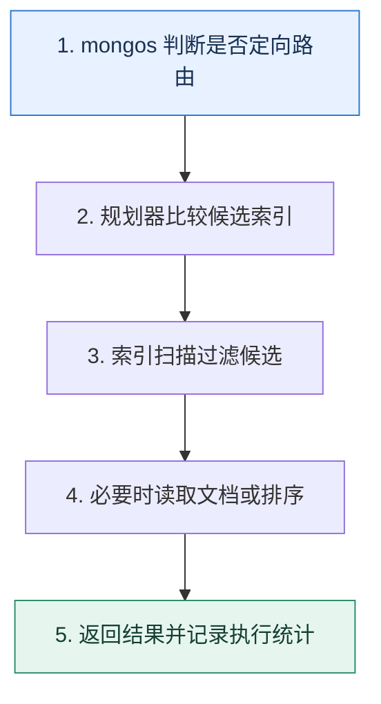

# MongoDB 查询优化｜让索引顺序服务真实的等值、排序与范围访问

> 本课只回答一个问题：复合索引字段应该怎样排序，查询为什么仍可能回表或广播？

这是一份独立学习稿。来源资料用于核对知识范围；下面的解释、推演、边界和图示均按工程学习路径重新组织，不依赖原页面也能完整阅读。

## 先补齐：建立正确的心智模型

查询先经过路由，再由目标分片的规划器选择索引，扫描键并在需要时读取文档。优化要同时减少目标分片数、扫描索引键数、读取文档数和排序工作。

读这一课时，始终把“组件名字”换成三个可追踪对象：**谁发起动作、状态存在哪里、失败后由谁收敛**。这样遇到不同产品或版本，仍能用同一套模型判断。

## 本节精讲：机制是怎样一步步工作的

常用 ESR 思路把等值字段放前面，再按工作负载在排序与范围之间选择。若避免内存排序更重要，可用 Equality→Sort→Range；若范围条件极具选择性，Equality→Range→Sort 可能扫描更少，但排序可能另行完成。覆盖查询只从索引返回所需字段，减少文档读取。分片查询包含分片键可定向路由，否则 mongos 可能广播。大数组、无限增长文档和过多索引会放大写入与搬迁成本，应按访问模式建模。

下面这张图只表达本课最重要的状态推进，蓝色是入口，绿色是可验收的终点；任一箭头失败，都要回到上文寻找重试、回退或人工处理的位置。

### 一次带数字的完整推演

查询 `{tenant:7, status:'PAID', created_at:{$gt:T}}`，按 amount 排序并取 20 条。若大多数记录都很新但 amount 排序必须稳定，可评估 `(tenant,status,amount,created_at)`；若时间范围只命中万分之一，`(tenant,status,created_at,amount)` 扫描更少但可能需要排序。用 explain 比较 keysExamined、docsExamined 与是否出现阻塞排序，而不是机械套公式。

数字的作用不是制造精确感，而是暴露容量和时间关系。把例子中的流量、延迟、分片数或版本号替换成自己的真实数据，方案可能会随之改变。

## 误区与失效边界

ESR 是指南，不是不可变定律；低选择性、排序方向、多键索引和分片路由都会改变结果。索引越多读选择越丰富，写入和缓存成本也越高。把 MongoDB 当作关系数据库逐表照搬，常会错失按聚合边界嵌入文档的优势。

判断一个结论是否可靠，可以追问两次：**它依赖什么前提？前提失效后系统留下了什么状态？** 如果回答只能停在“框架会自动处理”，就还没有走到工程边界。

## 按讲解顺序重建知识链

来源稿覆盖的论证主线在这里被重建成四步，保留问题、推导、反例和收束，不沿用原页面措辞：

1. 先从查询形状与分片键确定会访问多少分片。
2. 再按等值、排序、范围分析复合索引顺序。
3. 用 explain 的扫描量和排序验证 ESR 或 ERS 选择。
4. 最后治理覆盖查询、大文档、数组和索引写放大。

把四步连起来后，本课不是一个孤立结论，而是一条可以复演的因果链。需要回查课程覆盖范围时，可打开文末的来源稿；学习时以本页模型为主。

## 工程验证：把理解变成证据

保存 Top 查询形状及 `nReturned、keysExamined、docsExamined、executionTime、targetedShards、hasSortStage`。每次加索引还要记录写入耗时、索引大小和构建影响，避免只优化一条读路径。

### 状态检查表

| 步骤 | 状态或动作 | 需要留下的证据 |
| ---: | --- | --- |
| 1 | mongos 判断是否定向路由 | 记录耗时、结果与异常分支，确认状态能进入下一步 |
| 2 | 规划器比较候选索引 | 记录耗时、结果与异常分支，确认状态能进入下一步 |
| 3 | 索引扫描过滤候选 | 记录耗时、结果与异常分支，确认状态能进入下一步 |
| 4 | 必要时读取文档或排序 | 记录耗时、结果与异常分支，确认状态能进入下一步 |
| 5 | 返回结果并记录执行统计 | 记录耗时、结果与异常分支，确认状态能进入下一步 |

检查表不是要求生产系统逐字采用这些字段，而是强迫设计者为每一步提供可观测结果。只有入口、没有终态的流程，最终都会形成无法解释的中间状态。

## 自我检查

为什么复合索引设计不能永远机械地按 Equality→Sort→Range 排列？

如果范围条件极具选择性，把它提前可能大幅减少扫描；代价是排序可能无法完全由索引满足。应按实际数据分布与 explain 结果在 ESR 和 ERS 间选择。

再做一次闭卷练习：不看上文画出状态图，并为其中任意两个箭头注入超时、进程崩溃或重复请求。如果你能预测最终状态和观测信号，这一课才真正从“听懂”变成“会用”。

## 来源与版本校准

- [查看来源稿（13 页资料整理）](../content/42-mongodb-performance.md)

来源稿只用于追溯知识范围，不是本学习稿的正文。具体产品的默认值、命令与内部实现会随版本变化；落地前应使用目标版本官方文档和故障演练再次确认。

本课涉及的产品行为以这些官方资料为校准入口：

- [Elasticsearch · Clusters, nodes and shards](https://www.elastic.co/docs/deploy-manage/distributed-architecture/clusters-nodes-shards)
- [MongoDB · Replication](https://www.mongodb.com/docs/manual/replication/)
- [MongoDB · Sharded cluster components](https://www.mongodb.com/docs/manual/core/sharded-cluster-components/)
- [MongoDB · ESR guideline](https://www.mongodb.com/docs/manual/tutorial/equality-sort-range-guideline/)
