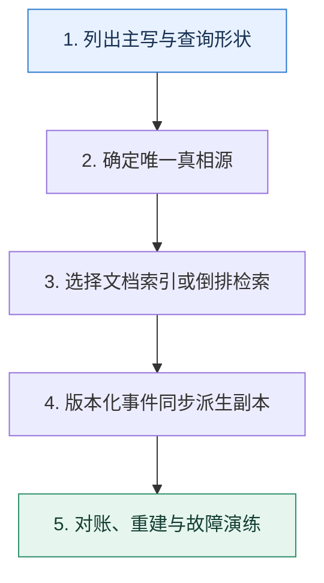

# NoSQL 专题复盘｜从访问模型选择检索系统与文档数据库

> 本课只回答一个问题：面对搜索、聚合、灵活文档和高可用需求，怎样判断系统边界而不是跟随产品标签？

这是一份独立学习稿。来源资料用于核对知识范围；下面的解释、推演、边界和图示均按工程学习路径重新组织，不依赖原页面也能完整阅读。

## 先补齐：建立正确的心智模型

Elasticsearch 与 MongoDB 都能查询 JSON 风格数据，但核心访问结构不同：前者围绕倒排索引、相关性和分片搜索，后者围绕文档主存储、复合索引、复制集与分片路由。选择要从真相源、查询形状和一致性要求出发。

读这一课时，始终把“组件名字”换成三个可追踪对象：**谁发起动作、状态存在哪里、失败后由谁收敛**。这样遇到不同产品或版本，仍能用同一套模型判断。

## 本节精讲：机制是怎样一步步工作的

全文检索、相关性、复杂聚合和日志探索更接近 Elasticsearch；以文档为聚合边界、需要主数据读写与灵活结构时可评估 MongoDB。常见架构让事务数据库或文档库保有真相，变更事件同步搜索索引，并明确索引延迟、重建和对账。两边都要规划分片键/路由、热点、分片大小、副本、备份与故障恢复。

下面这张图只表达本课最重要的状态推进，蓝色是入口，绿色是可验收的终点；任一箭头失败，都要回到上文寻找重试、回退或人工处理的位置。

### 一次带数字的完整推演

商品主数据写 MongoDB，商品名与属性同步到 Elasticsearch。更新版本 208 先在主库提交，再通过 Outbox 投递；搜索结果可能短暂仍是 207，详情页按商品 ID 回主库读取 208。对账发现索引版本落后时重放事件，而不是允许搜索集群直接改写主数据。

数字的作用不是制造精确感，而是暴露容量和时间关系。把例子中的流量、延迟、分片数或版本号替换成自己的真实数据，方案可能会随之改变。

## 误区与失效边界

双系统会带来延迟、重复、乱序和重建成本。如果查询只按主键且数据规模普通，引入搜索集群可能过度设计；如果需要复杂相关性，却用文档库堆大量正则查询，也会把成本转移到线上。

判断一个结论是否可靠，可以追问两次：**它依赖什么前提？前提失效后系统留下了什么状态？** 如果回答只能停在“框架会自动处理”，就还没有走到工程边界。

## 按讲解顺序重建知识链

来源稿覆盖的论证主线在这里被重建成四步，保留问题、推导、反例和收束，不沿用原页面措辞：

1. 先用访问模型而不是数据长相选择系统。
2. 分别画 Elasticsearch 分片搜索与 MongoDB 路由查询路径。
3. 再设计主数据到搜索索引的版本化同步。
4. 最后验证副本、快照、跨区和全量重建时间。

把四步连起来后，本课不是一个孤立结论，而是一条可以复演的因果链。需要回查课程覆盖范围时，可打开文末的来源稿；学习时以本页模型为主。

## 工程验证：把理解变成证据

决策记录至少比较：主写语义、事务范围、全文相关性、聚合、定向路由、允许索引延迟、全量重建时间、团队运维能力。若某项没有实测数字，就标记为未验证假设。

### 状态检查表

| 步骤 | 状态或动作 | 需要留下的证据 |
| ---: | --- | --- |
| 1 | 列出主写与查询形状 | 记录耗时、结果与异常分支，确认状态能进入下一步 |
| 2 | 确定唯一真相源 | 记录耗时、结果与异常分支，确认状态能进入下一步 |
| 3 | 选择文档索引或倒排检索 | 记录耗时、结果与异常分支，确认状态能进入下一步 |
| 4 | 版本化事件同步派生副本 | 记录耗时、结果与异常分支，确认状态能进入下一步 |
| 5 | 对账、重建与故障演练 | 记录耗时、结果与异常分支，确认状态能进入下一步 |

检查表不是要求生产系统逐字采用这些字段，而是强迫设计者为每一步提供可观测结果。只有入口、没有终态的流程，最终都会形成无法解释的中间状态。

## 自我检查

为什么“两个系统都能存 JSON”不足以支持技术选型？

数据表示相似不等于执行模型相同。应比较倒排检索、文档事务、索引写放大、查询路由、一致性与恢复路径。

再做一次闭卷练习：不看上文画出状态图，并为其中任意两个箭头注入超时、进程崩溃或重复请求。如果你能预测最终状态和观测信号，这一课才真正从“听懂”变成“会用”。

## 来源与版本校准

- [查看来源稿（5 页资料整理）](../content/42a-mock-nosql.md)

来源稿只用于追溯知识范围，不是本学习稿的正文。具体产品的默认值、命令与内部实现会随版本变化；落地前应使用目标版本官方文档和故障演练再次确认。

本课涉及的产品行为以这些官方资料为校准入口：

- [Elasticsearch · Clusters, nodes and shards](https://www.elastic.co/docs/deploy-manage/distributed-architecture/clusters-nodes-shards)
- [MongoDB · Replication](https://www.mongodb.com/docs/manual/replication/)
- [MongoDB · Sharded cluster components](https://www.mongodb.com/docs/manual/core/sharded-cluster-components/)
- [MongoDB · ESR guideline](https://www.mongodb.com/docs/manual/tutorial/equality-sort-range-guideline/)
