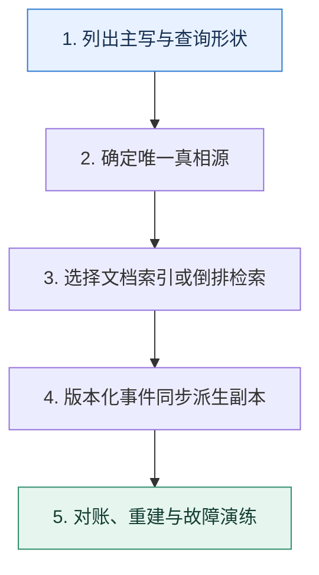

# NoSQL 专题复盘｜从访问模型选择检索系统与文档数据库

> 本课只解决一个问题：面对搜索、聚合、灵活文档和高可用需求，怎样判断系统边界而不是跟随产品标签？

这不是原页面的缩写，也不是一组孤立结论。下面先建立一个能推演的最小世界，再把状态、数字和失败分支摊开，最后按来源讲解顺序覆盖全部知识线索。读完后，你应当能从 `列出主写与查询形状` 一直解释到 `对账、重建与故障演练`，并说明中途任意一步失败会留下什么状态。

## 零基础入口：先建立本课的心智画面

Elasticsearch 与 MongoDB 都能查询 JSON 风格数据，但核心访问结构不同：前者围绕倒排索引、相关性和分片搜索，后者围绕文档主存储、复合索引、复制集与分片路由。选择要从真相源、查询形状和一致性要求出发。

先不要急着记组件名。只抓住四个问题：**现在手里有什么输入？下一步只做什么动作？哪个状态发生变化？变化后的结果交给谁？** 之后遇到新框架，只要这四个答案不变，核心机制就没有变。

### 放进一个足够小、可以手算的世界

商品主数据写 MongoDB，商品名与属性同步到 Elasticsearch。更新版本 208 先在主库提交，再通过 Outbox 投递；搜索结果可能短暂仍是 207，详情页按商品 ID 回主库读取 208。对账发现索引版本落后时重放事件，而不是允许搜索集群直接改写主数据。

这个小世界故意只保留本课必需的对象。生产系统会有更多节点、线程、分片和异常，但数量增加不会改变这里的因果关系。先确认你能手算这个例子，再把数字替换成真实系统数据。

### 先预测，不要马上看结论

**为什么“两个系统都能存 JSON”不足以支持技术选型？**

先写下自己的判断，并指出你依赖的前提。文末自我检查会揭示答案；如果答案不同，回到下面的状态表找出第一个分叉点。

## 本节精讲：让机制一步一步发生

全文检索、相关性、复杂聚合和日志探索更接近 Elasticsearch；以文档为聚合边界、需要主数据读写与灵活结构时可评估 MongoDB。常见架构让事务数据库或文档库保有真相，变更事件同步搜索索引，并明确索引延迟、重建和对账。两边都要规划分片键/路由、热点、分片大小、副本、备份与故障恢复。

### 可见状态推进

| 当前步 | 现在发生的动作 | 下一步拿到什么 |
| ---: | --- | --- |
| 1 | 列出主写与查询形状 | 确定唯一真相源 |
| 2 | 确定唯一真相源 | 选择文档索引或倒排检索 |
| 3 | 选择文档索引或倒排检索 | 版本化事件同步派生副本 |
| 4 | 版本化事件同步派生副本 | 对账、重建与故障演练 |
| 5 | 对账、重建与故障演练 | 得到可核对的终态 |

图只承担一个任务：让你看清状态如何向前移动。它不意味着每一步必然成功；网络超时、进程退出、重复执行和数据竞争都可能让箭头停在中间，因此后面必须继续讨论失效边界。

### 一次带数字的完整推演

商品主数据写 MongoDB，商品名与属性同步到 Elasticsearch。更新版本 208 先在主库提交，再通过 Outbox 投递；搜索结果可能短暂仍是 207，详情页按商品 ID 回主库读取 208。对账发现索引版本落后时重放事件，而不是允许搜索集群直接改写主数据。

数字不是装饰。它迫使我们回答容量、顺序、时间窗口或版本选择问题。若换一个数字就得出不同结论，真正的设计依据就是那个阈值，而不是某个中间件名称。

## 按讲解顺序重建知识链：完整来源讲解

下面按来源资料的教学顺序重新编排完整内容。转换页码、来源图片、推广信息、水印和个人宣传已经删除；原本围绕求职问答的角色与措辞改写为工程学习、方案评审和故障复盘语境。机制、算法、例子、反例、事故线索、评论补充和限制条件仍然保留。这里的作用是补齐知识覆盖，不取代前面的独立推演。

NoSQL 专题内容不多，但需要把访问模型、分片路由、副本确认、查询执行和恢复路径连接起来。下面用一组问题检查这些知识是否已经形成网络。

这些问题基本上都来自于我们的课程中，可以检验你的学习效果，如果你发现你并不能很好地解释出这些问题，那么我希望你可以回到课程中去好好复习一下，把基础打牢。

### 39｜Elasticsearch 高可用：怎么保证 Elasticsearch 的高可用？

1. Elasticsearch 的节点有什么角色？一个节点可以扮演多个角色吗？
2. 在实践中，怎么合理安排不同节点扮演的角色？
3. 什么是候选主节点和投票节点？投票节点可以被选为主节点吗？为什么要引入投票节点？

4. 可以说一下你们公司的 Elasticsearch 是如何部署的吗？性能如何？
5. 你用 Elasticsearch 解决过什么问题？为什么用 Elasticsearch？可以用别的框架吗？
6. Elasticsearch 为什么引入分片？为了解决什么问题？
7. 当一个写入请求发送到 Elasticsearch 之后，发生了什么？
8. Elasticsearch 是实时的吗？
9. Elasticsearch 的 Translog 是拿来干什么的？它可以保证数据一定不丢失吗？
10. 什么是 Commit Point？用来干什么？
11. Elasticsearch 在合并段的时候，会影响到已有的查询吗？一个查询怎么知道应该用合并前的段，还是应该用合并后的段？
12. 如果我的写入数据流量很大，怎么保证我的 Elasticsearch 不会崩溃？
13. 你知道什么是协调节点吗？它的作用是什么？怎么保证协调节点高可用？
### 40｜Elasticsearch 查询：怎么优化 Elasticsearch 的查询性能？

1. 你的业务写入和查询的性能如何？Elasticsearch 的性能瓶颈是多少？
2. 如何设计 Ealsticsearch 的索引？
3. 你有没有优化过 Elasticsearch 的查询性能？怎么优化？为什么可以这么优化？
4. 为什么 Elasticsearch 的分页查询也那么慢？可以怎么优化？
5. 你有没有优化过 Elasticsearch 的 JVM？怎么优化的？
6. 如果 Elasticsearch 经常出现 Full GC，怎么排查和优化？
7. 怎么为 Elasticsearch 选择适合垃圾回收算法？
8. swap 对 Elasticsearch 有什么影响？应该怎么调整？
9. 为什么 Elasticsearch 容易出现文件描述符耗尽的问题？可以怎么优化？
### 41｜MongoDB：MongoDB 是怎么做到高可用的？

1. 你们公司的 MongoDB 是如何部署的？可用性有多高？

2. 你用 MongoDB 解决过什么问题？你为什么要用 MongoDB？用 MySQL 行不行？
3. 和关系型数据库比起来，MongoDB 有哪些优势？
4. MongoDB 是如何分片的？
5. MongoDB 的块是什么？
6. 什么情况下会触发块迁移？怎么迁移？
7. MongoDB 的负载均衡（再平衡）是指什么？
8. MongoDB 的配置服务器有什么作用？
9. MongoDB 的复制机制是怎样的？
10. 为什么 MongoDB 的 oplog 总是很多？
11. 怎么控制 MongoDB 的写入语义？你用的是什么语义？为什么用这个语义？
12. 有没有遇到过配置服务器崩溃的问题？怎么提高配置服务器的可用性？
13. 当 MongoDB 的主节点崩溃之后，如何选出一个新的主节点？
14. 怎么样可以让 MongoDB 在主从选举的时候优先选择同机房的从节点？

1. 你的业务里面使用 MongoDB 的性能如何？能撑住多大的读写流量？
2. 你有没有遇到过 MongoDB 的性能问题？后面是如何解决的？
3. 当我一个查询请求落到了 MongoDB 之上后，MongoDB 是怎么执行这个查询的？
4. mongos 是什么？拿来干什么？怎么优化它的性能？
5. 怎么设计 MongoDB 的索引？怎么判定一个索引是否合适？
6. 什么是 ESR 规则？为何要遵守 ESR 规则？不遵守行不行？
7. 大文档有什么问题？可以怎么解决大文档引发的问题？
8. 什么时候要嵌入文档？有什么优势？
9. 怎么优化 MongoDB 的排序（分页）查询？
10. 为什么要尽可能只查询必要的字段？

11. 怎么优化 MongoDB 所在的操作系统？这些优化为什么会有效果？
### 一图懂

### 精选留言

由作者筛选后的优质留言将会公开显示，欢迎踊跃留言。

## 把完整讲解收束成一条因果链

1. 先用访问模型而不是数据长相选择系统。
2. 分别画 Elasticsearch 分片搜索与 MongoDB 路由查询路径。
3. 再设计主数据到搜索索引的版本化同步。
4. 最后验证副本、快照、跨区和全量重建时间。

把这几步连接起来时，不要省略“为什么”。最终结论只有在前提、状态变化和失败代价都说得清楚时才可靠。

## 误区与失效边界

双系统会带来延迟、重复、乱序和重建成本。如果查询只按主键且数据规模普通，引入搜索集群可能过度设计；如果需要复杂相关性，却用文档库堆大量正则查询，也会把成本转移到线上。

再加一条通用但必须落实到本课对象上的边界：机制只能处理它看得见的信号。若输入指标失真、状态没有持久化、错误被吞掉，或者补偿没有幂等保护，再成熟的框架也只能基于错误证据作决定。

### 三种故障注入方式

| 故障 | 要观察什么 | 不能接受的解释 |
| --- | --- | --- |
| 在第 2 步前让依赖超时 | 是否停在可重试状态，是否消耗完上游预算 | “框架稍后会处理” |
| 在状态写入后让进程退出 | 重启后能否识别已完成与待继续动作 | “再执行一次应该没事” |
| 对同一输入并发执行两次 | 是否出现重复副作用、顺序颠倒或覆盖 | “概率很低” |

## 工程验证：把理解变成可以复查的证据

决策记录至少比较：主写语义、事务范围、全文相关性、聚合、定向路由、允许索引延迟、全量重建时间、团队运维能力。若某项没有实测数字，就标记为未验证假设。

| 步骤 | 状态或动作 | 最少应留下的证据 |
| ---: | --- | --- |
| 1 | 列出主写与查询形状 | 开始时间、结束时间、输入标识、结果状态、异常原因 |
| 2 | 确定唯一真相源 | 开始时间、结束时间、输入标识、结果状态、异常原因 |
| 3 | 选择文档索引或倒排检索 | 开始时间、结束时间、输入标识、结果状态、异常原因 |
| 4 | 版本化事件同步派生副本 | 开始时间、结束时间、输入标识、结果状态、异常原因 |
| 5 | 对账、重建与故障演练 | 开始时间、结束时间、输入标识、结果状态、异常原因 |

验证时同时记录成功路径和失败路径。只证明“正常时能跑通”不能说明设计可靠；至少要让一次超时、一次进程退出和一次重复请求可重现，并能根据日志或指标解释最后状态。

## 学完检查：闭卷画出本课

你现在应该能独立完成四件事：

1. 用自己的话说出本课唯一问题，不使用产品名也能解释。
2. 复算上面的具体例子，并指出哪个输入改变会让结论改变。
3. 沿 Mermaid 图注入一次失败，预测系统停在哪里以及由谁收敛。
4. 说出本课机制不保证什么，并给出一个反例。

## 自我检查

为什么“两个系统都能存 JSON”不足以支持技术选型？

数据表示相似不等于执行模型相同。应比较倒排检索、文档事务、索引写放大、查询路由、一致性与恢复路径。

怎样证明自己不是只记住了名词？

把 `列出主写与查询形状` 的一个真实输入写出来，逐步记录到 `对账、重建与故障演练`。然后在中间任意一步制造失败；如果你能解释当前状态、下一责任方、可观测证据和恢复边界，就已经拥有可以迁移的工程模型。

## 来源与事实校准

- [查看完整来源稿（本地 5 页资料）](../content/42a-mock-nosql.md)

### 当前事实校准

Elasticsearch 与 MongoDB 都能处理文档形态数据，但一个围绕倒排检索与分片归并，一个围绕文档主存储、复制集与分片路由。若同时使用，应明确唯一真相源、版本化同步、一致性窗口、对账和全量重建，而不是让两个系统互相直接改写。

- [Elastic · Distributed architecture](https://www.elastic.co/docs/deploy-manage/distributed-architecture/clusters-nodes-shards)
- [MongoDB · Database Manual](https://www.mongodb.com/docs/manual/)

来源稿用于核对覆盖范围，不随公开站点发布。产品默认值和具体内部行为可能随版本变化；落地时应使用目标版本的官方文档、可运行实验和故障演练校准。本学习稿中的零基础入口、状态推演、故障矩阵和工程验证属于编辑补充，不冒充来源讲解者的原话。
