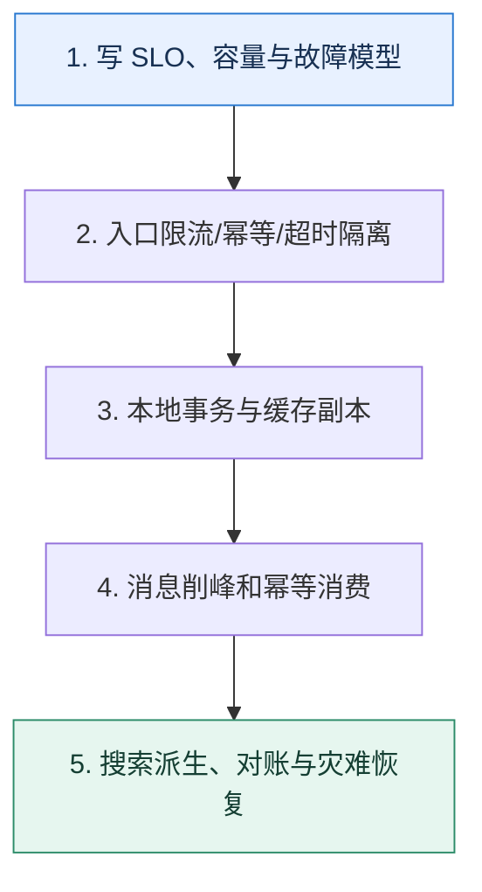

# 综合演练｜用一场流量突增验证整条后端链路

> 本课只回答一个问题：如何把服务治理、数据库、消息、缓存和 NoSQL 放进同一个可验证方案？

这是一份独立学习稿。来源资料用于核对知识范围；下面的解释、推演、边界和图示均按工程学习路径重新组织，不依赖原页面也能完整阅读。

## 先补齐：建立正确的心智模型

综合题的价值不是堆中间件，而是从 SLO 和故障模型出发，让每一层只解决明确问题，并交代新增状态、降级方式、恢复步骤和验证指标。

读这一课时，始终把“组件名字”换成三个可追踪对象：**谁发起动作、状态存在哪里、失败后由谁收敛**。这样遇到不同产品或版本，仍能用同一套模型判断。

## 本节精讲：机制是怎样一步步工作的

先写峰值流量、用户延迟、正确性、RPO/RTO 和成本边界；入口用限流与幂等令牌保护核心链路，服务调用分配超时预算并隔离外部依赖。数据库以本地事务保存事实与 Outbox，缓存只作为可失效副本，消息队列削峰并以业务键维持实体内顺序，消费者幂等。搜索索引从事件派生，允许明确延迟并可重建。每个异步状态都有查询、重试、死信和对账入口。

下面这张图只表达本课最重要的状态推进，蓝色是入口，绿色是可验收的终点；任一箭头失败，都要回到上文寻找重试、回退或人工处理的位置。

### 一次带数字的完整推演

大促峰值 100k 请求/秒，数据库安全写入 8k/秒。网关先把无资格请求挡掉，库存令牌只放 12k/秒进入队列；订单消费者按 7k/秒落库，差速可控。缓存故障时回源被限制到 3k/秒；支付服务 300ms 超时后不盲目重试扣款，而是按支付单号查询结果。搜索索引延迟 5 秒可接受，订单详情则回真相源。

数字的作用不是制造精确感，而是暴露容量和时间关系。把例子中的流量、延迟、分片数或版本号替换成自己的真实数据，方案可能会随之改变。

## 误区与失效边界

任何“自动扩容、最终一致、高可用”都必须落成数字与状态机。若数据库已满，单纯把入口改异步只会积压；若幂等键定义错，重试会重复副作用；若恢复没有优先级，重建流量可能压垮在线服务。

判断一个结论是否可靠，可以追问两次：**它依赖什么前提？前提失效后系统留下了什么状态？** 如果回答只能停在“框架会自动处理”，就还没有走到工程边界。

## 按讲解顺序重建知识链

来源稿覆盖的论证主线在这里被重建成四步，保留问题、推导、反例和收束，不沿用原页面措辞：

1. 从用户动作画同步关键路径与异步旁路。
2. 为每一跳标注超时、容量、重试和幂等键。
3. 依次注入下游超时、数据库变慢、消息积压、缓存全挂和索引落后。
4. 最后用 RPO/RTO、业务对账与降级体验评价方案。

把四步连起来后，本课不是一个孤立结论，而是一条可以复演的因果链。需要回查课程覆盖范围时，可打开文末的来源稿；学习时以本页模型为主。

## 工程验证：把理解变成证据

提交一张架构图和一张故障表。故障表每行包括 `故障、检测信号、自动动作、用户看到什么、数据是否会丢、恢复步骤、负责人`；再用压测数据证明各限流阈值小于下游安全容量。

### 状态检查表

| 步骤 | 状态或动作 | 需要留下的证据 |
| ---: | --- | --- |
| 1 | 写 SLO、容量与故障模型 | 记录耗时、结果与异常分支，确认状态能进入下一步 |
| 2 | 入口限流/幂等/超时隔离 | 记录耗时、结果与异常分支，确认状态能进入下一步 |
| 3 | 本地事务与缓存副本 | 记录耗时、结果与异常分支，确认状态能进入下一步 |
| 4 | 消息削峰和幂等消费 | 记录耗时、结果与异常分支，确认状态能进入下一步 |
| 5 | 搜索派生、对账与灾难恢复 | 记录耗时、结果与异常分支，确认状态能进入下一步 |

检查表不是要求生产系统逐字采用这些字段，而是强迫设计者为每一步提供可观测结果。只有入口、没有终态的流程，最终都会形成无法解释的中间状态。

## 自我检查

综合架构中为什么要先写 SLO 和安全容量，再选择中间件？

同一技术在不同延迟、一致性和故障要求下取舍不同。没有数字就无法确定限流、超时、缓存陈旧窗口、消息积压上限和恢复优先级。

再做一次闭卷练习：不看上文画出状态图，并为其中任意两个箭头注入超时、进程崩溃或重复请求。如果你能预测最终状态和观测信号，这一课才真正从“听懂”变成“会用”。

## 来源与版本校准

- [查看来源稿（2 页资料整理）](../content/43-final-test.md)

来源稿只用于追溯知识范围，不是本学习稿的正文。具体产品的默认值、命令与内部实现会随版本变化；落地前应使用目标版本官方文档和故障演练再次确认。
