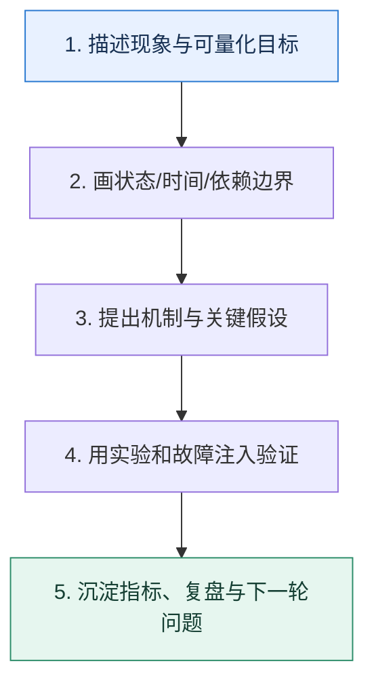

# 学习收束｜把知识点沉淀成可复用的工程判断

> 本课只回答一个问题：学完 50 篇后，怎样避免只记住术语，却不会定位真实问题？

这是一份独立学习稿。来源资料用于核对知识范围；下面的解释、推演、边界和图示均按工程学习路径重新组织，不依赖原页面也能完整阅读。

## 先补齐：建立正确的心智模型

可迁移能力来自一套稳定推理顺序：先描述现象与目标，再追踪状态和时间线，量化容量，识别故障边界，选择机制，最后用实验和监控反证。产品会升级，这套方法比参数记忆更耐久。

读这一课时，始终把“组件名字”换成三个可追踪对象：**谁发起动作、状态存在哪里、失败后由谁收敛**。这样遇到不同产品或版本，仍能用同一套模型判断。

## 本节精讲：机制是怎样一步步工作的

每个专题都可以归到四类控制：流量控制决定多少工作进入系统；状态控制决定事实写在哪里、如何并发与复制；时间控制处理超时、过期、延迟和重试；故障控制负责隔离、降级、恢复与对账。复习时不要问“某组件有什么特性”，而要问“它在哪个边界承诺了什么，失败后剩下什么状态，谁来收敛”。

下面这张图只表达本课最重要的状态推进，蓝色是入口，绿色是可验收的终点；任一箭头失败，都要回到上文寻找重试、回退或人工处理的位置。

### 一次带数字的完整推演

遇到缓存旧值：先画数据库提交、缓存失效、并发回填时间线；遇到消息积压：先算生产减消费的差速与清空时间；遇到服务雪崩：先画调用链、超时预算和共享资源池；遇到查询变慢：先看访问路径、扫描量和数据分布。四个问题使用的是同一套证据驱动方法。

数字的作用不是制造精确感，而是暴露容量和时间关系。把例子中的流量、延迟、分片数或版本号替换成自己的真实数据，方案可能会随之改变。

## 误区与失效边界

完整学习不等于每项都自行实现，也不等于一次读完。某些机制受版本、部署和业务语义影响，必须回到官方文档、压测和故障演练校准；对不确定结论保留条件比给出绝对答案更专业。

判断一个结论是否可靠，可以追问两次：**它依赖什么前提？前提失效后系统留下了什么状态？** 如果回答只能停在“框架会自动处理”，就还没有走到工程边界。

## 按讲解顺序重建知识链

来源稿覆盖的论证主线在这里被重建成四步，保留问题、推导、反例和收束，不沿用原页面措辞：

1. 从五个专题各选一个真实问题，不看标题重新推导。
2. 给每个方案写出前提、收益、代价和失效边界。
3. 用一个最小实验或故障演练验证最关键假设。
4. 把结果更新到自己的运行手册，而不是停在概念笔记。

把四步连起来后，本课不是一个孤立结论，而是一条可以复演的因果链。需要回查课程覆盖范围时，可打开文末的来源稿；学习时以本页模型为主。

## 工程验证：把理解变成证据

建立个人工程判断卡：正面写问题与约束，背面写状态流、容量公式、三个故障点、两个可替代方案和一个验证实验。每周抽取一张，用新案例重做，答案应随证据而不是随记忆更新。

### 状态检查表

| 步骤 | 状态或动作 | 需要留下的证据 |
| ---: | --- | --- |
| 1 | 描述现象与可量化目标 | 记录耗时、结果与异常分支，确认状态能进入下一步 |
| 2 | 画状态/时间/依赖边界 | 记录耗时、结果与异常分支，确认状态能进入下一步 |
| 3 | 提出机制与关键假设 | 记录耗时、结果与异常分支，确认状态能进入下一步 |
| 4 | 用实验和故障注入验证 | 记录耗时、结果与异常分支，确认状态能进入下一步 |
| 5 | 沉淀指标、复盘与下一轮问题 | 记录耗时、结果与异常分支，确认状态能进入下一步 |

检查表不是要求生产系统逐字采用这些字段，而是强迫设计者为每一步提供可观测结果。只有入口、没有终态的流程，最终都会形成无法解释的中间状态。

## 自我检查

判断自己真正掌握一个机制，最可靠的标准是什么？

能在给定约束下从状态与时间线推导它，说明适用边界和代价，并设计实验或故障注入验证；仅能复述定义还不够。

再做一次闭卷练习：不看上文画出状态图，并为其中任意两个箭头注入超时、进程崩溃或重复请求。如果你能预测最终状态和观测信号，这一课才真正从“听懂”变成“会用”。

## 来源与版本校准

- [查看来源稿（5 页资料整理）](../content/44-closing.md)

来源稿只用于追溯知识范围，不是本学习稿的正文。具体产品的默认值、命令与内部实现会随版本变化；落地前应使用目标版本官方文档和故障演练再次确认。
