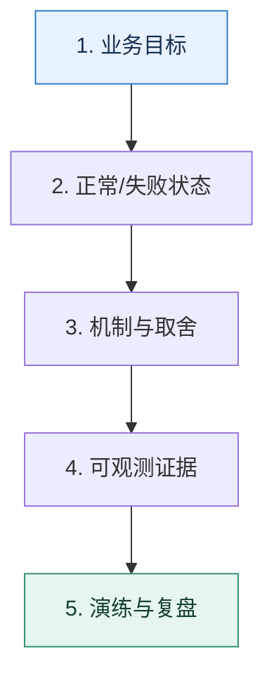

# 导学｜把零散知识变成可解释、可验证的工程能力

> 本课只解决一个问题：怎样学习一项后端技术，才能在真实故障和架构决策中用得出来？

这不是原页面的缩写，也不是一组孤立结论。下面先建立一个能推演的最小世界，再把状态、数字和失败分支摊开，最后按来源讲解顺序覆盖全部知识线索。读完后，你应当能从 `业务目标` 一直解释到 `演练与复盘`，并说明中途任意一步失败会留下什么状态。

## 零基础入口：先建立本课的心智画面

先区分“知道名词”和“拥有工程模型”。前者能复述定义，后者能说清输入、状态变化、失败路径、取舍和验证证据。后续每一课都按这五个对象来读。

先不要急着记组件名。只抓住四个问题：**现在手里有什么输入？下一步只做什么动作？哪个状态发生变化？变化后的结果交给谁？** 之后遇到新框架，只要这四个答案不变，核心机制就没有变。

### 放进一个足够小、可以手算的世界

以服务注册为例：背下“客户端从注册中心获得节点”还不够。真正掌握意味着你能推演注册中心失联、服务端突然断电、客户端缓存过期三种状态，说明请求会落到哪里，并设计一次断网演练验证判断。

这个小世界故意只保留本课必需的对象。生产系统会有更多节点、线程、分片和异常，但数量增加不会改变这里的因果关系。先确认你能手算这个例子，再把数字替换成真实系统数据。

### 先预测，不要马上看结论

**为什么仅仅记住一个中间件的优点，仍不足以支持架构选择？**

先写下自己的判断，并指出你依赖的前提。文末自我检查会揭示答案；如果答案不同，回到下面的状态表找出第一个分叉点。

## 本节精讲：让机制一步一步发生

一项技术只有放进业务约束里才有意义。先问系统要保护什么指标，再画正常路径和失败路径；接着找出可观测信号、控制手段与副作用；最后用压测、演练或数据回放验证。这样得到的不是一句结论，而是一套能够迁移到新场景的推理方法。

### 可见状态推进

| 当前步 | 现在发生的动作 | 下一步拿到什么 |
| ---: | --- | --- |
| 1 | 业务目标 | 正常/失败状态 |
| 2 | 正常/失败状态 | 机制与取舍 |
| 3 | 机制与取舍 | 可观测证据 |
| 4 | 可观测证据 | 演练与复盘 |
| 5 | 演练与复盘 | 得到可核对的终态 |

图只承担一个任务：让你看清状态如何向前移动。它不意味着每一步必然成功；网络超时、进程退出、重复执行和数据竞争都可能让箭头停在中间，因此后面必须继续讨论失效边界。

### 一次带数字的完整推演

以服务注册为例：背下“客户端从注册中心获得节点”还不够。真正掌握意味着你能推演注册中心失联、服务端突然断电、客户端缓存过期三种状态，说明请求会落到哪里，并设计一次断网演练验证判断。

数字不是装饰。它迫使我们回答容量、顺序、时间窗口或版本选择问题。若换一个数字就得出不同结论，真正的设计依据就是那个阈值，而不是某个中间件名称。

## 按讲解顺序重建知识链：完整来源讲解

下面按来源资料的教学顺序重新编排完整内容。转换页码、来源图片、推广信息、水印、角色化问答和只服务于技术讨论场景的话术已经删除；机制、算法、例子、反例、事故线索、评论补充和限制条件仍然保留。这里的作用是补齐知识覆盖，不取代前面的独立推演。

一名热爱开源的 IT 猛男。欢迎你的加入，从今天开始我们一起升级打怪，通关后端技术技术讨论。

作为一名早期从事业务开发转型成为中间件研发的工程师，我一直奋战在互联网一线，擅长设计和实现中间件，包括 Web、ORM、微服务框架、网关、分库分表、IM 等，积累了很多造高并发、大流量轮子的经验。除了工作之外，我也一直活跃在开源社区，学习、交流最新的技术，现在是 Beego 的 PMC 和 Apache Dubbo 的 Committer。

在我的职业生涯中曾跳过几次槽，都很幸运地得到了自己理想的岗位，甚至被朋友笑称“offer 收割机”，因为几乎每次跳槽我都是手捏好几个大厂 offer，按心意选择。如果你也想像我一样拥有选择的权利，可以加入进来，我会把我自己多年珍藏的经历分享给你，助你顺利通关。

### 机会永远留给有准备的人

那怎样做才能成为下一个 offer 收割机呢？

我想除了平时工作中的稳扎稳打，技术讨论前的准备工作也是必要的。因为我们都知道技术讨论从来都不是件简单的事，好的岗位永远是竞争最激烈的地方。想要在高手如云的竞技场上展现自己的优势，让自己脱颖而出，以下几点必不可少：

1. 扎实的基础知识，基础是一切的开始，我们平时就要做好技术积累。
2. 一些成功或失败的项目经历，这些经历能让你看到更多细节，无论是经验还是教训都很有价值。
3. 所在领域的最佳实践，让我们的工作更加专业、高效，避免很多问题。
4. 一些独到的观点或创新性的方案，这是让你崭露头角的关键。
可其实很多人都做不到这几点。这些年我一直担任极客时间训练营的讲师，带过 2000 多个学员，这个过程中我发现很多人不知道怎么技术讨论，也不知道怎么准备技术讨论。

有的人明明知道有一些问题肯定会被问到，但技术讨论前还是不好好准备，要么解释得模棱两可，要么答非所问，从而错失 offer。有的人不知道怎么包装自己的项目经历，凸显自己解决方案的优点，以至于看上去非常平淡，没办法给人留下深刻印象。还有人简历写得花里胡哨，但是实际上一问三不知，简历和经历完全对不上。

比如之前我曾看到有的人简历上写了微服务架构，但当我问他们服务治理的时候，他们的反应让我非常诧异。他们有的说：“啊，服务治理是啥？”，有的说：“啊！某个线上系统体量太小了，都不需要服务治理”，一句话就暴露了短板。

在发现这些问题之后，我就开始有意识地整理后端技术技术讨论中的重难点、梳理技术讨论的思路和进阶推导方案，并辅以一些经典案例来佐证。希望能够帮助更多的人在技术讨论过程中有条理地表达自己、突显自身优势，并最终获得理想的职位。下面这张微服务架构技术推理路径图，就是我的成果之一。后面每学完一章的内容，我都会整理出一张这样的图片，来帮助你梳理知识点，建立起自己的知识框架。

微服务架构技术推理路径

这里还要单独强调一下这门课程的一个特殊的设计——进阶推导方案。虽然技术讨论成功很大程度上取决于你对技术评审者的问题是否能做到对答如流，但别忘了，并不是说你解释出全部问题就能拿到offer，更重要的一点是要比别的学习者解释得更出彩。因此在上述每一个主题之下，我都会教你如何展示自己的进阶推导，期待一下吧。

课程讲述思路

### 从实践中来，到实践中去

说了这么多关于技术讨论的事情，是不是整个课程就只能用在技术讨论上呢？

当然不是，我在课程中展示的所有案例都是我在工作场景中摸爬滚打多年摸索出来的，可以说这门课程是来自于实践，最终也将回归实践。所有的案例和方案都是可以拿到生产环境中去实践的。

如果你是工作不久，经验不足的小白，可以把前面的知识点当作台阶，把里面的最佳实践作为样板，去大刀阔斧地应用在实际的生产环境中。如果你已经有了一些基础和经验，就可以通过前面系统的知识夯实自己的基础，通过里面的进阶推导方案，为自己目前的工作找到新的解决思路。如果你正准备跳槽，那这门课程可以说是为你量身打造的了，它将成为你的助手，帮你快速搭建起自己的知识框架，助你技术讨论通关。

我在课程中也多次强调，这些方案我们应该尽可能地去应用一下，并不只是为了技术讨论，也是为了提高自身技术实力。所以不要只关注课程中的套路和话术，其中的知识点和经典案例也需要你好好消化，以应对未来真实工作场景中复杂多变的情况。

### 课程设计

为了满足这些需求，我选取了后端工程师在技术讨论和工作场景中必知必会的 5 个热点领域：微服务、数据库、消息队列、缓存和 NoSQL。掌握这些核心技术能够为我们系统的高可用、高性能保驾护航，同时也能为我们的后端职业生涯开一扇窗。

第一章：微服务架构

微服务架构可以将大型应用拆分为多个小型服务，提高开发效率与性能。这个部分我们将学习最重要的几个服务治理手段，包括服务注册与发现、负载均衡、熔断、降级、限流、优雅调用第三方等。你可以根据具体情况选择不同的服务治理策略，来保证服务的高可用。

第二章：数据库与 MySQL

数据库和 MySQL 是存储数据的技术基础，其性能和稳定性关系到整个系统的效率和可靠性。这部分我们主要了解数据库索引、事务、SQL 优化、不停机数据迁移、分库分表等核心知识点与解决方案，让你能够懂原理、晓优化、重实践。

第三章：消息队列

消息队列和 Kafka 在分布式系统中担任着异步处理、流式计算等重要的角色，是构建高性能、可靠的分布式系统的必要工具。这部分我会带你了解消息队列的高可用和高性能原理以及实践中常见的问题，如积压、重复消费、消息可靠性等。让你上能理论压众人，下能实践解忧愁。

第四章：缓存

所谓缓存用得好，性能没烦恼。缓存可以大大提高系统的访问速度，减轻数据库访问压力。这部分内容基本涵盖了最热门的缓存模式、缓存击穿、雪崩、穿透等问题的解决方案，我将带你深入 Redis 的高可用和高性能原理，让你成为一个精通各种缓存奇技淫巧的人。

第五章：NoSQL

随着这些年行业技术栈演进，NoSQL 已经变得日益重要。这一模块我们会在掌握了基本的NoSQL 概念和原理的基础上，对 MongoDB 和 Elasticsearch 常见的技术讨论热点进行探讨，包括性能调优、高可用和高性能方案，帮助你更加全面地准备后端技术技术讨论。

课程设计

工作中的重难点也必然会成为技术讨论中的常考点，所以我们这门课程也并不是只会教你技术讨论的套路，更多的是技术之间的联系、灵活多变的方案、处理问题的思路，以及沟通时的引导策略。如果你可以透过表面的知识点和技术讨论的话术，掌握这些更深层次的技能，那么你收获的就不只是一两个 offer 那么简单了。

古人讲究“兵马未动，粮草先行”，这门课就是我们“广积粮”的好机会。现在就业市场变化莫测，前有互联网领域增速放缓，后有 AI 技术大爆发，企业也在时刻准备着调整自己的方向。不过无论怎样变化和调整，高端人才始终是稀缺资源，我们只有花时间做好充足的准备，坚定地拓展自己的技术面，才能让自己拥有超强的竞争力，为未来的自己赢得选择的权利。

### 补充讨论与边界校准

补充讨论： 1

补充讨论：

编辑回复: 每周一三五更新哦～每节课的体量比较大，好好消化，最好学完可以自己画一张思维导图出来，效果最好，加油

补充讨论：

编辑回复: 谢谢支持！每一章学完都汇总成这样一张图，期待后面一起学习、一起交流

补充讨论：

讲解补充：加油！

1

补充讨论：

讲解补充：加油加油！

1

补充讨论：

讲解补充：加油！

补充讨论：

讲解补充：加油！

补充讨论：

讲解补充：加油加油

补充讨论：

讲解补充：感谢感谢，加油加油

补充讨论：

讲解补充：谢谢！

## 把完整讲解收束成一条因果链

1. 先建立完整的课程地图，知道服务治理、数据库、消息系统、缓存和 NoSQL 分别解决什么问题。
2. 把原课中的技术问答改造成工程问题：什么条件下会坏，为什么坏，怎样证明修复有效。
3. 保留真实案例与警告，但不保留为表达效果服务的重复话术。
4. 每学完一个专题，用串联复盘把孤立知识点重新放回同一条请求链。

把这几步连接起来时，不要省略“为什么”。最终结论只有在前提、状态变化和失败代价都说得清楚时才可靠。

## 误区与失效边界

这套学习法不承诺一次读完就会。工程能力来自反复预测、观察和修正；如果只收藏方案、从不写下假设和证据，知识仍然停留在记忆层。

再加一条通用但必须落实到本课对象上的边界：机制只能处理它看得见的信号。若输入指标失真、状态没有持久化、错误被吞掉，或者补偿没有幂等保护，再成熟的框架也只能基于错误证据作决定。

### 三种故障注入方式

| 故障 | 要观察什么 | 不能接受的解释 |
| --- | --- | --- |
| 在第 2 步前让依赖超时 | 是否停在可重试状态，是否消耗完上游预算 | “框架稍后会处理” |
| 在状态写入后让进程退出 | 重启后能否识别已完成与待继续动作 | “再执行一次应该没事” |
| 对同一输入并发执行两次 | 是否出现重复副作用、顺序颠倒或覆盖 | “概率很低” |

## 工程验证：把理解变成可以复查的证据

为每课建一张四列表：`假设 | 观测信号 | 控制动作 | 副作用`。如果某个方案只有动作、没有信号和副作用，就暂时不能进入生产设计。

| 步骤 | 状态或动作 | 最少应留下的证据 |
| ---: | --- | --- |
| 1 | 业务目标 | 开始时间、结束时间、输入标识、结果状态、异常原因 |
| 2 | 正常/失败状态 | 开始时间、结束时间、输入标识、结果状态、异常原因 |
| 3 | 机制与取舍 | 开始时间、结束时间、输入标识、结果状态、异常原因 |
| 4 | 可观测证据 | 开始时间、结束时间、输入标识、结果状态、异常原因 |
| 5 | 演练与复盘 | 开始时间、结束时间、输入标识、结果状态、异常原因 |

验证时同时记录成功路径和失败路径。只证明“正常时能跑通”不能说明设计可靠；至少要让一次超时、一次进程退出和一次重复请求可重现，并能根据日志或指标解释最后状态。

## 学完检查：闭卷画出本课

你现在应该能独立完成四件事：

1. 用自己的话说出本课唯一问题，不使用产品名也能解释。
2. 复算上面的具体例子，并指出哪个输入改变会让结论改变。
3. 沿 Mermaid 图注入一次失败，预测系统停在哪里以及由谁收敛。
4. 说出本课机制不保证什么，并给出一个反例。

## 自我检查

为什么仅仅记住一个中间件的优点，仍不足以支持架构选择？

因为架构选择依赖当前业务目标、故障模型和约束。优点只有和可验证的指标、失败代价及替代方案连接起来，才构成决策。

怎样证明自己不是只记住了名词？

把 `业务目标` 的一个真实输入写出来，逐步记录到 `演练与复盘`。然后在中间任意一步制造失败；如果你能解释当前状态、下一责任方、可观测证据和恢复边界，就已经拥有可以迁移的工程模型。

## 来源与事实校准

- [查看完整来源稿（本地 9 页资料）](../content/00-introduction.md)

### 当前事实校准

本课程按工程问题组织知识，但任何章节都不替代目标系统的官方文档、运行数据和故障演练。学习结果应以能否独立推导、设计实验、解释证据和说清边界来验收，而不是以阅读页数或背诵术语计数。

- [Google SRE · The Site Reliability Workbook](https://sre.google/workbook/table-of-contents/)
- [OpenTelemetry · Observability Primer](https://opentelemetry.io/docs/concepts/observability-primer/)

来源稿用于核对覆盖范围，不随公开站点发布。产品默认值和具体内部行为可能随版本变化；落地时应使用目标版本的官方文档、可运行实验和故障演练校准。本学习稿中的零基础入口、状态推演、故障矩阵和工程验证属于编辑补充，不冒充来源讲解者的原话。
