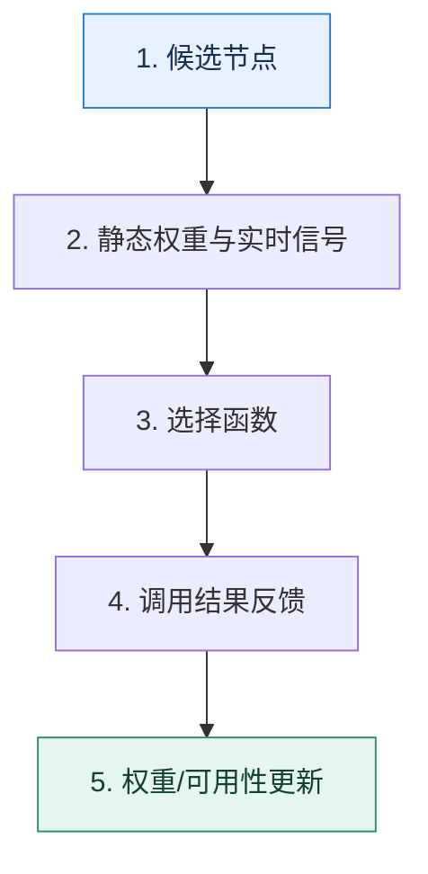

# 负载均衡｜不是平均分流，而是持续做出更好的节点选择

> 本课只解决一个问题：同一服务有多个节点时，怎样选择才能兼顾均衡、局部性和故障反馈？

这不是原页面的缩写，也不是一组孤立结论。下面先建立一个能推演的最小世界，再把状态、数字和失败分支摊开，最后按来源讲解顺序覆盖全部知识线索。读完后，你应当能从 `候选节点` 一直解释到 `权重/可用性更新`，并说明中途任意一步失败会留下什么状态。

## 零基础入口：先建立本课的心智画面

轮询、随机、哈希、最少连接只是“选择函数”。真正的负载均衡还要定义输入信号：静态权重、实时延迟、并发数、调用结果、缓存归属和节点健康状态。

先不要急着记组件名。只抓住四个问题：**现在手里有什么输入？下一步只做什么动作？哪个状态发生变化？变化后的结果交给谁？** 之后遇到新框架，只要这四个答案不变，核心机制就没有变。

### 放进一个足够小、可以手算的世界

节点 A/B/C 的稳定响应分别为 20/25/80ms。纯轮询会让三分之一请求长期变慢；最快响应算法若每次都选 A，又会把 A 压垮。可采用加权选择并用 EWMA 延迟做缓慢修正，例如权重 5:4:1；A 连续超时后临时降为 0，探测成功再逐步恢复。

这个小世界故意只保留本课必需的对象。生产系统会有更多节点、线程、分片和异常，但数量增加不会改变这里的因果关系。先确认你能手算这个例子，再把数字替换成真实系统数据。

### 先预测，不要马上看结论

**为什么把所有请求都发给当前响应最快的节点，可能让总体响应越来越差？**

先写下自己的判断，并指出你依赖的前提。文末自我检查会揭示答案；如果答案不同，回到下面的状态表找出第一个分叉点。

## 本节精讲：让机制一步一步发生

静态算法计算便宜但看不到节点瞬时状态；动态算法更贴近真实负载，却容易被噪声和慢反馈带偏。调用结果应更新节点的短期可用性，缓存亲和性则希望同一键尽量落到同一节点。一致性哈希通过环上后继节点减少扩缩容时的迁移，但虚拟节点数量和热点键仍会影响均匀度。选择算法必须和失败重试、缓存策略一起设计。

### 可见状态推进

| 当前步 | 现在发生的动作 | 下一步拿到什么 |
| ---: | --- | --- |
| 1 | 候选节点 | 静态权重与实时信号 |
| 2 | 静态权重与实时信号 | 选择函数 |
| 3 | 选择函数 | 调用结果反馈 |
| 4 | 调用结果反馈 | 权重/可用性更新 |
| 5 | 权重/可用性更新 | 得到可核对的终态 |

图只承担一个任务：让你看清状态如何向前移动。它不意味着每一步必然成功；网络超时、进程退出、重复执行和数据竞争都可能让箭头停在中间，因此后面必须继续讨论失效边界。

### 一次带数字的完整推演

节点 A/B/C 的稳定响应分别为 20/25/80ms。纯轮询会让三分之一请求长期变慢；最快响应算法若每次都选 A，又会把 A 压垮。可采用加权选择并用 EWMA 延迟做缓慢修正，例如权重 5:4:1；A 连续超时后临时降为 0，探测成功再逐步恢复。

数字不是装饰。它迫使我们回答容量、顺序、时间窗口或版本选择问题。若换一个数字就得出不同结论，真正的设计依据就是那个阈值，而不是某个中间件名称。

## 按讲解顺序重建知识链：完整来源讲解

下面按来源资料的教学顺序重新编排完整内容。转换页码、来源图片、推广信息、水印、角色化问答和只服务于技术讨论场景的话术已经删除；机制、算法、例子、反例、事故线索、评论补充和限制条件仍然保留。这里的作用是补齐知识覆盖，不取代前面的独立推演。

本节讨论微服务架构下的负载均衡。

负载均衡在微服务架构里也处于一个核心位置。一般我们在准备调用任何服务的时候，第一个要解决的问题就是负载均衡该怎么做。负载均衡在微服务架构的技术讨论中，也属于经常需要解释题目。

可惜的是，即便我们都知道负载均衡在技术讨论中是核心知识点，但是在每一次技术讨论的时候都还是难以给出有证据的判断。大多数的解释都仅仅是简单罗列一下负载均衡的算法，稍微有些进阶推导的则是讨论一下不同算法的优缺点。但是这并不能让你在技术评审者心里留下深刻印象。

因此需要继续考察负载均衡算法里面一些可以用于技术讨论的微妙细节，同时给出一个本地缓存和负载均衡结合的案例，让你在工程复盘时给出有证据的判断。下面先介绍微服务架构里面常见的负载均衡算法，让你先有一个最基本的理解。

### 先把机制拆开负载均衡，本质上就是解释一个问题：我该把请求发给哪个服务端？理论上来说，你会希望把请求发给某个能够最快返回响应的客户端。

这里常见疑问是有些困惑，因为我们之前都听过轮询和加权轮询、随机和加权随机，哈希和一致性哈希这些负载均衡算法，但看上去它们并没有试图去判断哪个节点才是最合适的节点。

确实，这一类算法也叫做静态负载均衡算法。它们依靠的是统计学上的“最合适”。也就是说，如果请求都差不多，请求数量也足够多，那么它们能够挑选出比较合适的节点。

还有一类算法，是动态负载均衡算法，或者说是实时检测负载均衡算法。这一类算法依赖于实时判断所有候选节点的状态，并且从里面挑选出最合适的节点。这一类算法包含最少连接数、最少活跃请求数、最快响应时间等算法。

下面逐一拆解。

### 轮询与加权轮询轮询本身是一个非常简单的算法，用一句俗话讲，就是“排排坐，分果果”。也就是说，所有的候选节点轮流作为负载均衡的目标节点。

这里首先要考虑，每个节点的实际处理能力可能并不一样。于是就有了一个加权的版本，就是所谓的加权轮询。这个算法就不再是节点轮流，而是根据权重来轮流。比如说，如果一个节点的权重是另外一个节点的两倍，那么最终这个节点被选中的次数也会是另外一个节点的两倍。

图中节点 1 的权重是其他两个节点的三倍，所以相应地被选中的机会也是三倍。

在加权算法里面，有一个改进叫做平滑的加权轮询算法。你在图里也可以看出来，因为服务端节点 1 的权重是别的节点的三倍，所以如果你不做任何措施，那么会连续三次将请求发送到同一个节点。

而这个平滑的加权轮询算法就是为了解决这个问题。每个节点会有两个权重，初始权重（weight）和当前权重（currrentWeight）。算法的过程稍微有点复杂，每一次挑选节点都执行这些步骤。

1. 对每一个节点，执行 currrentWeight = currrentWeight + weight。
2. 挑选最大 currrentWeight 的节点作为目标节点。
3. 将目标节点的 currrentWeight 修改为 currrentWeight= currrentWeight -sum(weight)。

那么简单理解就是，对于一个节点来说，每次被挑选之后，它的 currrentWeight 就会下降，那么下一次就不会选中它。

### 随机与加权随机随机可以看作是随便挑选一个作为目标节点，加权随机则是利用不同的权重来设置选中的概率。权重越大，那么被选中的机会也就越大。

由此可以看到，轮询算法相比之下可控性更强。一般来说，在实践中轮询和随机、加权轮询和加权随机是可以互相替代的。

### 哈希与一致性哈希哈希算法比较简单，一般就是选取请求里面某几个参数来计算一个哈希值，然后除以节点数量取余。这个过程几乎和随机一样，区别就在于随机算法里面用的是随机数，这里用的是根据参数计算出来的哈希值。

哈希算法的选取会严重影响负载均衡的效果。假如说你计算哈希值的算法不太好，就容易导致某几个节点上负载特别高，而其他节点的负载就比较低。所以要尽可能保证哈希值计算出来的结果是均匀的。

相比之下一致性哈希负载均衡才算是真正的技术讨论热点。

一致性哈希负载均衡引入了一个哈希环的概念，服务端节点会落在环的某些位置上。客户端根据请求参数，计算一个哈希值。这个哈希值会落在哈希环的某个位置。从这个位置出发，顺时针查找，遇到的第一个服务端节点就是目标节点。

注意，在一致性哈希负载均衡算法里面，并不要求服务端节点是均匀分散在哈希环上的。实际上，我们是希望所有的节点负载是均衡的，但是不同节点之间的间隔可以是不均匀的。

这里可以用一个比喻来简单描述这个算法。一致性哈希负载均衡算法就像是钟表，它的过程就有点儿像你的朋友约你吃火锅，说下一个整点到重庆火锅店集合。那么你看一下现在的时间，是下午三点四十五分，那么自然下一个整点就是下午四点了。

在工程复盘时，如果你实在记不住一致性哈希负载均衡算法，那么可以用这个比喻来向技术评审者解释一下。

### 最少连接数最少连接数基于一个基本假设：如果一个服务端节点上的连接数越多，那么这个节点的负载就越高。因此在做负载均衡的时候就是看一下客户端和各个节点的连接数量，从中挑选出连接数数量最少的节点。

最少连接数算法的缺陷在于，连接数并不能代表节点的实际负载，尤其是在连接多路复用的情况下。比如这张示意图里，理论上来说新来的请求就会落到服务端节点 1 上，而后连接数变成 11。实际上在连接复用的情况下，客户端可能连续发 10 个请求到服务端节点 1 上，才会创建一个新连接。

那么很显然，在这种情况下，服务端节点 1 的负载会比其他两个节点高一截。

### 最少活跃数最少活跃数算法则是用当前活跃请求数来代表服务端节点的负载。所谓的活跃请求，就是已经接收但是还没有返回的请求。客户端会维持一个自己发过去但是还没返回的请求数量，然后每次挑选活跃请求最少的那个服务端节点。

类似地，活跃请求数量也不能真正代表服务端节点的负载。比如说图中，服务端节点 1 虽然只有 10 个请求，但是万一这 10 个请求都是大请求，例如大商家、大买家或者千万粉丝 UP主的请求，那么服务端节点 1 的负载也会显著高于其他两个节点。

### 最快响应时间相比前两个算法，最快响应时间算法则要好很多，它用的是响应时间来代表服务端节点的负载。响应时间和前面的两个指标比起来，是一种综合性的指标，所以用响应时间来代表服务端节点负载要更加准确。

最快响应时间算法就是客户端维持每个节点的响应时间，而后每次挑选响应时间最短的。

这里的响应时间，可以是平均响应时间，也可以是 99 线之类的，选择什么其实效果并不会相差很多。

但是在实现上，要注意响应时间的时效性。一般来说统计响应时间时应该只用近期请求的响应时间，并且越近的响应时间，权重应该越高。换句话说，就是采集的响应时间效用应该随着时间衰减。

### 小结一下最少连接数、最少活跃请求数和最快响应时间，都可以看作是选择了单一的指标来代表一个节点的负载。

那么你在实际工作中也可以利用这个思路来设计自己的负载均衡算法。比如说在 CPU 密集型的应用里面，你可以设计一个负载均衡算法，每次筛选 CPU 负载最低的节点。难点则是你需要考虑怎么采集到所有服务端节点的 CPU 负载数据。

这三个算法还有一个问题，就是它们都是客户端来采集数据的。那么不同的客户端就可能采集到不同的数据。如图所示，因为客户端 1 本身并不知道客户端 2 上还有 30 个连接，因此它选择了服务端节点 1。而实际上它应该选择服务端节点 2。

那怎么解决这两个问题呢？

答案是让服务端上报指标，而不是客户端采集。总体上有两种思路。

第一种思路是服务端在返回响应的时候顺便把服务端上的一些信息一并返回。这种思路需要微服务框架支持从服务端往客户端回传链路元数据。

第二种思路是从观测平台上查询。例如通过查询 Prometheus 来获得各种指标数据。

不过目前业界很少用这种复杂的负载均衡算法，也因此几乎所有的微服务框架都没有服务端上报指标到客户端的机制。

### 把知识转成可验证的工程判断首先前面提到的这些算法，你都要记下来。尤其要对这几个算法格外上心一些。

轮询和加权轮询：对应的平滑加权轮询算是一个小进阶推导。一致性哈希负载均衡：这个可以结合 Redis 之类的使用了一致性哈希算法的中间件一起理解。最快响应时间算法：这个算法体现了采集指标随着时间准确性衰减的特性，后面在服务治理的部分你会再次接触到类似的东西。

那么我们对这些算法的简单分析你也要记住，尤其是在小结里提到的采集指标的问题。然后你在准备项目经验的时候要搞清楚公司以下几种情况。

如果公司有 Nginx 之类的网关，或者微服务网关，那么用的是什么负载均衡算法？如果公司用客户端负载均衡的话，用的是什么负载均衡算法？有没有出过和负载均衡相关的事故，如果有，那么是什么原因导致的，怎么解决的这个事故，它体现了负载均衡算法的什么缺陷？

另外，你还可以尝试根据业务设计一个独一无二的负载均衡算法。即便你用的是最简单的轮询之类的算法，也不用担心。因为目前大规模应用的就是这种简单的算法，那些花里胡哨的算法在技术评审的时候很有用，但是实际上落地的并不多。

如果你现在有足够的时间，那么前面这些算法你都可以试着实现一下。我尤其建议你在 gRPC里接入一下自己写的算法，做个小实验。一方面是加深理解，另一方面是防止技术评审者要求你现场写算法实现。

小结中讨论的内容可以作为一个进阶推导，但是稍微有点理论化，所以你还需要掌握一些实践方面的技术说明进阶推导。

怎么根据调用结果来调整权重，从而影响负载均衡的效果？怎么利用一致性哈希负载均衡算法，来提高本地缓存命中率，缓解数据不一致性问题？

这两个问题你可以从后面找找答案。

### 进一步推导：怎样把机制用进真实系统正常来说，技术评审者会先问你“是否了解负载均衡”“知道哪些负载均衡算法”之类的问题，那么你就可以列举前置知识里面提到的算法，然后要结合自己公司的实际情况，说明自己用的是什么负载均衡算法。

如果你准备了一个负载均衡引发的线上事故案例，那么一定要记得展开聊一聊。这里我用轮询作为例子，你可以参考这个例子来准备。

首先在解释里面你要先描述各种基本算法以及简要分析，然后再加上一句总结引导。

一般来说，加权类的算法都要考虑权重的设置和调整。

紧接着你开始说你们公司的负载均衡算法，关键词是大请求，可以把方案整理为。

某个线上系统用的是轮询来作为负载均衡。不过因为轮询没有实际查询服务端节点的负载，所以难免会出现偶发性的负载不均衡的问题。

比如说我们之前发现线上的响应时间总体来说是非常均匀的，但是每隔一段时间就会出现响应时间特别慢的情况。而且时间间隔是不固定的，慢的程度也不一样，所以就很奇怪。后来我们经过排查之后，发现是因为当一个大请求落到一个节点的时候，它会占据大量的内存和CPU。如果这时候再有请求打到同一个节点上，这部分请求的响应时间就会非常慢。

在这个解释里我用的这个例子说明了所有负载均衡算法都有的缺点，即没有考虑请求本身。一个大商家拉当日成交订单数据，和一个长尾商家拉当日成交订单数据，能是一回事吗？显然不是。

在这个例子里面，我并没有说怎么解决问题，其实这也是在引导后续继续追问。如果他问如何解决，那么你可以从业务拆分或者隔离的角度解释。

（业务拆分）这个大请求其实是一个大的批量请求。后来我们限制一批最多只能取 100 个就解决了这个问题。

（隔离角度）我们稍微魔改了一下负载均衡算法，不再是单纯的轮询了。我们每天计算一批大客户，这部分大客户的请求会在负载均衡里面被打到专门的几个节点上。虽然大客户的请求依旧很慢，但是至少别的客户不会再受到他们的影响了。

隔离角度的解释相比之下会更加高级一点，因为你可以借此机会将这个解释引到服务治理中的隔离措施这个话题上。同时，这个角度还体现了一个魔改负载均衡的创新点。但如果你不太熟悉服务治理类的话题，那么用业务拆分的角度来解释会更加合适。

这时候你可以补上一句总结，升华一下解释。

负载均衡算法有些时候用得好，是能够解决一些技术问题的，比如说缓存。

这里你应该能够看出来，不论是刚刚说的“加权类的算法都要考虑权重设置和调整”还是这个“能够解决一些技术问题的”，都是在预留追问入口。这两个点也就是你能彻底拉开和其他学习者差距的进阶推导。

### 调用结果对负载均衡的影响前面我和你提到过在负载均衡里面有对应的加权版本，比如说轮询有对应的加权轮询版本，随机也有对应的加权随机版本。

而实际上在工作中我们可以考虑根据调用结果来动态调整这个权重。所以如果技术评审者问你怎么设置权重或者怎么调整权重，抓住关键词成加败减就可以了。

权重代表节点的处理能力，当然在一些场景下它也代表节点的可用性或者重要性。所以权重根据节点的实际情况来设置值就可以。权重的要点在于体现不同节点的差异性，它的绝对值并不重要。

一般来说为了进一步提高可用性，加权类的负载均衡算法都会考虑根据调用结果来动态调整权重。如果调用成功了，那么就增加权重；如果调用失败了，那么就减少权重。

这里调用成功与否是一种非业务相关的概念，也就是说即便拿到了一个失败的响应，但是本身也算是调用成功了。调用失败了大多数时候是指网络错误、超时等。而在实际落地的时候，也可以考虑如果是网络引起的失败，那么权重下调就多一点，因为这一类的错误意味着问题更加严重。如果是超时这种，那么权重就下调少一点，因为这种错误是比较容易恢复过来的。

这里需要解释为什么说绝对值不重要。比如说一个方案是 A 的权重是 100，B 的权重是 200，与另一个方案 A 的权重是 1000，而 B 的权重是 2000，负载均衡的效果是一样的。但是在调整权重的时候要按比例来调。比如说前一个方案调整权重可能每次调 10，而后一个方案就要每次调 100。

解释到这里，还有一个很多开发者都意识不到以至于经常有人踩坑的点：权重的调整要设置好上限和下限。那么你可以揭开这个业界经常忽略的问题，关键词是上下限。

调整权重的算法都要考虑安全问题，即权重的调整应该有上限和下限。比如说一般下限不能为 0，因为一个节点的权重为 0 的话，它可能永远也不会被选中，又或者和 0 的数学运算会出现问题导致负载均衡失败。上限一般不超过初始权重的几倍，比如说两倍或者三倍，防止该节点一直被连续选中。

当然，如果在实现的时候使用了 uint 或者 Int8 之类的数字，还要进一步考虑溢出的问题。之前挺多公司因为没有控制上下限而引起了线上故障。

这里你如果对服务注册与发现烂熟于心，那么就可以尝试将话题引导到服务注册与发现中，关键词是可用性。

这种根据调用结果来调整权重的方式，有点类似于在服务中将暂时调用不通的节点挪出可用节点列表，本质上都是为了进一步提高系统的可用性。

### 哈希一致性结合本地缓存这算是一个微创新的方案。正常情况下，如果你使用本地缓存，那么同一个 key 对应的请求，可能会被打到不同的节点上。这就会造成两个问题，一个是严重的缓存未命中，一个是不同节点都要缓存同样的数据，导致内存浪费和极其严重的数据一致性问题。

所以在这种情况下，一个很自然的想法就是能不能把类似的请求都让同一个节点来处理。比如说对某个用户数据的请求都打到同一个节点上。

显然适合的负载均衡算法就两个：哈希或者一致性哈希。

如果我们考虑节点可能上线、下线的情况，那么一致性哈希负载均衡就是最优选择。所以你可以先简单介绍一下方案。

在性能非常苛刻的时候，我们会考虑使用本地缓存。但是使用本地缓存的数据一致性问题会非常严重，而我们可以尝试将一致性哈希负载均衡算法和本地缓存结合在一起，以提高缓存命中率，并且降低本地缓存的总体内存消耗。比如说针对用户的本地缓存，我们可以使用用户 ID 来计算哈希值，那么可以确保同一个用户的本地缓存必然在同一个节点上。不过即便是采用了一致性哈希负载均衡算法，依旧不能彻底解决数据一致性的问题，只能缓解一下。

最后一句就是你留下的追问入口。如果技术评审者追问为什么不能彻底解决，那么可以这样解释，关键词是应用发布。

当整个集群的节点数量发生变化的时候，就难免会导致同样的数据缓存在多个节点上。

例如在用户这个例子中，假如最开始有一个请求需要 user_id 为 1 的昵称小明，这个请求最开始会命中老节点。但是此时还没有查询到数据。紧接着扩容。此时又来了一个请求，那么它会被导去新节点。这一个请求会将 user_id 为 1 的昵称改为小刚。如果这时候第一个请求从老节点的缓存上读出了数据，那么它拿到的就还是老的数据。而应用发布是引起节点数量变化最常见的原因。毕竟应用发布可以看作先下线一个节点，再上线一个节点。

不过同时也可以看出来，在本地缓存结合了一致性哈希负载均衡算法之后数据一致性的问题已经被大大缓解了。

在这个方案中，你已经主动聊起了缓存和数据一致性的问题，那么技术评审者很可能就把话题转到缓存和一致性相关的问题。不过你也不用慌，在后面的内容里面我会告诉你如何应对。

### 本节原始知识线索收束好了，这就是这节课的主要内容。最后我们来一起回顾一下。

这节课我们主要解决的是负载均衡的问题。我给出了负载均衡的基本算法、技术讨论的思路和进阶推导方案。其中我提到几个关键词，分别是大请求、成加败减、上下限、可用性、应用发布。你可以从这几个关键词出发，加上自身真实的案例，梳理自己的技术推理路径，把这些知识内化为自己的，最后，我整理了这一节内容的思维导图，你可以参考一下。

### 继续推演如果单纯从算法效果看，随机和轮询其实差不多。而现在据我观察，使用轮询要比使用随机多得多，你觉得这是为什么？在基本算法总结里面我用最少连接数算法举了一个反面例子，但是同样的算法用在网关负载均衡上，就没有类似的问题，为什么？

### 补充讨论与边界校准补充讨论：

讲解补充：对的，随机的问题就是这个，尤其是特别倒霉的时候，你连续几次都命中同一个节点。当然，这也可以看做是可控性不强。

后面你对轮询的讨论也很对。一些简单的做法就是用权重来代表节点的处理能力，于是有了加权轮询。但是大请求的问题是非常难以解决，这也是不管选择什么负载均衡算法都有可能遇到偶发性的负载不均衡的根本原因。

之前我见过别人的定制化做法，就是在负载均衡里面会检测一下是不是大请求。这个检测非常简单，就是每天计算一批大用户，然后负载均衡器会全量加载这些用户的 ID，在调用特定服务的时候，如果请求的用户 ID 就是这些大用户的 ID，就判定为大请求，而后发送到几台专门的机器上。不过从本质上来说，它只是避开了大请求的问题，也没有根治。

10补充讨论：

1. 如果单纯从算法效果看，随机和轮询其实差不多。而现在据我观察，使用轮询要比使用随机多得多，你觉得这是为什么？轮询算法和随机算法，从统计学角度来看，最终效果是一样的。但是轮询算法天然的就会比随机算法更平滑，可以避免连读多次请求打到一个节点上。

2. 在基本算法总结里面我用最少连接数算法举一个反面例子，但是同样的算法用在网关负载均衡上，就没有类似的问题，为什么？客户端统计的连接数只是客户端自己与服务端之间的连接数，并不能代表服务端上所有的连接数，所以不具备参考性。而网关是服务端所有连接的入口，网关上统计的连接数实际上就是服务端的所有连接数，所以这个指标是有参考性的。
讲解补充：赞！非常准确！

补充讨论： 对于大数据场景 数据都是从kafka来的 数据从kafka拉取后 要去获取一些其他数据 而对于一些热点数据 虽然放在redis 但是请求太频繁 网络成为瓶颈 所以放在本地缓存 但是过一段时间 可能导致所以机器 本地缓存的数据基本一致 可以根据对kafka消息进行一定维度的hash发送到指定分区 这样每台机器本地缓存 存的数据都不一样讲解补充：对的！这种根据哈希来选择对应分区的思路可以用于解决缓存、有序性。我之前还用过这个方式来优化过分布式锁。因为同一个业务的都分到了同一个分区上，所以只有一个消费者，也就不需要分布式锁了，差不多都是这个思路

5补充讨论：

普通哈希会面临一个问题，就是当增加或删除节点时，哈希值会重新落在不同的节点上，违背使用哈希算法的本意。

一致性的意思是保证当服务集群某个真实服务器出现故障，只影响该服务器的哈希，而不会导致整个服务集群的哈希键值重新分布。

讲解补充：嘿嘿，我是觉得哈希的这个特性应该不需要我特意提，算是计算机非常基础的知识了，所以我并没有怎么说这个问题。后面我是觉得，哈希值均匀性和哈希环上节点的均匀性反而是比较少人讨论的，所以我提了一下。就好比随机，一个明显的缺点就是运气不太好的时候全部在一个节点上，这个也应该是比较容易想到的。

补充讨论： 99 线之类的”，此处的99线是指什么？Q4：负载均衡有多种算法，对于一个公司来说，是确定用其中的某一种吗？或者是不同的子系统可能采用不同的算法？或者有多种算法，会根据情况动态选用其中的某一种？Q5：“响应+元数据”这种，消息是怎么发送的？响应是给用户的，通常就是HTTP消息，元数据是内部用的，这两种怎么处理？定义一个内部消息，包含这两种，Nginx收到后取出元数据然后将响应发给用户吗？Q6：Nginx与网关重复吗？用了Nginx，还会用网关吗？或者反过来，用了微服务网关，还需要用Nginx吗？网关数量一般很少吧，一般就两台作为主备，不能直接接收用户消息吗？网关外面还需要用Nginx吗？

讲解补充：1. 这里要区分不同作用的网关。nginx是一种网关，还有一种微服务网关，比如说小伙伴搞的shenyu 就可以充当微服务网关，现在也叫做API网关，类似的还有APISIX之类的。大公司网关会有多个，用于不同场景。正常来说nginx肯定会有，作为最外层的Web网关。

补充讨论： eight和currentWeight也应该会不一样吧讲解补充：初始的时候你随便设置一个就可以，运行过程中它们可能一样，可能不一样，说不准。

2补充讨论：

将目标节点的 currrentWeight 修改为 currrentWeight= currrentWeight - sum(weight)。这里减去sum(weight)会不会出现负数情况讲解补充：会，而且几乎一定会。就是因为出现负数之后，下一次你就肯定不会选中它

2补充讨论：

1. 轮询相较于随机来说更加稳定，在最坏的情况下，随机可能导致一个节点分配到了大量请求；2.网关和应用服务所承载的职责不同，应用服务需要消耗大量资源，所以一定范围内的请求增长影响更大。
讲解补充：2. 有道理。同时还是要考虑网关的一个特性，就是网关是知道所有服务端节点的情况的，所以它可以选出全局最优解。

1补充讨论：

讲解补充：赞！

不过现在技术讨论，单纯解释加权轮询，已经无法赢得竞争优势了。所以你要搞花活，就是各种 定制化做法，调整权重。比如说超时了，我下调一点点；触发熔断、限流了，我唰一下调到很低。

这样技术讨论就比较有进阶推导。

1补充讨论： 感觉挺合理的。为什么呢讲解补充：因为用不上……就是这些花里胡哨的负载均衡算法在工程复盘时很有价值，但是实践中很少应用。

大多数场景下，简单的轮询就足够了。不过近两年有一些微服务框架允许在响应头里面带上一些元数据，这一类的负载均衡才开始多了起来。

## 把完整讲解收束成一条因果链

1. 先比较轮询、随机、哈希、最少连接、最少活跃和最快响应各自观察到的信号。
2. 再把调用结果纳入选择：失败节点应短期退出，而不是机械地继续轮询。
3. 结合本地缓存讨论一致性哈希，理解扩缩容时为什么只迁移部分键。
4. 最后把算法放回业务：请求有无状态、节点是否异构、缓存是否昂贵，决定了选择标准。

把这几步连接起来时，不要省略“为什么”。最终结论只有在前提、状态变化和失败代价都说得清楚时才可靠。

## 误区与失效边界

一致性哈希减少的是节点变动引发的键迁移，不保证请求量均匀，也不能代替健康检查。最少连接也不等于最少工作量：一个长查询和一个短查询都只算一个连接。

再加一条通用但必须落实到本课对象上的边界：机制只能处理它看得见的信号。若输入指标失真、状态没有持久化、错误被吞掉，或者补偿没有幂等保护，再成熟的框架也只能基于错误证据作决定。

### 三种故障注入方式

| 故障 | 要观察什么 | 不能接受的解释 |
| --- | --- | --- |
| 在第 2 步前让依赖超时 | 是否停在可重试状态，是否消耗完上游预算 | “框架稍后会处理” |
| 在状态写入后让进程退出 | 重启后能否识别已完成与待继续动作 | “再执行一次应该没事” |
| 对同一输入并发执行两次 | 是否出现重复副作用、顺序颠倒或覆盖 | “概率很低” |

## 工程验证：把理解变成可以复查的证据

记录每个节点的 `选择次数、成功率、P95、在途请求数、缓存命中率`。若总体延迟下降但单节点错误率升高，说明算法可能把压力集中到了“看起来最快”的节点。

| 步骤 | 状态或动作 | 最少应留下的证据 |
| ---: | --- | --- |
| 1 | 候选节点 | 开始时间、结束时间、输入标识、结果状态、异常原因 |
| 2 | 静态权重与实时信号 | 开始时间、结束时间、输入标识、结果状态、异常原因 |
| 3 | 选择函数 | 开始时间、结束时间、输入标识、结果状态、异常原因 |
| 4 | 调用结果反馈 | 开始时间、结束时间、输入标识、结果状态、异常原因 |
| 5 | 权重/可用性更新 | 开始时间、结束时间、输入标识、结果状态、异常原因 |

验证时同时记录成功路径和失败路径。只证明“正常时能跑通”不能说明设计可靠；至少要让一次超时、一次进程退出和一次重复请求可重现，并能根据日志或指标解释最后状态。

## 学完检查：闭卷画出本课

你现在应该能独立完成四件事：

1. 用自己的话说出本课唯一问题，不使用产品名也能解释。
2. 复算上面的具体例子，并指出哪个输入改变会让结论改变。
3. 沿 Mermaid 图注入一次失败，预测系统停在哪里以及由谁收敛。
4. 说出本课机制不保证什么，并给出一个反例。

## 自我检查

为什么把所有请求都发给当前响应最快的节点，可能让总体响应越来越差？

因为观测到的快可能只是它尚未承压。流量集中会增加排队并改变节点状态；选择策略需要反馈平滑、并发约束和探测流量。

怎样证明自己不是只记住了名词？

把 `候选节点` 的一个真实输入写出来，逐步记录到 `权重/可用性更新`。然后在中间任意一步制造失败；如果你能解释当前状态、下一责任方、可观测证据和恢复边界，就已经拥有可以迁移的工程模型。

## 来源与事实校准

- [查看完整来源稿（本地 25 页资料）](../content/02-load-balancing.md)

来源稿用于核对覆盖范围，不随公开站点发布。产品默认值和具体内部行为可能随版本变化；落地时应使用目标版本的官方文档、可运行实验和故障演练校准。本学习稿中的零基础入口、状态推演、故障矩阵和工程验证属于编辑补充，不冒充来源讲解者的原话。
