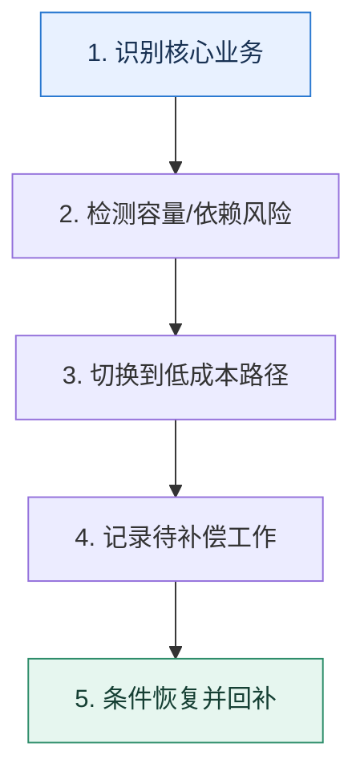

# 服务降级｜资源不足时主动舍弃次要能力

> 本课只解决一个问题：系统容量或依赖不足时，怎样让核心路径继续工作而不是一起崩溃？

这不是原页面的缩写，也不是一组孤立结论。下面先建立一个能推演的最小世界，再把状态、数字和失败分支摊开，最后按来源讲解顺序覆盖全部知识线索。读完后，你应当能从 `识别核心业务` 一直解释到 `条件恢复并回补`，并说明中途任意一步失败会留下什么状态。

## 零基础入口：先建立本课的心智画面

降级先要画业务优先级，而不是先选技术。核心路径、可延迟路径、可返回旧数据路径和可关闭路径必须由业务损失决定。

先不要急着记组件名。只抓住四个问题：**现在手里有什么输入？下一步只做什么动作？哪个状态发生变化？变化后的结果交给谁？** 之后遇到新框架，只要这四个答案不变，核心机制就没有变。

### 放进一个足够小、可以手算的世界

大促时库存扣减、下单和支付是核心链路，历史报表、个性化推荐和退款进度刷新可延后。若数据库写入达到安全上限，推荐接口返回上一小时缓存；退款请求仍受理并写入队列，页面显示“已受理，稍后处理”，而不是直接丢弃。

这个小世界故意只保留本课必需的对象。生产系统会有更多节点、线程、分片和异常，但数量增加不会改变这里的因果关系。先确认你能手算这个例子，再把数字替换成真实系统数据。

### 先预测，不要马上看结论

**为什么把写请求统一返回“成功”不是一种安全降级？**

先写下自己的判断，并指出你依赖的前提。文末自我检查会揭示答案；如果答案不同，回到下面的状态表找出第一个分叉点。

## 本节精讲：让机制一步一步发生

降级可以发生在功能、数据新鲜度、计算精度或同步方式上。读写服务中可暂停非关键写入，快慢路径中可跳过慢速精确计算，外部依赖中可返回缓存或排队稍后处理。降级开关需要触发信号、审批边界、恢复条件和补偿流程；没有恢复与补偿的“临时关闭”会变成永久数据债务。

### 可见状态推进

| 当前步 | 现在发生的动作 | 下一步拿到什么 |
| ---: | --- | --- |
| 1 | 识别核心业务 | 检测容量/依赖风险 |
| 2 | 检测容量/依赖风险 | 切换到低成本路径 |
| 3 | 切换到低成本路径 | 记录待补偿工作 |
| 4 | 记录待补偿工作 | 条件恢复并回补 |
| 5 | 条件恢复并回补 | 得到可核对的终态 |

图只承担一个任务：让你看清状态如何向前移动。它不意味着每一步必然成功；网络超时、进程退出、重复执行和数据竞争都可能让箭头停在中间，因此后面必须继续讨论失效边界。

### 一次带数字的完整推演

大促时库存扣减、下单和支付是核心链路，历史报表、个性化推荐和退款进度刷新可延后。若数据库写入达到安全上限，推荐接口返回上一小时缓存；退款请求仍受理并写入队列，页面显示“已受理，稍后处理”，而不是直接丢弃。

数字不是装饰。它迫使我们回答容量、顺序、时间窗口或版本选择问题。若换一个数字就得出不同结论，真正的设计依据就是那个阈值，而不是某个中间件名称。

## 按讲解顺序重建知识链：完整来源讲解

下面按来源资料的教学顺序重新编排完整内容。转换页码、来源图片、推广信息、水印、角色化问答和只服务于技术讨论场景的话术已经删除；机制、算法、例子、反例、事故线索、评论补充和限制条件仍然保留。这里的作用是补齐知识覆盖，不取代前面的独立推演。

本节讨论微服务架构下的降级功能。

上节课我们讨论熔断的时候，我就提到过熔断、降级、限流是三个经常合并在一起讨论的可用性保障措施。所以如果你想要掌握高可用微服务架构，那么降级也是其中必不可少的一环。

可惜的是，大部分人在聊起降级的时候只是简单讲一下概念，选择的降级案例也不够精巧，所以很难给技术评审者留下深刻的印象。那么这节课我就带你来深入讨论降级的各个方面，同时我也会给出具体的进阶推导的方案。我们还是从降级的基本概念讲起。

### 先把机制拆开

如果用一句俏皮话来形容降级，那就是“凑合过呗，还能离咋的。”就比如在双十一之类的大促高峰，平台是会关闭一些服务的，比如退款服务。

这就是降级的典型应用，不过它是一种手动的跨服务降级。常见疑问是困惑，这为什么也算是降级呢？这是因为对于整个系统来说，它提供了一部分服务，但是没有提供另外一部分服务，所以它在整个系统层面上是降级的。

这种降级的好处有两方面。一方面是腾出了服务器资源，可以给订单服务或者支付服务；另外一方面是减少了对公共组件的压力，比如说减少了对数据库的写入压力。

不过如果仅仅是针对退款服务而言，那么你也可以认为退款服务是整个熔断了。

### 降级与熔断

事实上，降级和熔断非常像。熔断重点讨论的两个点，降级也有讨论。

如何判定服务健康，在降级中则是判定一个服务要不要降级。降级之后怎么恢复，也是要考虑抖动的问题。

所以在一些场景下，你既可以用熔断，也可以用降级。比如说在响应时间超过阈值之后，你可以考虑选择熔断，完全不提供服务；你也可以考虑降级，提供有损服务。

原则上来说，是应该优先考虑使用降级的。然而有些服务是无法降级的，尤其是写服务。例如你从前端接收数据，然后写到数据库，这种场景是无法降级的。另外，如果你希望系统负载尽快降低，那么熔断要优于降级。

从具体实践上来说，降级可以玩出的花样要比熔断多很多。毕竟熔断是彻底不提供服务，而降级则是尽量提供服务。所以怎么降就有很多千奇百怪的做法了。

### 如何降级？

怎么降这个问题的答案又可以分成两大类。

跨服务降级，当资源不够的时候可以暂停某些服务，将腾出来的资源给其他更加重要、更加核心的服务使用。我这里提到的大促暂停退款服务就是跨服务降级的例子。这种策略的要点是必须知道一个服务比另外一个服务更有业务价值，或者更加重要。本服务提供有损服务，例如各大 App 的首页都会有降级的策略。在没有触发降级的时候，App 首页是针对你个人用户画像的个性化推荐。而在触发了降级之后，则可能是使用榜单数据，或者使用一个运营提前配置好的静态页面。这种策略的要点是你得知道你的服务调用者能够接受什么程度的有损。

跨服务降级的措施是很粗暴的，常见的做法有三个。

整个服务停掉，例如前面提到的停掉退款服务。停掉服务的部分节点，例如十个节点，停掉其中五个节点，这五个节点被挪作他用。停止访问某些资源。例如日志中心压力很大的时候，发信号给某些不重要的服务，让它们停止上传日志，只在本地保存日志。

而针对服务本身，也有一些常见的降级思路。

返回默认值，这算是最简单的一种状况。禁用可观测性组件，正常来说在业务里面都充斥了各种各样的埋点。这些埋点本身其实是会带来消耗的，所以在性能达到瓶颈的时候，就可以考虑停用，或者降低采样率。同步转异步，即正常情况下，服务收到请求之后会立刻处理。但是在降级的情况下，服务在收到请求之后只会返回一个代表“已接收”的响应。后续服务会异步地开启线程来处理，或者依赖于定时任务来处理。简化流程，如果你处理一个请求需要很多步骤，后续如果有一些步骤不关键的话，可以考虑不执行，或者异步执行。例如在内容生产平台，一般新内容要被推送到推荐系统里面。那么在降级的情况下你可以不推，而后可以考虑异步推送过去，也可以考虑等系统恢复之后再推送过去。

### 把知识转成可验证的工程判断

在技术讨论前，你需要了解清楚你所在公司使用降级的情况。

如果你所在公司有 App、网站之类的产品，那么去了解一下在首页、核心页面有没有采取降级措施。如果采用了降级，那么降级前后的逻辑是什么样的。提前了解你所在公司有没有使用降级来保护系统。如果有，那么你需要了解清楚什么情况下会触发降级，降级后的逻辑是怎样的，以及怎样从降级中恢复过来。

这些降级的东西可能你没做过，不过你只需要了解清楚每一种降级的前因后果即可。

如果你维护的服务没有使用任何降级措施，那么你可以考虑为这些服务接入降级措施。这样做不仅可以给你的 KPI 或者 OKR 添上一笔，还能让你在实践过程中加深对降级的理解，掌握更多的细节。

你的最佳技术讨论策略是把降级作为构建高可用微服务架构的一个措施，例如在项目介绍中说：

A 系统是某个线上系统的核心系统，而我的主要职责是保障该系统的高可用。为了达到这一个目标，我综合运用了熔断、降级、隔离等措施。

等技术评审者询问某个具体措施的时候再详细解答。

知己知彼，方能百战不殆。当技术评审者问哪些问题时我们可以用降级来解释呢？

你是否了解服务治理？如何提高系统的可用性？如果系统负载很高该怎么办？依赖的下游服务或者下游中间件崩溃了怎么办？

这些问题是不是很熟悉，其实我们已经在熔断里面聊过了。就像我上节课说的，这些知识之间是相通的，任何优秀的方案都是这些内容的完美整合。所以这些问题你同样可以用降级来解释。

同时为了展示进阶推导，你需要记住后面我给出的两个方案：读写服务降级写服务和快慢路径降级慢路径。我非常建议你参考这两个方案的思路，基于自己的实际业务情况设计自己独有的降级技术讨论案例。

### 基本思路

如果技术评审者问到了降级，或者说你将话题引导到了降级，那么你可以先介绍降级的基本概念，同时可以举前面我们提到的大促和 App 首页的例子。如果你之前没有和技术评审者聊过熔断，那么你可以在这里补充熔断里面讨论判断服务健康的要点，然后结合自己公司内部使用降级的例子，或者即便不是自己亲手落地但是自己也了解详情的案例。

我在公司也用了降级来保护我维护的服务。举例来说，正常情况下我的服务都会全量采集各种监控指标。那么在系统触及性能瓶颈的时候，我就会调整采集的比率。甚至在关键的时候，我会直接停用掉所有的指标采集，将资源集中在提供服务上。

我在这里给你的示例比较简单，你可以考虑换成我在前面提到的其他降级思路。当然，如果你在公司内部本身就使用了降级的话，那么使用自己的案例会更好。讲完一个案例之后，你可以进一步总结常规的降级思路，也就是我在前置知识里面列举出来的。 套路是一样的，这里我就不再赘述了。

我前面列举出来的这些措施你不一定都用过，那么万一技术评审者问到其中一个，你不了解细节的话，你可以大方承认这就是听说过的措施，并没有实际落地。毕竟，技术行业乱七八糟、千奇百怪的解决思路数不胜数，不一定非得都亲手实践过。

紧接着，还有一个关键问题——抖动，千万别忘记参考熔断中的话术提一下。而后你可以将熔断与降级结合，总结升华一下。

总的来说，在任何的故障处理里面，都要考虑恢复策略会不会引起抖动问题。

总结是必不可少的，任何总结都代表你对问题更加抽象、更加深层次的认知。

### 进一步推导：怎样把机制用进真实系统

到这一步，从理论上来说你基本上已经答得很好，唯一美中不足的就是案例过于简单。所以这里我给你准备了两个比较好的案例，你可以参考。这两个案例你都可以根据你所在公司的实际情况进行调整，用真实的服务来替代我这里使用的服务。

### 读写服务降级写服务

这个案例的基本思路是如果你的某个服务是同时提供了读服务和写服务，并且读服务明显比写服务更加重要，那么这时候你就可以考虑降级写服务。

假如说现在我有一个针对商家的服务，商家调用这些 API 来录入一些数据，比如他们门店的基本信息，上传一些门店图片等。同时我还有一个针对 C 端普通用户的服务，这个服务就是把商家录入的数据展示在商家门店的首页上。所以由此可以看到在这个场景下，读服务 QPS 更高，也更加重要。

那么如果这两个服务是一起部署的，在需要降级的时候，就可以考虑将针对商家的写服务停掉，将资源都腾出来给针对 C 端用户的读服务。

所以你可以介绍这个方案，关键词是降级写服务。

我在公司维护了一个服务，它的接口可以分成两类：一类是给 B 端商家使用的录入数据的接口，另外一类是给 C 端用户展示这些录入的数据。所以从重要性上来说，读服务要比写服务重要得多，而且读服务也是一个高并发的服务。

于是我接入了一个跨服务的降级策略。当我发现读服务的响应时间超过了阈值的时候，或者响应时间开始显著上升的时候，我就会将针对 B 端商家用户的服务临时停掉，腾出来的资源都给 C 端用户使用。对于 B 端用户来说，他们这个阶段是没有办法修改已经录入的数据的。但是这并不是一个特别大的问题。当 C 端接口的响应时间恢复正常之后，会自动恢复B 端商家接口，商家又可以修改或者录入数据了。

同时你可以考虑从对数据库性能影响的角度来进一步解释降级写服务的优点。

虽然整体来说写服务 QPS 占比很低，但是对于数据库来说，一次写请求对性能的压力要远比一次读请求大。所以暂停了写服务之后，数据库的负载能够减轻不少。

除了这种 B 端录入 C 端查询的场景，还有很多类似的场景也适用。

在内容生产平台，作者生产内容，C 端用户查看生产的内容。那么在资源不足的情况下可以考虑停掉内容生产端的服务，只保留 C 端用户查看内容的功能。如果你的用户分成普通用户和 VIP 用户，那么你也可以考虑停掉给普通用户的服务。甚至，如果一个服务既提供给普通用户，也提供给 VIP 用户，你可以考虑将普通用户请求拒绝掉，只服务 VIP 用户。

如果你负责的业务也有其他类似的场景，那么你可以将里面的商家服务和 C 端服务换成你自己的服务。

在讲完这一个方案之后，你要稍微总结一下，在理论层面上拔高一下。

这个方案就是典型的跨服务降级。跨服务降级可以在大部分合并部署的服务里面使用，一般的原则就是 B、C 端合并部署降级 B 端；付费服务和非付费服务降级非付费服务。当然也可以根据自己的业务价值，将这些部署在同一个节点上的服务分成三六九等。而后在触发降级的时候从不重要的服务开始降级，将资源调配给重要服务。

有时候技术评审者可能会问怎么确定一个服务的业务价值，又或者你可以自己引出这个话题，关键词就是赚钱。

判断一个服务的业务价值最简单的方法就是问产品经理，产品经理自然是清楚什么东西带来了多少业务价值。又或者根据公司的主要营收来源确定服务的业务价值，越是能赚钱的就越重要。唯一的例外是跟合规相关的。比如说内容审核，它不仅不赚钱，还是一块巨大的成本支出。但是不管怎么降级，内容审核是绝对不敢降级的，不然就等着被请去喝茶交代问题吧。

这里我们还可以进一步展示进阶推导，让人感觉你对微服务框架有很深研究。关键词就是跨节点。

不过这种跨服务降级都是只能降级处在同一个节点的不同服务。而如果服务本身就分布在不同节点上的话，是比较难设计这种降级方案的。比如说大促时关闭退款服务这种，就需要人手工介入。

从理论上来说，网关其实是可以考虑支持这种跨节点的服务降级的。假如说我们有 A、B 两个服务，A 比 B 更加有业务价值。那么在 A 服务所需资源不足的时候，网关可以考虑停掉B 的一部分节点，而后在这些节点上部署 A 服务。对于 B 服务来说，它只剩下一部分节点，所以也算是被降级了。很可惜，大部分网关的降级设计都没考虑过这种跨服务降级的功能。

微服务框架做得就更差了。大部分微服务框架提供的降级功能都是针对本服务的，比如说在触发降级的时候返回一个默认值。

最后对网关的评价可能会让技术评审者将话题引向网关，所以你要在对技术讨论网关内容有把握的情况下再说。

### 快慢路径降级慢路径

我在熔断里面提到了一个例子，即如果 Redis 崩溃了，那么就可以直接触发熔断。这种做法主要是为了保护数据库，防止 Redis 崩溃把所有的请求都直接落到数据库上，把数据库打崩。

你也可以考虑使用降级来保护这个缓存 - 数据库结构。正常来说，你使用缓存基本上都是先从缓存里面读数据，如果缓存里面没有数据，就从数据库中读取。

那么在触发降级的情况下，你可以考虑只从缓存里面读取。如果缓存里面没有数据，那么就直接返回，而不会再去数据库里读取。这样可以保证在缓存里面有数据的那部分请求可以得到正常处理，也就是提供了有损服务。

这种降级方案背后的逻辑也很简单。如果完全不考虑从数据库里取数据，那么你的性能瓶颈就完全取决于缓存或者说 Redis，那么服务能够撑住的 QPS 会非常高。

但是，如果缓存不命中的时候要去数据库取数据，那么服务的性能会衰退得非常快，即极少数缓存未命中的请求会占据大部分的系统资源。

所以你可以这样解释，关键词是只查缓存。

我还用过另外一个降级方案。正常来说在我的业务里面，就是查询缓存，如果缓存有数据，那么就直接返回。如果缓存没有，那么就需要去数据库查询。如果此时系统的并发非常高，那么我就会采取降级策略，将请求标记为降级请求。降级请求只会查询缓存，而不会查询数据库。如果缓存没有，那就直接返回错误。这样能够有效防止因为少部分请求缓存未命中而占据大量系统资源，导致系统吞吐量下降和响应时间显著升高。

同样地，你也需要总结拔高一下，关键词是快慢路径。

这种思路其实可以在很多微服务里面应用。如果一个服务可以分成快路径和慢路径两种逻辑，那么在降级之前就可以先走快路径，再走慢路径。而触发了降级之后，就只允许走快路径。在前面的例子里面，从缓存里加载数据就是快路径，从数据库里面加载数据就是慢路径。

慢路径还可以是发起服务调用或者复杂计算。比如说一个服务快路径是直接查询缓存，而慢路径可能是发起很多微服务调用，拿到所有响应之后一起计算，算出来一个结果并缓存起来。那么在降级的时候，可以有效提高吞吐量。不过这种吞吐量是有损的，毕竟部分请求如果没有在缓存中找到数据，那么就会直接返回失败响应。

很自然地，你的关键服务都应该有类似的降级措施。当任何下游崩溃，或者第三方中间件崩溃，你都可以不再调用这些崩溃的下游服务或中间件，以确保提供有损服务。

如果你选择这个作为进阶推导方案的话，那么自然就可以将话题引导到缓存的使用上来，你就可以使用课程后面缓存相关的内容来阐述了。

### 本节原始知识线索收束

这一节课我们已经讨论清楚了降级的基本概念、常见做法。

降级和熔断是很像的，它也要考虑判定服务健康，如何恢复以及怎么降级。你需要记住的是从系统整体上看，你可以考虑跨服务降级，例如大促的时候关闭退款服务。针对单一服务，也可以考虑提供有损服务。

那么不管是跨服务降级还是提供有损服务，根源都在于你要识别出来，一部分比另外一部分更加重要。这样你就可以牺牲不那么重要的部分来保障更加重要的部分。

最后我给出了两个进阶推导方案：读写服务降级写服务，快慢路径降级慢路径。你可以把这两个方案记下来，也可以根据自己的业务特征来设计类似的降级方案。

我再强调一点，我提供的这些方案本身都是可以在公司内部落地的。所以即便没有机会也应该创造机会在公司内部实践一下。

同样地，这是本节内容的思维导图，你可以参考。

### 继续推演

我在前面讲了一个读写服务降级写服务的例子，那么你觉得写服务内部可以考虑降级吗？比如说我的写服务是写多个数据源，那我可以降级为只写一个数据源吗？

这节课我还解释了一下熔断和降级的联系和区别，那么你是怎么看待这两者的关系的？你能举一些可以降级或者只能熔断的服务的例子吗？

### 补充讨论与边界校准

补充讨论：

可以降级的例子：

1. 订单表数据太大了，把历史数据归档（比如每年归一次档），然后限制大家只能查近一年的订单，如果要查看更久之前的，要先提申请只能熔断的例子：
1. 服务依赖的数据库无法正常使用，导致很多上游服务处理各种阻塞，此时要果断熔断，直接让服务返回错误，避免上游服务大量的积压业务消息，或有大量的未释放的资源，导致上游服务不健康
讲解补充：赞！我感觉这两个例子也蛮符合我说的规律，读请求一般比较好降级，写请求类的，就不太好降级。

历史数据之前我也搞过一个类似的，倒不是说要主动申请，而是历史订单，跑过去大数据平台上搜索，然后异步通知用户后面来看结果。

8

3. 0的A7 2023-06-23 来自内蒙古一
1. 写多个数据源是什么意思？同一份数据写到多个数据库吗？还是说有多个业务的数据来源？
2. 如果是同一份数据写到多给数据库。降级的目的是腾出部分资源给核心系统使用。如果写服务写的多个数据源，应该考虑多个数据源所在的数据库节点压力的释放是否能给核心系统带来减负，如果可以，就可以降级为只写一个数据源。
3. 如果是多个业务的数据来源。那可以按照这些写业务进一步按照重要度进行排序，
二用小饭馆举例子1 熔断就好比，我直接关门了降级是你来我接待，但是你点的鱼香肉丝我只能给你方便面或者馒头讲解补充：非常对！这里指的是多个业务的数据库。写多个数据源的场景，一般的降级做法就是，正常就直接同步写，降级就只写最重要的，然后其他都是走异步，甚至直接不写其它数据源，依赖于后续的数据修复工具来修复数据。

4补充讨论：

讲解补充：一般来说，是中间件和业务都要配合的，尤其是跟业务密切相关的怎么降级。

一般来说，中间件，比如说微服务框架的 middleware filter 之类的会帮助你判断是不是要降级。要降级的话就会把这个请求标记为降级请求，你在业务逻辑里面要根据这个标记来执行降级逻辑。本身这个分发机制也可以做得非常通用，但是正常业务逻辑、降级业务逻辑，这个必然是你写的。

也有一些通用的降级逻辑，比如说触发降级就返回默认值，那么你就可以在配置文件里面配置好默认值。

如果你有兴趣，你可以针对你现在的框架来研发一些通用的降级机制——比如说我提到的返回默认值，在工程复盘时也可以是一个不错的进阶推导。

3补充讨论：

1. 在前面讲了一个读写服务降级写服务的例子，你觉得写服务内部可以考虑降级吗？比如我的写服务是写多个数据源，可以降级为只写一个数据源吗？如果写服务内部还能根据重要程度拆分的话，内部也可以考虑降级。比如对商家的大部分接口都停用了，但是保留修改商品价格和商品下架的接口，如果发生了BUG 价之类的事故，商家还有机会即时止损。对于写多个数据源的情况，在不影响业务的前提下，可以先写部分数据源，然后通过课程里面讲到的异步等手段，再来写其它数据源。
2. 这节课还解释了一下熔断和降级的联系和区别，你是如何看待这两者的关系？可以举一些可以降级或只能熔断服务的例子吗？熔断和限流都是提高系统可用性的措施。限流是通过主动降低服务质量，来保证系统核心功能能正常运行。熔断是通过停止服务，来避免出现连锁故障。比如第三方短信平台挂了，本地的短信服务可以直接熔断，拒绝所有发短信的请求；也可以尝试降级，在第三方恢复前都返回一个明确的错误码，告诉用户不能发短信的原因，避免用户不断重试。如果是订单的数据库挂了，用户的订单数据没法写入数据库，那么订单服务就只能进行熔断，在订单数据库恢复前，订单服务没法提供任何服务。
讲解补充：赞！

1. 写多个数据源，就是看业务，业务能接受就可以降级。
2. 在短信降级那里，要是不着急，还可以直接转为异步，后续自己再把短信发出去。
1补充讨论：

讲解补充：1. 你说的两种形态都有。一种是服务自身控制，这种只能做到本服务内降级；但是跨服务降级，是需要有一个控制中心的。比如说，如果你们是自研的网关，就可以考虑让网关来协调不同服务之间的降级。

2. 等待一段时间确实是经验值。经验值比较难以确定，那么就可以考虑经验值 + 试探恢复策略，接近于熔断里面的那种做法。就是最开始是等待一段时间，但是这个等待时间可以非常短。之后就可以放一两个请求，不执行降级逻辑，看看能不能拿到正常响应，能就加大流量。不能就继续睡一段时间。如果你觉得一两个请求拿不到相应（也拿不到降级相应），那么可以考虑说每一秒发一个请求，试探一下看看有没有恢复。
1补充讨论： 我不行了，不要找我降级: 集中有限资源干重要的事，不太重要的事情就要想办法解决了，什么静态页面，缓存，异步，等等讲解补充：赞！

补充讨论：

1. 理论上来讲上可以的，例如同时写入MySQL和ElasticSearch，可以降级为只同步写入MySQ L；从架构层面来讲，写入多个数据源不应该耦合在一起；2.熔断更关注的是服务的健康状态，在高并发的场景下避免服务崩溃；降级则是从请求流程的角度来考虑，然后提供更高的并发度；对超过应用处理能力的请求，只能进行熔断。
讲解补充：1. 是的，总的来说还是看业务。并且极力避免。

2. 嘿嘿，还可以转异步。转异步这种也要看业务，转异步究竟算熔断还是算降级，我个人偏向算降级。

补充讨论：

讲解补充：这个要看你的服务是怎么定义的。如果你的服务是指不同的接口，比如说 user_service 和user_detail_service 都是同一个进程，那么你就不需要人手动介入。如果你说你同一个节点，buyer_service 和 seller_service 分别监听不同的端口，那么多半就是人手动介入了。

这其实是源自“服务”这个词汇语义不确定。

补充讨论： 多个数据源同步写 2. 多个数据源异步写

1. 多个数据源同步写这种情况，说明数据很重要，且对数据的一致性要求较高，首先要评估这种情况是否要优先考虑熔断。如果要保证可用性，不熔断，那么优先考虑同步写一个数据源，其他的改为异步，还不行再考虑逐步停掉一些服务。无论哪种方式的降级，都要事先想清楚保证数据一致性的方案再做降级，对万一发生数据不一致留有预案
2. 多个数据源异步写还可以继续拆子场景：（1）同步写一个数据源，其他数据源异步；（2）全部数据源都是异步写对于子场景（1），其他数据源本来就是异步的，只要保证同步的数据源写即可，异步的都降级掉没有问题，如果同步写的服务要关停了，那就可以考虑熔断了对于子场景（2），说明数据的重要程度和一致性不高，降级为异步写一个数据源没有问题
讲解补充：分析很对！本质上就是你能接受什么样的一致性的问题。是强一致性还是最终一致性？最终一致性的最终，究竟是多久？

这里，如果你出去技术讨论的话，这部分最好要有实际案例支撑，所以平时可以在业务里面找找可以降级的东西。

补充讨论：

限流是目的，熔断和降级是限流后的两种处理方法。思考题：

1. 可以考虑写降级，特别是一些量大不重要的写数据，例如：埋点数据
2. 降级：内部观测性数据，比如，埋点数据，服务的观测性数据，内部人员考核数据。
讲解补充：很不错的观点。我个人觉得，可用性是目的，限流是手段，被限流请求可以被熔断或者降级。

不过确实这三个概念意思接近。

## 把完整讲解收束成一条因果链

1. 先区分降级与熔断，明确一个处理替代结果、一个处理下游调用。
2. 从功能关闭、读写拆分、快慢路径和异步化四种形态理解降级。
3. 用退款等可延迟业务说明为什么停的是实时处理而不是业务承诺。
4. 最后补齐开关治理：谁能开启、何时恢复、遗漏数据怎样补偿。

把这几步连接起来时，不要省略“为什么”。最终结论只有在前提、状态变化和失败代价都说得清楚时才可靠。

## 误区与失效边界

降级不等于返回成功。无法完成的写操作若伪装成成功，会破坏业务语义；应返回可解释状态并保证后续补偿。它也不同于限流：限流控制进入量，降级缩减单个请求消耗的能力。

再加一条通用但必须落实到本课对象上的边界：机制只能处理它看得见的信号。若输入指标失真、状态没有持久化、错误被吞掉，或者补偿没有幂等保护，再成熟的框架也只能基于错误证据作决定。

### 三种故障注入方式

| 故障 | 要观察什么 | 不能接受的解释 |
| --- | --- | --- |
| 在第 2 步前让依赖超时 | 是否停在可重试状态，是否消耗完上游预算 | “框架稍后会处理” |
| 在状态写入后让进程退出 | 重启后能否识别已完成与待继续动作 | “再执行一次应该没事” |
| 对同一输入并发执行两次 | 是否出现重复副作用、顺序颠倒或覆盖 | “概率很低” |

## 工程验证：把理解变成可以复查的证据

为每个候选功能写降级卡：`业务损失、节省资源、返回语义、数据补偿、最大持续时间`。节省资源不明确或补偿不可执行的方案不能上线。

| 步骤 | 状态或动作 | 最少应留下的证据 |
| ---: | --- | --- |
| 1 | 识别核心业务 | 开始时间、结束时间、输入标识、结果状态、异常原因 |
| 2 | 检测容量/依赖风险 | 开始时间、结束时间、输入标识、结果状态、异常原因 |
| 3 | 切换到低成本路径 | 开始时间、结束时间、输入标识、结果状态、异常原因 |
| 4 | 记录待补偿工作 | 开始时间、结束时间、输入标识、结果状态、异常原因 |
| 5 | 条件恢复并回补 | 开始时间、结束时间、输入标识、结果状态、异常原因 |

验证时同时记录成功路径和失败路径。只证明“正常时能跑通”不能说明设计可靠；至少要让一次超时、一次进程退出和一次重复请求可重现，并能根据日志或指标解释最后状态。

## 学完检查：闭卷画出本课

你现在应该能独立完成四件事：

1. 用自己的话说出本课唯一问题，不使用产品名也能解释。
2. 复算上面的具体例子，并指出哪个输入改变会让结论改变。
3. 沿 Mermaid 图注入一次失败，预测系统停在哪里以及由谁收敛。
4. 说出本课机制不保证什么，并给出一个反例。

## 自我检查

为什么把写请求统一返回“成功”不是一种安全降级？

因为系统没有建立对应事实，调用方却会按成功继续推进，造成不可修复的不一致。安全降级必须保持语义诚实，并给出受理、排队或失败状态。

怎样证明自己不是只记住了名词？

把 `识别核心业务` 的一个真实输入写出来，逐步记录到 `条件恢复并回补`。然后在中间任意一步制造失败；如果你能解释当前状态、下一责任方、可观测证据和恢复边界，就已经拥有可以迁移的工程模型。

## 来源与事实校准

- [查看完整来源稿（本地 22 页资料）](../content/04-degradation.md)

### 当前事实校准

容错库可以在异常或拒绝时调用 fallback，但库无法替业务决定 fallback 的语义。读请求返回旧缓存、写请求返回“已受理”、或者直接失败是三种不同承诺；只有业务状态机和补偿流程能说明哪一种安全。

- [Spring Cloud CircuitBreaker · Reference](https://docs.spring.io/spring-cloud-circuitbreaker/reference/)
- [Resilience4j · Getting Started](https://resilience4j.readme.io/docs/getting-started)

来源稿用于核对覆盖范围，不随公开站点发布。产品默认值和具体内部行为可能随版本变化；落地时应使用目标版本的官方文档、可运行实验和故障演练校准。本学习稿中的零基础入口、状态推演、故障矩阵和工程验证属于编辑补充，不冒充来源讲解者的原话。
