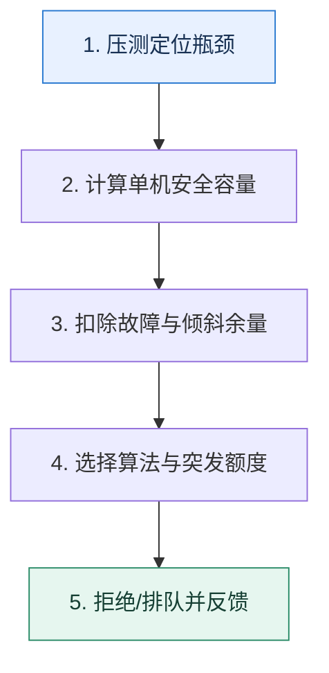

# 限流｜先算安全容量，再决定怎样拒绝流量

> 本课只解决一个问题：限流阈值应该来自什么证据，而不是凭经验写一个整数？

这不是原页面的缩写，也不是一组孤立结论。下面先建立一个能推演的最小世界，再把状态、数字和失败分支摊开，最后按来源讲解顺序覆盖全部知识线索。读完后，你应当能从 `压测定位瓶颈` 一直解释到 `拒绝/排队并反馈`，并说明中途任意一步失败会留下什么状态。

## 零基础入口：先建立本课的心智画面

限流算法回答“流量怎样通过”，阈值回答“系统能安全处理多少”。容量要从瓶颈资源、目标延迟、并发模型、请求大小和安全余量推导。

先不要急着记组件名。只抓住四个问题：**现在手里有什么输入？下一步只做什么动作？哪个状态发生变化？变化后的结果交给谁？** 之后遇到新框架，只要这四个答案不变，核心机制就没有变。

### 放进一个足够小、可以手算的世界

某接口平均占用 CPU 20ms，4 核机器理论上限约为 `4×1000/20=200 QPS`。压测发现超过 160 QPS 后 P99 急升，因此以 140 QPS 作为单机安全值。10 台集群不能直接设 1400：若要容忍 2 台故障，应按 8 台计算约 1120，并继续为流量倾斜留余量。

这个小世界故意只保留本课必需的对象。生产系统会有更多节点、线程、分片和异常，但数量增加不会改变这里的因果关系。先确认你能手算这个例子，再把数字替换成真实系统数据。

### 先预测，不要马上看结论

**令牌桶每秒产生 100 个令牌并最多积累 20 个，为什么某一秒能通过 120 个请求却不能长期保持 120 QPS？**

先写下自己的判断，并指出你依赖的前提。文末自我检查会揭示答案；如果答案不同，回到下面的状态表找出第一个分叉点。

## 本节精讲：让机制一步一步发生

固定窗口简单但边界处可出现双倍突发；滑动窗口更平滑；漏桶稳定输出；令牌桶允许积累令牌以吸收短时突发。阈值需通过单机压测得到并在集群规模、故障冗余和流量分布下折算。限流后还要明确快速失败、排队、降级或重试提示，避免客户端无退避重试制造更大流量。

### 可见状态推进

| 当前步 | 现在发生的动作 | 下一步拿到什么 |
| ---: | --- | --- |
| 1 | 压测定位瓶颈 | 计算单机安全容量 |
| 2 | 计算单机安全容量 | 扣除故障与倾斜余量 |
| 3 | 扣除故障与倾斜余量 | 选择算法与突发额度 |
| 4 | 选择算法与突发额度 | 拒绝/排队并反馈 |
| 5 | 拒绝/排队并反馈 | 得到可核对的终态 |

图只承担一个任务：让你看清状态如何向前移动。它不意味着每一步必然成功；网络超时、进程退出、重复执行和数据竞争都可能让箭头停在中间，因此后面必须继续讨论失效边界。

### 一次带数字的完整推演

某接口平均占用 CPU 20ms，4 核机器理论上限约为 `4×1000/20=200 QPS`。压测发现超过 160 QPS 后 P99 急升，因此以 140 QPS 作为单机安全值。10 台集群不能直接设 1400：若要容忍 2 台故障，应按 8 台计算约 1120，并继续为流量倾斜留余量。

数字不是装饰。它迫使我们回答容量、顺序、时间窗口或版本选择问题。若换一个数字就得出不同结论，真正的设计依据就是那个阈值，而不是某个中间件名称。

## 按讲解顺序重建知识链：完整来源讲解

下面按来源资料的教学顺序重新编排完整内容。转换页码、来源图片、推广信息、水印、角色化问答和只服务于技术讨论场景的话术已经删除；机制、算法、例子、反例、事故线索、评论补充和限制条件仍然保留。这里的作用是补齐知识覆盖，不取代前面的独立推演。

本节讨论微服务架构下的限流功能。

熔断、降级和限流是最常见的三种微服务架构可用性保障措施。和熔断、降级比起来，限流要更加复杂一些。大部分情况下，技术评审者技术讨论限流就是随便问问算法，最多就是问问 BBR 之类的动态算法。但是有一个问题，很多人都答不好，就是限流需要确定一个流量阈值，这个阈值该怎么算？

今天我就带你深入讨论限流的这个问题。

### 先把机制拆开

限流是通过限制住流量大小来保护系统，它尤其能够解决异常突发流量打崩系统的问题。例如常见的某个攻击者攻击你维护的系统，那么限流就能极大程度上保护住你的系统。

要想全面掌握限流这个知识点，我们需要深入理解限流的算法、对象，以及限流后的做法。下面我们一个一个来看。

### 算法

限流算法也可以像负载均衡算法那样，划分成静态算法和动态算法两类。

静态算法包含令牌桶、漏桶、固定窗口和滑动窗口。这些算法就是要求研发人员提前设置好阈值。在算法运行期间它是不会管服务器的真实负载的。动态算法也叫做自适应限流算法，典型的是 BBR 算法。这一类算法利用一系列指标来判定是否应该减少流量或者放大流量。动态算法和 TCP 的拥塞控制是非常接近的，只不过 TCP控制的是报文流量，而微服务控制的是请求流量。

除了我这里列举的算法，你也可以考虑参考熔断和降级里面的思路，选用一些指标来设计自己的限流算法。例如你的业务需要很多内存，那么你可以根据剩余空闲内存来判断要不要执行限流。

下面我们就从静态算法中的令牌桶看起，掌握限流中常见的算法。

令牌桶系统会以一个恒定的速率产生令牌，这些令牌会放到一个桶里面，每个请求只有拿到了令牌才会被执行。每当一个请求过来的时候，就需要尝试从桶里面拿一个令牌。如果拿到了令牌，那么请求就会被处理；如果没有拿到，那么这个请求就被限流了。

你需要注意，本身令牌桶是可以积攒一定数量的令牌的。比如说桶的容量是 100，也就是这里面最多积攒 100 个令牌。那么当某一时刻突然来了 100 个请求，它们都能拿到令牌。

漏桶漏桶是指当请求以不均匀的速度到达服务器之后，限流器会以固定的速率转交给业务逻辑。

某种程度上，你可以将漏桶算法看作是令牌桶算法的一种特殊形态。你将令牌桶中桶的容量设想为 0，就是漏桶了。

所以由此可以看到，在漏桶里面，令牌产生之后你就需要取走，没取走的话也不会积攒下来。因此漏桶是绝对均匀的，而令牌桶不是绝对均匀的。

固定窗口与滑动窗口固定窗口是指在一个固定时间段，只允许执行固定数量的请求。比如说在一秒钟之内只能执行100 个请求。

滑动窗口类似于固定窗口，也是指在一个固定时间段内，只允许执行固定数量的请求。区别就在于，滑动窗口是平滑地挪动窗口，而不像固定窗口那样突然地挪动窗口。

假设窗口大小是一分钟。此时时间是 t1，那么窗口的起始位置是 t1-1 分钟。过了 2 秒之后，窗口大小依旧是 1 分钟，但是窗口的起始位置也向后挪动了 2 秒，变成了 t1 - 1 分钟 + 2秒。这也就是滑动的含义。

### 限流对象

此外我们还要进一步考虑限流对象，也就是针对什么来进行限流。

从单机或者集群的角度看，可以分为单机限流或者集群限流。集群限流一般需要借助 Redis 之类的中间件来记录流量和阈值。换句话说，就是你需要用 Redis 等工具来实现前面提到的限流算法。当然如果是利用网关来实现集群限流，那么可以摆脱 Redis。

针对业务对象限流，这一类限流对象就非常多样。

VIP 用户不限流而普通用户限流。针对 IP 限流。用户登录或者参与秒杀都可以使用这种限流，比方说设置一秒钟最多只能有50 个请求，即便考虑到公共 IP 的问题，正常的用户手速也是没那么快的。针对业务 ID 限流，例如针对用户 ID 进行限流。

### 限流后的做法

即使一个请求被限流了，那么我们也可以设计一些精巧的方案来处理。

同步阻塞等待一段时间。如果是偶发性地触发了限流，那么稍微阻塞等待一会儿，后面就有极大的概率能得到处理。比如说限流设置为一秒钟 100 个请求，恰好来了 101 个请求。多出来的一个请求只需要等一秒钟，下一秒钟就会被处理。但是要注意控制住超时，也就是说你不能让人无限期地等待下去。

同步转异步。这里我们又一次看到了这个手段，它是指如果一个请求没被限流，那就直接同步处理；而如果被限流了，那么这个请求就会被存储起来，等到业务低峰期的时候再处理。这个其实跟降级差不多。调整负载均衡算法。如果某个请求被限流了，那么就相当于告诉负载均衡器，应该尽可能少给这个节点发送请求。我在熔断里面给你讲过类似的方案。不过在熔断里面是负载均衡器后续不再发请求，而在限流这里还是会发送请求，只是会降低转发请求到该节点的概率。调整节点的权重就能达成这种效果。

### 把知识转成可验证的工程判断

理论上，你要能够说出各种算法的基本原理。但动态算法，比如 BBR，就不作硬性的要求了。这主要是因为 BBR 的原理和实现都很有难度，大多数微服务框架都没提供 BBR 的限流器实现。不过还是那句老话，你要是有时间和精力，还是可以了解一下 BBR 的基本原理。

有些时候技术评审者可能会让你手写限流算法，那么漏桶、令牌桶、滑动窗口和固定窗口这几个算法你都要能写出来，至少要能把基本思路写清楚。如果你还有时间和精力，那么我建议你为一些开源框架提供限流插件，比如说为 gRPC 提供各种限流算法实现的插件。

你可能会说，现在开源的那么多，你写出来的插件还有人用吗？大概率没人用，但是你的目标也不是让人用，而是作为一个证据，来证明你懂限流，你很熟悉 gRPC，你喜欢开源。

除了这些基本的知识，在技术讨论前，你还需要了解清楚你们公司使用限流的情况。正常来说，核心 HTTP 请求和核心服务都应该使用限流来保障系统的可用性。对于每一个限流，你都要了解这些信息。

限流的阈值是多少，为什么设定成这个阈值？被限流的请求会被怎么处理，是直接拒绝还是阻塞直到超时，还是转为异步处理？

同样，技术讨论限流的最好策略就是为自己打造一个掌握了高可用微服务架构的人设。而限流就是你在提高系统可用性时的一个具体策略。如果你前面和技术评审者已经聊到了熔断和降级，那么就可以直接把话题引导到限流上。比如：

在讨论对外的 API，如 HTTP 接口或者公共 API 时，可以强调使用限流来保护系统。在讨论 TCP 拥塞控制时，你可以提起在服务治理上限流也借鉴了 TCP 拥塞控制的一些思想。在讨论 Redis 或者类似产品的时候，你可以提你用 Redis 实现过集群限流。

如果你维护的服务或者接口还没有使用限流来保护系统，那么你就可以考虑加上限流。而为了确定具体的阈值，你可以尝试对接口进行压力测试，找准限流的阈值。这个也是需要你通过实践来加深印象、把握细节的。

### 基本思路

如果技术评审者问到了限流，那么你就可以先阐述限流的总体目标，然后解释前置知识里面的三个点：算法、限流对象和限流后的做法，最后再把话题引到计算阈值上。

限流是为了保证系统可用性，防止系统因为流量过大而崩溃的一种服务治理手段。从算法上来说，有令牌桶、漏桶、固定窗口和滑动窗口算法。还有动态限流算法，或者说自适应限流算法，比较有名的就是参考了 TCP 拥塞控制算法 BBR 衍生出来的算法，比如说 B 站开源的 Kratos 框架就有一个实现。这些算法之间比较重要的一个区别是能否处理小规模的突发流量。

从限流对象上来说，可以是集群限流或者单机限流，也可以是针对具体业务来做限流。比如说在登录的时候，我们经常针对 IP 进行限流。又或者在一些增值服务里面，非付费用户也会被限流。

触发限流之后，具体的措施也可以非常灵活。被限流的请求可以同步阻塞一段时间，也可以考虑同步转异步。如果负载均衡算法灵活的话，也可以做一些调整，减少发到该节点的概率。

用好限流的一个重要前提是能够设置准确的阈值，例如每秒钟限制在 100 个请求还是限制在 200 个请求。如果阈值过低，那么系统资源就容易闲置浪费；如果阈值太高，那么系统可能撑不住那么多流量，导致崩溃。

同时你还要补充一个简单的例子，关键词是 IP 限流。你也可以考虑使用你的真实案例。

我在某个线上系统的登录接口里面就引入了限流机制。正常情况下，一个用户在一秒钟内最多点击一次登录，所以针对每一个 IP，我限制它最多只能在一秒内提交 50 次登录请求。这个50 充分考虑到了公共 IP 的问题，正常用户是不可能触发这个阈值的。这个限流虽然很简单，但是能够有效防范一些攻击。不过限流再怎么防范，还是会出现系统撑不住流量的情况。

注意在上面的解释里，我们没有说任何的细节，只是宽泛地介绍了一下限流，那么技术评审者接下来大概会问每一个算法、不同的限流对象，以及限流后的不同做法的细节。这部分你按照前置知识里面的内容来解释就可以。

同时，如果你开源了一个限流的仓库，你可以一起介绍一下。

我在 GitHub 上有一个开源仓库，里面放了我为 gRPC 实现的各种限流算法，包括基于Redis 实现的集群限流版本。

如果你是跨语言技术讨论，比如你是 Python 转 Go，你就可以强调一下，这个原本在我司是Python 写的，后来我用 Go 又写了一遍。如果你有进行一些改进，你可以把你具体改进的内容表述出来。

接下来是一些对限流的深入讨论，这部分内容能让你刷出不少的进阶推导。

### 突发流量

前面我们提到了“算法之间比较重要的一个区别是能否处理小规模的突发流量”，就是为这个部分的详细阐述留下了一个引子。

假如说正常你的限流是一秒钟 100 个请求，但是如果某一秒钟来了 101 个请求，你依旧会觉得第 101 个请求应该尽可能处理掉。在这种场景下，漏桶是做不到的，因为漏桶是非常均匀的。一秒钟 100 个请求在漏桶里面就是 10 毫秒一个请求，绝对不会多也不会少。

而令牌桶就能够处理。比如说令牌桶产生令牌的速率是 100 个每秒，但是桶的容量是 20 个，那么也就是说某一秒钟内，最多可以处理 120 个请求。

### 20（前一秒攒的令牌） + 100（当下这一秒） = 120

固定窗口和滑动窗口则有另外一个类似的问题，就是毛刺问题。

假如一个窗口大小是一分钟 1000 个请求，你预计这 1000 个请求会均匀分散在这一分钟内。那么有没有可能第一秒钟就来了 1000 个请求？当然可能。那当下这一秒系统有没有可能崩溃？自然也是可能的。

所以固定窗口和滑动窗口的窗口时间不能太长。比如说以秒为单位是合适的，但是以分钟作为单位就是不合适的。

那么在技术评审者问到，或者你在介绍了漏桶或令牌桶算法之后，就可以补充这一段。

漏桶算法非常均匀，但是令牌桶相比之下就没那么均匀。令牌桶本身允许积攒一部分令牌，所以如果有偶发的突发流量，那么这一部分请求也能得到正常处理。但是要小心令牌桶的容量，不能设置太大。不然积攒的令牌太多的话就起不到限流效果了。例如容量设置为1000，那么要是积攒了 1000 个令牌之后真的突然来了 1000 个请求，它们都能拿到令牌，那么系统可能撑不住这突如其来的 1000 个请求。

### 请求大小

刚刚我们讨论的限流是针对请求的个数进行的，但并没有考虑到另一个非常关键的问题，就是请求的大小。我在负载均衡里曾提过到这个问题，就是负载均衡算法基本上都没有考虑请求所需的资源。同理在限流算法也是如此。

限流是针对请求个数进行的，那么显然，如果有两台实例，一台实例处理的都是小请求，另一台实例处理的都是大请求，那么都限流在每秒 100 个请求。可能第一台实例什么问题都没有，而第二台实例就崩溃了。

所以如果技术评审者问到为什么使用了限流，系统还是有可能崩溃，或者你在负载均衡里面聊到了请求大小的问题，都可以这样来解释，关键词是请求大小。

限流和负载均衡有点儿像，基本没有考虑请求的资源消耗问题。所以负载均衡不管怎么样，都会有偶发性负载不均衡的问题，限流也是如此。例如即便我将一个实例限制在每秒 100个请求，但是万一这个 100 个请求都是消耗资源很多的请求，那么最终这个实例也可能会承受不住负载而崩溃。动态限流算法一定程度上能够缓解这个问题，但是也无法根治，因为一个请求只有到它被执行的时候，我们才知道它是不是大请求。

以上就是我们在解释限流相关问题时的基本思路，如果可以解释出来，基本上就可以拿到一个70 分的成绩，你满意吗？相信你和我一样，还想要更加出类拔萃一点，那这时候就要从计算阈值上面下功夫了。

### 计算阈值

在技术讨论限流的基本解释里面，你已经主动提起了限流阈值难以确定。那么不出所料，技术评审者就会问你怎么确定阈值。又或者你使用了限流的不同案例，那么技术评审者也会问你限流的阈值是怎么确定的。

总体上思路有四个：看服务的观测数据、压测、借鉴、手动计算。

看服务的性能数据属于常规解法，基本上就是看业务高峰期的 QPS 来确定整个集群的阈值。如果要确定单机的阈值，那就再除以实例个数。所以你可以这样来解释，关键词是业务性能数据。

某个线上系统有完善的监控，所以我可以通过观测到的性能数据来确定阈值。比如说观察线上的数据，如果在业务高峰期整个集群的 QPS 都没超过 1000，那么就可以考虑将阈值设定在

1200，多出来的 200 就是余量。

不过这种方式有一个要求，就是服务必须先上线，有了线上的观测数据才能确定阈值。并且，整个阈值很有可能是偏低的。因为业务巅峰并不意味着是集群性能的瓶颈。如果集群本身可以承受每秒 3000 个请求，但是因为业务量不够，每秒只有 1000 个请求，那么我这里预估出来的阈值是显著低于集群真实瓶颈 QPS 的。

注意你在解释的时候也解释了这种方法的缺陷，这算是一个小进阶推导。然后我们可以继续讨论其他的思路，关键词是压测。

不过我个人觉得，最好的方式应该是在线上执行全链路压测，测试出瓶颈。即便不能做全链路压测，也可以考虑模拟线上环境进行压测，再差也应该在测试环境做一个压力测试。

在这个解释里面你其实已经解释出了最正确的思路：做压测，而且你要强调全链路压测。理由很简单，限流针对的是线上环境，那么自然要尽可能模拟线上环境。最符合这个要求的就是全链路压测了，它就是直接在线上环境执行的，因此结果也是最准的。

然后你需要进一步解释，怎么利用压测结果。大部分性能测试的结果类似于图片里展示的这样，当然你是不太可能搞出来那么优雅的图形，多少会有些偏差。

从理论上来说，你可以选择 A、B、C 当中的任何一个点作为你的限流的阈值。

A 是性能最好的点。A 之前 QPS 虽然在上升，但是响应时间稳定不变。在这个时候资源利用率也在提升，所以选择 A 你可以得到最好的性能和较高的资源利用率。

B 是系统快要崩溃的临界点。很多人会选择这个点作为限流的阈值。这个点响应时间已经比较长了，但是系统还能撑住。选择这个点意味着能撑住更高的并发，但是性能不是最好的，吞吐量也不是最高的。

C 是吞吐量最高的点。实际上，有些时候你压测出来的 B 和 C 可能对应到同一个 QPS 的值。选择这个点作为限流阈值，你可以得到最好的吞吐量。

你在解释怎么选之前，最好给技术评审者比划一下上面这张图中的三条曲线，然后解释这三个点，口诀就是性能 A、并发 B、吞吐量 C。

综合来说，如果是性能苛刻的服务，我会选择 A 点。如果是追求最高并发的服务，我会选择 B 点，如果是追求吞吐量的服务，我会选择 C 点。

技术评审者多半会杠你，压力测试特别难，或者有些服务根本测不了，那你怎么办。这个时候，你需要说点正确但没用的废话，关键词压测是基操。你在表述的时候语气要委婉，态度要坚决。

一般我会认为一家公司应该把压测作为提高系统性能和可用性的一个关键措施，毕竟没有压测数据，性能优化和可用性改进也不知道怎么下手。所以我还是比较建议尽可能把压测搞起来，反正压测这个东西是迟早要有的。

然后你就要转过话头，顺着技术评审者的话往下说，讨论真的做不了压测的时候怎么确定阈值。关键词就是借鉴。

不过如果真的做不了，或者来不及，或者没资源，那么还可以考虑参考类似服务的阈值。比如说如果 A、B 服务是紧密相关的，也就是通常调用了 A 服务就会调用 B 服务，那么可以用 A 已经确定的阈值作为 B 的阈值。又或者 A 服务到 B 服务之间有一个转化关系。比如说创建订单到支付，会有一个转化率，假如说是 90%，如果创建订单的接口阈值是 100，那么支付的接口就可以设置为 90。

这个时候技术评审者可能会继续问：如果我这是一个全新的业务呢？也就是说，你都没得借鉴。这个时候就只剩下最后一招了——手动计算。

实在没办法了，就只能手动计算了。也就是沿着整条调用链路统计出现了多少次数据库查询、多少次微服务调用、多少次第三方中间件访问，如 Redis，Kafka 等。举一个最简单的例子，假如说一个非常简单的服务，整个链路只有一次数据库查询，这是一个会回表的数据库查询，根据公司的平均数据这一次查询会耗时 10ms，那么再增加 10 ms 作为 CPU 计算耗时。也就是说这一个接口预期的响应时间是 20ms。如果一个实例是 4 核，那么就可以

### 简单用 1000ms ÷ 20ms × 4 = 200 得到阈值。

这个时候你还可以进一步补充一些手动计算要考虑的事情。

手动计算准确度是很差的。比如说垃圾回收类型语言，还要刨除垃圾回收的开销，相当于200 打个折扣。折扣多大又取决于你的垃圾回收频率和消耗。

最后再升华一下主题。

最好还是把阈值做成可以动态调整的。那么在最开始上线的时候就可以把阈值设置得比较小。后面通过观测发现系统还很健康，就可以继续上调阈值。

### 本节原始知识线索收束

这节课我们讨论了限流的主要问题，包括限流算法，限流对象以及限流之后的做法。在讨论怎么计算阈值的问题时，你尤其要记住里面提到的 ABC 三个点。不仅仅是技术讨论中，在你实际工作中也用得上的。

我也再次强调一下，你应该在技术讨论前尽可能在公司里面应用一下限流，同时尝试做一做压测。如果公司没有这种压测的环境，那么这正好是你刷 KPI 的机会。你把压测环境准备好，流程标准化之后，这件事情本身也可以作为你技术讨论时候的一个进阶推导。

同样地，这里有我整理的思维导图，你可以参考。

### 继续推演

最后你来思考几个问题。

针对 IP 限流是一个非常常见的限流方案，那么怎么获得用户的 IP 呢？尤其是在请求经过了网关的情况下，怎么避免自己拿到的是网关的 IP？我在阈值里面提到的 ABC 三个点，你能说出你的业务应该使用哪个点吗？

### 补充讨论与边界校准

3. 0的A7 2023-06-26 来自北京获取用户的真实IP，有一下集中方法，分别是应用层方法、传输层方法、网络层方法：
1. 应用层方法：X-Forwarded-For缺点:会被伪造、多个X-Forwarded-For头部、不能解决HTTP和SMTP之外的真实源IP获取的需求
2. 传输层方法：利用 TCP Options 的字段来承载真实源 IP 信息、Proxy Protocol、NetScaler的 TCP IP header
3. 网络层：隧道 +DSR 模式贴一下参考(照抄)来源吧:https://time.geekbang.org/column/article/497864
讲解补充：优秀优秀！哈哈哈，能够找准资料也是一种能力！

15补充讨论： header头中加入“X-Forwarded-Fo r”字段，用以记录这个请求从哪里来的，所以看这个字段的第一个值就是原始的用户ip讲解补充：赞！要小心 X-Forwarded-For 是可以伪造的。

8补充讨论：

1. 针对 IP 限流是一个非常常见的限流方案，那么怎么获取用户的 IP 呢？尤其是在请求经过网关的情况下，怎么避免拿到的是网关的 IP ？可以是用 HTTP 请求头中的，X-Forwarded-For（XFF）自定有头字段。可以获取客户端的真实地址，还可以获取整个请求链中的所有代理服务器 IP 地址。但要注意 X-Forwarded-For 头是可伪造的字段。
2. 我在阈值里面提到的 ABC 三点，你能说出你的业务应该使用哪个点吗？我觉得需要根据系统的整体情况来考虑。如果系统很少会触发阈值，可以考虑 B 点，追求最大并发数。触发限流之后，系统一般阻塞下，扛一扛就过去了。如果系统长时间在阈值附近徘徊，说明系统性能已经接近极限了，就算把请求阻塞下，最后多半也是超时。这个时候选 C 点更好，最大吞吐量，能处理掉最多的请求。如果系统对性能要求苛刻，比如整条链路超时时间很短，那就只能选 A 点，最大化性能。但凡请求的响应时间长一点，可能就整体超时了。
讲解补充：赞！

4补充讨论：

1. 会出现误限的情况，比如说有两台实例 A 和 B，每个单机限流阈值为 10，那么整体限流阈值是 20，但是如果出现负载不均，某一秒 A 接收的请求是 15，B 接收的请求是 5，那么根据单机阈值，A 将放行 10 个请求，B 放行 5 个请求，这一秒内实际只承接了 15 个请求，而我们的期望是 20；
2. 无法很好的设置精确的限流值，一般情况下，单机限流阈值 = 整体限流阈值 / 实例数。比如说实例数有 50 个，但是想要 80 的限流值就无法精确匹配。 单机限流阈值设置为 1 的情况下整体限流阈值只有 50 ，单机限流阈值设置为 2 的情况下整体限流阈值则达到了 100。
3. 如果整体限流值不变，实例进行扩、缩容是单机限流阈值要跟着更新单机限流阈值；

集群限流的特点：

1. 使用中央模式的计数器，不会出现单机限流出现的误限、无法精确匹配限流值以及扩、缩容调整问题，限流值比较准确；
2. 依赖提供中央技术器的服务，如果该服务不可用，那么限流功能将不可用，此时可以考虑降级到单机限流；
讲解补充：总结很到位！单机限流第三点是值得讨论的。因为本身在单机限流的时候，你可以不再考虑集群整个流量限制多少了。比如说每台机器限流 100，已经有两台了，也就是整个限流是 200。但是如果你再加一个机器，这个机器其实也可以限流 100。

这也就是说，你单机限流是从单机的处理能力角度考虑的。

2补充讨论：

讲解补充：在努力写了，尽量更新！

2补充讨论： 50 充分考虑到了公共 IP 的问题"，这里指的是，用户可能连这个wifi或者另外一个wif i，又或者使用流量。以至于ip不一样，这种情况么讲解补充：不是。比如说，我和女朋友在家里用一个路由器，又或者运营商给我们整个小区的公共 IP都是同一个。或者你可以认为，你到某地连上 wifi 之后，可能共享这个 wifi 的所有人，在对外的 IP都是同一个。

1补充讨论：

关于压测和阈值我想问，一个服务肯定有多个接口，这多个接口有些处理时间长，有些慢，他们共用一系列资源，相互之间是有影响的，单独一个接口压到顶峰，可能其他接口直接就凉凉了，这个时候应该怎么来设置，怎么压测呢？另外写接口或者post接口也可以压测吗？

讲解补充：这算是一个非常好的问题。如果你要综合考虑多个服务的话，你需要模拟线上流量的比例来进行压测。比如说 A 接口和 B 接口各自占据了 70% 和 30%，那么你在压测的时候，压测流量额的 70% 是给 A 的，30% 是给 B 的。

3. 0的A7 2023-10-11 来自北京关于限流有几个疑问：
1. 目前一些方案都是基于接口粒度的，这样的话，是需要针对每一个接口都要进行限流的配置吗，这样的话，如果一个服务能承受的最大qps是3000，共有10个接口，假设每个接口的访问频率都差不多，是不是要针对每个接口设置最大300？
2. 如果针对单机维度进行3000的限流，会不会出现一种情况，就是如果一个完整的业务需要n多个接口，前m个都通过了，结果后边突然被限制，这样前边m个接口的计算资源是不是也被浪费了？
3. 目前sentinel、Hystrix 都是针对java的，如果公司内部技术栈比较多，有没有通用的限流方案呢？nginx可以限，但是可能解决不了上面的两个问题。
讲解补充：1. 实际上，我就搞过全部接口有一个限流阈值，以及单一的核心接口又有一个阈值，双重限流。

2. 是的，但是没办法，因为你作为一个服务端你不知道他们是归属于同一个业务的请求。
3. 其实我也见过 Go 的客户端。如果你要跨语言的话，最好就是手写了。比如说用 Redis，那么写好一个 lua 脚本，各个语言都调用同一个脚本。又或者，自己照着抄一个别的语言的 sentinel, hystrix。

补充讨论：

1. 用户真实请求IP可以放在上下文中进行传递；2.业务上会优先选择B或者C。
讲解补充：1. 确实，关键是这个地方核心是网关要记录好原始的客户端IP。

补充讨论： 0，就是漏桶了”是会引起误解的。虽然令牌桶的以“恒定的速率产生令牌”和漏桶的“以固定的速率转交给业务逻辑”比较类似，但在桶的实现上，漏桶往往是有一个队列的，这个队列的大小就是漏桶的容量；而令牌桶可以不带队列。

讲解补充：你说的这个是实现机制，漏桶也可以不用队列实现。我这里强调的是，令牌桶如果不允许积攒令牌，就相当于漏桶了。

## 把完整讲解收束成一条因果链

1. 从固定窗口、滑动窗口、漏桶和令牌桶区分稳定速率与突发能力。
2. 明确限流对象可以是请求数、并发数、用户、租户或请求大小。
3. 用响应时间和核心数估算阈值，再用压测曲线修正理论值。
4. 最后设计拒绝后的客户端退避和降级，防止限流器外形成重试风暴。

把这几步连接起来时，不要省略“为什么”。最终结论只有在前提、状态变化和失败代价都说得清楚时才可靠。

## 误区与失效边界

平均耗时推导的是粗略上限，不包含锁竞争、I/O 排队、GC 和长尾。令牌桶的突发能力也不是额外容量，只是把前一段空闲额度挪到当前使用。

再加一条通用但必须落实到本课对象上的边界：机制只能处理它看得见的信号。若输入指标失真、状态没有持久化、错误被吞掉，或者补偿没有幂等保护，再成熟的框架也只能基于错误证据作决定。

### 三种故障注入方式

| 故障 | 要观察什么 | 不能接受的解释 |
| --- | --- | --- |
| 在第 2 步前让依赖超时 | 是否停在可重试状态，是否消耗完上游预算 | “框架稍后会处理” |
| 在状态写入后让进程退出 | 重启后能否识别已完成与待继续动作 | “再执行一次应该没事” |
| 对同一输入并发执行两次 | 是否出现重复副作用、顺序颠倒或覆盖 | “概率很低” |

## 工程验证：把理解变成可以复查的证据

容量报告至少保存 `QPS、并发、平均/P95/P99、CPU、连接池、错误率` 六组数据，并标出曲线开始非线性上升的位置。阈值来自拐点之前，而不是错误率达到 100% 的极限。

| 步骤 | 状态或动作 | 最少应留下的证据 |
| ---: | --- | --- |
| 1 | 压测定位瓶颈 | 开始时间、结束时间、输入标识、结果状态、异常原因 |
| 2 | 计算单机安全容量 | 开始时间、结束时间、输入标识、结果状态、异常原因 |
| 3 | 扣除故障与倾斜余量 | 开始时间、结束时间、输入标识、结果状态、异常原因 |
| 4 | 选择算法与突发额度 | 开始时间、结束时间、输入标识、结果状态、异常原因 |
| 5 | 拒绝/排队并反馈 | 开始时间、结束时间、输入标识、结果状态、异常原因 |

验证时同时记录成功路径和失败路径。只证明“正常时能跑通”不能说明设计可靠；至少要让一次超时、一次进程退出和一次重复请求可重现，并能根据日志或指标解释最后状态。

## 学完检查：闭卷画出本课

你现在应该能独立完成四件事：

1. 用自己的话说出本课唯一问题，不使用产品名也能解释。
2. 复算上面的具体例子，并指出哪个输入改变会让结论改变。
3. 沿 Mermaid 图注入一次失败，预测系统停在哪里以及由谁收敛。
4. 说出本课机制不保证什么，并给出一个反例。

## 自我检查

令牌桶每秒产生 100 个令牌并最多积累 20 个，为什么某一秒能通过 120 个请求却不能长期保持 120 QPS？

前 20 个来自此前空闲时积累的额度。消耗完后长期补充速率仍是每秒 100 个，持续 120 QPS 会不断被拒绝。

怎样证明自己不是只记住了名词？

把 `压测定位瓶颈` 的一个真实输入写出来，逐步记录到 `拒绝/排队并反馈`。然后在中间任意一步制造失败；如果你能解释当前状态、下一责任方、可观测证据和恢复边界，就已经拥有可以迁移的工程模型。

## 来源与事实校准

- [查看完整来源稿（本地 25 页资料）](../content/05-rate-limiting.md)

### 当前事实校准

不同实现的计数方式不同。Resilience4j 当前官方实现按刷新周期发放许可，并不等同于课程中用于解释突发流量的令牌桶。因此要区分“限流目的、理论算法、所用库的实际实现”三层，不能看到 RateLimiter 名称就假定它一定有令牌积累能力。

- [Resilience4j · RateLimiter](https://resilience4j.readme.io/docs/ratelimiter)

来源稿用于核对覆盖范围，不随公开站点发布。产品默认值和具体内部行为可能随版本变化；落地时应使用目标版本的官方文档、可运行实验和故障演练校准。本学习稿中的零基础入口、状态推演、故障矩阵和工程验证属于编辑补充，不冒充来源讲解者的原话。
