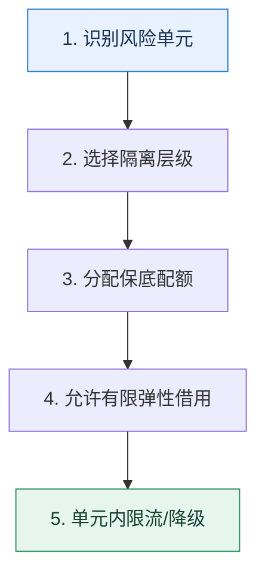

# 隔离｜先画清故障边界，再分配独立资源

> 本课只解决一个问题：一个租户、任务或依赖变慢时，怎样避免耗尽全系统的公共资源？

这不是原页面的缩写，也不是一组孤立结论。下面先建立一个能推演的最小世界，再把状态、数字和失败分支摊开，最后按来源讲解顺序覆盖全部知识线索。读完后，你应当能从 `识别风险单元` 一直解释到 `单元内限流/降级`，并说明中途任意一步失败会留下什么状态。

## 零基础入口：先建立本课的心智画面

隔离不是简单多建几个线程池，而是让不同风险单元不能无上限地争抢同一资源。风险单元可按租户、业务、实例、机房、依赖或任务类型划分。

先不要急着记组件名。只抓住四个问题：**现在手里有什么输入？下一步只做什么动作？哪个状态发生变化？变化后的结果交给谁？** 之后遇到新框架，只要这四个答案不变，核心机制就没有变。

### 放进一个足够小、可以手算的世界

普通用户与 VIP 共用 100 个数据库连接。一次普通用户报表把连接占满，VIP 查询也会排队。改为 VIP 保底 20、普通 60、弹性 20：平时双方可借弹性连接；拥塞时 VIP 至少保有 20 个，普通请求在自己的边界内排队或降级。

这个小世界故意只保留本课必需的对象。生产系统会有更多节点、线程、分片和异常，但数量增加不会改变这里的因果关系。先确认你能手算这个例子，再把数字替换成真实系统数据。

### 先预测，不要马上看结论

**给 VIP 单独线程池后，为什么仍可能被普通流量拖慢？**

先写下自己的判断，并指出你依赖的前提。文末自我检查会揭示答案；如果答案不同，回到下面的状态表找出第一个分叉点。

## 本节精讲：让机制一步一步发生

隔离层级越靠近物理资源，故障边界越清晰但成本越高。机房和实例隔离适合强 SLA；线程池、连接池和信号量隔离成本低但仍共享 CPU、内存和网络。慢任务应独立队列与工作池，第三方依赖应拥有独立连接池和超时预算。隔离容量还要防止一边闲置、一边饥饿，可设置保底配额加可借用的弹性池。

### 可见状态推进

| 当前步 | 现在发生的动作 | 下一步拿到什么 |
| ---: | --- | --- |
| 1 | 识别风险单元 | 选择隔离层级 |
| 2 | 选择隔离层级 | 分配保底配额 |
| 3 | 分配保底配额 | 允许有限弹性借用 |
| 4 | 允许有限弹性借用 | 单元内限流/降级 |
| 5 | 单元内限流/降级 | 得到可核对的终态 |

图只承担一个任务：让你看清状态如何向前移动。它不意味着每一步必然成功；网络超时、进程退出、重复执行和数据竞争都可能让箭头停在中间，因此后面必须继续讨论失效边界。

### 一次带数字的完整推演

普通用户与 VIP 共用 100 个数据库连接。一次普通用户报表把连接占满，VIP 查询也会排队。改为 VIP 保底 20、普通 60、弹性 20：平时双方可借弹性连接；拥塞时 VIP 至少保有 20 个，普通请求在自己的边界内排队或降级。

数字不是装饰。它迫使我们回答容量、顺序、时间窗口或版本选择问题。若换一个数字就得出不同结论，真正的设计依据就是那个阈值，而不是某个中间件名称。

## 按讲解顺序重建知识链：完整来源讲解

下面按来源资料的教学顺序重新编排完整内容。转换页码、来源图片、推广信息、水印、角色化问答和只服务于技术讨论场景的话术已经删除；机制、算法、例子、反例、事故线索、评论补充和限制条件仍然保留。这里的作用是补齐知识覆盖，不取代前面的独立推演。

本节讨论微服务架构下的隔离功能。

隔离和前面讨论的熔断、降级、限流比起来，在技术讨论中要“冷”一点。一个很重要的原因是隔离在实际中的应用要比限流这种措施少很多。尤其是在中小型公司，很多时候是用不到隔离的。但隔离依旧是构建高可用和高性能的微服务架构中的一环，因为在出现故障的时候，隔离可以把影响限制在一个可以忍受的范围内。

比如说我们为 VIP 用户提供单独的服务集群，普通用户共享一个服务集群。那么普通用户集群出了问题，VIP 用户一点感觉都没有，依旧可以正常使用，这样就可以保证 VIP 用户体验不受损。特别是复杂的、核心的和规模庞大的服务，隔离机制就更加重要了。否则，一个小小的故障都能蔓延到整个系统，你就离喜提大礼包不远了。

所以今天我就带你看看隔离在实际工作中形形色色的用法以及两个比较出彩的隔离方案。

### 先把机制拆开

隔离是通过资源划分，在不同服务之间建立边界，防止相互影响的一种治理措施。

隔离在实际工作中有很多种做法，从不同的角度可以进行不同类型的隔离。一般来说，使用隔离策略主要是为了达到 3 个目的。

提升可用性，也就是说防止被影响或防止影响别人。这部分也叫做故障隔离。提升性能，这是隔离和熔断、降级、限流不同的地方，一些隔离方案能够提高系统性能，而且有时候甚至能做到数量级提升。提升安全性，也就是为安全性比较高的系统提供单独的集群、使用更加严苛的权限控制、迎合当地的数据合规要求等。

一般的原则是核心与核心隔离，核心与非核心隔离。注意，这里有一个常见的误解，很多人认为核心服务可以放在一起，实际上并不是。

举例来说，如果核心服务都放在同一台机器上，那么这台机器一宕机，所有的核心服务就都宕机了。反过来说，如果核心服务部署在了不同的机器上，那么其中一台机器宕机了，也就只有这台机器上的服务崩了，而其他机器上的服务还是可以继续运行。

那么隔离究竟该怎么样做才能达成提升可用性、提升性能和提升安全性的目标呢？其实可以采取的措施也是非常多的，让我们一个个看。

### 机房隔离

机房隔离也就是我们会把核心业务单独放进一个机房隔离，不会和其他不重要的服务混在一起。这个机房可能会有更加严格的变更流程、管理措施和权限控制，所以它的安全性会更高。

一些公司的金融支付业务，个人隐私类的往往会有独立的机房，或者至少在逻辑上它们会有完全不同的安全策略和保护措施。还有一些公司受制于当地的法律法规，例如数据必须留在本地。那么这些公司也只能说一个国家或一个地区一个机房。

在这种形态下，其中一个机房崩溃了自然不会对另外一个机房有任何影响。

机房隔离和多活看起来有点儿像，但是从概念上来说差异还是挺大的。这里的隔离指的是不同服务分散在不同的机房，而多活强调的是同一个服务在不同的城市、不同的机房里面有副本。

### 实例隔离

实例隔离是指某个服务独享某个实例的全部资源。当然这里指的是常规意义上的实例，比如说你在云厂商里面买了一个 4C8G 的机器，实例隔离就是指服务独享了这个实例，没有和其他组件共享。

但是这种隔离并没有考虑到这么一种情况，就是虽然你买了很多实例，但是这些实例在云厂商那里都是同一个物理机虚拟出来的。这种情况下，如果物理机有故障，那么这些虚拟机都会出问题。

在早期还没有云服务的时候，也有机器隔离的说法。它指的就是核心服务独享一整个物理机的资源。

在一些小公司里面，为了节省成本，一些不太重要的服务就可能会共享同一个实例，特别是测试环境，经常在一台机器上部署多个服务，如果一个服务消耗资源过多，比如说把 CPU 打满，所有人的测试服务就都跟着崩了。

而同一个服务的实例合并在一起就构成了集群，那么这个集群自然也是隔离的。

### 分组隔离

分组隔离其实就是典型的微服务框架分组功能的应用。它通常是指一起部署的服务上有多个接口或者方法，那么就可以利用分组机制来达成隔离的效果。

B 端一个组，C 端一个组。普通用户一个组，VIP 用户一个组。读接口一个组，写接口一个组。这种也叫做读写隔离。比如说在生产内容的业务里面，没有实行制作库和线上库分离的话，那么就可以简单地把读取内容划分成一个组，编辑内容划分成另外一个组。快接口一个组，慢接口一个组。这个和前面的读写隔离可能会重叠，因为一般来说读接口就是比较快。

分组隔离非常灵活，你完全可以根据自己的实际业务来设计不同的隔离策略。

### 连接池隔离和线程池隔离

这两种都可以看作是池子隔离，只不过一个池子里面放的是连接，另一个池子里面放的是线程。而且连接池和线程池都不必局限在微服务领域，例如数据库连接池也是同样可以做隔离的。

这两种措施针对的是同一个进程内的不同服务，一般的做法都是给核心服务单独的连接池和线程池。这么做对于性能的改进也是很有帮助的，尤其是连接池隔离。

线程池隔离在 Java 里面被广泛使用，而在另外一些语言里面则根本没有线程池隔离的概念。比如说 Go 语言，虽然 Go 存在所谓的 GMP 调度，里面有线程的概念，但是开发者是操作不了线程的。

那么在 Go 这种语言里面有没有类似的策略呢？理论上来说，可以做协程隔离，但是就我对大多数框架的了解，它们都没有提供类似的功能。毕竟协程过于廉价了，似乎不太值得做池化。但是在后面慢任务隔离的案例里面，由此可以看到协程池隔离在一些场景下还是有必要的。

与这两个类似的还有进程隔离，顾名思义它是指为不同的服务或者业务准备独立的进程。这种措施在 PHP 里面更加常见。另外有一种说法是认为容器化本身也属于进程隔离的一种。那么这么看起来，在云原生时代进程隔离就算是应用最广泛的隔离策略了。

### 第三方依赖隔离

第三方依赖隔离是指为核心服务或者热点专门提供数据库集群、消息队列集群等第三方依赖集群。

正常来说，越是关键的业务，业务上越是关键的路径，就越要小心隔离。比如说我们经常听到某家公司因为 Redis 共用，导致某个业务把 Redis 搞崩了，结果其他更加重要的服务也一起崩溃了的事故报告。

### 把知识转成可验证的工程判断

首先要记住刚刚我列举的这些策略，然后你要考虑这些策略能不能用在你维护的服务里面。如果能，但是你还没有做，那么你就可以在工程复盘时说你计划将来用隔离来保护你的服务。

其次要弄清楚隔离机制在你们公司的应用情况，例如你可以从以下这些方面去了解。

1. 数据库方面：你们公司有几个物理上的数据库（包括主从集群），有没有业务是独享某一个物理数据库的。

2. 你们公司有没有准备多个 Redis 实例或者多个集群。另外理论上来说开启了持久化功能或者被用作消息队列的 Redis 最好是一个独立的集群，防止影响正常将 Redis 用作缓存的业务。
3. 其他类似的中间件，包括消息队列、Elasticsearch 等，是否针对不同业务启用了不同的集群。
4. 对核心业务、热点业务在资源配置上有没有什么特别之处。
5. 在业务上，有没有针对高价值用户做什么资源倾斜。
6. 在具体的系统上，有没有使用连接池隔离、线程池隔离等机制。
7. 因为缺乏隔离机制引起的事故报告。
其实现实中还有因为组织关系引起的隔离。比如说你们公司 A 部门和 B 部门各自有独立的Redis 集群，但这并不是出于隔离的目的有意设计的，而是纯粹因为两个部门的利益冲突才各自维护了一个 Redis 集群。这一点你要注意区分。

隔离最佳的技术讨论策略是把隔离作为你构建高可用和高性能微服务的手段之一，和熔断、降级、限流合并在一起作为一个方案。

如果技术评审者问到了微服务架构可用性和性能的问题，那么隔离都可以作为你的解释。如果前面你已经讨论到了熔断、降级、限流中的任何一种，这里都可以顺带提起隔离。

除此之外，通过下面这些问题把话题引导到隔离。

连接池和线程池相关的问题，你可以把隔离作为例子，证明你在连接池和线程池的使用上是很有心得体会的。如何处理热点？你可以解释隔离，一方面可以提升性能，另一方面可以防止热点被别的业务影响，同时也可以防止别的业务影响到热点。某个第三方中间件，比如 Redis 崩溃之后怎么办？那这个时候你可以强调给核心业务不同的 Redis 集群，能够一定程度上缓解这个问题，毕竟只要核心业务的 Redis 没有崩溃，不重要的业务的 Redis 崩溃也不是那么难以接受。

### 基本思路

不管是技术评审者直接问隔离，还是问到如何提高微服务可用性，你都可以列举前面提到的那些隔离措施。要注意，为了方便技术评审者理解，你需要尽可能举例子，最好是用你们公司的例子。

这里我给你提供一个例子，你可以参考，关键词是 BC 端隔离。

之前为了保障我们 C 端用户的服务体验，我在我们的服务上利用微服务框架的分组功能做了一个简单的隔离。我们的服务本身部署了八个实例，我将其中三台实例分组为 B 端。于是商家过来的请求就只会落在这三台机器上，而 C 端用户的请求就可以落到八台中的任意一台。我这么做的核心目的是限制住 B 端使用的资源，但是 C 端就没有做任何限制。

如果你收集到了一些因为缺乏隔离机制而引起的事故报告，那么你可以进一步讲述这些案例。这里我用 Redis 来举一个例子，关键词是大对象。

之前我在公司的时候就遇到过一个事故。当时我们的服务原本运行得很好，结果突然之间Redis 就卡住了，导致我们的 Redis 请求大部分超时，请求都落到了数据库上，数据库负载猛增，导致数据库查询也超时。后来运维排查，确认了 Redis 在那段时间因为别的业务上线了一个新功能，这个功能会批量计算数据，产生的结果会存储在 Redis。但是这个结果非常庞大，所以在这个功能运行的时候，Redis 就相当于在频繁操作大对象。

也不仅仅是我们，所有使用那个 Redis 的业务都受到了影响。后来我们再使用 Redis 的时候，就分成了核心与非核心。核心 Redis 有更加严格的接入机制和代码 review 机制，而非核心的就比较随意。不仅如此，我们还为高并发的服务设计了数据库限流，防止再来一次Redis 失效导致 MySQL 被打崩的事故。

可以注意到，我在最后还补充了一段使用限流来保护数据库的话，那么这就可以将话题带到限流那边。就像我前面说的，熔断、降级、限流、隔离这些保证微服务的高可用措施并不是互相割裂了，任何问题的解法也不是单一的，你需要将这几种手段内化于心，融会贯通，达到收缩自如的效果。

好了，我们前面一直在说隔离的方式还有它能达到的目标，那隔离就没有什么缺点了吗？当然有，关键词就是贵且浪费。

隔离本身并不是没有代价的。一方面，隔离往往会带来资源浪费。例如为核心业务准备一个独立的 Redis 集群，它的效果确实很好，性能很好，可用性也很好。但是代价就是需要更多钱， Redis 本身需要钱，维护它也需要钱。另外一方面，隔离还容易引起资源不均衡的问题。比如说在连接池隔离里面，可能两个连接池其中一个已经满负荷了，另外一个还是非常轻松。当然，公司有钱的话就没有什么缺点了。

这一段内容你可以在整个隔离技术讨论快要结束的时候补充上。做完前面这些工作，我们的基本操作就完成了。

### 进一步推导：怎样把机制用进真实系统

对，没错，前面的只是基本操作。如果想让自己的解释更加出彩，肯定少不了进阶推导的加持。我在这里给出两个进阶推导方案，一是慢任务隔离，二是制作库与线上库分离。你可以考虑选择其中一个在技术讨论中使用。

### 慢任务隔离

这个案例本质上就是线程池隔离。我相信你在实际工作中也会经常遇到类似的场景。其中有两种很常见的场景，我们会考虑开启一个线程池来处理。

异步任务，比如说收到请求之后直接返回一个已接收的响应，而后往线程池里面提交一个任务，异步处理这个请求。定时任务，比如说每天计算一下热榜等。

这一类场景有一个潜在的隐患，就是慢任务可能把所有的线程都占掉。我举一个极端的例子，假如说我线程池里最多有 100 个线程，而绝大多数任务在一秒内就可以执行完毕。

如果说某一个时刻，来了 100 个至少需要一分钟的慢任务，这 100 个慢任务就会占据全部的线程，那么其他普通的任务全都得不到执行。

所以要解决这种问题，就是要考虑甄别出慢任务之后，将这些任务丢到一个单独的线程池里。

之前我们遇到过一个 Bug，就是我们的定时任务总不能及时得到调度。后来我们加上监控之后，发现是因为存在少数执行很慢的任务，将线程池中的线程都占满了。所以我后来引入了线程池隔离机制，核心就是让慢任务在一个专门的线程池里面执行。

我准备了两个线程池，一个线程池专门执行慢任务，一个是执行快任务。而当任务开始执行的时候，先在快任务线程池里执行一些简单的逻辑，确定任务规模，这一步也就是为了识别慢任务。比如说根据要处理的数据量的大小，分出慢任务。如果是快任务，就继续执行。否则，转交给慢任务线程池。

你可以进一步补充如何识别慢任务，关键词是时长数据量。

这种方案的关键是如何识别慢任务。最简单的做法就是如果运行时间超过了一个阈值，那么就转交给慢任务线程池。这在识别循环处理数据里面比较好用。只需要在每次进入循环之前检测一下执行时长就可以了。而其他情况比较难，因为你没办法无侵入式地中断当前执行的代码，然后查看执行时长。

另外一种方案是根据要处理的数据量来判断。比如说任务是找到数据库里面符合条件的数据，然后逐条处理。那么可以先统计一下数据库有多少行是符合条件的。如果数据量很多，就转交给慢任务处理。

这里我用线程来举的例子，但如果你用的是 Go 语言，那么你可以用协程来替换线程。虽然我在前置知识里面说协程太便宜以至于大家很少用协程池，但并不代表没有协程池。那么在这个场景下你应该能够看到协程池存在的必要性了。

此外这里还有一个可能被技术评审者问到的问题——业务中断，业务中断只能依赖于人在业务代码里面嵌入检测代码，无法做到自动化、智能化检测并中断。你会在下节课超时控制里再次见到这个问题。

### 制作库与线上库分离

在正常的内容生产平台或者电商平台，一般都会有制作库和线上库的概念。我这里就用内容生产平台来作为例子。

当创作者正在创作的时候，他们的文章、视频等内容是存放在制作库的。等到他们完成创作之后，点击发布的时候，就会保存到线上库。当然现实中从制作库到线上库的步骤并不是那么简单的。比如说内容生产平台都需要经过审核之后才能真正发布到线上库。

并且因为本身线上库的数据是只有在制作库同步的时候才会变更，所以缓存可以做得更加细致。比如说在真正发布的时候，就直接同步写入到缓存。这样阅读请求会直接命中缓存，就不需要回表了。

在电商领域，这个过程可能是商家修改商品信息而后发布，在金融领域可能是录入金融方案再发布。基本上一端在生产信息，另外一端在查看信息的业务，都可以用这个架构来提高可用性和性能。

所以你可以参考这个方案来介绍你类似的业务。

在我们的业务里面，采用了制作库和线上库分离的方案来保证业务的可用性和性能。大体来说，作者在 B 端写作，操作的都是制作库，这个过程 C 端读者是没有任何感知的。当作者点击发布之后，就会开始同步给审核，审核通过之后就会同步给线上库。在同步给线上库的时候，我们还会直接同步到缓存，这样作者的关注者阅读文章的时候就会直接命中缓存。

后面如果作者要修改文章，修改的也是 B 端制作库，等他修改完毕，就会再次提交审核。审核完成之前，C 端用户看到的都是历史版本，这样 B 端和 C 端隔离保证了两边的用户体验。同时拆成两个数据库之后，C 端线上库几乎都是读流量，性能很好。

如果你的公司有类似的业务但是还没有引入这个这种方案，那么也可以考虑在公司内部重构一下，加深理解。

### 本节原始知识线索收束

这节课我们讨论了常见的隔离方案，分别是机房隔离、实例隔离、分组隔离、连接池隔离和线程池隔离，以及第三方依赖隔离，并且给出了两个方案：慢任务隔离和制作库与线上库分离。慢任务隔离可以增加系统的稳定性，避免因为线程问题影响系统中的其他任务；而制作库与线上库分离的方式可以保证信息生成端和信息查看端的性能和体验。在实际工作中有很多类似的业务场景，如果你已经有类似的案例了，那么你就采用你的案例来说明问题。

如果你还没有案例，那么你可以考虑在公司里面实施一波，实践过后相信你会有更深的体会。

我在基本技术推理路径里面强调了你应该在最后补充一下隔离的缺点，这也算是一个技术讨论技巧。即不管你是在讲自己的方案、同事的方案，还是你和技术评审者在讨论业界的某个方案，都不要只讲好处不讲缺点。最佳的策略是讲完优点讲缺点，讲完缺点讲改进。例如你在介绍自己的某个解决方案的时候就可以用这个模板。

同样地，我也画了这节课的思维导图，你可以参考。

### 继续推演

最后你来思考两个问题。

在分组功能里面我举了几个例子，那么如果热点的放一组，非热点的放一组，你觉得可不可行？为什么？连接池隔离虽然很厉害，但是很多微服务框架并不支持连接池隔离。那么你用的微服务框架支持吗？你可以分析一下原因。

### 补充讨论与边界校准

#### 全部留言 (7)

3. 0的A7 2023-06-28 来自北京一，刚开始觉得可以（主要是想着参考数据的冷热分离），但是写着写着觉得不太行，原因有以下几个：1、热点数据应该是比较重要的数据，如果出了问题，舆论影响会比较大。2、热点数据可以通过负载策略打到权重高的机器。3、热点数据只是说查询频繁，不是大请求，所以按照冷热分离解决不了本质的问题。二、我是写 java 的，主要用到就是 springboot 这一套，见识短浅，没听过池隔离呀，尤其是文中说的那个快慢任务线程，不知道怎么实现，如果老师能给出常用后端语言的代码示例就更棒了
讲解补充：1. 赞！对于特定一个热点业务，其实应该要做的尽量将流量分散开来，不然的话热点高并发可能打崩机器。也就是，不同业务的热点之间要隔离，同一个业务热点就不要隔离，并且应该尽量让热点分散到所有的机器上。

2. 你写 Java 应该很经常遇到，比如说用 @Async 注解。另外就是你使用的 ORM，RPC 框架的，你去看看是否有提供配置，能让你指定专门的线程池。比如说在 Dubbo 里面就有的。

补充讨论：

1. 热点数据不能集中放，因为热点数据一般的请求量很大，需要将热点数据均衡分配各个节点，降低热点数据造成的压力
2. 我们是用的是spring cloud，在对接新服务并且是核心业务的时候会使用线程池隔离，原因：新服务一般稳定性差，不能影响核心业务。当然用的多了，到处都是线程池，增加线程切换和内存的消耗讲解补充：2. 这时候，如果我是技术评审者我就会追问你，那么多线程池你怎么管？也就是你提到的，到处都是线程池有什么问题？怎么解决问题？

比如说我们之前就出过一个问题。也就是我们一个庞大的服务，每一个开发都觉得自己的业务很核心，然后就开了一个独立的线程池。本来每个人都开是没什么问题的，但是大家都开加一起就出问题了。

不过当时我们也没很好的办法。一个是将这个庞大的服务拆分了；另外一个是梳理了一下，对服务进行了分级，分成了三级：独享，部分共享，全服务无共享三种线程池。这样控制住了线程池数量和线程数量。

其实，后面在讲超时控制的内容也可以用于缓解这个问题。就是设置好超时时间，那么线程池的线程会及时释放，变相地就可以少用一些线程，也能缓解系统线程数量过多的问题。

彻底解决，还是依赖于当时我们直接拆分，一次拆出来三个核心服务，各自独立部署。

5补充讨论：

1. 线程池中的线程数怎么确定？通常来说是大于等于内核线程数的，既然如此，只要创建的用户线程数大于内核线程数，其底层都是所有的内核线程执行，那么其“大于”的意义在哪，为什么不“等于”呢？
2. 如果快慢线程池都是在一台服务器上，其对应的内核线程数是恒定的，怎么做到隔离的效果呢，将线程与CPU核心绑定吗？但是我从没见过线程池绑定CPU的呀^_^?
讲解补充：1. 其实线程池中的线程数和你的内核线程、用户线程模型没太大关系。线程数的确定要考虑你的业务会不会频繁引起阻塞。正常来说，线程池会有核心线程数、最大线程数、空闲线程数。核心线程数比 CPU 大 1 就可以，而空闲线程数就看你能给它多少资源了。

2. 不是，意思是你慢线程你就慢慢处理任务，但是那些快的任务，短的任务在另外一个线程池上，就不会受到影响。这种隔离确实不彻底，毕竟大家都还在共享 CPU。要彻底隔离，就得另外启动一个虚拟机，把快慢任务彻底分离。

补充讨论：

给老师个建议，文字太多，显得干巴巴，可以搞点伪代码看看思路讲解补充：感谢你的建议啊，后面讲解思路的时候可以用伪代码配合，但是文字怕是少不了，因为要用一种针对技术讨论的口语化的表述清楚原理。毕竟在工程复盘时总不能说技术评审者我给你来一个伪代码=。=

1补充讨论： Redis 最好是一个独立的集群”，消息队列有四个常见的产品，很少听说过Redis作为消息队列。Q2：分组一般怎么做的？在网关或Nginx给请求加一个分组标志位吗？Q3：SpringCloud支持连接池隔离吗？Q4：一台机器上，MySQL适合起多个实例吗？还是说一台机器上只适合起一个MySQL实例？

讲解补充：1. Redis 在一些中小公司里面确实会被用作消息队列，比如说使用 Redis 的订阅功能。

2. 分组这个要讨论请求和实力分开来看。对于请求来说，可以是你任何一个上游打个标记，比如你说的网关，或者前端自己在 Header 里面带一个标记位。也可以是你自己计算一下，比如说对于一个用户是不是 VIP 这种，在登录校验那里或者权限校验那里，你就可以在上下文里面打一个标签。这个标签，是需要能够跨端传递的。而至于说某些实例属于哪些组，一种是服务端自己配置文件（或者环境变量）里面指定，而后注册到注册中心；也可以是动态计算，比如说服务端自己计算自己的当下状态，如果发现自己负载高了，也可以自己给自己打一个标签“高负载”。
3. 支持的，这个你需要去看看 SpringCloud 的文档
4. 正常来说，我是建议一台机器就启动一个实例的，让它独占资源，性能最好，出问题了影响也最小，同时也不会被别人影响。不过要是物理机虚拟出来了虚拟机，那么每个虚拟机一个也可以，因为资源从逻辑上也隔离了，你启多个容器也可以。目前在大公司里面的 MySQL 有些都是容器化部署的，那么一台物理机上可能就有非常多个 MySQL。
1补充讨论：

讲解补充：正常你可以在用户登录的时候在 session 里面加入一个 vip 的标记位。然后在登录校验里面，检查一下是不是 vip。如果是 vip，就在整个链路中传递 vip=true 这个标记位。

补充讨论：

1. 这里的问题在于如何识别热点数据，以及如何设计相应的路由机制，在读写时找到对应的资源并进行操作，对于区分明显的场景可行；2.例如mysql是不支持线程池隔离的。
讲解补充：2. 不过一些语言的 mysql 的 driver，或者连接池是支持隔离的。比如说 JAVA 里面一大堆的 mysql 连接池实现，可以随便折腾。

## 把完整讲解收束成一条因果链

1. 从机房、实例、分组到线程池和连接池，比较隔离强度与成本。
2. 用 VIP 与普通流量解释为什么需要独立资源保底。
3. 把慢任务、制作库和线上库、第三方连接分别划入独立故障域。
4. 最后检查共享的底层瓶颈，避免只在上层分池却仍一起压垮数据库。

把这几步连接起来时，不要省略“为什么”。最终结论只有在前提、状态变化和失败代价都说得清楚时才可靠。

## 误区与失效边界

隔离不增加总容量，只控制容量被谁消耗。分出过多小池会降低利用率并增加配置负担；如果所有池最终仍争用同一个已饱和的数据库，隔离只能保护优先级，不能消除瓶颈。

再加一条通用但必须落实到本课对象上的边界：机制只能处理它看得见的信号。若输入指标失真、状态没有持久化、错误被吞掉，或者补偿没有幂等保护，再成熟的框架也只能基于错误证据作决定。

### 三种故障注入方式

| 故障 | 要观察什么 | 不能接受的解释 |
| --- | --- | --- |
| 在第 2 步前让依赖超时 | 是否停在可重试状态，是否消耗完上游预算 | “框架稍后会处理” |
| 在状态写入后让进程退出 | 重启后能否识别已完成与待继续动作 | “再执行一次应该没事” |
| 对同一输入并发执行两次 | 是否出现重复副作用、顺序颠倒或覆盖 | “概率很低” |

## 工程验证：把理解变成可以复查的证据

列出资源矩阵：行是业务单元，列是 CPU、线程、连接、队列、实例、存储。每个格子标明“独享、保底共享、完全共享”。矩阵能暴露表面隔离、底层仍共用的假边界。

| 步骤 | 状态或动作 | 最少应留下的证据 |
| ---: | --- | --- |
| 1 | 识别风险单元 | 开始时间、结束时间、输入标识、结果状态、异常原因 |
| 2 | 选择隔离层级 | 开始时间、结束时间、输入标识、结果状态、异常原因 |
| 3 | 分配保底配额 | 开始时间、结束时间、输入标识、结果状态、异常原因 |
| 4 | 允许有限弹性借用 | 开始时间、结束时间、输入标识、结果状态、异常原因 |
| 5 | 单元内限流/降级 | 开始时间、结束时间、输入标识、结果状态、异常原因 |

验证时同时记录成功路径和失败路径。只证明“正常时能跑通”不能说明设计可靠；至少要让一次超时、一次进程退出和一次重复请求可重现，并能根据日志或指标解释最后状态。

## 学完检查：闭卷画出本课

你现在应该能独立完成四件事：

1. 用自己的话说出本课唯一问题，不使用产品名也能解释。
2. 复算上面的具体例子，并指出哪个输入改变会让结论改变。
3. 沿 Mermaid 图注入一次失败，预测系统停在哪里以及由谁收敛。
4. 说出本课机制不保证什么，并给出一个反例。

## 自我检查

给 VIP 单独线程池后，为什么仍可能被普通流量拖慢？

如果两个线程池还共享已耗尽的数据库连接、CPU 或下游服务，线程隔离只隔开排队位置。需要沿调用链检查真正的瓶颈资源。

怎样证明自己不是只记住了名词？

把 `识别风险单元` 的一个真实输入写出来，逐步记录到 `单元内限流/降级`。然后在中间任意一步制造失败；如果你能解释当前状态、下一责任方、可观测证据和恢复边界，就已经拥有可以迁移的工程模型。

## 来源与事实校准

- [查看完整来源稿（本地 22 页资料）](../content/06-isolation.md)

### 当前事实校准

Resilience4j 官方区分基于信号量的并发隔离和带有界队列、固定线程池的线程池隔离。两者都只能约束进入该隔离舱的并发；若多个隔离舱最终共享同一个已饱和数据库，底层故障域仍没有被真正切开。

- [Resilience4j · Bulkhead](https://resilience4j.readme.io/docs/bulkhead)

来源稿用于核对覆盖范围，不随公开站点发布。产品默认值和具体内部行为可能随版本变化；落地时应使用目标版本的官方文档、可运行实验和故障演练校准。本学习稿中的零基础入口、状态推演、故障矩阵和工程验证属于编辑补充，不冒充来源讲解者的原话。
