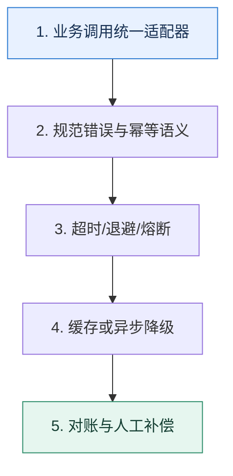

# 外部依赖｜把不可控接口包进可治理的边界

> 本课只解决一个问题：第三方接口慢、错、变更或不可压测时，自己的核心流程怎样保持可控？

这不是原页面的缩写，也不是一组孤立结论。下面先建立一个能推演的最小世界，再把状态、数字和失败分支摊开，最后按来源讲解顺序覆盖全部知识线索。读完后，你应当能从 `业务调用统一适配器` 一直解释到 `对账与人工补偿`，并说明中途任意一步失败会留下什么状态。

## 零基础入口：先建立本课的心智画面

第三方能力属于外部故障域。第一步是用适配器统一协议和错误语义，让业务代码不直接依赖供应商字段；第二步才是超时、重试、熔断和降级。

先不要急着记组件名。只抓住四个问题：**现在手里有什么输入？下一步只做什么动作？哪个状态发生变化？变化后的结果交给谁？** 之后遇到新框架，只要这四个答案不变，核心机制就没有变。

### 放进一个足够小、可以手算的世界

地址校验供应商 P99 为 800ms，而下单预算只有 500ms。可先使用本地规则完成基础校验并受理订单，把精确校验写入任务表异步执行；若发现异常再进入人工复核。这样不是假装第三方变快，而是重定义主流程对结果的依赖时机。

这个小世界故意只保留本课必需的对象。生产系统会有更多节点、线程、分片和异常，但数量增加不会改变这里的因果关系。先确认你能手算这个例子，再把数字替换成真实系统数据。

### 先预测，不要马上看结论

**为什么第三方返回超时后立即重试，可能比直接失败更危险？**

先写下自己的判断，并指出你依赖的前提。文末自我检查会揭示答案；如果答案不同，回到下面的状态表找出第一个分叉点。

## 本节精讲：让机制一步一步发生

客户端适配层应统一鉴权、序列化、错误码、幂等键和观测。只对明确可重试且幂等的失败做带抖动退避；对非关键结果可同步转异步，通过任务表或消息系统补偿。多供应商切换必须先解决语义差异、数据对账和切换条件。压测时用可配置桩模拟慢响应、错误比例和字段变更，不能直接冲击真实供应商。

### 可见状态推进

| 当前步 | 现在发生的动作 | 下一步拿到什么 |
| ---: | --- | --- |
| 1 | 业务调用统一适配器 | 规范错误与幂等语义 |
| 2 | 规范错误与幂等语义 | 超时/退避/熔断 |
| 3 | 超时/退避/熔断 | 缓存或异步降级 |
| 4 | 缓存或异步降级 | 对账与人工补偿 |
| 5 | 对账与人工补偿 | 得到可核对的终态 |

图只承担一个任务：让你看清状态如何向前移动。它不意味着每一步必然成功；网络超时、进程退出、重复执行和数据竞争都可能让箭头停在中间，因此后面必须继续讨论失效边界。

### 一次带数字的完整推演

地址校验供应商 P99 为 800ms，而下单预算只有 500ms。可先使用本地规则完成基础校验并受理订单，把精确校验写入任务表异步执行；若发现异常再进入人工复核。这样不是假装第三方变快，而是重定义主流程对结果的依赖时机。

数字不是装饰。它迫使我们回答容量、顺序、时间窗口或版本选择问题。若换一个数字就得出不同结论，真正的设计依据就是那个阈值，而不是某个中间件名称。

## 按讲解顺序重建知识链：完整来源讲解

下面按来源资料的教学顺序重新编排完整内容。转换页码、来源图片、推广信息、水印、角色化问答和只服务于技术讨论场景的话术已经删除；机制、算法、例子、反例、事故线索、评论补充和限制条件仍然保留。这里的作用是补齐知识覆盖，不取代前面的独立推演。

本节讨论一个跟微服务架构有很强关联的话题：如何保证调用第三方接口的可用性。

到目前为止，我们可以看到任何一个系统，都难免要跟第三方打交道。

登录注册要跟微信开放平台打交道，接入扫码登录。金融要跟银行打交道，比如结算。重要功能发验证码，要跟短信服务商打交道。人脸识别、身份认证也要跟供应商打交道。

所以早期我就注意到很多人的简历上都写了自己对接过这一类的 API。但是我还注意到大多数人对接这些 API 的时候只是简单实现了功能。换句话来说，就是完全没有考虑可用性和容错之类的问题。

实际上，调用第三方接口是一个非常常见的场景，技术评审者很容易理解，所以在工程复盘时你谈到这样的项目，很容易取得共鸣。而且你可以在上面应用非常多的微服务治理措施，和前面学过的内容形成呼应。

所以今天我就来和你深入讨论一下，如果你需要调用一些第三方接口，而你难以推动这个第三方接口的提供者做一些事情的时候，如何保证你的系统高可用。

### 先把机制拆开

正常来说，和第三方平台打交道的是一个独立的模块还是一个独立的服务，取决于你维护的是一个单体应用还是微服务应用。

对于自己系统内这样一个第三方模块或者第三方服务来说，它要解决的问题也很直观。

提供一个一致性抽象，屏蔽不同第三方平台 API 之间的差异。提供客户端治理，即提供调用第三方平台 API 的重试、限流等功能。提供可观测性支持。提供测试支持。

### 一致性抽象

这算是你这个模块或者服务最基本的目标。举个例子，如果你调用的是第三方支付平台，你们公司支持多种接入方式，包括微信支付、支付宝支付。

在这种情况下，业务方只希望调用你的某个接口，然后告诉你支付所需要的基本信息，比如说金额和方式。你这个接口的实现就能根据具体的支付方式发起调用，业务方完全不需要关心其中的任何细节。

这种一致性抽象会统一解决很多细节问题。比如不同的通信协议、不同的加密解密算法、不同的请求和响应格式、不同的身份认证和鉴权机制、不同的回调机制等等。这会带来两个好处。

1. 研发效率大幅提高，对于业务方来说他们不需要了解第三方的任何细节，所以他们接入一个第三方会是一件很简单的事情。
2. 高可扩展性，你可以通过扩展接口的方式轻松接入新的第三方，而已有的业务完全不会受到影响。
提供了一致性抽象之后，你就可以在这种一致性抽象上做很多事情，比如说客户端治理。

### 客户端治理

前面我们在讲熔断、降级、限流的时候，实际上都是在服务端或者网关进行的。那么这一次你就需要在客户端进行治理了。一般来说，客户端治理有两个关键措施：限流和重试。

就拿限流来说，大部分的第三方平台 API 为了保护自己的系统，是不允许你频繁发送请求的。比如说某些银行的接口只允许你一秒钟发送十个请求，多了就会拒绝服务。那么自然地，你其实可以在你发起调用之前就开启限流，这样就可以省去一次必然失败的调用。

另外一个重要的措施是重试。当你调用第三方平台超时的时候，业务方肯定不希望你直接返回超时响应，因为他们还要自己处理超时，比如说发起重试等。

所以你可以提供重试机制，并且可以对业务方保持透明。但你要小心的是，只有当第三方接口是幂等的时候你才能发起重试。

当你完成客户端治理之后，一般是不会出问题的。但万一业务出问题了怎么办？这时候你就需要可观测性支持，告诉你的业务方你的接口稳如泰山，把锅甩出去。

### 可观测性支持

第三方接口一般都不在你的控制范围内，所以你一定要做好监控，比如说接入 Prometheus和 SkyWalking 等工具。同时，你还要考虑提供便利的查询工具，让你自己和你的业务方都能够快速定位问题。

告警也是必不可少的。这些告警分成两类，一类是给你和你共同维护这个功能的同事使用的，另外一类是给业务方用的。例如，当监控系统发现第三方平台突然不可用了，那么它会发出两个告警，一个是告诉你出事了；另外一个则是通知业务方第三方平台目前不稳定，那么业务方就需要确认对他们业务的影响范围，以及他们是否需要启动一些容错措施。

可观测性做得好，定位和解决问题就会变得很简单。但是能不能进一步降低一点出问题的概率呢？

当然是可以的，你把测试支持做好，让你的业务方多测测，省得出了问题甩锅给你。

### 测试支持

测试支持的核心是你要提供 mock 服务。例如正常情况下，业务方调用你的接口，你会真的调用第三方 API。但是在测试环境下，你就要考虑返回 mock 响应。

如果第三方平台还有回调机制，并且你在收到回调之后还要通知业务方，那么你还需要模拟这个回调。比如说微信支付接口后面会回调你的一个接口，告知你支付结果。

使用 mock 服务有很多好处。

没有额外开支。比如说发短信之类的，短信是收费的，那么测试服务如果能避免真的发送短信，多少也能省一点。不受制于第三方平台。有些第三方平台的认证和鉴权机制非常复杂，在测试环境要发起一次调用几乎不可能，那么只能用 mock 服务。你可以返回业务方任何预期的响应，包括成功响应、失败响应，甚至于你还能返回模拟第三方平台超时的响应。

如果考虑到压测之类的问题，那么这个 mock 功能就更加必不可少了，毕竟第三方是不可能配合你做压测的。

### 把知识转成可验证的工程判断

如果你的业务需要和第三方平台打交道，那么你需要了解清楚以下信息。

你们是否构建了一个一致性的抽象，屏蔽了不同平台之间的差异？比如说你是和短信服务商打交道，如果你们公司决定换一家短信服务商，那么你需要做哪些事情，你的业务方能否不受影响？

第三方平台有没有治理措施？比如说有没有限流机制，如果有是怎么限流的，你有没有针对这个限流做对应的客户端限流？你有没有在和第三方打交道的时候引入重试机制，以及重试几次，重试间隔如何，如果重试最终都失败了怎么办？

技术讨论调用第三方这个话题的最佳策略就是将它包装成你整个系统可用性的关键一环。所以在技术评审者问到可用性相关内容的时候，或者直接问你是怎么和第三方打交道的时候，你就可以和他深入讨论这节课的内容。

### 基本思路

技术评审者有些时候不一定会想到要深入考察你和第三方打交道的内容，因为可能他们公司做得就比较差，所以你要考虑主动出击。这种主动出击和前面的熔断、降级、限流、超时控制差不多。比如说你在自我介绍或者在项目介绍的时候，强调一下你的系统是一个高可用的微服务架构。

我的系统对可用性要求非常高，为此我综合使用了熔断、限流、降级、超时控制等措施。并且，我这个系统还有一个特别之处，就是它需要和很多第三方平台打交道。所以要想保证系统的可用性，我就需要保证和第三方打交道是高可用的。

这种话术你已经在前面的内容里见过了。当你将自己的项目说成是高可用的项目的时候，那么技术评审者肯定会逮着你往死里问高可用，那么你就能将话题全方位展开，并且限定在自己熟悉的战场内。

比如当你们聊到了调用第三方的时候，你可以考虑采用这个话术来介绍你的做法，关键词是前后对比。

我在刚接手这个项目的时候，这一块的设计和实现不太行。总体来说可扩展性、可用性、可观测性和可测试性都非常差。为了解决这个问题，全方位提高系统的可扩展性、可用性、可观测性和可测试性，我做了比较大的重构。

1. 我重新设计了接口，提供了一个一致性抽象。（这里你可以补充你设计了哪些接口，然后强调一下效果）重构之后，研发效率提高了 30%，并且接入一个全新的第三方，也能对业务方做到完全没感知。
2. 我引入客户端治理措施，主要是限流和重试，并且针对一些特殊的第三方接口，我还设计了一些特殊的容错方案。
3. 我全方面接入了可观测性平台，包括 Prometheus 和 Skywalking，并且配置了告警。和原来比起来，现在能够做到快速响应故障了。
4. 我还进一步提供了测试工具，可以按照业务方的预期返回响应，比如说成功响应、失败响应以及模拟接口超时。针对压测，我也做了一些改进。

注意，在介绍任何一点的时候都要强调一下你最终取得的效果。这样能够凸显你在改进系统的时候是有计划的、成体系的。

另外这段话里面有一个地方你需要小心，就是研发效率提升 30%，这是我举例子说的，而现实中研发效率是很难衡量的。所以你可以换一种说法，用具体例子来说明研发效率的提高。

在重构之前，原本某个线上系统的 A 组要接入我们的接口，搞了大概一个星期。后面重构之后，B 组接入我们的接口，只用了两天。而且稳定性更好，Bug 更少。

类似地，在告警那里你也可以强调在你完成重构前后的对比。

早期我们调用第三方接口的时候，缺乏监控和告警，以至于只有等用户出现问题联系客服的时候，或者业务方发现我们出现故障报告过来的时候，我们才知道出问题了。后面我们接入了监控和告警之后，在第三方接口出问题的短时间内，就能得到通知，然后快速启动各种容错预案，并且通知业务方和第三方。

最后你要进一步总结和引导。

在任何跟第三方打交道的场景之下，都要考虑好第三方崩溃的时候自己的系统怎么容错。公司或者部门内部的调用出现问题了，还可以推动同事快速修复。但是第三方是推不动的，所以只能是我们调用者考虑容错。

这里我依旧是留了一个话柄，就等着技术评审者来问怎么容错，这也就是我在进阶推导方案里面写的前两点，你可以考虑选择其中符合你业务的来解释。

### 进一步推导：怎样把机制用进真实系统

这里我提供三个可以刷进阶推导的方向，分别是同步转异步、自动替换第三方和压测支持。你可以根据你的需要与技术讨论的情况，选择其中一两个。

### 同步转异步

在一些不需要立刻拿到响应的场景，如果你发现第三方已经崩溃了，你可以将业务方的请求临时存储起来。等后面第三方恢复了再继续调用第三方处理。这种方案一般用于对时效性要求不高的业务。比如业务方只是要求你上报数据，不要求你立刻成功，那么你就可以采用这种方案。

你可以仔细介绍你的容错方案，关键词就是同步转异步。

正常来说我们推送数据都是尽可能实时推过去，但是有些时候业务方推过来的数据太多，又或者第三方崩溃，那么我就会临时将数据存起来。后面第三方恢复过来了，再逐步将数据同步过去。这算是比较典型的同步转异步用法。

更进一步，你可以阐述对这个做法的进一步改进，关键词是解耦。

我们这种容错机制其实完全可以做成利用消息队列来彻底解耦的形式。在这种解耦的架构下，业务方不再是同步调用一个接口，而是把消息丢到消息队列里面。然后我们的服务不断消费消息，调用第三方接口处理业务。等处理完毕再将响应通过消息队列通知业务方。

那么这种解耦的方式和直接调用的方式合并在一起，其实就是正常我们系统对接业务方的两个方案。所以你可以再次总结拔高一下。

同步调用与异步解耦两种方式，可以看作是对接不同业务方的通用范式。一般而言但凡能异步解耦的，我绝不搞什么同步调用。

### 自动替换第三方

这种策略和我在负载均衡里面提到的有些类似，即调用一个第三方的接口失败的时候，你可以考虑换一个第三方。

举例来说，你们公司有 A、B、C 三个短信供应商。现在你在选择使用 A 的时候，发现 A 一直返回失败的响应，或者说响应时间很长，那么你就可以考虑自动切换到 B 上。

但是这种策略是受制于公司的情况的，大多数时候公司是没有这种可以切换的服务供应商的。早期我就听过某司使用的短信服务商服务异常，导致网站在一段时间内都无法发送验证码，引发了严重事故。所以你可以这样介绍你的方案，关键词是自动替换。

为了进一步提高可用性，降低因为第三方故障引起事故的概率，我在调用第三方这里引入了自动替换机制。我们本来有多个第三方，相互之间是可以替换的，于是我就做了一个简单的自动切换机制。当我发现第三方接口出现故障的时候，就会切换到一个新的第三方。

这里有一些技术评审者可能会追问的点。

1. 你怎么知道第三方出问题了？这个问题可以参考我们前面讲过多次的判断服务健康与否的方式，比如说用响应时间、错误率、超时率。那么自然可以将话题引导到熔断、降级、限流那边。
2. 如果全部可用的第三方都崩溃了怎么办？这种问题直接认怂就可以。因为一家出故障是小概率，多家同时出故障那就更是小概率事件了，在这种情况下你除了告警也没有别的办法了。也就是所谓的尽人事，听天命。
### 压测支持

每当你想搞压测的时候，你就会发现，所有的第三方接口都是压测路上的拦路虎。

正常来说，你不能指望第三方会配合你的压测。你可以设想，类似于微信之类的开放平台是不可能配合你搞什么压力测试的。甚至即便你是非常强硬的甲方，你想让乙方配合你做压力测试，也是不现实的。所以你只能考虑通过 mock 来提供压测支持。和正常的测试支持比起来，压测你需要做到三件事。

模拟第三方的响应时间。模拟触发你的容错机制。如果你采用了同步转异步这种容错机制，那么你需要确保在流量很大的情况下，你确实转异步了；如果你采用的是自动切换第三方，那你也要确保真的如同你设想的那样真的切换了新的第三方。流量分发。如果是在全链路压测的情况下，压测流量你会分发到 mock 逻辑，而真实业务请求你是真的调用第三方。

那么你在介绍你的测试支持的时候可以强调一下这个特性。

早期为了弄清楚服务的吞吐量和响应时间瓶颈，我搞过一些压测。但这些流量不能真的调用第三方，所以我为了解决压测这个问题，设计了两个东西。

一个是模拟第三方的响应时间。不过这种模拟是比较简单的，就是在代码里面睡眠一段时间，这段时间是第三方接口的平均响应时间加上一个随机偏移量计算得出的。另一个是在并发非常高的情况下，会触发我的容错机制。

而且我这里留好了接口，万一某个线上系统要做全链路压测了，我这边也可以根据链路元数据将压测流量转发到 mock 逻辑，而真实业务请求则会发起真实调用。

最后一段我是假设你并没有实际接触过全链路压测。如果你接触过，那么你就可以改成“你已经做到”，而不是“留好了接口”。

### 本节原始知识线索收束

这节课我们讨论了调用第三方平台接口如何保证可用性的问题。当你和第三方平台打交道的时候，要做到这四点：一致性抽象、客户端治理、可观测性支持和测试支持。同时在后面我进一步提供了同步转异步，自动替换第三方和压测支持三个进阶推导方案。

这节课的内容你也可以看作是我们前面讲的熔断、限流、降级和超时控制在一个具体场景下的综合运用。不管你们公司用不用得上这些治理手段，你都要自己去尝试一下，因为技术讨论需要你用上这些治理手段。不然你的整个项目经历平平无奇，那么连技术讨论的机会都难得，更加不要说给出有证据的判断了。

此外，在这节课还有一个点你需要额外注意，就是强调自己对研发效率的改进。研发效率是一个比较难量化的东西，所以你在工程复盘时要想办法说服技术评审者相信你确实提高了研发效率。

### 继续推演

最后你来思考 2 个问题。

你们公司有没有出现什么因为第三方服务不可用引发的故障？后面你们有没有设计什么改进方案？你的工作经历中有没有什么内容主要是提高同事研发效率的？如果有，你是怎么向技术评审者介绍这个项目并且让他相信你确实提高了研发效率的？

### 补充讨论与边界校准

#### 全部留言 (9)

补充讨论：

讲解补充：大佬！你们公司这个方面算是做得非常仔细了，比很多大厂做得还要仔细了。监控这部分，我是没想到还可以分析性价比，学到了！

补充讨论：

1. 你们公司有没有出现什么第三方服务不可用引发的故障？后面有没有设计什么改进方案？一个手机短信验证码登录的功能，遇到过因为短信服务商故障，导致系统有一个小时不能通过短信验证码登录。后续的改进方案就是引入另外一家短信服务商，并加入切换机制。
2. 你的工作经历中有没有什么内容是提高同事研发效率的？如果有，你是怎么向技术评审者介绍这个项目并让他相信确实提高了研发效率？做过一个流程引擎的功能。在企业软件开发中，流程审批是一个很常见的功能，流程也经常需要根据甲方要求做调整。

在引入流程引擎前，都是靠代码来实现流程的流转，代码中充斥着条件判断，混杂了业务逻辑和流程处理逻辑，很难看懂也很难进行流程调整。后来我引入了一套流程引擎，把流程和业务完全剥离开，代码变得更清爽，流程调整也变容易了。

讲解补充：1. 这边如果你要去技术讨论的话，就要搞清楚切换机制的细节，比如什么时候触发切换，会不会换回来，如果都失败了怎么办？有没有可能切换本身就失败了？是人手工切换还是自动切换？

2. 这其实就是我说的很难说清楚研发效率。从你的描述里面，我能够感觉到应该是有提高的，但是就不清楚你究竟做到了什么地步。举个例子，就是同样的系统，你是做到了页面拖拉拽就生成一个新流程，还是说要写一大堆配置？还是说需要提供新接口实现。也就是难以证明我究竟提高了多少。因此你这一段话比较欠缺说服力。
4

补充讨论：

讲解补充：没你想的那么难。压测这个就很难，因为第三方一般不会配合你做压测。你就可以用一个Mock 服务来替换第三方，然后只测试自己这一部分。

补充讨论：

讲解补充：日志 + prometheus + tracing，然后在类似 grafana 之类的框架里面配置好告警，

补充讨论：

1. 调用第三方的路由是通过配置规则来确定的，第三方不可用导致出现失败订单，通过故障自动切换来解决这个问题；2.提供统一抽象接口，封装基础组件。

讲解补充：赞！

2. 这个地方证据还是比较薄弱的，或者说你只说了自己做了什么，但是技术评审者看不出来效果。

补充讨论：

讲解补充：赶紧刷 KPI ！

补充讨论：

讲解补充：不是，是换实现。你可以理解为你有一个抽象地发送短信的接口，而后针对不同服务商有不同的实现。那么在实现层面上，比较简单的就是你用一个数组装着所有的实现，然后当一个调不通，你判定已经寄了的时候，就挪一下数组下标，用下一个实现。

3. 0的A7 2023-07-03 来自北京
1. 之前公司，有个同事操作不规范，查询把 公司阿里云的 redis 搞挂了，结果一连串服务都用不了了。改进方案是，打开了阿里云 redis 后台的一些个检测规则 ，其实正常是应该代码 review 的，这样就可以发现。还有现在公司，经常有个服务一发版，就导致别的服务不可用了，咱也不知道为啥。
2. 这个主要是写了写公共组件、平台给同事用。我主要是写了一个日至组件，通过该组件日志可以输出到指定位置，然后通过 filebeat kafka es 进行收集展示，用户还可以进行设置指定级别的日志告警，保证业务出错第一时间发现。还写了一个平台，吧啦吧啦

讲解补充：1. 是的，正常来说，应该是走变更流程，代码 review，能避免很多问题。不过之前我们出现过的大对象，那就真的是没有预料到，因为从代码上是看不出来这里会有大对象，然后寄了。

2. 你这里如果出去技术讨论还是可以深入讨论你的平台是怎么设计的，

补充讨论：

讲解补充：1. 打个比方，正常的调用方向是 A 调用 B，那么回到就是 B 反过来调用 A。比如说，A 调用了 B 之后，B 没有立刻给出响应，而是过了一段时间之后，B 再调用 A 的一个接口告诉了 A 响应。在微信平台里面，你支付成功之后，微信会回调你的接口，告诉你结果。

2. 这个你询问第三方接口就可以，一般他们都需要告诉你的。你也可以在研发阶段试试同一个请求过去会发生什么。
3. 有些公司会一起使用。它们的侧重点不同，正常来说，一家公司里面 metrics 类的监控和 tracing类的监控就是两个工具。从采集的数据上来说，它们会有一部分重复，但是问题并不大。
4. 异步处理也可以有超时，比如说 A 调用 B，B 说一小时以内给你处理完，一小时没处理完，那么 B就要告诉 A 超时了。异步超时一般是走回调通知机制。

## 把完整讲解收束成一条因果链

1. 先建立一致性抽象，把不同供应商包装成稳定的内部契约。
2. 在客户端侧加入超时、限流、重试和熔断，但只对安全操作启用。
3. 补齐调用量、延迟、错误类型和业务结果的观测，不只看 HTTP 成功率。
4. 用同步转异步、多供应商和压测桩处理不可控依赖，同时保留对账与回补。

把这几步连接起来时，不要省略“为什么”。最终结论只有在前提、状态变化和失败代价都说得清楚时才可靠。

## 误区与失效边界

重试不是默认安全动作。支付、发券等写接口如果没有幂等键，超时后重试可能重复执行。自动切换供应商也不保证结果等价，必须验证字段、精度和合规边界。

再加一条通用但必须落实到本课对象上的边界：机制只能处理它看得见的信号。若输入指标失真、状态没有持久化、错误被吞掉，或者补偿没有幂等保护，再成熟的框架也只能基于错误证据作决定。

### 三种故障注入方式

| 故障 | 要观察什么 | 不能接受的解释 |
| --- | --- | --- |
| 在第 2 步前让依赖超时 | 是否停在可重试状态，是否消耗完上游预算 | “框架稍后会处理” |
| 在状态写入后让进程退出 | 重启后能否识别已完成与待继续动作 | “再执行一次应该没事” |
| 对同一输入并发执行两次 | 是否出现重复副作用、顺序颠倒或覆盖 | “概率很低” |

## 工程验证：把理解变成可以复查的证据

故障注入矩阵：延迟 2 秒、连续 500、响应成功但字段缺失、请求超时但实际成功、供应商配额耗尽。逐项写出主流程结果、重试行为、补偿入口和告警。

| 步骤 | 状态或动作 | 最少应留下的证据 |
| ---: | --- | --- |
| 1 | 业务调用统一适配器 | 开始时间、结束时间、输入标识、结果状态、异常原因 |
| 2 | 规范错误与幂等语义 | 开始时间、结束时间、输入标识、结果状态、异常原因 |
| 3 | 超时/退避/熔断 | 开始时间、结束时间、输入标识、结果状态、异常原因 |
| 4 | 缓存或异步降级 | 开始时间、结束时间、输入标识、结果状态、异常原因 |
| 5 | 对账与人工补偿 | 开始时间、结束时间、输入标识、结果状态、异常原因 |

验证时同时记录成功路径和失败路径。只证明“正常时能跑通”不能说明设计可靠；至少要让一次超时、一次进程退出和一次重复请求可重现，并能根据日志或指标解释最后状态。

## 学完检查：闭卷画出本课

你现在应该能独立完成四件事：

1. 用自己的话说出本课唯一问题，不使用产品名也能解释。
2. 复算上面的具体例子，并指出哪个输入改变会让结论改变。
3. 沿 Mermaid 图注入一次失败，预测系统停在哪里以及由谁收敛。
4. 说出本课机制不保证什么，并给出一个反例。

## 自我检查

为什么第三方返回超时后立即重试，可能比直接失败更危险？

超时意味着结果未知，不代表操作未执行。若接口有副作用且缺少幂等键，重试会产生重复支付、重复发券等问题。

怎样证明自己不是只记住了名词？

把 `业务调用统一适配器` 的一个真实输入写出来，逐步记录到 `对账与人工补偿`。然后在中间任意一步制造失败；如果你能解释当前状态、下一责任方、可观测证据和恢复边界，就已经拥有可以迁移的工程模型。

## 来源与事实校准

- [查看完整来源稿（本地 21 页资料）](../content/08-third-party-calls.md)

### 当前事实校准

Resilience4j Retry 允许按返回结果、异常类型和尝试次数决定是否重试；官方配置里的最大尝试次数包含首次调用。这只是调用策略，不会自动赋予写操作幂等性。第三方写请求在重试前仍必须有幂等键、状态查询或补偿协议。

- [Resilience4j · Retry](https://resilience4j.readme.io/docs/retry)
- [Resilience4j · TimeLimiter](https://resilience4j.readme.io/docs/timeout)

来源稿用于核对覆盖范围，不随公开站点发布。产品默认值和具体内部行为可能随版本变化；落地时应使用目标版本的官方文档、可运行实验和故障演练校准。本学习稿中的零基础入口、状态推演、故障矩阵和工程验证属于编辑补充，不冒充来源讲解者的原话。
