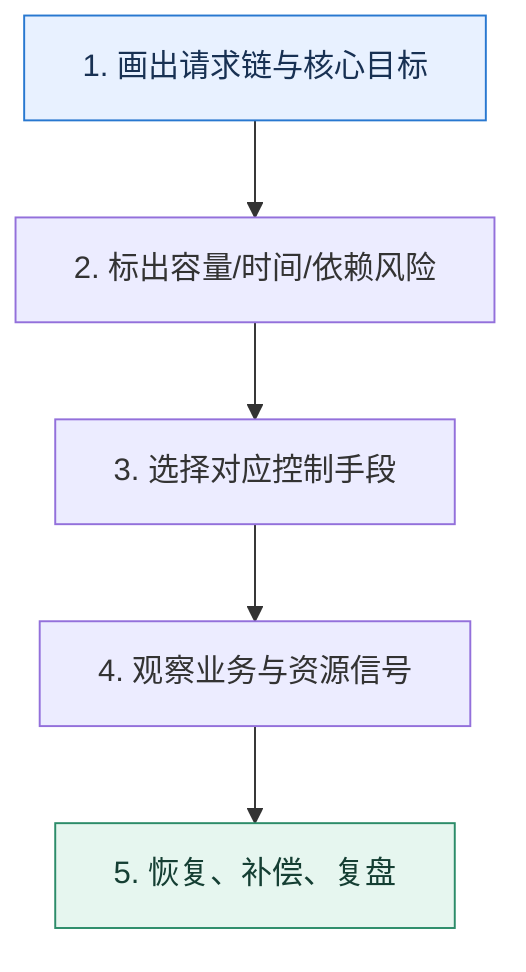

# 服务治理专题复盘｜从一次故障串起九个控制手段

> 本课只解决一个问题：面对一次“流量突增叠加下游抖动”的事故，怎样按因果顺序选择治理手段？

这不是原页面的缩写，也不是一组孤立结论。下面先建立一个能推演的最小世界，再把状态、数字和失败分支摊开，最后按来源讲解顺序覆盖全部知识线索。读完后，你应当能从 `画出请求链与核心目标` 一直解释到 `恢复、补偿、复盘`，并说明中途任意一步失败会留下什么状态。

## 零基础入口：先建立本课的心智画面

复盘时不要按组件名字逐个背。先画请求从入口到依赖的路径，再标出流量、时间、资源和状态四种约束，治理动作自然会落在对应位置。

先不要急着记组件名。只抓住四个问题：**现在手里有什么输入？下一步只做什么动作？哪个状态发生变化？变化后的结果交给谁？** 之后遇到新框架，只要这四个答案不变，核心机制就没有变。

### 放进一个足够小、可以手算的世界

假设营销活动使流量涨 5 倍，第三方风控同时 P99 升到 3 秒。先按可承载 QPS 拒绝超额流量；VIP 与普通流量分池；风控调用 300ms 截止，超时订单进入人工复核；错误窗口触发熔断；恢复后半开探测；整个过程用订单受理率而不是 HTTP 200 率评估。

这个小世界故意只保留本课必需的对象。生产系统会有更多节点、线程、分片和异常，但数量增加不会改变这里的因果关系。先确认你能手算这个例子，再把数字替换成真实系统数据。

### 先预测，不要马上看结论

**事故中数据库连接池已满，为什么先调大网关超时通常会让情况更差？**

先写下自己的判断，并指出你依赖的前提。文末自我检查会揭示答案；如果答案不同，回到下面的状态表找出第一个分叉点。

## 本节精讲：让机制一步一步发生

入口过量由限流控制；不同租户争抢由隔离控制；每跳等待由超时预算控制；下游连续失败由熔断止损；核心路径资源不足由降级释放；节点变化由服务发现同步；节点选择由负载均衡反馈；外部供应商由适配层和补偿包围。所有动作最后汇入观测、恢复和变更治理。

### 可见状态推进

| 当前步 | 现在发生的动作 | 下一步拿到什么 |
| ---: | --- | --- |
| 1 | 画出请求链与核心目标 | 标出容量/时间/依赖风险 |
| 2 | 标出容量/时间/依赖风险 | 选择对应控制手段 |
| 3 | 选择对应控制手段 | 观察业务与资源信号 |
| 4 | 观察业务与资源信号 | 恢复、补偿、复盘 |
| 5 | 恢复、补偿、复盘 | 得到可核对的终态 |

图只承担一个任务：让你看清状态如何向前移动。它不意味着每一步必然成功；网络超时、进程退出、重复执行和数据竞争都可能让箭头停在中间，因此后面必须继续讨论失效边界。

### 一次带数字的完整推演

假设营销活动使流量涨 5 倍，第三方风控同时 P99 升到 3 秒。先按可承载 QPS 拒绝超额流量；VIP 与普通流量分池；风控调用 300ms 截止，超时订单进入人工复核；错误窗口触发熔断；恢复后半开探测；整个过程用订单受理率而不是 HTTP 200 率评估。

数字不是装饰。它迫使我们回答容量、顺序、时间窗口或版本选择问题。若换一个数字就得出不同结论，真正的设计依据就是那个阈值，而不是某个中间件名称。

## 按讲解顺序重建知识链：完整来源讲解

下面按来源资料的教学顺序重新编排完整内容。转换页码、来源图片、推广信息、水印、角色化问答和只服务于技术讨论场景的话术已经删除；机制、算法、例子、反例、事故线索、评论补充和限制条件仍然保留。这里的作用是补齐知识覆盖，不取代前面的独立推演。

恭喜你学完第一章的内容，终于到了要验收成果的时刻了。微服务这一章的内容很多，而且知识点之间盘根错节，记忆起来并不容易，所以为了帮助你更好地掌握这部分内容，我们在这里设置了工程问题。

你在解释的时候，最好是能够写成一个文档，至少也要口头上说一遍。千万不要只在脑海里面回忆一遍。因为在真正技术讨论的时候，脑海中的记忆到嘴里说出的话，还需要一个转换。

此外，在解释的时候你可以从以下几个角度来评估自己的解释：

在技术讨论前有没有想好自己要打造什么人设？你的解释有没有围绕这个人设进行？当你看到一个问题的时候，你能不能瞬间想到可以怎么刷进阶推导？怎么引导技术评审者？有没有在解释中留下足够的引导话术？有没有在我准备的解释基础上，糅合自己的项目经历，打造独一无二的解释？

我希望你可以通过我给你列出的这些问题，回想起我教给你的那些方案，真正地掌握这部分内容，下面我们开始通关吧！

### 整体性问题

✨什么是微服务架构？

✨怎么保证微服务架构的高可用？

还有下面这些问题，横跨了多个主题，可以从不同的角度解释。

✨怎么判定服务是否已经健康？

✨如果服务不健康该怎么办？

✨怎么判定服务已经从不健康状态恢复过来了？

✨听你说你用到了 Redis 作为缓存，如果你的 Redis 崩溃了会怎么样？

✨听你说你用到了 Kafka 作为消息队列，如果你的 Kafka 崩溃了怎么办？

✨现在需要设计一个开放平台，即提供接口给合作伙伴用，你觉得需要考虑一些什么问题？

### 01｜服务注册与发现：注册中心应该选 AP 还是 CP？

🔍什么是注册中心？

🔍服务注册与发现机制的基本模型是怎样的？

🔍服务上线与服务下线的步骤是什么？

🔍注册中心选型需要考虑哪些因素？

🔍你为什么使用 Zookeeper/Nacos/etcd 作为你的注册中心？

🔍什么是 CAP?

🔍在服务注册与发现里面你觉得应该用 AP 还是 CP？

🔍如何保证服务注册与发现的高可用？

🔍服务器崩溃，如何检测？

🔍客户端容错的措施有哪些？

🔍注册中心崩溃了怎么办？

🔍注册中心怎么判断服务端已经崩溃了？

### 02｜负载均衡：调用结果、缓存机制怎么影响负载均衡的？

⚖你了解负载均衡算法吗？

⚖静态负载均衡算法和动态负载均衡算法的核心区别是什么？

⚖轮询与随机负载均衡算法有什么区别？

⚖你了解平滑的加权轮询算法吗？

⚖如何根据调用结果来调整负载均衡效果？

⚖为什么有些算法要动态调整节点的权重？权重究竟代表了什么？

⚖你们公司的算法有没有调整过权重？为什么？

⚖最快响应时间负载均衡算法有什么缺点？

⚖如果我现在有一个应用，对内存和 CPU 都非常敏感，你可以针对这个特性设计一个负载均衡算法吗？

⚖为什么使用轮询、加权轮询、随机之类的负载均衡算法，系统始终会出现偶发性的流量不均衡，以至于某台服务器出故障的情况？怎么解决这一类问题？

### 03｜熔断：熔断 - 恢复 - 熔断 - 恢复，抖来抖去怎么办？

🔥为什么说熔断可以提高系统的可用性？

🔥如何判断节点的健康状态，需要看哪些指标？

🔥触发熔断之后，该熔断多久？

🔥响应时间超过多少应该触发熔断？

🔥响应时间超过阈值就一定要触发熔断吗？

🔥怎么避免偶发性超过阈值的情况？

🔥服务熔断后如何恢复？

🔥产生抖动的原因，以及如何解决抖动问题？

### 04｜降级：为什么每次大促的时候总是要把退款之类的服务停掉？

🤚什么时候会用到降级，请举例说明？

🤚降级有什么好处？

🤚跨服务降级常见的做法是什么？

🤚你怎么评估业务服务的重要性？或者说，你怎么知道 A 服务比 B 服务更加重要？

🤚请说一说服务内部常见的降级思路。

🤚怎么判断哪些服务需要降级？

🤚触发降级之后，应该保持在降级状态多久？

🤚服务降级之后如何恢复，如何保证恢复过程中不发生抖动？

🤚你们公司的产品首页是如何保证高可用的？

### 05｜限流：别说算法了，就问你阈值怎么算？限流的目的是什么？

🏁限流算法都包括哪些？

🏁不同的限流算法怎么选？

🏁限流的对象应该如何选择？

🏁怎么确定流量的阈值？

🏁如何应对突发流量？

🏁被限流的请求会被怎么处理？

🏁为什么使用了限流，系统还是有可能崩溃？

🏁我们有一个功能，对于普通用户来说，一些接口需要限制在每分钟不超过 10 次，整天不能超过 1000 次；VIP 用户不限制。你怎么解决这个问题？

### 06｜隔离：怎么保证尊贵的 VIP 用户体验不受损？

🤝什么是隔离，你用来解决什么问题？

🤝你了解哪些隔离策略？你用过哪些？

🤝当某个服务崩溃的时候，你有什么办法保证其它服务不受影响？

🤝在使用线程池、连接池和协程池的时候，怎么避免业务之间相互影响？

### 07｜超时控制：怎么保证用户一定能在 1s 内拿到响应？

🕙为什么要做超时控制？

🕙为什么缺乏超时控制有可能引起连接泄露、线程泄露？

🕙什么是链路超时控制？

🕙如何确定超时时间？

🕙怎么在链路中传递超时时间？

🕙超时时间传递的是什么？

🕙如何计算网络传输时间？

🕙什么是时钟同步问题？

🕙客户端和服务端谁来监听超时？

🕙超时之后能不能中断业务？怎么中断？

### 08｜调用第三方：下游的接口不稳定性能又差怎么办？

🌊如何保证调用第三方接口的可用性？

🌊如果在出错的时候你会切换不同的第三方，但是如果全部第三方换一遍之后都崩溃了，怎么办？

🌊调用第三方接口出错的时候，你是怎么重试的？重试次数和重试间隔你是怎么确定的？

🌊你怎么判定第三方服务已经非常不可用，以至于要切换一个新的第三方服务了？

🌊对时效性要求不高的接口，你可以怎么优化架构？

🌊在压力测试一个接口的时候，如果这个接口依赖了一个第三方接口，你怎么解决？

🌊公司业务依赖一个非常关键的第三方依赖，我要怎么保证我在调用第三方的时候不出错？

### 一图懂

### 补充讨论与边界校准

#### 全部留言 (5)

补充讨论：

讲解补充：怕什么，这些技术评审者也知道你不是主要负责人。你在工程复盘时强调自己考察调研过公司的各种基础设施，确认了各种高可用方案就可以了。大部分人出去技术讨论是说不清楚的，你能说清楚就是优势了

3

Jason Ding 2023-08-30 来自上海上面的问题有答案嘛？

讲解补充：比较简单的问题，这个专栏倒是没有。比如一些基本概念的题目，只是帮助大家梳理一下技术评审者可能出题的思路。

补充讨论：

讲解补充：我咔嚓手写了之后，我再顺手手写一个 lua 版用于 Redis 的，再嘲讽一下开源的用 Redis限流各种并发问题，然后收工回家，hhhh。字节的话，应该是 Go 语言写？Go 语言里面用 Channel 写令牌桶和漏桶特别简单。

补充讨论：

讲解补充：对于校招来说，一般的要求是你需要掌握它的基本理论，也就是从服务注册与发现到服务治理的整个东西。大厂还会额外要求由微服务架构衍生出来的微服务网关之类的话题。如果你想要赢得竞争优势，最好是有在微服务架构上工作的经验。当然，微服务架构本身就是分布式系统，所以你肯定得知道分布式系统的基本理论。校招主打的还是一个八股文背好，对你在实践上的要求不会很高。

补充讨论：

讲解补充：加油加油！

## 把完整讲解收束成一条因果链

1. 先回答系统的核心可用目标和允许牺牲的功能。
2. 沿请求链检查节点发现与选择，避免流量继续进入坏节点。
3. 再检查限流、隔离、超时、熔断、降级能否形成互补而非重复。
4. 最后把第三方、恢复放量、数据补偿和变更流程纳入同一份事故时间线。

把这几步连接起来时，不要省略“为什么”。最终结论只有在前提、状态变化和失败代价都说得清楚时才可靠。

## 误区与失效边界

专题串联不是“一次接入所有治理组件”。若没有明确风险，额外中间层会增加延迟和故障点。每个动作都要能指向一个已观察或已演练的失败模式。

再加一条通用但必须落实到本课对象上的边界：机制只能处理它看得见的信号。若输入指标失真、状态没有持久化、错误被吞掉，或者补偿没有幂等保护，再成熟的框架也只能基于错误证据作决定。

### 三种故障注入方式

| 故障 | 要观察什么 | 不能接受的解释 |
| --- | --- | --- |
| 在第 2 步前让依赖超时 | 是否停在可重试状态，是否消耗完上游预算 | “框架稍后会处理” |
| 在状态写入后让进程退出 | 重启后能否识别已完成与待继续动作 | “再执行一次应该没事” |
| 对同一输入并发执行两次 | 是否出现重复副作用、顺序颠倒或覆盖 | “概率很低” |

## 工程验证：把理解变成可以复查的证据

复盘练习：画一张时间线，至少标出 `流量变化、第一条告警、第一次自动动作、核心指标最低点、恢复开始、补偿完成`。每个治理手段必须能落到一个时间点。

| 步骤 | 状态或动作 | 最少应留下的证据 |
| ---: | --- | --- |
| 1 | 画出请求链与核心目标 | 开始时间、结束时间、输入标识、结果状态、异常原因 |
| 2 | 标出容量/时间/依赖风险 | 开始时间、结束时间、输入标识、结果状态、异常原因 |
| 3 | 选择对应控制手段 | 开始时间、结束时间、输入标识、结果状态、异常原因 |
| 4 | 观察业务与资源信号 | 开始时间、结束时间、输入标识、结果状态、异常原因 |
| 5 | 恢复、补偿、复盘 | 开始时间、结束时间、输入标识、结果状态、异常原因 |

验证时同时记录成功路径和失败路径。只证明“正常时能跑通”不能说明设计可靠；至少要让一次超时、一次进程退出和一次重复请求可重现，并能根据日志或指标解释最后状态。

## 学完检查：闭卷画出本课

你现在应该能独立完成四件事：

1. 用自己的话说出本课唯一问题，不使用产品名也能解释。
2. 复算上面的具体例子，并指出哪个输入改变会让结论改变。
3. 沿 Mermaid 图注入一次失败，预测系统停在哪里以及由谁收敛。
4. 说出本课机制不保证什么，并给出一个反例。

## 自我检查

事故中数据库连接池已满，为什么先调大网关超时通常会让情况更差？

更长等待会让更多请求和线程滞留，继续占用连接及内存。应先减少进入量、隔离或降级，再定位并扩展真实瓶颈。

怎样证明自己不是只记住了名词？

把 `画出请求链与核心目标` 的一个真实输入写出来，逐步记录到 `恢复、补偿、复盘`。然后在中间任意一步制造失败；如果你能解释当前状态、下一责任方、可观测证据和恢复边界，就已经拥有可以迁移的工程模型。

## 来源与事实校准

- [查看完整来源稿（本地 9 页资料）](../content/09a-mock-service-governance.md)

### 当前事实校准

故障分析里的日志、指标和链路追踪是互补证据：指标说明异常从何时开始、影响多大，链路追踪定位慢或错在哪一跳，日志解释该跳内部发生了什么。工具只能提供观测记录，根因仍需要通过时间线、对照实验和修复后的指标回落来证明。

- [OpenTelemetry · Traces](https://opentelemetry.io/docs/concepts/signals/traces/)
- [Prometheus · Querying basics](https://prometheus.io/docs/prometheus/latest/querying/basics/)

来源稿用于核对覆盖范围，不随公开站点发布。产品默认值和具体内部行为可能随版本变化；落地时应使用目标版本的官方文档、可运行实验和故障演练校准。本学习稿中的零基础入口、状态推演、故障矩阵和工程验证属于编辑补充，不冒充来源讲解者的原话。
