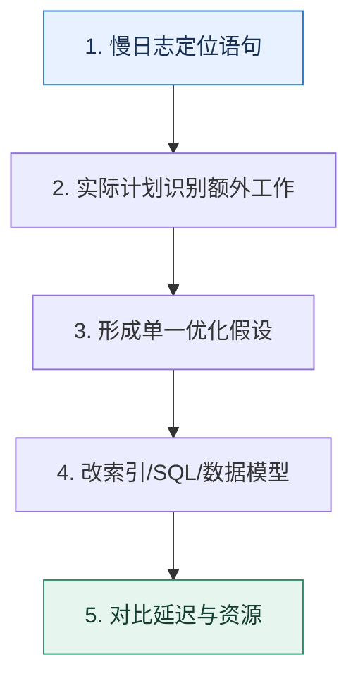

# SQL 优化｜先定位多做了什么，再减少扫描、排序与回表

> 本课只解决一个问题：一条 SQL 很慢时，怎样从证据而不是猜测开始优化？

这不是原页面的缩写，也不是一组孤立结论。下面先建立一个能推演的最小世界，再把状态、数字和失败分支摊开，最后按来源讲解顺序覆盖全部知识线索。读完后，你应当能从 `慢日志定位语句` 一直解释到 `对比延迟与资源`，并说明中途任意一步失败会留下什么状态。

## 零基础入口：先建立本课的心智画面

SQL 延迟由解析、等待、访问路径、行处理、排序/聚合、网络返回共同组成。执行计划是优化器的估算，慢日志和实际执行统计才是结果。

先不要急着记组件名。只抓住四个问题：**现在手里有什么输入？下一步只做什么动作？哪个状态发生变化？变化后的结果交给谁？** 之后遇到新框架，只要这四个答案不变，核心机制就没有变。

### 放进一个足够小、可以手算的世界

订单表查询某商户最近 20 条已支付订单：`WHERE merchant_id=? AND status='paid' ORDER BY created_at DESC LIMIT 20`。索引只有 `merchant_id` 时要读取大量行再过滤排序；建立 `(merchant_id,status,created_at DESC)` 后可直接从小范围按序取 20 条。若还返回大字段，可能仍需回表。

这个小世界故意只保留本课必需的对象。生产系统会有更多节点、线程、分片和异常，但数量增加不会改变这里的因果关系。先确认你能手算这个例子，再把数字替换成真实系统数据。

### 先预测，不要马上看结论

**为什么 `type=range` 且 `key` 非空仍可能是一条坏计划？**

先写下自己的判断，并指出你依赖的前提。文末自我检查会揭示答案；如果答案不同，回到下面的状态表找出第一个分叉点。

## 本节精讲：让机制一步一步发生

先确认慢在数据库还是连接等待；再看扫描行数、返回行数、索引、临时表和排序；随后只改变一个变量，比较执行时间与资源。常见优化包括把过滤条件推到更早位置、建立覆盖索引、让排序顺序匹配索引、用游标替代深 offset、缩小返回列。COUNT、HAVING 和索引提示都应根据语义与数据分布验证，不能机械改写。

### 可见状态推进

| 当前步 | 现在发生的动作 | 下一步拿到什么 |
| ---: | --- | --- |
| 1 | 慢日志定位语句 | 实际计划识别额外工作 |
| 2 | 实际计划识别额外工作 | 形成单一优化假设 |
| 3 | 形成单一优化假设 | 改索引/SQL/数据模型 |
| 4 | 改索引/SQL/数据模型 | 对比延迟与资源 |
| 5 | 对比延迟与资源 | 得到可核对的终态 |

图只承担一个任务：让你看清状态如何向前移动。它不意味着每一步必然成功；网络超时、进程退出、重复执行和数据竞争都可能让箭头停在中间，因此后面必须继续讨论失效边界。

### 一次带数字的完整推演

订单表查询某商户最近 20 条已支付订单：`WHERE merchant_id=? AND status='paid' ORDER BY created_at DESC LIMIT 20`。索引只有 `merchant_id` 时要读取大量行再过滤排序；建立 `(merchant_id,status,created_at DESC)` 后可直接从小范围按序取 20 条。若还返回大字段，可能仍需回表。

数字不是装饰。它迫使我们回答容量、顺序、时间窗口或版本选择问题。若换一个数字就得出不同结论，真正的设计依据就是那个阈值，而不是某个中间件名称。

## 按讲解顺序重建知识链：完整来源讲解

下面按来源资料的教学顺序重新编排完整内容。转换页码、来源图片、推广信息、水印、角色化问答和只服务于技术讨论场景的话术已经删除；机制、算法、例子、反例、事故线索、评论补充和限制条件仍然保留。这里的作用是补齐知识覆盖，不取代前面的独立推演。

本节讨论数据库中的 SQL 优化。

一般而言，在技术讨论过程中，我都是鼓励你尽可能为自己打造熟练掌握性能优化技巧的人设。高并发项目经验可遇不可求，但是高性能是可以勉强追求的，性能优化就是追求高性能的方法。和我在微服务里面讲到的高可用相结合，你在写简历、自我介绍和技术讨论过程中，可以有意识地展示自己在高可用和高性能方面的知识和积累。

而 SQL 优化是性能优化中最平易近人、最好准备的点。所以今天我们就来学习一下 SQL 优化的多种方案。

### 先把机制拆开

SQL 优化可以看作是一个更大的主题“数据库优化”下的一个子议题。数据库优化主要包含以下内容：

硬件资源优化：换更大更强的机器。操作系统优化：调整操作系统的某些设置。服务器 / 引擎优化：也就是针对数据库软件本体进行优化，比如说调整事务隔离级别。在MySQL 里面还可以针对不同的引擎做优化，比如说调整 InnoDB 引擎的日志刷盘时机。SQL 优化：针对的就是 SQL 本身了。

如果站在数据库的角度，那么 SQL 优化就是为了达到两个目标。

1. 减少磁盘 IO，这个又可以说是尽量避免全表扫描、尽量使用索引以及尽量使用覆盖索引。
2. 减少内存 CPU 消耗，这一部分主要是尽可能减少排序、分组、去重之类的操作。
这部分知识你只需要有一个概念就可以，在工程复盘时倒是不经常用到。SQL 优化是一个实践为主的技术讨论主题，很少讨论这种纯理论的内容。

如果想要知道你优化后的效果，就需要掌握一个工具，就是 EXPLAIN 命令。

### EXPLAIN 命令

应该说，每一个后端研发都应该掌握 EXPLAIN 命令。EXPALIN 命令的大概用法是 EXPLAIN your_sql，然后数据库就会返回一个执行计划。

执行计划有很多字段，我把最关键的地方列出来，你在工程复盘时只需要记住这几个就可以了。

1. type：指的是查询到所需行的方式，从好到坏依次是 system > const > eq_ref > ref >range > index > ALL。
system 和 const 都可以理解为数据库只会返回一行数据，所以查询时间是固定的。eq_ref 和 ref 字面意思是根据索引的值来查找。range：索引范围扫描。index：索引全表扫描，也就是扫描整棵索引。ALL：全表扫描，发起磁盘 IO 的那种全表扫描。

2. possible_keys：候选的索引。
3. key：实际使用的索引。
4. rows：扫描的行数。数据库可能扫描了很多行之后才找到你需要的数据。
5. filtered：查找到你所需的数据占 rows 的比例。
在实践中，没有必要将这些东西都死记硬背下来。等你要解读 EXPLAIN 的返回结果的时候，再去搜索一下就行了。

一般优化 SQL 都是在 EXPLAIN 查看执行计划、尝试优化两个步骤之间循环往复，直到发现SQL 性能达标。

### 选择索引列

设计索引的时候，列的选择非常关键，但是目前来说并没有特别统一的说法。你可以参考以下规则。

外键，一般都会用于关联、过滤数据，所以正常来说都会为表的外键创建索引。频繁出现在 WHERE 中的列，主要是为了避免全表扫描。频繁出现在 ORDER BY 的列，这是为了避免数据库在查询出来结果之后再次排序。频繁出现在关联查询的关联条件中的列。不过一般我们都不建议使用关联查询，所以几乎可以忽略这个。区分度很高的列。比如每一行的数据都不同的列，并且在创建组合索引的时候，区分度很高的列应该尽可能放到左边。

### 大表表定义变更

优化 SQL 很多手段都是围绕索引来进行的。比如后面我给出的案例要么是修改已有的索引，要么是加索引。但在修改索引的时候，数据量大的表修改索引和数据量小的表修改索引，实施方案是完全不一样的。

修改索引或者说表定义变更的核心问题是数据库会加表锁，直到修改完成。

所以当你发现你的 MySQL 性能不行了，准备新加一个索引的时候，如果这个表的数据很多，那么在你执行加索引的命令的时候，整张表可能都会被锁住几分钟甚至几个小时。

可见大表表结构变更是一件很麻烦的事情，一般可以考虑的方案有 3 种。

1. 停机变更，就是把业务停下来，然后更新表结构。如果做得更加精细一点，那么就可以说只把和这个表有关的功能下线，但不需要将整个服务或者系统下线。
2. 在业务低谷变更，比停机更新好一点，但是业务依旧受到了影响。而且万一你以为在低谷能完成变更，结果并没有，那么你就面临着业务在高峰期也不能用的问题。
3. 创建新表，这是不停机又不想业务受到影响的方案。具体来说就是创建一张新表，这张新表就是你准备用的新的表定义。然后将旧表的数据迁移过去，我们在后面会专门讨论数据迁移方案。

### 把知识转成可验证的工程判断

你需要准备很多个 SQL 优化的案例，这些案例可以体现你对 SQL 和数据库底层不同技术点的理解。为此你需要收集和整理好一些信息：

你维护的业务的所有表结构定义（包含索引定义），每张表上执行最频繁的三个 SQL 是否用到了索引。公司内部曾经或者已有的慢 SQL 是怎么发现、分析和优化的。然后要记住 SQL 优化前后的执行时间，以凸显优化的效果。每一个 SQL 优化案例你都要考虑清楚技术评审者如果要深挖，那么会朝着什么方向深挖。

整体上来说，SQL 优化的手段是非常多而且非常细碎的。但是在技术讨论中，你不需要全部掌握。你只需要在技术讨论前精心设计一下你在整个 SQL 优化里面的技术讨论节奏就可以了。

当技术评审者问到这些问题的时候，你都可以将话题引导到 SQL 优化中。

你是否做过性能优化？接口的响应时间是多少？有没有优化的空间？你是否了解索引？是否用过索引？

还有一种比较罕见的技术讨论方式是技术评审者会要求你手写 SQL。手写之后，技术评审者会进一步考察在特定的一些场景下，你的 SQL 是否会有问题。记住，但凡让你手写 SQL 的题目，你都要谨慎考虑 SQL 有没有改进的空间。

### 基本思路

技术讨论 SQL 优化的最佳策略就是把它作为自己全方面优化系统性能的一个举措。你可以考虑这样说：

某某系统是一个核心系统，对性能有很高的要求。为了让服务的响应时间降低到 100ms 以内，我做了很多性能优化的事情，比如 SQL 优化。

如果你这个系统同时还要求高可用，那么你就将高可用和性能优化融合在一起。

某某系统是一个核心系统，对可用性和性能都有很高的要求。公司对可用性的要求是希望能达到三个九，平均响应时间控制在 100ms 内。

接下来技术评审者就会问一些具体的措施。比如说他可能会问：“你是怎么优化你的 SQL 查询的？”那么你可以这样解释。

某个线上系统有 SQL 的慢查询监控，当我们发现接口响应时间比较差的时候，就会去排查 SQL的问题。我们主要是使用 EXPLAIN 命令来查看 SQL 的执行计划，看看它有没有走索引、走了什么索引、是否有内存排序、去重之类的操作。

初步判定了问题所在之后，我们尝试优化，包括改写 SQL 或者修改、创建索引。之后再次运行 SQL 看看效果。如果效果不好，就继续使用 EXPLAIN 命令，再尝试修改。如此循环往复，直到 SQL 性能达到预期。

你可以用你实际接触过的案例补充说明一下。

如果案例中涉及到了变更表结构定义、增加索引或者修改索引，那么技术评审者就可能问你怎么找出合适的列来创建索引，以及在大表里面怎么变更表结构。

如果技术讨论的内容比较基础，那么技术评审者还会问你 EXPLAIN 命令返回了什么数据。这部分内容前置知识都有，你需要记住。

此外，如果你了解怎么优化操作系统、怎么优化数据库本身，那么你可以把这些内容结合起来，将自己打造成数据库优化高手。

即便你真不会，也有一个取巧的办法。就是你去找你们公司的 DBA，问清楚公司的数据库和数据库所在的操作系统有没有设置过什么参数。你弄清楚每一个参数的含义，修改背后的逻辑，对技术讨论也大有裨益。

### 优化案例

我这里给你一些具体的优化案例，这些案例和方法都是可以用在生产实践中的，如果你之前没有尝试过，建议你自己亲手实现一下，增强实感。

### 覆盖索引

覆盖索引是最为常见的优化。比如说你执行最多的 SELECT 语句是 SELECT A, B, C 三个列，而且 WHERE 里面也只有这三个列的条件，那么就可以考虑直接创建一个 <A, B, C>组合索引。

那么你可以这么介绍你的案例，关键词是覆盖索引。

原来我们有一个执行非常频繁的 SQL。这个 SQL 查询全部的列，但是业务只会用到其中的三个列 A B C，而且 WHERE 条件里面主要的过滤条件也是这三个列组成的，所以我后面就在这三个列上创建了一个组合索引。

对于这个高频 SQL 来说，新的组合索引就是一个覆盖索引。所以我在创建了索引之后，将SQL 由 SELECT * 改成了 SELECT A, B, C，完全避免了回表。这么一来，整个查询的查询时间就直接降到了 1ms 以内。

然后再进一步总结。

正常来说，对于非常高频的 SQL，都要考虑避免回表，那么设计一个合适的覆盖索引就非常重要了。

除了覆盖索引，还可以用索引来优化排序，也就是下面的优化 ORDER BY 案例。

### 优化 ORDER BY

这算是一个非常典型的案例。在很多场景中，我们查询一些数据之后，都要求对数据进行一定的排序，比如说按照更新时间来排序。那么你就可以这样说，关键词是将排序列加入索引。

我在公司优化过一个 SQL，这个 SQL 非常简单，就是将某个人的数据搜索出来，然后按照数据的最后更新时间来排序。SQL 大概是 SELECT * FROM xxx WHERE uid = 123

ORDER BY update_time。

如果用户的数据比较多，那么这个语句执行的速度还是比较慢的。后来我们做了一个比较简单的优化，就是用 uid 和 update_time 创建一个新的索引。从数据库原理上说，在 uid 确认之后，索引内的 update_time 本身就是有序的，所以避免了数据库再次排序的消耗。这样一个优化之后，查询时间从秒级降到了数十毫秒。

这种优化在现实中非常容易遇到。它的底层原理就是索引本身就是有序的。如果用表格来形容<uid, update_time> 这个索引的数据组织形式，那么看起来大概是这样的。

所以在 uid 确定之后，数据库可以直接按照 update_time 在索引中的顺序来返回结果。在优化前，数据库就只能自己将对应 uid 的数据都读过来之后再次进行排序。优化后则是省了一次排序过程。

最后你也可以总结一下。

在所有的排序场景中，都应该尽量利用索引来排序，这样能够有效减轻数据库的负担，加快响应速度。进一步来说，像 ORDER BY，DISTINCT 等这样的操作也可以用类似的思路。

### 优化 COUNT

SELECT COUNT(*) 也算是一个很常用的语句了。很不幸的是，最常使用的 MySQL InnoDB引擎并没有存储数据总数。所以类似的语句在 MySQL InnoDB 引擎上执行起来特别慢。

那么优化 COUNT 的思路也比较简单。第一种方法是用估计值取代精确值，关键词是预估。

我的这个场景对数据的准确性不是很高，所以我用了一个奇诡的方法，即用 EXPLAIN your_sql，之后用 EXPLAIN 返回的预估行数。比如说 SELECT COUNT(*) FROM xxx WHERE uid= 123，就可以用 EXPLAIN SELECT * FROM xxx WHERE uid = 123 来拿到一个预估值。

后面你还可以进一步描述其他可行的优化。

不过如果需要精确值，那么就可以考虑使用 Redis 之类的 NoSQL 来直接记录总数。或者直接有一个额外的表来记录总数也可以。

这种优化就跟优化 SQL 本身没什么关系了，但是也可以认为是一种性能优化，或者架构层面的优化。

在这个解释里面，还有一个地方你要小心，那就是如果你用了 Redis 来维持总数，那么就会涉及数据一致性的问题。也就是说，如果插入数据库成功，但是更新 Redis 上的总数失败了，应该怎么办？

这本质上是一个分布式事务的问题。主要思路有两个：

1. 如果数据短时间不一致但是业务可以接受的话，那么就可以考虑异步刷新 Redis 上的总数。
2. 使用 Canal 之类的工具监听 MySQL binlog，然后刷新 Redis 上的总数。

### 索引提示优化

在上一节课我讲到了 FORCE INDEX、USE INDEX 和 IGNORE INDEX 三个索引提示，当然我也强调了这个不是什么好的实践，尽量少用。

但是在实际工作中有些时候数据库的执行就很奇怪，要么不用索引，要么用了错误的索引，那么在这种情况下你就可以考虑使用这些索引提示来纠正数据库的行为。

早期我们有一个表结构定义，上面有 A、B 两个索引。原本按照预期，我们是认为这个查询应该会走 A 这个索引。结果实际用 EXPLAIN 命令之后，MySQL 却使用了 B 索引。所以我使用了 FORCE INDEX 之后强制查询使用 A 索引，果然查询的响应时间降低到了毫秒级。

同时还是需要强调一下，这个不是很好的实践，不到逼不得已都不要使用。

类似于 FORCE INDEX 之类的索引提示，本身并不是什么好的实践，还是要谨慎使用。

### 用 WHERE 替换 HAVING

一般来说，数据库都是先根据 WHERE 条件找到候选的列，再根据 HAVING 条件进行二次过滤。

那么你应该可以意识到，如果能够将 HAVING 中部分条件提前到 WHERE 里，那么就可以提前将不符合条件的数据过滤掉了。

早期我们有一个历史系统，里面有一个 SQL 是很早以前的员工写的，比较随意。他将原本可以用在 WHERE 里面的普通的相等判断写到了 HAVING 里面。后来我将这个条件挪到了WHERE 之后查询时间降低了 40%。

然后你可以总结出一般的规律。

如果不是使用聚合函数来作为过滤条件，最好还是将过滤条件优先写到 WHERE 里面。

在这个案例里面因为你提到了 SQL 的执行顺序，那么技术评审者可能会问 SQL 执行顺序的问题，你需要有一个心理准备。

### 优化分页中的偏移量

有一些 SQL 在不断执行中会产生极大的偏移量，比如说非常简单的文章列表分页，一页 50条数据，那么当你要拿第 101 页的数据，需要写成 LIMIT 5000, 50。5000 就是偏移量。实际执行中数据库就需要读出 5050 条数据，然后将前面的 5000 都丢掉，只保留 50 条。

因此优化思路就是使用小偏移量。

在我们的系统里面，最开始有一个分页查询，那时候数据量还不大，所以一直没出什么问题。后来数据量大了之后，我们发现如果往后翻页，页码越大查询越慢。问题关键就在于我们用的 LIMIT 偏移量太大了。

所以后来我就在原本的查询语句的 WHERE 里面加上了一个 WHERE id > max_id 的条件。这个 max_id 就是上一批的最大 ID。这样我就可以保证 LIMIT 的偏移量永远是 0。这样修改之后，查询的速度非常稳定，一直保持在毫秒级。

同样可以总结一下。

很多时候因为测试环境数据量太小，这种性能问题根本不会被发现。所以所有使用分页的查询都应该考虑引入类似的查询条件。

这种优化手段还可以用于分库分表中的分页查询，我们后面会再次讨论。

### 本节原始知识线索收束

今天这节课我讲了 SQL 优化里面比较容易遇到的三个点：EXPLAIN 命令、选择索引列和大表表结构变更，并提供了覆盖索引、优化 ORDER BY、优化 COUNT、优化索引提示、用WHERE 替换 HAVING、优化分页中的偏移量六个案例。

此外还有一点你需要注意：花样繁多的东西，你并不需要全部掌握。比如说有很多 SQL 优化的手段可能我都没听过。因此在技术讨论过程中你需要注意把控节奏，要掌握整个技术讨论的主动权。或者说虽然看上去技术评审者还在频繁问你问题，但是他问的问题都是你心中有数的，所以实际上是你在暗中控制整个技术讨论的过程。

而如果你不能控制好这种节奏，技术评审者就会随便问，那么问到你不知道的也毫不意外了。

### 继续推演

听我说了这么多，你有没有其他优化 SQL 的案例呢？欢迎你分享出来。另外在计算行数上，SHOW TABLE STATUS 也能看到一个 TABLE_ROWS 列，代表表的行数，那么能不能用这个来优化 COUNT(*)？

### 补充讨论与边界校准

补充讨论：

1. 按前台业务和后台业务分表，前台业务表不包含各种审核状态，只包含纯粹的业务数据，所以表数据更少，字段更小，每次读到buffer pool 中能读更多的数据，性能更好
2. 避免like查询，搜索功能使用专业的搜索引擎，而且还能更加为业务提供更多发展空间，比如es的分词，权重打分等
3. 避免循环中查询单条数据的错误，写的时候要思考如果该接口高并发时会不会挂
4. 适当冗余少量字段，做一定的反范式设计，尽量使用单表查询
5. 索引是有代价的，在上千万的数据中，有时候索引占的空间比表数据更大，一定要避免滥用，不要为了sql建索引，而是从业务角度考虑索引
讲解补充：赞！这些优化手段都可以拿去技术讨论。

1. 可以总结为就是尽可能查询少的字段，以及按照查询频率进行垂直分表。
3. 可以说是新手研发的常见坑了，大部分都是为了偷懒而引起的。
4. 是，冗余都好说，就是又要解决一致性问题，也挺麻烦的
9

补充讨论：

1. 索引的角度。（1）根据执行计划优化索引，从type，keys，extra这几个主要字段去分析。（2）避免返回不需要的列（覆盖索引，避免回表）
2. 架构层面。（1）分库分表（2）读写分离（3）为了避免like这种，以及超级大数据量查询（没办法避免多表查询），可以借助数仓，建宽表，以及引入es等方法进行实现。
3. 分析问题角度（1）执行sql之前，先执行“set profiling = 1;”，然后执行完查询sql之后，执行"show profiles"可以展示详细的具体执行时间。

（2）show profiles的方法已经开始被MySQL逐渐淘汰，后续会被 performance_schema代替，performance_schema是一个数据库，里面有87张表，可以通过查询这些表来查看执行情况。

4. 常见技巧（1）深度分页问题：limit m,n分页越往后越慢的问题。a. select * from tableA where id >=(select id from tableA limit m, 1) limit n；这种做法有个弊端，要求主键必须自增。b. select * from tableA a inner join (select id from tableA limit m, n)b on a.id = b.id(2)避免For循环里面查单条数据，改为一条sql查集合。(3)建表的时候考虑增加冗余字段，尽可能保持单表查询，而非多表Join.(4)在所有的排序场景中，都应该尽量利用索引来排序.(5)算count行数的时候，如果业务场景要求不高，可以有一个偏门方法，就是执行explain sele ct * from t where xxxx，在执行计划里面会预估出来大致的行数。(6)where 替代 having
讲解补充：赞！

8

江 Nina 2023-07-10 来自北京[WHERE id > max_id ] 具体实操过程中，max_id是如何获取的呢？假如直接点击第1000页的内容，是不是就没法实现了？

讲解补充：max_id 是前端继续往后传。理论上来说，这个优化不适合做跳页。所以这个优化适合在 APP 这种下拉刷新的环境下。

补充讨论：

讲解补充：回表其实是很正常的事情，只是说在性能苛刻的场景下，要避免回表。目前的数据库回表一次不到 10ms，基本都能接受。

我觉得你是想问这种动态筛选怎么设置索引吧？一般我建议是用 ES 比较好，如果用 MySQL，我建议你在最频繁的几个查询条件里面设置索引。又或者，可以通过业务折中来达成目标，比如说要求某些字段是必填。

3

补充讨论：

讲解补充：学到了！居然还有专业名词！

3

补充讨论： TABLE STATUS 也能看到一个 TABLE_ROWS 列，代表表的行数，那么能不能用这个来优化 COUNT(*)？"不太行，索引统计的值是通过采样来估算的。实际上，TABLE_ROWS 就是从这个采样估算得来的，因此它也很不准。有多不准呢，官方文档说误差可能达到 40% 到 50%。《MySQL实战45讲》的第14章，也有介绍这一点

讲解补充：确实，哈哈哈，不过糊弄老板的时候可以用用。

1

补充讨论： COUNT"这里"考虑使用 Redis 之类的 NoSQL 来直接记录总数"，这里不太好记录吧，像MySQL有一致性视图就很难模拟吧，市场有啥成熟的案例咩

讲解补充：也没你想象中的那么麻烦，就是业务层面上，操作数据库的时候，顺便操作一下redis。不过如果 COUNT 的 WHERE 条件很复杂，就很难处理。

1

补充讨论： ddl的吧。那如果支持的话，是不是对大表也可以直接ddl了

讲解补充：风险还是很大的……因为虽然online DDL 不会阻塞增删改查，但是对服务器的压力还是存在的。也就是你这段时间 mysql 的负载还是很高。所以要看你能不能接受这种性能损耗。

补充讨论：

讲解补充：确实，我以前也做过这种优化，不过还是挺罕见的场景

补充讨论： count(distinct(name)) from user 这条sql如何优化，能用group by优化吗？select name from user group by name;

讲解补充：GROUP BY 应该不行。不过要是 name 上有单独的索引，那么查询效果还可以。有一种不精确的做法，就是线下计算一次，count(distinct(name)) 和 count(name)，确认两者的比率。而后线上就只需要用 count(name) 乘以比例就可以了。又或者在 Redis 里面维护总数。

## 把完整讲解收束成一条因果链

1. 先用慢日志和执行计划找证据，重点比较扫描与返回行数。
2. 按选择性、联合索引顺序和覆盖需求设计访问路径。
3. 分别处理 ORDER BY、COUNT、HAVING、深分页和大表变更，不把它们混成一个技巧。
4. 优化后在相同数据量与缓存状态下复测，并观察写入成本。

把这几步连接起来时，不要省略“为什么”。最终结论只有在前提、状态变化和失败代价都说得清楚时才可靠。

## 误区与失效边界

EXPLAIN 显示用了索引不代表性能已经好；扫描 500 万个索引项仍然很慢。强制索引可能短期修复统计误判，也可能在数据分布变化后变成新的问题。

再加一条通用但必须落实到本课对象上的边界：机制只能处理它看得见的信号。若输入指标失真、状态没有持久化、错误被吞掉，或者补偿没有幂等保护，再成熟的框架也只能基于错误证据作决定。

### 三种故障注入方式

| 故障 | 要观察什么 | 不能接受的解释 |
| --- | --- | --- |
| 在第 2 步前让依赖超时 | 是否停在可重试状态，是否消耗完上游预算 | “框架稍后会处理” |
| 在状态写入后让进程退出 | 重启后能否识别已完成与待继续动作 | “再执行一次应该没事” |
| 对同一输入并发执行两次 | 是否出现重复副作用、顺序颠倒或覆盖 | “概率很低” |

## 工程验证：把理解变成可以复查的证据

优化记录必须包含优化前后 SQL、数据规模、执行计划、P50/P95、扫描行数、返回行数和新增索引大小。只有延迟下降但写入变慢时，也要写出是否接受这个交换。

| 步骤 | 状态或动作 | 最少应留下的证据 |
| ---: | --- | --- |
| 1 | 慢日志定位语句 | 开始时间、结束时间、输入标识、结果状态、异常原因 |
| 2 | 实际计划识别额外工作 | 开始时间、结束时间、输入标识、结果状态、异常原因 |
| 3 | 形成单一优化假设 | 开始时间、结束时间、输入标识、结果状态、异常原因 |
| 4 | 改索引/SQL/数据模型 | 开始时间、结束时间、输入标识、结果状态、异常原因 |
| 5 | 对比延迟与资源 | 开始时间、结束时间、输入标识、结果状态、异常原因 |

验证时同时记录成功路径和失败路径。只证明“正常时能跑通”不能说明设计可靠；至少要让一次超时、一次进程退出和一次重复请求可重现，并能根据日志或指标解释最后状态。

## 学完检查：闭卷画出本课

你现在应该能独立完成四件事：

1. 用自己的话说出本课唯一问题，不使用产品名也能解释。
2. 复算上面的具体例子，并指出哪个输入改变会让结论改变。
3. 沿 Mermaid 图注入一次失败，预测系统停在哪里以及由谁收敛。
4. 说出本课机制不保证什么，并给出一个反例。

## 自我检查

为什么 `type=range` 且 `key` 非空仍可能是一条坏计划？

因为它可能扫描很大的索引范围、做大量回表或额外排序。访问类型和用了哪个索引只是线索，必须继续看实际扫描量与算子成本。

怎样证明自己不是只记住了名词？

把 `慢日志定位语句` 的一个真实输入写出来，逐步记录到 `对比延迟与资源`。然后在中间任意一步制造失败；如果你能解释当前状态、下一责任方、可观测证据和恢复边界，就已经拥有可以迁移的工程模型。

## 来源与事实校准

- [查看完整来源稿（本地 18 页资料）](../content/11-sql-optimization.md)

### 当前事实校准

EXPLAIN 展示优化器计划；EXPLAIN ANALYZE 会真实执行语句，并给出迭代器的估算、实际行数、循环次数和时间。因此生产写语句不能在不了解副作用时直接运行 ANALYZE，且一次执行计划也不能替代不同参数分布下的观测。

- [MySQL 8.4 · EXPLAIN](https://dev.mysql.com/doc/refman/8.4/en/explain.html)
- [MySQL 8.4 · Optimizer Use of Generated Column Indexes](https://dev.mysql.com/doc/refman/8.4/en/generated-column-index-optimizations.html)

来源稿用于核对覆盖范围，不随公开站点发布。产品默认值和具体内部行为可能随版本变化；落地时应使用目标版本的官方文档、可运行实验和故障演练校准。本学习稿中的零基础入口、状态推演、故障矩阵和工程验证属于编辑补充，不冒充来源讲解者的原话。
