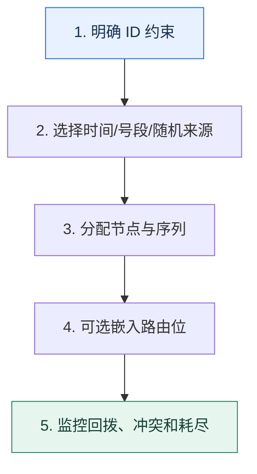

# 全局 ID｜在唯一、趋势递增和路由信息之间做取舍

> 本课只解决一个问题：分库分表后，怎样生成跨节点唯一且满足查询与写入需求的主键？

这不是原页面的缩写，也不是一组孤立结论。下面先建立一个能推演的最小世界，再把状态、数字和失败分支摊开，最后按来源讲解顺序覆盖全部知识线索。读完后，你应当能从 `明确 ID 约束` 一直解释到 `监控回拨、冲突和耗尽`，并说明中途任意一步失败会留下什么状态。

## 零基础入口：先建立本课的心智画面

ID 生成器要同时回答唯一性、可用性、排序性、吞吐、时钟依赖和信息暴露。没有一种格式在所有维度都最好。

先不要急着记组件名。只抓住四个问题：**现在手里有什么输入？下一步只做什么动作？哪个状态发生变化？变化后的结果交给谁？** 之后遇到新框架，只要这四个答案不变，核心机制就没有变。

### 放进一个足够小、可以手算的世界

设计 64 位 ID：41 位毫秒时间、10 位节点、12 位序列，理论上单节点每毫秒 4096 个。若需要按 32 个库路由，可从业务键哈希取 5 位嵌入约定位置。看到 ID 就能定位库，但也会暴露时间和规模，需要评估安全性。

这个小世界故意只保留本课必需的对象。生产系统会有更多节点、线程、分片和异常，但数量增加不会改变这里的因果关系。先确认你能手算这个例子，再把数字替换成真实系统数据。

### 先预测，不要马上看结论

**号段模式中出现 ID 空洞，为什么通常不是数据错误？**

先写下自己的判断，并指出你依赖的前提。文末自我检查会揭示答案；如果答案不同，回到下面的状态表找出第一个分叉点。

## 本节精讲：让机制一步一步发生

UUID 去中心化但随机写入会降低局部性且体积大；数据库号段可趋势递增，但依赖号段服务；雪花类方案把时间、节点和序列编码进整数，需要处理节点号冲突与时钟回拨。若高频查询按租户分片，可在 ID 中嵌入稳定的路由位，避免额外查映射表。批量预取号段提高吞吐，但进程崩溃会留下空洞；空洞通常不影响唯一性。

### 可见状态推进

| 当前步 | 现在发生的动作 | 下一步拿到什么 |
| ---: | --- | --- |
| 1 | 明确 ID 约束 | 选择时间/号段/随机来源 |
| 2 | 选择时间/号段/随机来源 | 分配节点与序列 |
| 3 | 分配节点与序列 | 可选嵌入路由位 |
| 4 | 可选嵌入路由位 | 监控回拨、冲突和耗尽 |
| 5 | 监控回拨、冲突和耗尽 | 得到可核对的终态 |

图只承担一个任务：让你看清状态如何向前移动。它不意味着每一步必然成功；网络超时、进程退出、重复执行和数据竞争都可能让箭头停在中间，因此后面必须继续讨论失效边界。

### 一次带数字的完整推演

设计 64 位 ID：41 位毫秒时间、10 位节点、12 位序列，理论上单节点每毫秒 4096 个。若需要按 32 个库路由，可从业务键哈希取 5 位嵌入约定位置。看到 ID 就能定位库，但也会暴露时间和规模，需要评估安全性。

数字不是装饰。它迫使我们回答容量、顺序、时间窗口或版本选择问题。若换一个数字就得出不同结论，真正的设计依据就是那个阈值，而不是某个中间件名称。

## 按讲解顺序重建知识链：完整来源讲解

下面按来源资料的教学顺序重新编排完整内容。转换页码、来源图片、推广信息、水印、角色化问答和只服务于技术讨论场景的话术已经删除；机制、算法、例子、反例、事故线索、评论补充和限制条件仍然保留。这里的作用是补齐知识覆盖，不取代前面的独立推演。

本节讨论分库分表——主键生成。

分库分表在技术讨论里是一个非常热门，而且偏难的一个话题。这节课我就带你来攻克这个难题，带你了解 UUID、自增主键和雪花算法的特点，并且教你在工程复盘时给出有证据的判断。在这些基础上，我会进一步给出一个微创新的主键生成方案，可以作为你技术讨论时候的主要突破口。

不过为了让你的知识系统更加完整，我前面还是会给你讲解一下分库分表相关的知识，这样就算你的基础比较薄弱，也能看懂后面的方案。

### 先把机制拆开

所谓的分库分表严格来说是分数据源、分库和分表。例如某个公司订单表的分库分表策略就是用了 8 个主从集群，每个主从集群 4 个库，每个库有 32 张表，合在一起可以说成是 8 ×

### 4 × 32。

不过根据数据规模和读写压力，也可以共享一个主从集群，然后只分库或者只分表。如果技术讨论面到了分库分表的内容，那么主键生成基本上就是一个绕不开的话题。显然，在没有分库分表的时候，我们都可以使用自增主键。

比如说我们在 MySQL 里面的建表语句，指定了 AUTO_INCREMENT。

复制代码1 CREATE TABLE order (2 id BIGINT PRIMARY KEY AUTO_INCREMENT,3 buyer_id BIGINT NOT NULL 4 )

那么在分库分表的场景下，这种自增主键就无法运作了，因为存在冲突的可能。举个最简单的例子，假如说我们分库分表只分表，而且按照 buyer_id 除以 2 的余数来分成两张表，分别是order_tab_0 和 order_tab_1。

如果这两张表都依赖于自增生成主键，那么两张表会生成相同的 ID。比如说两张表插入第一行数据的时候，ID 都是 1。而问题在于订单这一类的业务，我们需要一个全局唯一的 ID。

主键生成一般还伴随着两个要点。

我们希望全局唯一的 ID 依旧能够保持自增，因为自增与否会显著影响插入的性能。因为只有数据量大的才会考虑分库分表，而数据量大一般意味着并发高，所以还要考虑怎么支持高并发。

接下来我就会在这两个要点下教你怎么在工程复盘时给出有证据的判断来。

### 把知识转成可验证的工程判断

首先我们需要把话题引到主键生成上来。如果你接触过使用分库分表的项目，那么在简历和项目介绍的时候一定要提及分库分表关键词，后面就等技术评审者主动问你主键是如何生成的。如果在技术讨论过程中被问到了数据库自增主键相关的问题，那么你要主动提起自增主键不适用于分库分表场景，然后技术评审者自然就会追问你分库分表场景下主键的生成问题。

那在技术评审者问到这些问题的时候我们怎样才能抓住这个机会，展现自己的实力呢？

这就需要我们提前做一些准备工作了。

1. 深入理解市面上常见的主键生成策略。
2. 准备一个有进阶推导的、微创新的主键生成方案。

3. 记住一些可行的优化方案。
下面我们就一步一步来，先来看看市面上一些常见的主键生成策略。

### 常见思路

如果技术评审者问，在分库分表里面，怎么解决主键问题，或者分库分表可以怎么生成主键，又或者问你如何设计一个发号器，基本上都是希望你解释主键生成的常见思路，也就是 UUID、数据库自增和雪花算法。接下来我们一个个分析。

### UUID

UUID 是最简单粗暴的方案，也是技术讨论的时候你必须要解释出来的一种策略。

如果你想和其他技术讨论的人拉开差距，那么即便是最简单的 UUID 方案也可以下一番功夫，首先你需要详细地解释 UUID 的两个弊端。

过长：这个弊端其实在技术讨论里面讨论得比较少，毕竟会采用 UUID 的地方就不会在意它的长度了。UUID 不是递增的：这个弊端是你技术讨论时要重点描述的，并且要尝试给出有证据的判断来。

进阶推导 1：页分裂

UUID 不是递增的这个弊端，要想讲清楚，你就要先描述为什么我们会希望在数据库里面使用自增主键。那么你可以引用数据库为什么使用自增主键的知识点来解释这个问题，关键词就是页分裂。

如图所示，你在尝试往 23 之后插入一个 25 的时候，这个叶子节点已经放不下了，逼不得已就只能分裂成（20，21）和（22，23，25）两个节点。如果你再仔细观察一下，就会发现，原本的（10，20，30）多了一个元素之后变成了（10，20，22，30）。你想到了什么？

即页分裂这个东西是可能会引起连锁反应的，从叶子节点沿着树结构一路分裂到根节点。

所以你可以这样解释。

UUID 最大的缺陷是它产生的 ID 不是递增的。一般来说，我们倾向于在数据库中使用自增主键，因为这样可以迫使数据库的树朝着一个方向增长，而不会造成中间叶节点分裂，这样插入性能最好。而整体上 UUID 生成的 ID 可以看作是随机，那么就会导致数据往页中间插入，引起更加频繁地页分裂，在糟糕的情况下，这种分裂可能引起连锁反应，整棵树的树形结构都会受到影响。所以我们普遍倾向于采用递增的主键。

如果你这样解释，那么算是基本达标了。

进阶推导 2：顺序读

此外，我们还可以从一个比较新奇的角度，解释为什么要使用自增主键，关键词就是顺序读。

所以你可以这样解释。

自增主键还有一个好处，就是数据会有更大的概率按照主键的大小排序，两条主键相近的记录，在磁盘上位置也是相近的。那么可以预计，在范围查询的时候，我们能够更加充分地利用到磁盘的顺序读特性。

进阶推导 3：InnoDB 的数据组织

如果你希望在技术评审者面前树立你在数据库方面积累比较多的形象，那么你就要进一步解释数据库的页分裂究竟是怎么一回事，这时候你可以用 MySQL InnoDB 引擎来举例子。

MySQL 的 InnoDB 引擎，每一个页上按照主键的大小放着数据。假如说我现在有一个页放着主键 1、2、3、5、6、7 这六行数据，并且这一页已经放满了。现在我要插入一个 ID 为4 的行，那么 InnoDB 引擎就会发现，这一页已经放不下 4 这行数据了，于是逼不得已，就要将原本的页分成两页，比如说 1、2、3 放到一页，5、6、7 放到另外一页，然后可以把 4 放到第一页。

这种页分裂会造成一个问题，就是虽然从逻辑上来说 1、2、3 这一页和 5、6、7 这一页是邻近的两个页，但是在真实存储的磁盘上，它们可能离得很远。

这个解释基本上就是前面图片的一个口语化表述。

到这一步，你的解释就已经算是可以了。技术评审者如果想要进一步探讨，那么可能会继续追问InnoDB 引擎上的页这种数据结构有什么字段，各自有什么用处。如果你现在是临时抱佛脚准备技术讨论，那么就没必要去背这些八股文。但是如果你只是平常在学习技术知识，想要夯实基础，那么我建议你深入去看看这部分内容。

### 数据库自增

除了 UUID 这种方案以外，还有另外一种常见的方案也叫做自增。不过这种自增有点特殊，它是设置了步长的自增。

我们可以用一个例子来说明这种方案。

经过分库分表之后我有十个表，那么我可以让每一个表按照步长来生成自增 ID。比如说第一个表就是生成 1、11、21、31 这种 ID，第二个表就是生成 2、12、22、32 这种 ID。

紧接着我们还可以简单评价一下这种方案，关键词是表内部自增。

这种方案非常简单，而且本身我们在应用层面并不需要做任何事情，只是需要在创建表的时候指定好步长就可以了。ID 虽然并不一定是全局递增的，但是在一个表内部，它肯定是递增的。这个方案的性能基本取决于数据库性能，应用层面上也不需要关注。

### 雪花算法

除了 UUID 和数据库自增之外，你还可以从雪花类算法上找找进阶推导。

要注意的是，以目前的内卷情况，你即便答出了雪花算法，可能还是很普通。不过别担心，我这就教你怎么让自己的解释变得不普通。

雪花算法的原理倒不难，它的关键点在于分段。

那么雪花算法保证 ID 唯一性的理由也很充分了。

时间戳是递增的，不同时刻产生的 ID 肯定是不同的。机器 ID 是不同的，同一时刻不同机器产生的 ID 肯定也是不同的。同一时刻同一机器上，可以轻易控制序列号。

在技术讨论中，你要先解释这几个理由，然后解释。

雪花算法采用 64 位来表示一个 ID，其中 1 比特保留，41 比特表示时间戳，10 比特作为机器 ID，12 比特作为序列号。

基本解释清楚之后，我们刷进阶推导有很多个方向，你可以根据自己掌握相关知识的程度来选择。

进阶推导 1：调整分段

第一个方向是深入讨论每个字段，关键点就是根据需求自定义各个字段含义、长度。

大多数情况下，如果自己设计一个类似的算法，那么每个字段的含义、长度都是可以灵活控制的。比如说时间戳 41 比特可以改得更短或者更长，比如说 39 比特也能表示十几年，其实也够用了。

机器 ID 虽然明面上是机器 ID，但是实际上并不是指物理机器，准确说是算法实例。例如，一台机器部署两个进程，每个进程的 ID 是不同的；又或者进一步切割，机器 ID 前半部分表示机器，后半部分可以表示这个机器上用于产生 ID 的进程、线程或者协程。甚至机器 ID也并不一定非得表示机器，也可以引入一些特定的业务含义。而序列号也是可以考虑加长或者缩短的。

说完这些，你最好再加上一句总结，升华一下主题。

雪花算法可以算是一种思想，借助时间戳和分段，我们可以自由切割 ID 的不同比特位，赋予其不同的含义，灵活设计自己的 ID 算法。

进阶推导 2：序列号耗尽

但是这里还有一个问题，就是不管你怎么设计雪花算法，你的序列号长度都有可能不够。比如说前面标准的是 12 比特，那么有没有可能并发非常高，以至于 12 比特在某一个特定的时刻机器上的比特全都用完了呢？

显然，理论上是存在这种可能的，所以我们的进阶推导就要从如何解决这个问题入手。这个问题解决起来倒也很简单。

如果 12 比特不够，你就给更多比特，这部分比特可以从时间戳里面拿出来如果还不够，那么就让业务方等待一下，到下一个时刻，自然又可以生成新的 ID 了，也就是时间戳变了，这也是一种变相的限流。

所以你可以这样解释。

一般来说可以考虑加长序列号的长度，比如说缩减时间戳，然后挪给序列号 ID。当然也可以更加简单粗暴地将 64 位的 ID 改成 96 位的 ID，那么序列号 ID 就可以有三四十位，即便是国际大厂也不可能用完了。不过，彻底的兜底方案还是要有的。我们可以考虑引入类似限流的做法，在当前时刻的 ID 已经耗尽之后，可以让业务方等一下。我们的时间戳一般都是毫秒数，那么业务方最多就会等一毫秒。

这里技术评审者可能会继续杠，问你这里让业务方等一下会有什么问题？或者说如果技术评审者不主动杠，你也可以自己说明一下。

业务方等待算是一个比较危险的方案，因为这可能导致大量业务方阻塞住，导致线程耗尽或者协程耗尽之类的问题。不过如果是偶发性的序列号不够，那么问题不大，因为阻塞的业务方很快就能拿到 ID。

那么如果序列号耗尽不是一个偶发性的问题，是长期的问题，那么还是要考虑从业务角度切割，不同业务使用不同的 ID 生成，就不要共享了。又或者，逼不得已还是用 96 或者 128位的，一了百了。

进阶推导 3：数据堆积

你设想这么一个场景：你的分库分表是按照 ID 除以 32 的余数来进行的，那么如果你的业务非常低频，以至于每一个时刻都只生成了尾号为 1 的 ID，那么是不是所有的数据都分到了一张表里面呢？

没错，不过解决方案也很简单。

1. 某一个时刻使用随机数作为起点，而不是每次从 0 开始计数。
2. 使用上一个序列号作为起点。比如说上一个序列号只分到了 3，那么下一个时刻的序列号就从 4 开始。
随机数算是正统方案，第二个方案看起来稍微有点儿奇怪。

你就可以这样来解释。

在低频场景下，很容易出现序列号几乎没有增长，从而导致数据在经过分库分表之后只落到某一张表里面的情况。为了解决这种问题，可以考虑这么做，序列号部分不再是从 0 开始增长，而是从一个随机数开始增长。还有一个策略就是序列号从上一时刻的序列号开始增长，但是如果上一时刻序列号已经很大了，那么就可以退化为从 0 开始增长。这样的话要比随机数更可控一点，并且性能也要更好一点。

接下来，你有一个“亮剑”的机会，补充一句话。

一般来说，这个问题只在利用 ID 进行哈希的分库分表里面有解决的意义。在利用 ID 进行范围分库分表的情况下，很显然某一段时间内产生的 ID 都会落到同一张表里面。不过这也是我们的使用范围分库分表预期的行为，不需要解决。

做完前面这些工作，我们的基本操作就完成了。

### 进阶推导方案：主键内嵌分库分表键

看到这里你是不是在想，前面的解释都还不够有进阶推导吗？都解释出来雪花算法了还不够吗？答案是有进阶推导但是还不够拉开差距。既然寻求刺激，那就要贯彻到底。

我这里直接给你一个方案——主键内嵌分库分表键。

大多数时候，我们会面临一个问题，就是分库分表的键和主键并不是同一个。比如说在 C端的订单分库分表，我们可以采用买家 ID 来进行分库分表。但是一些业务场景，比如说查看订单详情，可能是根据主键又或者是根据订单 SN 来查找的。

那么我们可以考虑借鉴雪花算法的设计，将主键生成策略和分库分表键结合在一起，也就是说在主键内部嵌入分库分表键。例如，我们可以这样设计订单 ID 的生成策略，在这里我们假设分库分表用的是买家 ID 的后四位。第一段依旧是采用时间戳，但是第二段我们就换成了这个买家后四位，第三段我们采用随机数。

普遍情况下，我们都是用买家 ID 来查询对应的订单信息。在别的场景下，比如说我们只有一个订单 ID，这种时候我们可以取出订单 ID 里嵌入进去的买家 ID 后四位，来判断数据存

储在哪个库、哪个表。类似的设计还有技术说明记录按照技术说明者 ID 来分库分表，但是技术说明记录ID 本身可以嵌入这个技术说明者 ID 中用于分库分表的部分。

最后你要记得升华一下这种设计思想。

这一类解决方案，核心就是不拘泥于雪花算法每一段的含义。比如说第二段可以使用具备业务含义的 ID，第三段可以自增，也可以随机。只要我们最终能够保证 ID 生成是全局递增的，并且是独一无二的就可以。

为什么要这么升华呢？因为在这一段话里面，我们很明显地埋下了两颗“雷”，一个是全局递增，一个是独一无二。也就是说这个进阶推导方案保证不了这两点，而如果技术评审者的水平足够，那么他肯定会追问你全局递增和独一无二两个点。

### 全局递增

假如说技术评审者进一步追问：你这个方案能够保证主键递增吗？

这个保证不了，但是它能够做到大体上是递增的。你可以设想，同一时刻如果有两个用户来创建订单，其中用户 ID 为 2345 的先创建，用户 ID 为 1234 的后创建，那么很显然用户ID 1234 会产生一个比用户 ID 2345 更小的订单 ID；又或者同一时刻一个买家创建了两个

订单，但是第三段是随机数，第一次 100，第二次 99，那么显然第一次产生的 ID 会更大。

但是这并不妨碍我们认为，随着时间推移，后一时刻产生的 ID 肯定要比前一时刻产生的 ID要大。这样一来，虽然性能比不上完全严格递增的主键好，但是比完全随机的主键好。

### 独一无二

如果技术评审者进一步追问你这个方案能不能保证 ID 唯一，那么你应该解释不能，但这并不是一个多大的问题。

你可以想到，不能保证独一无二是因为在第三段里面使用了随机数。既然是随机数，那么就可能随机到同样的数字。但是，产生冲突 ID 的可能性是很低的。它要求在同一时刻同一个用户创建了两个订单，然后订单 ID 的随机数部分随机到了同一个数字。

这时候你就可以揭示这个概率以及相应的容错措施。

产生一样 ID 的概率不是没有，而是极低。它要求同一个用户在同一时刻创建了两个订单，然后订单 ID 的随机数部分一模一样，这是一个很低的概率。

如果有杠精技术评审者非要问你这个概率有多低，你就可以从业务和数学两个角度上解释为什么概率低。

在下单场景下，正常的用户都是一个个订单慢慢下，在同一时刻同时创建两个订单，对于用户来说，是一件不可能的事情。而如果有攻击者下单，那就更加无所谓，反正是攻击者的订单，失败就失败了。而即便真的有用户因为共享账号之类的问题同一时刻下两个订单，那么随机到同一个数的概率也是十万分之一。

注意，这里的十万分之一，是假设你随机数产生的范围是在 0 到 十万之间。

最后你还是需要提出解决方案，关键词就是重新产生一个主键。

解决方案其实也很简单，就是在插入数据的时候，如果返回了主键冲突错误，那么重新产生一个，再次尝试就可以了。

如果你还想要继续刷进阶推导，你还可以假装很不在意地说：

实际上，还有一种非常偶发性的因素也可能会引起 ID 冲突，也就是时钟回拨，不过相比正统雪花算法，时钟回拨问题在这个方案里面不太严重，毕竟还有一个随机数的部分。

这么一说就足以凸显你知识广博，考虑周全了。

### 优化思路

如果你能够把前面的进阶推导方案说清楚，还觉得意犹未尽，想继续在技术评审者面前炫技的话，那么你可以尝试聊聊一般的发号器的优化思路。注意这个优化思路你可以说你只是想过，但是并没有落地，省得说不清楚细节。

优化的点就是：批量取、提前取、singleflight 取、局部分发。

注意，批量取和提前取对应的还有批量生成和提前生成，思路是一样的。万一技术评审者问到了如何设计一个高性能的发号器，你也可以解释这些点。

### 批量取

批量取是指业务方每次跟发号器打交道，不是只拿走一个 ID，而是拿走一批，比如说 100个。拿到之后业务方自己内部慢慢消耗。消耗完了再去取下一批。

这种优化思路的优点就是极大地减轻发号器的并发压力。比如说一批是 100 个，那么并发数就降低为原本的 1% 了。缺点就是可能破坏递增的趋势。比如说一个业务方 A 先取走了 100个 ID，然后业务方 B 又取走 100 个，结果业务方 B 先用完了自己取的 ID，插到了数据库里面；然后业务方 A 才用完自己的 100 个。

### 提前取

提前取是指业务方提前取到 ID，这样就不需要真的等到需要 ID 的时候再临时取。提前取可以和批量取结合在一起，即提前取一批，然后内部慢慢使用。在快要用完的时候，再取一批。同时也要设计一个兜底措施，如果要是用完了，新的一批还没取过来，要让业务方停下来等待。

这个思路的优点是能够提高业务方的性能，缺点和前面一样是会破坏 ID 的递增性。

### singleflight 取

这个就类似于在缓存中应用 singleflight 模式。假如说业务方 A 有几十个线程或者协程需要ID，那么没有必要让这些线程都去取 ID，而是派一个代表去取。这个代表取到之后再分发给需要的线程。这也能够降低发号器的并发负载。

这个思路还可以进一步优化，就是每次取的时候多取一点，那么后续还有别的线程需要，也不用自己去取了。

### 局部分发

假如说现在整个实例上有 1000 个 ID，这些 ID 是批量获取的。那么一个线程需要 ID 的时候，它就不再是只拿一个，而是拿 20 个，然后存在自己的 TLB（thread-local-buffer) 里面，以后这个线程需要 ID 的时候，就先从自己的 TLB 里面拿，避开了全局竞争，减轻了并发压力。

### 技术推理路径回顾

这节课我们主要解决的是分库分表主键生成的问题。我给出了 UUID、数据库自增和雪花算法这三种常见思路，并在此基础上设计了一个主键内嵌分库分表键的进阶推导方案，还给出了几种优化的思路。我给出的这些解释依旧体现了我一直以来跟你说的，对于复杂的理论，你不要死记硬背，而是用一个简单的例子来解释这个理论，正如同我这里用的页分裂的例子。对于技术评审者来说，他很容易听懂，你也容易记住。

同时，也再次证明了我最开始跟你说的那个说法，对于一些喜欢一杆子打到底的技术评审者来说，引导他们是一件非常简单的事情。他们所自豪的一杆子打到底，实际上每一步都在你的预料之内。

### 继续推演

最后你来思考几个问题。

我在雪花算法里面讲到说，如果序列号耗尽，可以缩短时间戳，把比特位给序列号用，那么能不能缩减机器 ID 的比特位？在 singleflight 取那里，算是一个典型的化全局竞争为局部竞争的并发优化，那么你还见过类似的优化吗？

### 补充讨论与边界校准

补充讨论： ID 除以 32 的余数来进行的，那么如果你的业务非常低频，以至于每一个时刻都只生成了尾号为 1 的 ID，那么是不是所有的数据都分到了一张表里面呢？问题来了：非常低频的话那，是不是就没有必要分表了？

讲解补充：其实这个主要考虑的高峰和低谷。高峰很高但是低谷也很低。

2

补充讨论：

讲解补充：这个跟你怎么落地 ID 生成程序有关系。在这种方案中，可以直接在应用服务器中生成。而一个创建订单的服务有很多实例，通过负载均衡之后，同一个人的请求会落到不同的机器上，这时

候你要顺序序列号，就得协调这些机器。

随机就没这个烦恼。

2

补充讨论：

讲解补充：新用法！我倒是没想到还有这种玩法，算是学了一招，感谢！

2

补充讨论：

1. 可以是可以，但是缩减之后所能代表的机器数量也就减少了
2. Go里面的GMP调度中的本地队列和全局队列，Go内存分配中的mcache
讲解补充：赞！

1

补充讨论：

1. 个人认为还是个 trade off 问题，缩短时间戳和缩短机器位数两种方式都是可取的，如果你的业务活不了太久，那么缩短时间戳位数问题不大，如果你确定你不会拼命堆机器来提高业务吞吐量，当然也可以缩短机器位数，没有对与错之分，只有哪个方式更适合当前情况
2. 记得PHP是每次都是向OS申请一大片内存空间的，然后再慢慢用，算不
by the way :补充一个我们日常的使用场景《数据迁移》，自增ID对数据迁移来说是非常不友好的，动不动就冲突，如果还用自增ID来做业务关联，那就更麻烦了，如果真的要用自增I D，最好是把它当作占坑用的，业务不要用它，而UUID 的主键虽然可以解决冲突问题，但是它的缺点也很明显，页分裂，查询不友好，占用空间大，这样索引树的空间占用也变大了（非主键索引树叶子节点存的是主键），而雪花ID可以递增又可以解决冲突问题，所以目前我们的新服务我都是要求用雪花ID，雪花ID冲突的场景我工作中确实没有遇到过（业务不给力呀，好想搞电商）

另外，分段思想还挺不错的，感谢讲解者兄分享

讲解补充：1. 赞！

2. 哈哈哈，也算。很多系统，包括我们自己设计缓存都是这种套路，自己申请一块，内部慢慢分。
多交流！

补充讨论： 虽然说，如果项目规模不大，部署的微服务较少，可以去挪用。但是，现在的情况是微服务的序列都不够用了，说明业务量比较大，一般是有增加机器的需求，怎么还会去减少机器Id比特位呢

讲解补充：赞！对，这是一个理由！

1

补充讨论： ID 来查询对应的订单信息。在别的场景下，比如说我们只有一个订单 ID，这种时候我们可以取出订单 ID 里嵌入进去的买家 ID 后四位，来判断数据存储在哪个库、哪个表。类似的设计还有技术说明记录按照技术说明者 ID 来分库分表，但是技术说明记录 ID 本身可以嵌入这个技术说明者 ID 中用于分库分表的部分

没太明白只有uid后四位怎么判断uid对应的库表的？

讲解补充：你是按照买家的后四位来分库分表的，那么你知道这个后四位，就知道数据在哪里了。

补充讨论：

讲解补充：冲突也没想象中的严重。因为时间戳本身是记录的是毫秒数，那么你可以预期，如果是千万 QPS（一秒一千万个订单已经很高了），那么同一毫秒，也就是有一万个请求而已。后四位相同的概率就是 1/9999，而随机数是 8比特，也就是随机数相同的概率是 1/2^8，一万个请求也不一定会有一个相同的 ID。

我这个算法应该不太对，但是量级应该是这样一个量级，就是冲突并没有想象中的那么厉害。并且，冲突了之后，可以再次生成一个随机数，这个时候估计就避开了上一个冲突的同尾号的用户了。

补充讨论：

讲解补充：我主观来说，我是觉得独立部署的发号器是一个纯纯馊主意。我更加倾向于应用服务器本身也充当发号器（也就是不同的线程/goroutine），然后直接应用就从本地的发号器里面拿ID。

独立部署的发号器就是你说的这种，还有微服务集群形态的发号器。

补充讨论：

1. 页分裂除了逻辑相邻的数据在磁盘上不相邻之外，页分裂过程也会对数据库性能有所消耗吧
2. 进阶推导3： 数据堆积这里，这里是对雪花算法之后的数字进行求余，然后确定对应要插入到的数据库么
讲解补充：1. 对的

2. 是的。比如说你很不幸把所有的大商家的数据都分配到了同一个表里，这张表就会有极多的数据。

## 把完整讲解收束成一条因果链

1. 比较 UUID、数据库自增、号段和雪花类算法的中心化与有序性。
2. 逐位解释时间、节点、序列分别解决什么，计算峰值容量。
3. 把分片路由信息纳入 ID，但说明安全和迁移代价。
4. 用批量取、提前取、singleflight 和局部分发降低号段服务压力。

把这几步连接起来时，不要省略“为什么”。最终结论只有在前提、状态变化和失败代价都说得清楚时才可靠。

## 误区与失效边界

趋势递增不等于全局连续，唯一也不等于不可猜。依赖机器时钟的算法若回拨而没有防护，可能重复或暂停发号。不要把业务分片键直接裸露在外部标识中而忽略隐私。

再加一条通用但必须落实到本课对象上的边界：机制只能处理它看得见的信号。若输入指标失真、状态没有持久化、错误被吞掉，或者补偿没有幂等保护，再成熟的框架也只能基于错误证据作决定。

### 三种故障注入方式

| 故障 | 要观察什么 | 不能接受的解释 |
| --- | --- | --- |
| 在第 2 步前让依赖超时 | 是否停在可重试状态，是否消耗完上游预算 | “框架稍后会处理” |
| 在状态写入后让进程退出 | 重启后能否识别已完成与待继续动作 | “再执行一次应该没事” |
| 对同一输入并发执行两次 | 是否出现重复副作用、顺序颠倒或覆盖 | “概率很低” |

## 工程验证：把理解变成可以复查的证据

验算表必须写出每个字段位数、最大值、单位和耗尽时间。例如 12 位序列是 0–4095；若一毫秒内超过 4096 个请求，生成器要等待下一毫秒或扩展位宽。

| 步骤 | 状态或动作 | 最少应留下的证据 |
| ---: | --- | --- |
| 1 | 明确 ID 约束 | 开始时间、结束时间、输入标识、结果状态、异常原因 |
| 2 | 选择时间/号段/随机来源 | 开始时间、结束时间、输入标识、结果状态、异常原因 |
| 3 | 分配节点与序列 | 开始时间、结束时间、输入标识、结果状态、异常原因 |
| 4 | 可选嵌入路由位 | 开始时间、结束时间、输入标识、结果状态、异常原因 |
| 5 | 监控回拨、冲突和耗尽 | 开始时间、结束时间、输入标识、结果状态、异常原因 |

验证时同时记录成功路径和失败路径。只证明“正常时能跑通”不能说明设计可靠；至少要让一次超时、一次进程退出和一次重复请求可重现，并能根据日志或指标解释最后状态。

## 学完检查：闭卷画出本课

你现在应该能独立完成四件事：

1. 用自己的话说出本课唯一问题，不使用产品名也能解释。
2. 复算上面的具体例子，并指出哪个输入改变会让结论改变。
3. 沿 Mermaid 图注入一次失败，预测系统停在哪里以及由谁收敛。
4. 说出本课机制不保证什么，并给出一个反例。

## 自我检查

号段模式中出现 ID 空洞，为什么通常不是数据错误？

生成器只承诺唯一和一定顺序，不承诺每个号码都被业务使用。进程拿到号段后崩溃会浪费号码，但不会产生重复记录。

怎样证明自己不是只记住了名词？

把 `明确 ID 约束` 的一个真实输入写出来，逐步记录到 `监控回拨、冲突和耗尽`。然后在中间任意一步制造失败；如果你能解释当前状态、下一责任方、可观测证据和恢复边界，就已经拥有可以迁移的工程模型。

## 来源与事实校准

- [查看完整来源稿（本地 22 页资料）](../content/16-sharding-id.md)

### 当前事实校准

Snowflake 是一种把时间、节点和序列组合进整数的设计家族，不是一个自动解决时钟回拨和节点号冲突的协议。位宽、纪元、节点分配与回拨策略必须按实现说明；趋势递增也不等于全局连续。

- [Twitter Archive · Snowflake](https://github.com/twitter-archive/snowflake)

来源稿用于核对覆盖范围，不随公开站点发布。产品默认值和具体内部行为可能随版本变化；落地时应使用目标版本的官方文档、可运行实验和故障演练校准。本学习稿中的零基础入口、状态推演、故障矩阵和工程验证属于编辑补充，不冒充来源讲解者的原话。
