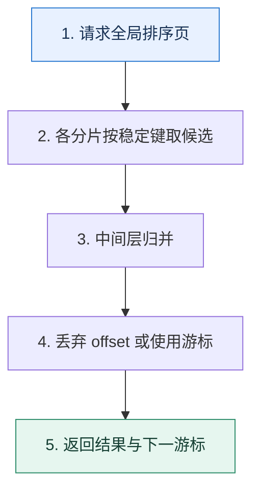

# 跨分片分页｜为什么越往后翻，重复扫描和丢弃越多

> 本课只解决一个问题：排序数据分散在多个分片时，怎样得到全局第 N 页而不让成本随页码爆炸？

这不是原页面的缩写，也不是一组孤立结论。下面先建立一个能推演的最小世界，再把状态、数字和失败分支摊开，最后按来源讲解顺序覆盖全部知识线索。读完后，你应当能从 `请求全局排序页` 一直解释到 `返回结果与下一游标`，并说明中途任意一步失败会留下什么状态。

## 零基础入口：先建立本课的心智画面

单库 offset 已经需要跳过前面的记录；跨分片还要从每个分片取候选、在中间层归并并再次丢弃。全局排序键必须稳定且能处理相同值。

先不要急着记组件名。只抓住四个问题：**现在手里有什么输入？下一步只做什么动作？哪个状态发生变化？变化后的结果交给谁？** 之后遇到新框架，只要这四个答案不变，核心机制就没有变。

### 放进一个足够小、可以手算的世界

4 个分片查询第 1001 页，每页 20 条。朴素方式每片最多取 20020 条，共约 80080 条，只返回 20 条。若使用上一页最后的 `(created_at,id)` 作为游标，每片只取 20 个候选，最多归并 80 条。

这个小世界故意只保留本课必需的对象。生产系统会有更多节点、线程、分片和异常，但数量增加不会改变这里的因果关系。先确认你能手算这个例子，再把数字替换成真实系统数据。

### 先预测，不要马上看结论

**为什么给每个分片分配 `offset/S` 不能保证得到正确的全局第 N 页？**

先写下自己的判断，并指出你依赖的前提。文末自我检查会揭示答案；如果答案不同，回到下面的状态表找出第一个分叉点。

## 本节精讲：让机制一步一步发生

朴素方案让每个分片取 `offset+limit` 条，再归并前 N 条，深页会放大网络和内存。游标分页携带上一页的 `(sort_key,id)`，各分片只查询其后的数据，再做小规模归并；它不支持任意跳页但成本稳定。若产品必须跳页，可限制最大页、预计算中间结果、维护全局索引或交给更适合检索的系统。

### 可见状态推进

| 当前步 | 现在发生的动作 | 下一步拿到什么 |
| ---: | --- | --- |
| 1 | 请求全局排序页 | 各分片按稳定键取候选 |
| 2 | 各分片按稳定键取候选 | 中间层归并 |
| 3 | 中间层归并 | 丢弃 offset 或使用游标 |
| 4 | 丢弃 offset 或使用游标 | 返回结果与下一游标 |
| 5 | 返回结果与下一游标 | 得到可核对的终态 |

图只承担一个任务：让你看清状态如何向前移动。它不意味着每一步必然成功；网络超时、进程退出、重复执行和数据竞争都可能让箭头停在中间，因此后面必须继续讨论失效边界。

### 一次带数字的完整推演

4 个分片查询第 1001 页，每页 20 条。朴素方式每片最多取 20020 条，共约 80080 条，只返回 20 条。若使用上一页最后的 `(created_at,id)` 作为游标，每片只取 20 个候选，最多归并 80 条。

数字不是装饰。它迫使我们回答容量、顺序、时间窗口或版本选择问题。若换一个数字就得出不同结论，真正的设计依据就是那个阈值，而不是某个中间件名称。

## 按讲解顺序重建知识链：完整来源讲解

下面按来源资料的教学顺序重新编排完整内容。转换页码、来源图片、推广信息、水印、角色化问答和只服务于技术讨论场景的话术已经删除；机制、算法、例子、反例、事故线索、评论补充和限制条件仍然保留。这里的作用是补齐知识覆盖，不取代前面的独立推演。

本节讨论分库分表分页查询。

在实践中，分页是分库分表之后肯定要解决的问题，如果解决方案没选好，那么很容易出现性能问题。分页的解决方案很多，不过能够在技术讨论中系统地将所有的方案都说出来的候选人可以说是少之又少。所以你只需要记住这节课的内容记住，就足以拉开和其他候选人的差距。

让我们从分库分表的一般做法开始学起。

### 分库分表的一般做法

分库分表我们一般会使用三种算法。

1. 哈希分库分表：根据分库分表键算出一个哈希值，然后根据这个哈希值选择一个数据库。最常见的就是使用数字类型的字段作为分库分表键，然后取余。比如说在订单表里面，按照买家的 ID 除以 8 的余数进行分表。

2. 范围分库分表：将某个数据按照范围大小进行分段。比如说根据 ID，[0, 1000) 在一张表，[1000, 2000) 在另外一张表上。最常见的应该是按照日期进行分库分表，比如说按照月分表，每个月一张表。
3. 中间表：引入一个中间表来记录数据所在的目标表。一般是记录主键到目标表的映射关系。
这三者并不是互斥的，也就是说你可以考虑使用哈希分库分表，同时引入一个中间表。也可以先进行范围分库分表，再引入一个中间表。

### 分库分表中间件的形态

分库分表中间件的形态有三种。

1. SDK 形态：SDK 形态就是我们最熟悉的，它通过依赖的形式引入到你的代码里面。比如说ShardingSphere 的 Java 依赖。
2. Proxy 形态：独立部署的分库分表中间件，它对于所有的业务方来说，就像一个普通的数据库，业务方的查询发送过去之后，它就会执行分库分表，发起实际查询，然后把查询结果返回给业务方。ShardingSphere 也支持这种形态。

3. Sidecar 形态：简单来说就是一个提供了分库分表的 Sidecar。这是一个理论上的形态，现在并没有非常成熟的产品。
这三种形态里面，SDK 形态性能最好，但是和语言强耦合。比如说 Java 研发的ShardingSphere jar 包是没办法给 Go 语言使用的。

Proxy 形态性能最差，因为所有的数据库查询都发给了它，很容易成为性能瓶颈。尤其是单机部署 Proxy 的话，还面临着单节点故障的问题。它的优点就是跟编程语言没有关系，所以部署一个 Proxy 之后可以给使用不同编程语言的业务使用。同时，Proxy 将自己伪装成一个普通

的数据库之后，业务方可以轻易地从单库单表切换到分库分表，整个过程对于业务方来说就是换了一个数据源。

Sidecar 目前还没有成熟的产品，但是从架构上来说它的性能应该介于 SDK 和 Proxy 之间，并且也没有单体故障、集群管理等烦恼。

### 把知识转成可验证的工程判断

在准备分库分表分页查询技术讨论的时候，你还需要弄清楚几个问题。

你们公司是如何解决分库分表中的分页问题的？有没有因为排序或者分页而引起的性能问题？如果有，最终是怎么解决的？

你还要去看看公司的监控数据，看看分页查询的响应时间。并且在业务高峰期或者频繁执行分页的时候，看看内存和 CPU 的使用率。这些数据你可以作为分页查询比较容易引起性能问题的证据。

从技术讨论策略上来说，最好是把分页查询优化作为你性能优化的一个举措，你可以进一步和前面几节课里面讲到的查询优化、数据库参数优化相结合，这样你的方案会更加完善，对应地你的能力也会更加全面。

如果技术评审者问到了数据库性能优化和数据库分页查询，你都可以尝试把话题引导到分页查询上。

### 基本思路

在工程复盘时，你可以尝试介绍一下你是如何优化数据库性能的，比如 SQL 本身优化，数据库优化等。然后罗列出你准备的 SQL 案例，说明你在 SQL 优化方面做过哪些事情，比如你说你优化过分库分表的查询，其中最典型的就是优化分页查询。

我们假设之前是全局查询，现在我们采用禁用跨页查询的方案来优化。

最开始我在公司监控慢查询的时候，发现有一个分页查询非常慢。这个分页查询是按照更新时间降序来排序的。后来我发现那个分页查询用的是全局查询法，因为这个接口原本是提供给 Web 端用的，而 Web 端要支持跨页查询，所以只能使用全局查询法。当查询的页数靠后的时候，响应时间就非常长。

后来某个线上系统搞出 App 之后，类似的场景直接复用了这个接口。但是事实上在 App 上是没有跨页需求的。所以我就直接写了一个新接口，这个接口要求分页的时候带上上一页的最后一条数据的更新时间。也就是我用这个更新时间构造了一个查询条件，只查询早于这个时间的数据。那么分页查询的时候 OFFSET 就永远被我控制在 0 了，查询的时间就非常稳定了。

最后你可以加一个总结。

分页查询在分库分表里面是一个很难处理的问题，要么查询可能有性能问题，比如说这里使用的全局查询法，要么就是要求业务折中，比如说我优化后禁用了跨页，以及要求数据平均分布的平均分页法，当然还有各方面都不错，但是实现比较复杂的二次查询法、中间表法。

当技术评审者追问你其中细节的时候，你就可以这样来引导。

### 全局查询

从理论上来说，我们的分页查询要在全局有序的情况下进行。但是在分库分表之后，要想做到“全局有序”就非常难了。假如说我们的数据库 order_tab 是以 buyer_id 除以 2 的余数（%2） 来进行分表的，如果你要执行一个语句。

复制代码1 SELECT * FROM order_tab ORDER BY id LIMIT 4 OFFSET 2

那么实际执行查询的时候，就要考虑各种数据的分布情况。

符合条件的数据全部在某个表里面。在这里就是两种情况，order_tab_0 上有全部数据，或者 order_tab_1 上有全部数据。

偏移量中前面两条全部在一张表，但是符合条件的数据在另外一张表。

偏移量和数据在两张表都有。

所以在分库分表里面，这样一个 SELECT 语句生成的目标语句是这样的：

复制代码1 SELECT * FROM order_tab ORDER BY id LIMIT 6 OFFSET 0

2 SELECT * FROM order_tab ORDER BY id LIMIT 6 OFFSET 0

注意看 LIMIT 部分，被修改成了 0、6。用更加通用的形式来描述，就是如果一个分页语句是LIMIT x OFFSET y 的形式，那么最终生成的目标语句就是 LIMIT x + y OFFSET 0。

复制代码1 LIMIT x OFFSET y => LIMIT x+y OFFSET 0

当分库分表中间件拿到这两个语句的查询结果之后，就要在内存中进行排序，再找出全局的LIMIT 4 OFFSET 2。

那么你可以先解释这种全局排序的基本思路，抓住关键词 LIMIT x+y OFFSET 0。

分库分表中间件一般采用的都是全局排序法。假如说现在我们要查询的是 LIMIT x OFFSET y。那么分库分表中间件会把查询改写为 LIMIT x+y OFFSET 0，然后把查询请求发送给所有的目标表。在拿到所有的返回值之后，在内存中排序，并且根据排序结果找出全局符合条件的目标数据。

接下来你可以先从性能问题上刷一个进阶推导，抓住受影响的三个方面：网络、内存、CPU。

这个解决方案最大的问题是性能不太好。首先是网络传输瓶颈，比如说在 LIMIT 10 OFFSET 1000 这种场景下，如果没有分库分表，那么只需要传输 10 条数据。而在分库分表的情况下，如果命中了 N 个表，那么需要传输的就是 （1000 + 10） × N 条数据。而实际上最终我们只会用其中的 10 条数据，存在巨大的浪费。

其次是内存瓶颈。收到那么多数据之后，中间件需要维持在内存中排序。CPU 也会成为瓶颈，因为排序本身是一个 CPU 密集的操作。所以在 Proxy 形态的分库分表中间件里面，分页查询一多，就容易把中间件的内存耗尽，引发 OOM，又或者 CPU 100%。不过可以通过归并排序来缓解这些问题。

我在这里还留了一个归并排序的引导点，但是技术评审者如果不擅长分库分表的话，他可能注意不到这个地方，那么你也可以直接解释。关键点就是在拿到数据之后，使用归并排序的算法。

在分库分表里面，可以使用归并排序算法来给返回的结果排序。也就是说在改写为 LIMIT x+y OFFSET 0 之后，每一个目标表返回的结果都是有序的，自然可以使用归并排序。在归并排序的过程中，我们可以逐条从返回结果中读取，这意味着没必要将所有的结果一次性放到内存中再排序。在分页的场景下，取够了数据就可以直接返回，剩下的数据就可以丢弃了。

不过既然我们前面说了全局查询这个方案的性能很差，那么有没有其他方案呢？的确有，比如平均分页、禁用跨页查询、换用其他中间件等。不过任何方案都不是十全十美的，这些方案也存在一些难点，有的是需要业务折中，有的处理过程非常复杂。

我们先来看第一个需要业务折中的平均分页方案。

### 平均分页

如果你不了解分库分表，那么看到分页查询的第一个念头应该就是：我能不能在不同的表上平均分页查询数据，得到的结果合并在一起就是分页的结果。

例如，查询中的语句是这样的：

复制代码1 SELECT * FROM order_tab ORDER BY id LIMIT 4 OFFSET 2

因为本身只有两张表，那么我可以改写成这样：

复制代码1 SELECT * FROM order_tab_0 ORDER BY id LIMIT 2 OFFSET 1 2 SELECT * FROM order_tab_1 ORDER BY id LIMIT 2 OFFSET 1

也就是说，我在每一张表都查询从偏移量 1 开始的 2 条数据，那么合并在一起就可以认为是从全局的偏移量 2 开始的 4 条数据。

你可以看一下我给出的平均分页图，从图里我们能够看出来，按照道理全局的 LIMIT 4 OFFSET 2 拿到的应该是 3、4、5、6 四条数据。但是这里我们拿到的数据却是 2、4、5、9。这也就是这个方案的缺陷：它存在精度问题。也就是说，它返回的数据并不一定是全局最精确的数据。

那么这个方案是不是就不能用了呢？并不是的，在一些对顺序、精度要求不严格的场景下，还是可以用的。例如浏览页面，你只需要返回足够多的数据行，但是这些数据具体来自哪些表，用户并不关心。

你在解释的时候，抓住关键词：平均分页。

在一些可以接受分页结果不精确的场景下，可以考虑平均分页的做法。举个例子来说，如果查询的是 LIMIT 4 OFFSET 2，并且命中了两张目标表，那么就可以考虑在每个表上都查询LIMIT 2 OFFSET 1。这些结果合并在一起就是 LIMIT 4 OFFSET 2 的一个近似答案。这种做法对于数据分布均匀的分库分表效果很好，偏差也不大。

这个方案还有一个进阶版本，就是根据数据分布来决定如何取数据。假如说你预计你查询的数据有 70% 在 order_tab_0，有 30% 在 order_tab_1，然后你假设逻辑上的查询是：

复制代码1 SELECT * FROM order_tab ORDER BY id LIMIT 10 OFFSET 100

那么你可以根据数据分布，从 order_tab_0 取 70% 的数据，然后在 order_tab_1 取 30% 数据，偏移量也是如此。

因此目标 SQL 就是：

复制代码1 SELECT * FROM order_tab_0 ORDER BY id LIMIT 7 OFFSET 70 2 SELECT * FROM order_tab_1 ORDER BY id LIMIT 3 OFFSET 30

这个进阶版本你可以在前面的基本解释之后进一步补充。

更加通用的做法是根据数据分布来决定分页在不同的表上各自取多少条数据。比如说一张表上面有 70% 的数据，但是另一张表上只有 30% 的数据，那么在 LIMIT 10 OFFSET 100 的

场景下，可以在 70% 的表里取 LIMIT 7 OFFSET 70，在 30% 的表里取 LIMIT 3 OFFSET 30。所以，也可以把前面平均分配的方案看作是各取 50% 的特例。

那么技术评审者就可能进一步追问，你怎么知道一张表上有 70% 的数据，另外一张表上有 30%。这个倒是很简单，在开发的时候先用 SQL 在不同的表上执行一下，看看同样的 WHERE 条件下各自返回了多少数据，就可以推断出来了。

不过实际上，能够接受不精确的业务场景还是比较少的。所以我们还有一种业务折中的解决方案，它精确并且高效，也就是禁用跨页查询方案。

### 禁用跨页查询

禁用跨页查询，意思就是要求用户只能从第 0 页开始，逐页往后翻，不允许跨页。比如说从第 3 页跳到第 10 页，这种是不允许的。假如说业务上分页查询是 50 条数据一页。那么发起的查询依次是：

复制代码1 SELECT * FROM order_tab ORDER BY id LIMIT 50 OFFSET 0 2 SELECT * FROM order_tab ORDER BY id LIMIT 50 OFFSET 50 3 SELECT * FROM order_tab ORDER BY id LIMIT 50 OFFSET 100 4 ...

所以由此可以看到，这里不断增长的只有偏移量。那么有没有办法控制住这个偏移量呢？

答案就是根据 ORDER BY 的部分来增加一个查询条件。在上面的例子里，ORDER BY id 是按照 id 升序排序的，那么只需要在 WHERE 部分增加一个大于上次查询的最大 id 的条件就可以了。

复制代码1 SELECT * FROM order_tab WHERE `id` > max_id ORDER BY id LIMIT 50 OFFSET 0

max_id 就是你上一批次的最大 id。

反过来，如果 ORDER BY 是降序的，比如 ORDER BY id DESC，那么对应的 SQL 就变成这样：

复制代码1 SELECT * FROM order_tab WHERE `id` < min_id ORDER BY id LIMIT 50 OFFSET 0

min_id 就是上一批次里最小的 id。

即便 ORDER BY 里面使用了多个列，规则也是一样的。

总的来看，你的解释要分成两部分，第一部分介绍基本做法，关键词是拿到上一批次的极值。

目前比较好的分页做法是禁用跨页查询，然后在每一次查询条件里面加上上一次查询的极值，也就是最大值或者最小值。比如说第一次查询的时候 ORDER BY ID LIMIT 10 OFFSET 0，那么下一页，就可以改成 WHERE id > max_id ORDER BY ID LIMIT 10 OFFSET 0。在现在的手机 App 里这个策略是非常好用的，因为手机 App 都是下拉刷新，天然就不存在跨页的问题。

第一部分你提到了极值，那么技术评审者就可能问你什么时候用最大值，什么时候用最小值。你就可以这样说：

至于用最大值还是用最小值，这个取决于 ORDER BY。总的原则就是升序用最大值，降序用最小值。如果 ORDER BY 里面包含了多个列，那么针对每一个列是升序还是降序，来确定使用最大值还是使用最小值。

这种方案在实践中使用得非常广泛。不过我们还有一个更加简单粗暴的方案，既然分库分表难以处理分页的问题，那么干嘛不直接换用其他中间件呢？

### 换用其他中间件

这个思路可以说是非常直接了，既然分库分表导致了分页很困难，那么我就换一个不需要分库分表的中间件不就好了吗？也可以，换中间件也有两种思路。

第一种思路是用 NoSQL 之类的来存储数据。比如说使用 Elasticsearch、ClickHouse。另外一种思路是使用分布式关系型数据库。这其实就相当于你把分页的难题抛给了这些数据库，性能如何就取决于你最终选择了哪个分布式关系型数据库。

上面这些方案不管是从实际，还是从理论上，都有各自的特色。下面我们再往前一步，看看还有哪些比较好用且有进阶推导的方案。

### 进一步推导：怎样把机制用进真实系统

这里我提供两个进阶推导方案。第一个是二次查询。实际上它应该是一个常见的方案，但是因为过于复杂所以能够记住并且把原理讲清楚，本身就是一件不容易的事情。第二个是引入中间表。这个方案从复杂度上来说是不如二次查询的，但是它比较罕见，也就是说面经里面会提到这个方案的比较少。

### 二次查询

二次查询的基本理念是先尝试获得某个数据的全局偏移量，然后再根据这个偏移量来计算剩下数据的偏移量。这里我用一个例子来阐述它的基本原理，再抽象出一般步骤。

假设说我们的查询依旧是：

复制代码1 SELECT * FROM order_tab ORDER BY id LIMIT 4 OFFSET 4

数据分布如图所示：

全局上的 LIMIT 4 OFFSET 4 是 5、6、7、8 四条数据。

步骤一：首次查询

我们把 SQL 语句改写成这样：

复制代码1 SELECT * FROM order_tab_0 ORDER BY id LIMIT 4 OFFSET 2 2 SELECT * FROM order_tab_1 ORDER BY id LIMIT 4 OFFSET 2

注意，这里我们只是把 OFFSET 平均分配了，但是 LIMIT 没变。

那么我们第一次查询到的数据是怎样的呢？你可以看一下图片。

order_tab_0 拿到了 4、6、10、12，而 order_tab_1 拿到了 7、8、9、11。

步骤二：确认最小值

很明显，上一步返回的查询数据里面，id 最小的是 4，来自 order_tab_0。

步骤三：二次查询

这一次查询需要利用上一步找出来的最小值以及各自分库的最大值来构造 BETWEEN 查询。改写得到的 SQL 是：

复制代码1 SELECT * FROM order_tab_0 WHERE id BETWEEN 4 AND 12 2 SELECT * FROM order_tab_1 WHERE id BETWEEN 4 AND 11

结果：

order_tab_0 返回 4、6、10、12。order_tab_1 返回 5、7、8、9、11，也就是多了 1 条数据，记住这一点。

取过来的所有数据排序之后就是 4、5、6、7、8、9、10、11、12。

步骤四：计算最小值的全局偏移量

这是最难理解的一步，你抓住核心：根据 BETWEEN 中多出来的数据量来推断全局偏移量。现在我们知道 4 在 order_tab_0 中的偏移量是 2，也就是说比 4 小的数据有 2 条。在BETWEEN 查询里面，order_tab_1 返回的结果是 5、7、8、9、11，7 在第一次查询里面的偏移量是 2，所以 5 的偏移量是 1。也就是说，5 的前面只有一条比 4 小的数据。

那么 4 在 order_tab 中的全局偏移量就是 3（2+1），换一句话来说，就是 4 前面有三条数据。

那么加上 4 本身，刚好构成了 OFFSET 4，因此就是从 5 开始取，往后取 4 条数据。

小结

现在我抽象地说一下这个算法。假设你的分库分表总共有 N 个表，查询是 LIMIT X OFFSET Y，那么：

1. 首先发送查询语句 LIMIT X OFFSET Y/N 到所有的表。
2. 找到所有返回结果中的最小值（升序），记为 min。
3. 执行第二次查询，关键是 BETWEEN min AND max。其中 max 是在第一次查询的数据中每个表各自的最大值。
4. 根据 min、第一次查询和第二次查询的值来确定 min 的全局偏移量。总的来说，min 在某个表里面的偏移量这样计算：如果第二次查询比第一次查询多了 K 条数据，那么偏移量就是 Y 除以 N 减去 K。然后把所有表的偏移量加在一起，得到的就是 min 的全局偏移量。
5. 根据 min 的全局偏移量，在第二次查询的结果里面向后补足到 Y，得到第一条数据的位置，再取 X 条。
上面的这些步骤太难记忆了，这里我给你一个简化版本。

1. 首次查询，拿到最小值。
2. 二次查询，确认最小值的全局偏移量。
3. 在二次查询的结果里根据最小值取到符合偏移量的数据。
就像我说的，这个部分难以理解，所以你在技术讨论解释的时候，可以尝试解释最简版本。如果技术评审者继续发问，你就可以通过前面的例子来进一步解释。

### 引入中间表

引入中间表的意思是额外存储一份数据，只用来排序。这个方案里面就是在中间表里加上排序相关的列。

排序是一个非常常见的需求，那么就可以考虑引入一个中间表来辅助排序。比如说在使用更新时间来排序的时候，在中间表里面加上更新时间。查询的时候先在中间表里面查到目标数据，然后再去目标表里面把全部数据都查询出来。

这个方案也是有缺点的，你可以进一步指出来。

这个方案有两个明显的缺陷，一个是 WHERE 也只能使用中间表上的列；另外一个是维护中间表也会引入数据一致性的问题。

对于第一个缺陷，技术评审者应该没什么好问的。但是第二个缺陷，也是一个追问入口，不出意外技术评审者就会追问怎么解决这个数据一致性的问题。

比较简单的做法就是业务保持双写，也就是写入目标表也写入中间表。不过这里我更加建议使用 Canal 之类的框架来监听 binlog，异步更新中间表。这样做的好处是业务完全没有感知，没有什么改造成本。更新的时候可以考虑引入重试机制，进一步降低失败的几率。

这个解释可能会把话题引向我们前面学过的 binlog，你做好准备就可以。

这里你还需要注意，技术评审者可能进一步问你，如果更新中间表经过重试之后也失败了，怎么办？这时候并没有更好的办法，无非就是引入告警，然后人工介入处理。

最后你可以再总结一下这个方案。

这个方案是一个依赖最终一致性的方案，在强调强一致性的场景下并不是很合适。

### 本节原始知识线索收束

这一节课内容也有点多，我们再来捋一捋。基础知识的部分你需要掌握分库分表的一般做法：哈希分库分表、范围分库分表和中间表分库分表。还有分库分表中间件的形态：SDK、Proxy和 Sidecar。

我们还重点讨论了分页的解决思路，分别是：

1. 全局查询：注意它的性能问题，以及用归并排序缓解性能问题。
2. 平均分页：注意根据数据分布来分页的一般算法。
3. 禁用跨页查询：这在实践中非常常用，基本没什么缺点。
4. 换用其他中间件：需要你了解对应的中间件。
最后我还给出了两个进阶推导方案，一个是二次查询，这个方案很复杂，所以你需要多花一点精力，在技术讨论前多模拟练习一下。另一个是引入中间表：这个方案并不复杂，只是因为罕见所以适合拿来技术讨论。

### 继续推演

学而不思则罔，最后我给你留两道思考题。

如果查询里面有 GROUP BY，其实会影响到分页的执行。你可以说说假如 GROUP BY 刚好是根据分库分表键来进行的，分页可以怎么执行呢？不然的话又该怎么执行呢？我在这里用的例子都是哈希分表的，那么在使用范围分库分表的情况下，分页查询执行又有一些不同，你能说一下范围查询的做法会有怎样的区别吗？我可以给你一些提示，要注意ORDER BY 和分库分表键，还要注意 GROUP BY。

### 补充讨论与边界校准

#### 全部留言 (8)

补充讨论：

1. 如果查询里面有 GROUP BY，其实会影响到分页的执行。你可以说说假如 GROUP BY 刚好是根据分库分表键来进行的，分页可以怎么执行呢？不然的话又该怎么执行呢？分组列如果是分库分表键，同一个分组列的值都在一张表里面，不需要改写聚合函数。分组列如果不是分库分表键，同一个分组列的值分布在不同表里面，可能需要先改写聚合函数，比如 AVG 需要改写为 SUM 和 COUNT，再在内存中合并结果并计算。后续分页相关的步骤应该就是上文里面的这些。
2. 这里的例子都是哈希分表，如果在使用范围分库分表的情况下，分页查询执行又有什么不同，你能说下范围查询的做法有怎样的区别吗？提示，注意 ORDER BY 和分库分表键，还要注意 GROUP BY。在范围分库分表的情况下，如果 GROUP BY 的刚好是分库分表键，那么需要需要按分表顺序依次计算每张表的 COUNT，然后根据 OFFSET 判断返回结果起始位置在哪张表，根据 LIM IT 判断结果终止位置在哪张表，然后进行查询。

如果 ORDER BY 的是其它列，那么处理方式和上文应该就没区别了。GROUP BY 的处理方式应该和上一题是一样的思路。

讲解补充：赞！！！很有天赋！！第二个问题，GROUP BY 如果是分库分表键，其实和你第一个问题的答案差不多。ORDER BY 倒是，计算各个表的 COUNT，然后计算起始 offset。

2

补充讨论： 数据库这里只有二次查询真正解决了问题,但是有点复杂了...

讲解补充：哈哈哈，应该说，跨页查询勉强算是解决了，主要是控制住了偏移量，那么网络通信和磁盘扫描都要少很多。

补充讨论： 感觉复杂度有点高。 感觉还是通过binlog同步到es里查好一点

讲解补充：早期没啥 ES 的时候用得多，后面就用得少了。不过分库分表中间件要支持分页查询，就只能这么搞。

补充讨论：

讲解补充：是的，难以避免。不仅仅是分库分表，但凡有 partition 概念的，差不多都有这个问题。

补充讨论：

老师我问下，如果是订单表和订单明细表。一个订单有多条明细。如果订单表按照月来分表，明细表按什么比较合适？ 如果是一个订单1k明细，如果明细也按月来分这个时候数据差距就会越来越大。

讲解补充：因为你本身是两张表，所以你可以说，订单表按照月，但是订单性情表按照周。核心目标是同一个订单的订单详情必然在同一个分区上就可以。

补充讨论：

讲解补充：你用 mycat 的话，就不会自己去写二次查询了吧？

补充讨论：

讲解补充：实践中当然都是多快好省，技术讨论就是啥复杂啥牛逼就用啥。

补充讨论：

讲解补充：当然会，但是要比业务表表现好很多。正常的中间表列都很少，而且你大部分列上面你都是需要创建索引的。因此你在中间表上的查询差不多都是命中索引，甚至直接是覆盖索引。

业务表因为列少，所以你单表能够放的中间表数据可以很多。

## 把完整讲解收束成一条因果链

1. 先推导全局查询为何需要每个分片提供候选。
2. 比较全量取 offset、平均分页和禁止深翻页的正确性与成本。
3. 用二次查询或中间表降低回表和归并数据量。
4. 最后根据产品需求选择游标、最大页限制或外部检索系统。

把这几步连接起来时，不要省略“为什么”。最终结论只有在前提、状态变化和失败代价都说得清楚时才可靠。

## 误区与失效边界

平均分页把 offset 平均分给各分片只在数据均匀且排序分布可预测时勉强成立，通常会漏数据或顺序错误。游标分页也要求排序键不可变或能接受变化带来的跳动。

再加一条通用但必须落实到本课对象上的边界：机制只能处理它看得见的信号。若输入指标失真、状态没有持久化、错误被吞掉，或者补偿没有幂等保护，再成熟的框架也只能基于错误证据作决定。

### 三种故障注入方式

| 故障 | 要观察什么 | 不能接受的解释 |
| --- | --- | --- |
| 在第 2 步前让依赖超时 | 是否停在可重试状态，是否消耗完上游预算 | “框架稍后会处理” |
| 在状态写入后让进程退出 | 重启后能否识别已完成与待继续动作 | “再执行一次应该没事” |
| 对同一输入并发执行两次 | 是否出现重复副作用、顺序颠倒或覆盖 | “概率很低” |

## 工程验证：把理解变成可以复查的证据

对每种方案记录复杂度：分片数 S、页偏移 O、页大小 L。朴素候选量上界约为 `S×(O+L)`；游标方案约为 `S×L`，这两个式子能直接解释扩分片和深分页的成本。

| 步骤 | 状态或动作 | 最少应留下的证据 |
| ---: | --- | --- |
| 1 | 请求全局排序页 | 开始时间、结束时间、输入标识、结果状态、异常原因 |
| 2 | 各分片按稳定键取候选 | 开始时间、结束时间、输入标识、结果状态、异常原因 |
| 3 | 中间层归并 | 开始时间、结束时间、输入标识、结果状态、异常原因 |
| 4 | 丢弃 offset 或使用游标 | 开始时间、结束时间、输入标识、结果状态、异常原因 |
| 5 | 返回结果与下一游标 | 开始时间、结束时间、输入标识、结果状态、异常原因 |

验证时同时记录成功路径和失败路径。只证明“正常时能跑通”不能说明设计可靠；至少要让一次超时、一次进程退出和一次重复请求可重现，并能根据日志或指标解释最后状态。

## 学完检查：闭卷画出本课

你现在应该能独立完成四件事：

1. 用自己的话说出本课唯一问题，不使用产品名也能解释。
2. 复算上面的具体例子，并指出哪个输入改变会让结论改变。
3. 沿 Mermaid 图注入一次失败，预测系统停在哪里以及由谁收敛。
4. 说出本课机制不保证什么，并给出一个反例。

## 自我检查

为什么给每个分片分配 `offset/S` 不能保证得到正确的全局第 N 页？

各分片在目标排序区间内的数据量并不相等。平均跳过会在某些分片跳过过多、另一些过少，归并后位置就不再是全局第 N 页。

怎样证明自己不是只记住了名词？

把 `请求全局排序页` 的一个真实输入写出来，逐步记录到 `返回结果与下一游标`。然后在中间任意一步制造失败；如果你能解释当前状态、下一责任方、可观测证据和恢复边界，就已经拥有可以迁移的工程模型。

## 来源与事实校准

- [查看完整来源稿（本地 25 页资料）](../content/17-sharding-pagination.md)

### 当前事实校准

MySQL 的 LIMIT 优化仍需要结合 ORDER BY、索引和实际执行计划理解。跨分片游标分页要求一个稳定、唯一的全局排序边界，通常用 `(sort_key, id)`；只携带可能重复的时间字段会产生重复或遗漏。

- [MySQL 8.4 · LIMIT Query Optimization](https://dev.mysql.com/doc/refman/8.4/en/limit-optimization.html)

来源稿用于核对覆盖范围，不随公开站点发布。产品默认值和具体内部行为可能随版本变化；落地时应使用目标版本的官方文档、可运行实验和故障演练校准。本学习稿中的零基础入口、状态推演、故障矩阵和工程验证属于编辑补充，不冒充来源讲解者的原话。
