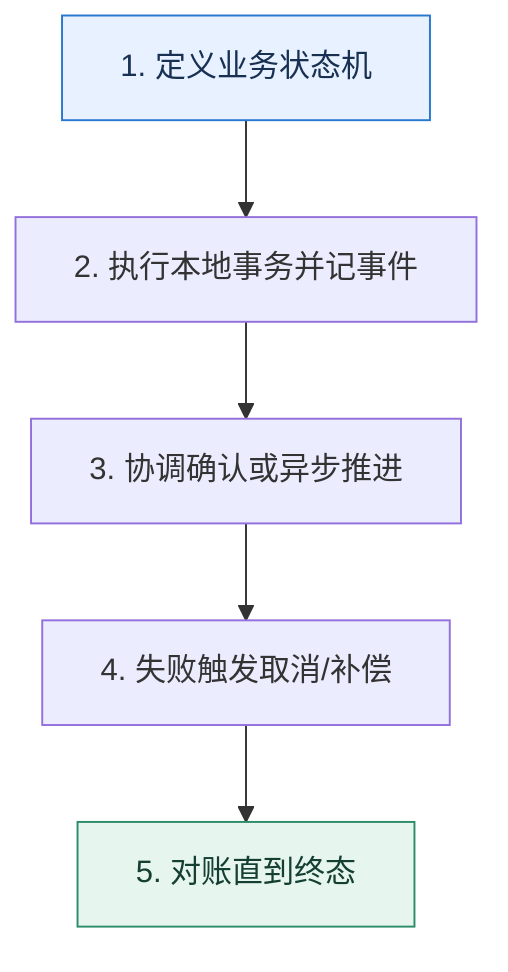

# 跨服务一致性｜在强协调、业务补偿和可用性之间选择

> 本课只解决一个问题：一个业务动作跨越多个数据库或服务时，怎样处理部分成功？

这不是原页面的缩写，也不是一组孤立结论。下面先建立一个能推演的最小世界，再把状态、数字和失败分支摊开，最后按来源讲解顺序覆盖全部知识线索。读完后，你应当能从 `定义业务状态机` 一直解释到 `对账直到终态`，并说明中途任意一步失败会留下什么状态。

## 零基础入口：先建立本课的心智画面

本地事务只能覆盖一个资源管理器的提交边界。跨资源后需要协调协议或把流程建模成可恢复状态机；选择取决于能否长时间锁资源、业务是否可补偿和一致性窗口。

先不要急着记组件名。只抓住四个问题：**现在手里有什么输入？下一步只做什么动作？哪个状态发生变化？变化后的结果交给谁？** 之后遇到新框架，只要这四个答案不变，核心机制就没有变。

### 放进一个足够小、可以手算的世界

创建订单需要锁库存、扣余额、生成订单。TCC 可先 Try 预留库存与余额，再 Confirm；失败则 Cancel 释放。Saga 可先建待支付订单、预占库存、扣款，某一步失败按逆序补偿。补偿不是数据库回滚：退款可能产生新流水并需要人工处理。

这个小世界故意只保留本课必需的对象。生产系统会有更多节点、线程、分片和异常，但数量增加不会改变这里的因果关系。先确认你能手算这个例子，再把数字替换成真实系统数据。

### 先预测，不要马上看结论

**Saga 的补偿操作为什么不能简单理解成数据库 ROLLBACK？**

先写下自己的判断，并指出你依赖的前提。文末自我检查会揭示答案；如果答案不同，回到下面的状态表找出第一个分叉点。

## 本节精讲：让机制一步一步发生

XA/两阶段提交用准备与提交协调多个资源，提供较强原子语义但协调器和锁持有影响可用性。TCC 把预留、确认、取消暴露给业务，侵入性高但控制清晰；Saga 把长事务拆成本地事务和补偿，接受中间状态；事务消息/Outbox 让本地数据与待发送事件同事务写入，再异步投递。所谓三阶段提交更多是理论扩展，不是常见业务默认方案。

### 可见状态推进

| 当前步 | 现在发生的动作 | 下一步拿到什么 |
| ---: | --- | --- |
| 1 | 定义业务状态机 | 执行本地事务并记事件 |
| 2 | 执行本地事务并记事件 | 协调确认或异步推进 |
| 3 | 协调确认或异步推进 | 失败触发取消/补偿 |
| 4 | 失败触发取消/补偿 | 对账直到终态 |
| 5 | 对账直到终态 | 得到可核对的终态 |

图只承担一个任务：让你看清状态如何向前移动。它不意味着每一步必然成功；网络超时、进程退出、重复执行和数据竞争都可能让箭头停在中间，因此后面必须继续讨论失效边界。

### 一次带数字的完整推演

创建订单需要锁库存、扣余额、生成订单。TCC 可先 Try 预留库存与余额，再 Confirm；失败则 Cancel 释放。Saga 可先建待支付订单、预占库存、扣款，某一步失败按逆序补偿。补偿不是数据库回滚：退款可能产生新流水并需要人工处理。

数字不是装饰。它迫使我们回答容量、顺序、时间窗口或版本选择问题。若换一个数字就得出不同结论，真正的设计依据就是那个阈值，而不是某个中间件名称。

## 按讲解顺序重建知识链：完整来源讲解

下面按来源资料的教学顺序重新编排完整内容。转换页码、来源图片、推广信息、水印、角色化问答和只服务于技术讨论场景的话术已经删除；机制、算法、例子、反例、事故线索、评论补充和限制条件仍然保留。这里的作用是补齐知识覆盖，不取代前面的独立推演。

我们在把单库拆分成为分库分表之后，一个巨大的挑战就是本地事务变成了分布式事务。事实上，即便没有分库分表，在微服务架构之下我们也还是会面临分布式事务的问题。所以，在学习了微服务架构又学习了分库分表之后，是时候深入讨论一下分布式事务了。

分布式事务在技术讨论中是一把双刃剑，用得好，那么会是一个非常强的加分项。但是如果你基础不够扎实，见闻不够广博，面分布式事务很容易翻车，所以熟练掌握分布式事务很重要。

希望你学完这节课的内容之后可以自信地在简历里写上精通分布式事务这一条，提高简历通过筛选的几率，同时也在技术讨论过程中给出有证据的判断，给技术评审者留下深刻印象。

### 先把机制拆开

关于分布式事务，首先你需要弄清楚一个东西，就是分布式事务既可以是纯粹多个数据库实例之间的分布式事务，也可以是跨越不同中间件的业务层面上的分布式事务。前者一般是分库分表中间件提供支持，后者一般是独立的第三方中间件提供支持，比如 Seata。你在工程复盘时，要根据上下文确定技术评审者问你的分布式事务是哪一类，然后有针对性地解释。

要学习分布式事务，我们要先学习分布式事务中几个比较常用的协议。

### 两阶段提交

两阶段提交协议（Two Phase Commit）是分布式事务中的一种常用协议，算法思路可以概括为参与者将操作成败通知协调者，再由协调者根据所有参与者的反馈情况决定各参与者要提交操作还是中止操作。

它可以分为两个阶段：准备阶段和提交阶段。

1. 准备阶段，协调者让参与者执行事务，但是并不提交，协调者返回执行情况。这个阶段参与者会记录 Redo 和 Undo 信息，用于后续提交或者回滚。
2. 提交阶段，协调者根据准备阶段的情况，要求参与者提交或者回滚，参与者返回提交或者回滚的结果。准备阶段任何一个节点执行失败了，就都会回滚。全部执行成功就提交。
两阶段提交协议的缺点很多。最大缺点是在执行过程中节点都处于阻塞状态。也就是节点之间在等待对方的响应消息时，什么也做不了。特别是如果某个节点在已经占有了某项资源的情况

下，为了等待其他节点的响应消息而陷入阻塞状态时，当第三个节点尝试访问该节点占有的资源时，这个节点也会连带着陷入阻塞状态。

此外，协调者也是关键，如果协调者崩溃，整个分布式事务都无法执行。所以，如果协调者是单节点，那么就容易出现单节点故障。而且协调者采用保守策略，如果一个节点在第一阶段没有返回响应，那么协调者会执行回滚。所以这可能会引起不必要的回滚。

而这里有一个问题，很少有人会想到。如果在第二阶段，协调者发送 Commit 的时候，参与者没有收到，会怎样？那么协调者会不断重试，直到请求发送成功。

但是如果参与者已经收到了 Commit 请求，但是在提交之前就宕机了又该怎样呢？

参与者在恢复过来之后会查看自己本地的日志，看有没有收到 Commit 指令，如果已经收到了，就会使用 Redo 信息来提交事务。

总的来说，两阶段提交协议是分布式事务中最常用的协议之一，它可以有效地保证分布式事务的一致性和可靠性。

### 三阶段提交

三阶段提交协议是在两阶段提交协议的基础上进行的改进，三阶段提交协议引入了一个额外阶段来确保在执行事务之前有足够的资源，减少两阶段协议引起的事务失败的可能。

在两阶段协议里面，比较容易出现的一个情况就是参与者在准备阶段辛辛苦苦把 Redo、Undo 写好，结果另外一个参与者说自己这边执行不了事务，要回滚。那么这个参与者就白费功夫了。

因此在两阶段提交的基础上，三阶段提交引入了一个新阶段，协调者会先问一下参与者能不能执行这个事务。所以整个三阶段提交协议的三个阶段是这样的：

1. 第一阶段（CanCommit）：协调者问一下各个参与者能不能执行事务。参与者这时候一般是检查一下自己有没有足够的资源。
2. 第二阶段（PreCommit）：类似于两阶段提交的第一个阶段，执行事务但是不提交。
3. 第三阶段（Commit）：直接提交或者回滚。

目前看来，三阶段提交协议并没有两阶段提交协议使用得那么广泛，原因有两个，一是两阶段提交协议已经足以解决大部分问题了，二是三阶段提交协议的收益和它的复杂度比起来，性价比有点低。

### XA 事务

XA 事务遵循了两阶段提交协议。我个人认为，两阶段协议是一种学术理论，而 XA 则是把两阶段提交协议具像化之后的一个标准。它定义了协调者和参与者之间的接口。用专业的术语来说，就是定义了事务管理器（Transaction Manager）和资源管理器（Resource Manager）之间的接口。

### 小结一下

这里我讲一个稍微有点争议的事情，也就是 XA 是否满足 ACID。我注意到网上有一部分人认为 XA，或者说两阶段提交协议，有数据一致性的问题，但是也有人认为 XA 是满足 ACID的。

我在两阶段提交那里说到在提交阶段，协调者会不断重试直到把 Commit 请求发送给协调者；协调者如果在提交阶段中途崩溃，也要确定是否需要提交或者回滚。那么你就应该可以理解，在重试成功之前，或者在协调者恢复过来重新提交或者回滚之前，数据是不一致的。

所以我个人倾向 XA 不满足 ACID。但是相比其他的方案，它更加接近 ACID。

### 把知识转成可验证的工程判断

关于分布式事务，你在公司需要弄清楚几个问题：

1. 如果公司使用了分库分表，那么是否允许跨库事务？
2. 如果允许跨库事务，那么是如何解决的？
3. 如果你使用了分库分表中间件，那么它支持哪些类型的事务？
4. 在微服务层面上，使用的是什么样的分布式事务方案？是 TCC、SAGA 还是 AT？
5. 当你在使用分布式事务的时候，中间步骤出错了你怎么办？

此外，你最好收集一些实际的案例，在工程复盘时作为证据。

正常来说，在技术讨论微服务架构的时候就有可能面到分布式事务。技术评审者可能会问这两个问题。

1. 在单体应用拆分成微服务架构之后，你怎么解决分布式事务？
2. 你们的服务是共享一个数据库吗？如果不是的话，你们怎么解决分布式事务问题？
当然，在分库分表里面也会有类似的问法。

在单库拆分之后，你怎么解决分布式事务问题？当你开启一个事务的时候，分库分表中间件做了什么？怎么在分库分表的事务里面保证 ACID？

有些时候技术评审者不会直接问分布式事务，而是问你数据一致性的问题，其实基本上也是问的分布式事务。他可能这样问：“如果你的 DELETE 语句，经过分库分表之后要删除多张表的数据，那你怎么保证数据一致性？”所以对于数据一致性的问题，你也要做好准备。

其实技术讨论翻车的一个主要原因就是你不熟悉各种异常情况的处理方案，所以在接下来我给你介绍的各种方案里面，容错都是一个比较重要的部分，也是你用来刷进阶推导的部分。

### 基本思路

一句话总结，就是既想要 ACID，又想要分布式事务，以目前的条件来说基本不可能。所以所有解决分布式事务的方案，立足点都是最终一致性。因此不管从哪里提到了分布式事务，如果技术评审者问起来，你都可以先从理论上强调这一点，关键词是最终一致性。

分布式事务或者说跨库事务基本上都只能依赖于最终一致性，ACID 是不太可能的。比如说常见的 TCC、AT、SAGA，又或者比较罕见的延迟事务，其实都是追求最终一致性。

这里提到了 TCC、AT 和 SAGA 这些比较具体的方案，你就可以根据后面的内容来进一步解释，或者等技术评审者询问。

注意，如果技术评审者认为 XA 是支持 ACID 的，那么他可能会问：“难道没有什么能够保证ACID 吗？”通过这种问题你就可以知道技术评审者的倾向了，那么你就可以抛开个人立场，解释XA 事务。

有，XA 事务可以看作支持 ACID。

如果技术评审者直接问 XA，那么你就可以按照自己的真实想法来解释。

### TCC 事务

TCC 是一个追求最终一致性，而不是严格一致性的事务解决方案，它不满足 ACID 要求。TCC是 Try-Confirm-Cancel 的缩写，它勉强也算是两阶段提交协议的一种实现。

Try：对应于两阶段提交协议的准备阶段，执行事务但是不提交。Confirm：对应于两阶段提交协议第二阶段的提交步骤。Cancel：对应于两阶段提交协议第二阶段的回滚步骤。

之所以给它一个新名字，完全是因为 TCC 强调的是业务自定义逻辑。也就是说 Try 是执行业务自定义逻辑，Confirm 也是执行业务自定义逻辑，Cancel 同样如此。

TCC 在微服务架构里面比较常用，Try 对应一个微服务调用，Confirm 对应一个微服务调用，Cancel 也对应一个微服务调用。不过一些分库分表中间件也支持 TCC 模式，但是比较罕见。

接下来你可以从两个角度深入讨论。

进阶推导一：TCC 与本地事务

其实在微服务架构中 Try-Confirm-Cacel 都对应一个微服务调用，你就可以猜测到，TCC 的任何一个步骤都可以是本地事务，所以你可以这样说：

在 TCC 里面，Try 可以是一个完整的本地事务，Confirm 也可以是一个完整的本地事务，Cancel 同样可以是一个完整的本地事务。

然后你可以用这个例子补充说明。

比如在我的某个业务里面，Try 本身就是插入数据，但是处于初始化状态，还不能使用。后续 Confirm 的时候就是把状态更新为可用，而 Cancel 则是更新为不可用，当然直接删除也是可以的。

不过 TCC 怎样都是会出错的，比如说在 Confirm 阶段出错或者出现超时，所以你是搞不清楚究竟有没有提交的。这里你可以补一句，引出下面的进阶推导。

TCC 用起来还是比较简单的，但是要想做好容错还是很不容易的。

进阶推导二：容错

实际上，正如我之前好几次提到的，容错很多时候就是重试，重试失败之后人工介入或者引入自动故障处理机制，后续尝试修复数据。

技术讨论的时候我们需要一步步分析，首先要分析出错的场景。

正常来说，TCC 里面 T 阶段出错是没有关系的。比如说前面的那个例子里，数据处于初始化状态的时候，其实后续业务是用不了的，也就不会有问题。但是如果在 Confirm 的时候出错了，问题就比较严重了。比如说一部分业务已经将数据更新为可用了，另外一部分业务更新数据为可用失败，那么就会出现不一致的情况。

紧接着讲解决方案，关键词是重试。

基本上这里就是只能考虑不断重试，确保在 Confirm 阶段都能提交成功。毫无疑问，不管怎么重试，最终都是要失败的，所以要做好监控和告警的机制。

这里我们提到了重试最终都可能失败，所以紧接着你就要进一步补充重试失败了之后怎么办。我给你两个方案，第一个方案是异步比较数据并修复。

我在后面搞了一个离线比对数据并修复的方案，就是用来查找这种相关联的数据的，一部分数据还处于初始化状态，但是一部分数据已经处于可用状态，然后修复那部分初始化的数据。

另外一个方案则是在读取数据的时候，如果发现数据不一致，那么就丢弃这个数据，同时触发修复逻辑。

在一些业务场景下，读请求是能够发现这种数据不一致的。那么它就会立刻丢弃这个数据，并且触发修复程序。

到这里 TCC 你已经讨论得比较深入了。接下来你可以考虑尝试把话题引到 SAGA。

TCC 整体来说是追求最终一致性的，和它类似的是 SAGA 事务，也是一个追求最终一致性的事务解决方案，也不满足 ACID 的要求。

### SAGA 事务

SAGA 的核心思想一句话就可以说明白，就是把业务分成一个个步骤，当某一个步骤失败的时候，就反向补偿前面的步骤。

很多人在介绍 SAGA 的时候会用回滚这个词来取代反向补偿，但是我认为这会让你误解SAGA，所以我这里就用反向补偿这个词。

我举一个例子，某个步骤是插入数据，如果是回滚的话，那么是指插入的时候没有提交，然后在业务失败的时候回滚。如果是反向补偿的话，那么是指插入的时候已经提交了，然后在业务失败的时候执行删除。

在聊到 SAGA 的时候，你可以简单介绍一下 SAGA 的基本理念，关键词是反向补偿。

SAGA 的核心思想是反向补偿事务中已经成功的步骤。比如说某个业务，需要在数据库 1和数据库 2 中都插入一条数据，那么在数据库 1 插入之后，数据库 2 插入失败，那么就要删除原本数据库 1 的数据。但是要注意，在最开始数据库 1 插入的时候，事务是已经被提交了的。

大部分人没有使用过 SAGA。我这里给出我曾经使用过一个实现比较复杂但是理论很简单的SAGA 调度机制，你可以用来刷进阶推导，关键词是并发调度。

早期我设计过一个比较复杂的 SAGA 机制，它支持并发调度。也就是说如果整个分布式事务中有可以并发执行的步骤，那么就并发执行，在后续出错的时候，这些并发执行的步骤也可以并发反向补偿。

SAGA 本身也是需要考虑容错的，难点就是在反向补偿的时候失败了怎么办？比如说在前面的例子里，你准备删除数据的时候失败了。那么还是没有特别好的办法，无非就是不断重试，这一部分你可以参考 TCC 中讨论的容错内容。

在讲完容错之后，紧接着你可以尝试把话题引导到 AT。

我个人认为最近比较流行的 AT 模式可以看作是 SAGA 的一种特殊形态，或者说简化形态。

### AT 事务

AT 是指如果你操作很多个数据库，那么分布式事务中间件会帮你生成这些数据库操作的反向操作。

这就有点类似于 undo log。比如说你数据库操作是一个 INSERT，那么对应的反向补偿操作就是 DELETE 了。你在解释的时候就可以结合 undo log 一起解释，顺便把话题引导到 undo log 上。

AT 模式的核心是分布式事务中间件会帮你生成数据库的反向操作，比如说 INSERT 对应的就是 DELETE，UPDATE 对应的就是 UPDATE，DELETE 对应的就是 INSERT。这个机制有点类似于 undo log。

同样地，AT 事务也有容错的问题，它的容错和 SAGA 一样，都是在反向补偿的时候出错了该怎么办。这里我就不赘述了，你可以参考前面的内容。

在解释了这些内容之后，你还可以进一步强调可以考虑禁用跨库事务。

如果是单纯使用分库分表，不涉及多个服务的分布式事务，可以考虑直接禁用跨库事务，一了百了。

### 禁用跨库事务

在实践中，解决分库分表中的分布式事务问题，最简单的方式就是直接禁用跨库事务。正常来说，在分库分表之后，你的业务就应该操作特定的某个数据库中的某个表。最多就是操作某个数据库上的某几张表，跨库本身就是一个不好的实践。

所以可以从公司规范上直接禁用了跨库事务。

某个线上系统是直接禁止跨库事务。所以在分库分表之后我们要做的就是改造业务代码，确保不会出现跨库事务。

但是这样又有点太牵强了，那么你接下来就可以补充说明如果真的要使用跨库事务，你可以怎么解决，也就是把话题引导到延迟事务这个方案上。

### 进阶推导方案：延迟事务

这算是分库分表中间件经常采用的方案。从理论上来说这个方案其实并不比 SAGA 复杂，但是 TCC、SAGA 和 AT 属于烂大街的答案，你拉不开差距，而延迟事务可以。

在分库分表中间件眼里，当你执行 Begin 的时候，它是无法预测你接下来会在哪些数据库上面开启事务的。

比如说，在同一个场景下，某个请求过来，你处理的时候在分库分表中间件上调用了 Begin方法，这个请求最终在 user_db_0 和 user_db_1 上开启了事务；但是另外一个请求过来，因为参数不同，它可能最终在 user_db_2 上开启了事务。

所以中间件只有两个选择，要么在 Begin 的时候就在全部数据库上开启事务，要么就是延迟到执行具体 SQL 的时候，知道要在哪些数据库上执行，再去开启事务。

而在 Begin 的时候就直接开启事务过于粗暴，毕竟后面有些 DB 根本不会有任何查询。

因此，延迟事务应用更加广泛，它可以避免在用不上的数据库上开启事务的问题。

这时候，你就可以对比全开事务和延迟事务这两种思路。

默认情况下，我们使用的是延迟事务。在正常的情况下，当我们执行 Begin 的时候，其实并不知道后续事务里面的查询会命中哪些数据库和数据表，那么只有两个选择，要么Begin 的时候在所有的分库上都开启事务。但是这会浪费一些资源，毕竟事务不太可能操作所有的库，因此才有了延迟事务。也就是在 Begin 的时候，分库分表中间件并没有真的开启事务，而是直到执行 SQL 的时候，才在目标数据库上开启事务。

举例来说，如果 SQL 命中了数据库 db_0，这个时候 db_0 还没有开始事务，那么就会直接开启事务，然后执行 SQL；如果又来了一个 SQL，再次命中了 db_0，此时 db_0 上已经开启了事务，因此直接使用已有的事务。在提交或者回滚的时候，就提交或者回滚所有开启的事务。不过提交或者回滚的时候，部分失败的问题比较难以解决。

这里你故意提到了部分失败的问题，是为了引导后续继续追问。所谓部分失败是指在COMMIT 的时候，某些数据库 COMMIT 成功了，但是另外一些数据库 COMMIT 失败了怎么办？当然，回滚也有类似的问题。

其实这里没有完美的解决方案，只能考虑重试，类似于在讨论 TCC、SAGA 和 AT 的时候那样。

部分失败并没有更好的解决办法。我们这里就是在 Commit 的时候，如果发现某个数据库失败了，那么会立刻发起重试。如果连续重试失败，就会触发告警，人工介入处理。

这里我再给出一个处理重试失败的高级方案。你可以用我们在高可用微服务架构里面提到的自动故障处理机制。

在重试失败的时候，最开始某个线上系统就是告警，然后人手工介入处理。后来我改进了这个机制，引入了自动故障处理机制。也就是说如果一个事务里面部分数据库提交或者回滚失败，触发告警，然后自动故障处理机制就会根据告警的上下文来修复数据。

修复数据本身分成两种，一种是用已经提交的数据库的数据来修复没有提交成功的数据库的数据；另外一种则是用没有提交成功的数据库的数据来还原已经提交的数据库的数据。具体采用哪种，根据业务来决定。

在我引入这个机制之后，很多业务都接入了自己的自动修复逻辑，整体上数据出错之后的持续时间和出错本身的比率都大幅度下降了，系统可用性提升到了三个九。

实际上，这种自动修复的逻辑是跟业务强相关的，所以你可以提供一些简单的通用处理机制，但是如果比较复杂的话，就需要业务方来控制如何修复了。

### 本节原始知识线索收束

这一节课你需要掌握两阶段提交协议、三阶段提交协议和 XA 协议的基本步骤这几个重要的知识点。到分布式事务的具体解决方案上，如果是跨服务的分布式事务，那么可以考虑 TCC、SAGA 和 AT。你在解释的时候尤其要注意讨论容错部分。

容错基本上就是重试，重试失败之后就有三种方案，分别是：

监控 + 告警 + 人手工介入处理；读请求 + 数据修复；监控 + 告警 + 故障自动处理。

如果是单纯的分库分表跨库事务，那么可以考虑延迟事务，同时它也是我给你提供的进阶推导方案。

此外，这一节课我又演示了一个技术讨论小技巧，就是顺着技术评审者的立场解释。在我们的技术领域，并不是所有答案都有对错之分，有一些是立场之分、偏好之分。如果你摸不清技术评审者的偏向，你就按照自己的本心解释。如果你的解释技术评审者不满意，也就是你的偏向和他的偏向不一致，他一路杠到底，你就直接认怂。

不太建议你和技术评审者杠到底，毕竟你出去技术讨论，遇到一个什么样的技术评审者是未知数，而人往往喜欢和自己相似的人。你也不用觉得丢人，毕竟技术讨论求职生存下来是王道，挣钱嘛，不寒碜。

### 继续推演

最后你来思考 2 个问题。

在 XA 事务里面，我提到了一个有点争议的点，即 XA 究竟算不算满足了 ACID，你是怎么看这个问题的？欢迎你分享自己的观点。在分布式事务里面，我提到了三种容错措施，你还有没有使用过别的容错方案？可以分享一下。

### 补充讨论与边界校准

#### 全部留言 (9)

补充讨论：

讲解补充：我持怀疑态度。我个人理解，分布式事务里面，如果事务协调者，事务参与者没有什么 re do 和 undo log 之类的东西，我个人认为它们不可能达成强一致性。但是问题又来了，事务协调者还要考虑 ACID 中的 AID 问题，不仅仅是一致性。举个例子，在意图保证强一致性的场景里面，你要不要考虑隔离性的问题？一个分布式事务能不能看到另外一个分布式事务的修改？

所以，综合来说，我持怀疑态度。之前听过一点银行的技术分享，他们说的强一致性其实都是最终一致性，总是有不一致的问题。也可能是我孤陋寡闻了。

2

补充讨论： 调 cancel 不行吗

讲解补充：你可以调 cancel，但是问题在于，万一一部分人已经 confirm 成功了呢？

补充讨论：

讲解补充：基本上分库分表中间件都会实现吧，因为这是最简单的事务形态了。

实际中你就用装饰器，装饰不同 DB 的事务。然后当要执行操作的时候，你就看看有没有开事务，没有你就开事务，有了你就直接用已有的事务。

补充讨论： TCC 另外一个方案中，进行丢掉这个数据，这里图片好像没有看到丢掉这个流程耶问题2: AT事务下会帮你生成反向操作。有哪些分布式事务中间件支持这种反向操作呀问题3: 业务A调用业务B，业务A根据业务B的执行情况来确定是继续执行，还是回滚，这种也属于分布式事务么问题4：并发高的业务，分布式事务频繁失败情况下，会不会导致不一致的情况越来越严重？虽然有自动修复进行缓解。

其他的：“也就是把话题引导到延迟事务这个方案方案上”，是不是多了一个“方案”两个词“只有db_2上开启的事务用上了”图片这里应该是db_1吧

讲解补充：1. 虽然画了返回响应，但是不是说返回正确响应，而是返回一个异常响应。其实如果你是同步修复的话，你可以修复了之后返回正确顺序

2. 据我了解，seata 是支持的
3. 分布式事务这个词已经被用烂了，所以这里这么说也没错。
4. 如果分布式事务频繁失败，你关心的就不是数据一致性了，你要首先解决频繁失败的问题。正常来说，失败比率都是低于万分之一的。比如说以前我们一天百万的数据，不一致的数据也不到个位数。
db_2 的我没找到，感谢纠正。

补充讨论：

讲解补充：我看起来是差不多，我觉得 AT 就是一种在 SQL 层面上的 SAGA。个人观点。

补充讨论： ”只有一份数据,假如我db1 rollback失败,此时db0之前已经提交了数据,我怎么用已提交的数据修复未提交的?他们数据没有冗余呀

讲解补充：你这个场景我其实没有理解。就是如果 db0 是提交的话，那么 db1 也是提交，不会出现 d b0 提交，db1 回顾的场景。

如果 db0 提交成功了，但是 db1 没有提交成功，那么就用 db0 的数据去修复 db1。

补充讨论： L不能共用一个事务吧。Q5：对数据库进行修复会影响业务吗？如果会影响，会采取哪些措施？

讲解补充：1. 这个要看业务。成功率是一个不够准确的定义，你应该说取得一致性的时间是多长，以及没有办法达成一致的比率有多高。实际上，你应该做到和你的可用性一致。比如说正常，我们都会要求最终不一致的数据，每天应该控制在个位数。太多了你手工修复很要命的。

2. 我个人认为，是 seata 里面引入的。我比较孤陋寡闻，没见着别的地方哟用。我自己理解的话喜欢把它说成是 SAGA 的自动化的特殊形态。
3. 嘿嘿，如果你的分库分表中间件做得好，那么就没有。有些分库分表中间件是语句维度来调度的，所以搞不好也引入了分布式事务。
4. 对的
5. 主要是小心并发。比如说你数据出错了，你准备去修复。但是你修复之前，可能另外一个请求又把错误的数据更新为新数据了，但是这个新数据是对的。所以最好是在修复的时候要根据更新时间、版本号之类的来判断一下，避免出现并发覆盖的问题。

补充讨论： 协调者让参与者执行事务，但是并不提交，协调者返回执行情况 这里是不是参与者返回执行情况呢。 我在两阶段提交那里说到在提交阶段，协调者会不断重试直到把 Commit请求发送给协调者；协调者如果在提交阶段中途崩溃，也要确定是否需要提交或者回滚。那么你就应该可以理解，在重试成功之前，或者在协调者恢复过来重新提交或者回滚之前，数据是不一致的。这句话好像有点小问题吧。 两阶段提交如果a参与者成功了,b参与者失败了,那么是不是只能人工处理或者有个修复数据的脚步进行修复呢? 关于容错,如果协调者挂了,那么参与者1是否可以询问其他参与者情况呢

讲解补充：1. 是参与者返回执行情况。

2. b 参与者如果在准备阶段就失败了，那么直接回滚，这个应该没什么疑问。问题是在 commit 阶段，如果 b 参与者 commit 失败了怎么办。那么按照两阶段提交协议的要求，b 参与者这时候是不能commit 失败的，b 要不断重试，或者用别的手段保证自己的成功。但是，显然这也是一个不现实的要求，所以 b commit 最终失败之后，肯定要人工介入的。这你也可以看出来，又出现了不一致。从理论上来说，协调者在发现 b 死活不能提交成功之后，那么 a 提交的数据应该也要处于一种不可用的状态，可惜的是，我们也做不到。
3. 参与者可以考虑询问。但是这里有一个问题，就是你问几个人呢？比如说十个节点里面，你问了六个人，三个人告诉你提交，三个人告诉你不知道，这时候你是提交还是不提交？那三个不知道的，又该怎么办？所以整体这需要一个比较复杂的机制。

补充讨论：

## 把完整讲解收束成一条因果链

1. 先用两阶段提交理解协调者、准备和阻塞成本。
2. 再比较 XA、TCC、Saga、AT/代理模式的侵入性和一致性。
3. 说明某些高性能场景可以禁止跨库事务，改用分片内聚合。
4. 最后用延迟执行或 Outbox 把短本地事务与长业务流程分开。

把这几步连接起来时，不要省略“为什么”。最终结论只有在前提、状态变化和失败代价都说得清楚时才可靠。

## 误区与失效边界

最终一致不等于随便异步。每一步仍需幂等、可重试、可观测和人工兜底。补偿也不一定能完全还原现实世界副作用，例如已经发送的短信无法“撤回”。

再加一条通用但必须落实到本课对象上的边界：机制只能处理它看得见的信号。若输入指标失真、状态没有持久化、错误被吞掉，或者补偿没有幂等保护，再成熟的框架也只能基于错误证据作决定。

### 三种故障注入方式

| 故障 | 要观察什么 | 不能接受的解释 |
| --- | --- | --- |
| 在第 2 步前让依赖超时 | 是否停在可重试状态，是否消耗完上游预算 | “框架稍后会处理” |
| 在状态写入后让进程退出 | 重启后能否识别已完成与待继续动作 | “再执行一次应该没事” |
| 对同一输入并发执行两次 | 是否出现重复副作用、顺序颠倒或覆盖 | “概率很低” |

## 工程验证：把理解变成可以复查的证据

为业务状态画转移表：`当前状态、允许事件、幂等键、下一状态、补偿动作、超时动作、人工入口`。如果某个中间状态没有出路，就存在永久悬挂风险。

| 步骤 | 状态或动作 | 最少应留下的证据 |
| ---: | --- | --- |
| 1 | 定义业务状态机 | 开始时间、结束时间、输入标识、结果状态、异常原因 |
| 2 | 执行本地事务并记事件 | 开始时间、结束时间、输入标识、结果状态、异常原因 |
| 3 | 协调确认或异步推进 | 开始时间、结束时间、输入标识、结果状态、异常原因 |
| 4 | 失败触发取消/补偿 | 开始时间、结束时间、输入标识、结果状态、异常原因 |
| 5 | 对账直到终态 | 开始时间、结束时间、输入标识、结果状态、异常原因 |

验证时同时记录成功路径和失败路径。只证明“正常时能跑通”不能说明设计可靠；至少要让一次超时、一次进程退出和一次重复请求可重现，并能根据日志或指标解释最后状态。

## 学完检查：闭卷画出本课

你现在应该能独立完成四件事：

1. 用自己的话说出本课唯一问题，不使用产品名也能解释。
2. 复算上面的具体例子，并指出哪个输入改变会让结论改变。
3. 沿 Mermaid 图注入一次失败，预测系统停在哪里以及由谁收敛。
4. 说出本课机制不保证什么，并给出一个反例。

## 自我检查

Saga 的补偿操作为什么不能简单理解成数据库 ROLLBACK？

前面的本地事务已经提交，补偿是一个新的业务动作，可能失败、重试并留下审计记录，也可能无法完全撤销外部副作用。

怎样证明自己不是只记住了名词？

把 `定义业务状态机` 的一个真实输入写出来，逐步记录到 `对账直到终态`。然后在中间任意一步制造失败；如果你能解释当前状态、下一责任方、可观测证据和恢复边界，就已经拥有可以迁移的工程模型。

## 来源与事实校准

- [查看完整来源稿（本地 24 页资料）](../content/18-distributed-transactions.md)

### 当前事实校准

MySQL XA 提供两阶段式资源协调能力，但只覆盖参与 XA 的资源管理器。消息、HTTP 第三方和人工流程不因数据库 XA 自动获得原子性；这类跨边界流程仍要用可恢复状态、幂等和补偿建模。

- [MySQL 8.4 · XA Transactions](https://dev.mysql.com/doc/refman/8.4/en/xa.html)

来源稿用于核对覆盖范围，不随公开站点发布。产品默认值和具体内部行为可能随版本变化；落地时应使用目标版本的官方文档、可运行实验和故障演练校准。本学习稿中的零基础入口、状态推演、故障矩阵和工程验证属于编辑补充，不冒充来源讲解者的原话。
