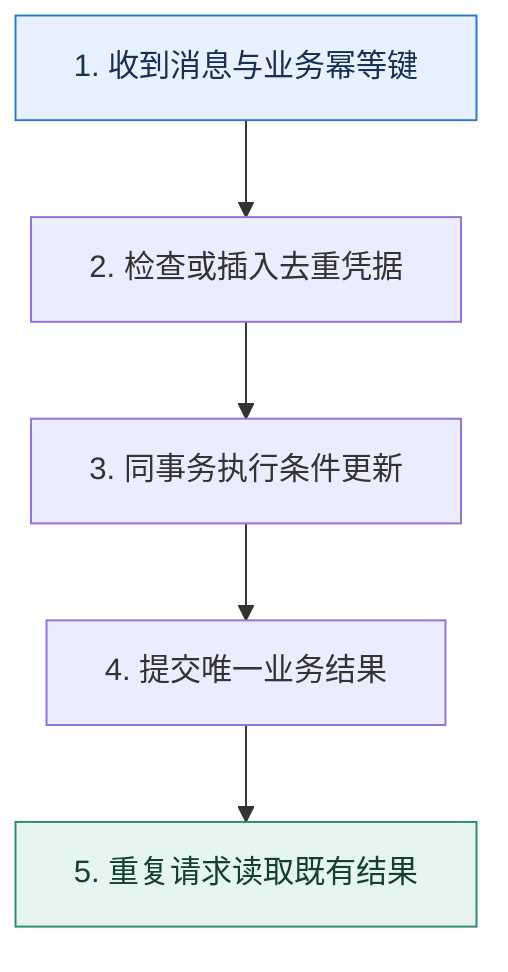

# 重复消费｜把至少一次投递变成一次业务效果

> 本课只解决一个问题：消息可能重复到达时，怎样保证余额、库存和通知不会重复产生副作用？

这不是原页面的缩写，也不是一组孤立结论。下面先建立一个能推演的最小世界，再把状态、数字和失败分支摊开，最后按来源讲解顺序覆盖全部知识线索。读完后，你应当能从 `收到消息与业务幂等键` 一直解释到 `重复请求读取既有结果`，并说明中途任意一步失败会留下什么状态。

## 零基础入口：先建立本课的心智画面

重试是可靠投递的正常组成部分，不是异常角落。幂等的含义不是代码执行一次，而是同一个业务请求重复执行后，可观察结果与执行一次相同。

先不要急着记组件名。只抓住四个问题：**现在手里有什么输入？下一步只做什么动作？哪个状态发生变化？变化后的结果交给谁？** 之后遇到新框架，只要这四个答案不变，核心机制就没有变。

### 放进一个足够小、可以手算的世界

扣款消息 E77 到达两次。事务先插入 `processed_event(E77)`，唯一索引只允许一次，再执行 `UPDATE account SET balance=balance-100 WHERE ...`。第一次共同提交；第二次插入冲突后读取已有结果并返回成功。若扣款与去重分开提交，任一中间崩溃都可能多扣或漏扣。

这个小世界故意只保留本课必需的对象。生产系统会有更多节点、线程、分片和异常，但数量增加不会改变这里的因果关系。先确认你能手算这个例子，再把数字替换成真实系统数据。

### 先预测，不要马上看结论

**为什么只用 Redis `SETNX` 记录消息已处理，仍不足以保护余额扣减？**

先写下自己的判断，并指出你依赖的前提。文末自我检查会揭示答案；如果答案不同，回到下面的状态表找出第一个分叉点。

## 本节精讲：让机制一步一步发生

优先选择天然幂等的状态覆盖或条件更新；非幂等动作使用业务幂等键和数据库唯一约束。去重记录与业务结果应在同一本地事务内提交，否则“记录已处理但业务失败”或相反仍有空隙。Redis 和布隆过滤器可在前面挡掉大量明显重复，但缓存丢失、过期或误判不能作为资金类最终凭据。通知等外部副作用要向对方传幂等键，或采用待发送表与状态机。

### 可见状态推进

| 当前步 | 现在发生的动作 | 下一步拿到什么 |
| ---: | --- | --- |
| 1 | 收到消息与业务幂等键 | 检查或插入去重凭据 |
| 2 | 检查或插入去重凭据 | 同事务执行条件更新 |
| 3 | 同事务执行条件更新 | 提交唯一业务结果 |
| 4 | 提交唯一业务结果 | 重复请求读取既有结果 |
| 5 | 重复请求读取既有结果 | 得到可核对的终态 |

图只承担一个任务：让你看清状态如何向前移动。它不意味着每一步必然成功；网络超时、进程退出、重复执行和数据竞争都可能让箭头停在中间，因此后面必须继续讨论失效边界。

### 一次带数字的完整推演

扣款消息 E77 到达两次。事务先插入 `processed_event(E77)`，唯一索引只允许一次，再执行 `UPDATE account SET balance=balance-100 WHERE ...`。第一次共同提交；第二次插入冲突后读取已有结果并返回成功。若扣款与去重分开提交，任一中间崩溃都可能多扣或漏扣。

数字不是装饰。它迫使我们回答容量、顺序、时间窗口或版本选择问题。若换一个数字就得出不同结论，真正的设计依据就是那个阈值，而不是某个中间件名称。

## 按讲解顺序重建知识链：完整来源讲解

下面按来源资料的教学顺序重新编排完整内容。转换页码、来源图片、推广信息、水印、角色化问答和只服务于技术讨论场景的话术已经删除；机制、算法、例子、反例、事故线索、评论补充和限制条件仍然保留。这里的作用是补齐知识覆盖，不取代前面的独立推演。

今天我们来讨论一个在消息队列里面非常常见的话题——重复消费。

通过前面几节课的学习，我相信你已经发现了，很多方案都会引起一个问题：消息重复发送或者重复消费。而解决的思路基本上一致，就是把消费者设计成幂等的。也就是说，同一个消息，不管消费多少次，系统状态都是一样的。

另外一个经常和幂等联系在一起的话题就是重试。就像你在微服务部分接触到的那样，为了提高可用性，我们经常会引入各种重试机制。而重试的一个前提就是重试的动作必须是幂等的。所以，在技术讨论中幂等是一个绕不开的话题。只不过大部分人在讨论幂等的时候，只能想到使用唯一索引，而且即便解释唯一索引，也很难深入。

所以今天我就带你从重复消费讨论到幂等，最后给出一个非常强大的高并发幂等方案，确保你在工程复盘时可以赢得竞争优势。

### 布隆过滤器

布隆过滤器（Bloom Filter）是一种数据结构，它可以用于检索一个元素是否在一个集合里。它的优点是空间效率和查询时间都远远超过一般的算法，缺点是存在假阳性的问题，还有对于删除操作不是很友好。

布隆过滤器的基本思路是当集合加入某个元素的时候，通过哈希算法把元素映射到比特数组的N 个点，把对应的比特位设置成 1。

在查找的时候，只需要看对应的比特位是不是 1，就可以粗略判断集合里有没有这个元素。

如果查询的元素对应的 N 个点都是 1，那么这个元素可能存在。如果布隆过滤器认为一个元素存在，但是实际上并不存在，也叫做假阳性。

任何一个点是 0，那么这个元素必然不存在。

因此布隆过滤器经常和其他手段结合在一起判断某个元素在不在。它在判断某个元素必定不存在的场景下，效果非常好。

和布隆过滤器类似的还有 bit array，也叫做 bit map。它也是用一个比特位来代表元素是否存在，1 代表存在，0 代表不存在。它和布隆过滤器的核心区别是它不需要哈希函数，因为它的值本身就是一个数字。比如说，你的用户 ID 是数字，那么你就可以把 ID 当成 bit array 的下标，对应位置的比特位是 1。

并且，bit array 不存在假阳性的说法，它的判断是精确的。

### 重复消费的可能原因

重复消费的可能原因有 2 种。

1. 生产者重复发送。比如说你的业务在发送消息的时候，收到了一个超时响应，这个时候你很难确定这个消息是否真的发送出去了，那么你就会考虑重试，重试就可能导致同一个消息发送了多次。
2. 消费者重复消费。比如说你在处理消息完毕之后，准备提交了。这个时候突然宕机了，没有提交。等恢复过来，你会再次消费同一个消息。
在避免重复消费的实践中你就记住一个原则：一定要把消费逻辑设计成幂等的。你的微服务也要尽可能设计成幂等的，这样上游就可以利用重试来提高可用性了。另外我要说明一点，现在大多数消息中间件都声称自己实现了恰好一次（exactly once）语义，都是依赖于重试和幂等来达成的。

### 把知识转成可验证的工程判断

在技术讨论前，你需要弄清楚一些信息。

你负责的业务里面有没有接口或消费者是要求幂等的？如果有，你是如何解决幂等的？如果你依赖于唯一索引来解决幂等，那么这部分的写流量有多大？如果你依赖于唯一索引来解决幂等，那么你是怎么保证业务操作和将数据插入到唯一索引是同时成功，或者同时失败的？你或者你的同事有没有因为没有设计幂等，或者幂等方案有问题而引起线上事故？如果有，你是怎么解决的？你的业务是否使用过布隆过滤器，如果有，当时用来解决什么问题？

重复消费、重试、幂等是我们设计系统的时候经常要解决的问题，所以你可以在项目介绍或者自我介绍的时候主动提起你设计过比较复杂的幂等解决方案。还有在技术讨论过程中，如果你和面

试官聊到了布隆过滤器，那么你可以主动提起你用布隆过滤器实现过幂等方案。类似地，聊到了 bit array 也可以提起你的幂等方案。当你们聊到 Redis 的 key 过期时间该怎么确定的时候，你可以用幂等方案里的 Redis key 过期时间的计算方式来作为例子。

下面我们来看一下关于重复消费的基本技术推理路径。

### 基本思路

在工程复盘时，不管你是提到重试还是提到重复消费，技术评审者大概率都会问你怎么解决幂等的问题，你可以先介绍一个简单的思路，就是利用唯一索引。

最简单的幂等方案就是利用唯一索引。比如说在业务处理的时候，先根据消息内容往业务表里面插入一条数据，而这个业务表上有唯一索引。如果插入成功了就说明这个消息没有被处理过，可以继续处理。如果插入的时候出现了唯一索引错误，那就说明这个消息之前被处理过了。

如果想要用这个简单的方案给出有证据的判断，就需要补充足够多的细节。第一个进阶推导就是深入讨论究竟是怎么将数据插入到唯一索引的。

### 本地事务将数据插入到唯一索引

在这个方案里面，当我第一次处理请求的时候，我把数据插入到唯一索引成功了，万一我后面处理业务失败了怎么办？

这个时候你应该使用事务。也就是说，你收到消息之后就开启一个本地事务。在这个本地事务里面你会同时完成业务操作和将数据插入到唯一索引这两个操作，然后提交。当然，很多情况下这个插入唯一索引的操作本身就是你业务操作的一部分。

在这种机制之下，只会出现一种情况，就是事务提交了，但是提交消息失败了。显然你会再次消费同一条消息，但因为你的事务都已经提交了，所以你下次消费的时候就会遇到唯一索引冲突的错误。

如果你没有提交本地事务呢？那就说明你这个消息消费本身就失败了，应该再次重试。所以你可以进一步补充这个细节。

要使用唯一索引，最好的方式是把唯一索引和业务操作组合在一起，做成一个事务。也就是在收到消息的时候先开启事务，把数据插入到唯一索引，然后执行业务操作，最后提交事务。提交事务之后，就认为业务已经成功了，就算接下来提交消息失败了也没关系，因为后面重复请求还是会被唯一索引拦下来。不过万一不能使用本地事务，比如说在分库分表的条件下，那么解决方案就会更加麻烦。

这最后一句可以把话题引向另一个进阶推导。

### 非本地事务将数据插入到唯一索引

如果没有本地事务，业务操作和将数据插入到唯一索引的操作就不能看作是一个整体，无法保证要么都成功，要么都失败。这时候，只能追求最终一致性，依赖于一个第三方来检测了。

这种情况下整个方案的执行步骤也不一样，它分成 3 步。

1. 把数据插入到唯一索引，但是这个时候状态被标记为初始状态。注意这一步一定要先执行，这是避免重复处理的关键。
2. 执行业务操作。
3. 将唯一索引对应的数据标记为完成状态。
出问题的地方就是第二步成功了，但是第三步失败了。这时候你就需要使用一个异步检测系统，这个异步检测系统会定时扫描唯一索引的表，然后再去扫描业务表。这个时候会有两种情况。

如果业务表的数据表明业务操作已经处理成功了，那么这个异步检测系统就会把唯一索引更新为成功状态。

如果业务表的数据表明业务操作没有成功，那么异步检测系统可以直接触发重试。

所以你抓住关键词异步检测来解释。

在不能使用本地事务的时候，实现幂等就更加麻烦了，因为我们不能再把业务操作和将数据插入到唯一索引这两步做成原子操作。所以我们的解决方案是追求最终一致性，基本步骤是这样的。首先把数据插入到唯一索引里面，避免重复消费，这个时候数据保持在初始化状态。然后执行业务操作，执行业务操作之后，把唯一索引里的数据更新为成功状态。

那么会出问题的地方就是第二步成功了，但是第三步失败了。在这种场景下，需要启动一个异步检测系统定时扫描初始状态的唯一索引数据。这个异步检测系统会检测唯一索引的数据和业务数据，判断是否一致。如果不一致，那么如果这个时候业务操作已经成功，那么就把唯一索引的数据标注为成功；如果这个时候业务失败了，那么就应该触发重试。

到这一步，我觉得就算是单纯用唯一索引这个解决方案来技术讨论，你也可以和其他学习者已经拉开差距了。不过我还有一个更加强大的方案，能让你的优势更加明显。

### 进阶推导方案：布隆过滤器 + Redis + 唯一索引

这里我给你一个非常高级的方案，这个方案综合运用了大数据处理中常见的布隆过滤器、Redis 和唯一索引。从思路上来说，就是四个字层层削流。从目标上来说，就是确保到达数据

库的流量最小化。

前面的基本方案里我们讨论的是使用唯一索引，并且提及了这种方案的缺陷，就是性能完全取决于数据库的性能。很明显，数据库是撑不住高并发的，尤其是高并发写流量。所以我们就要想尽一切办法让流量在到达数据库之前就返回了。

这时候我们就需要一个高效的数据结构，帮助我们判断某个请求或者消息是否已经被处理过了。布隆过滤器就非常适合用来解决这个问题。但是布隆过滤器本身存在假阳性的问题。也就是说，一个消息明明没有被处理过，但是布隆过滤器可能误报你处理过了。所以我们可以在布隆过滤器之后再加一个 Redis，存储近期处理过的业务 key。

所以整个流程就变成了图片中展示的这样。

在工程复盘时你可以先介绍下这个方案的基本流程。

我在公司设计过一个高并发的幂等方案。这个幂等方案需要用到布隆过滤器、Redis 和唯一索引。方案的基本思路是，如果依赖于数据库唯一索引来判断幂等，那么数据库撑不住高并发。所以我们就想办法在使用唯一索引之前，尽可能先削减流量。这个场景就非常适合使用

布隆过滤器。而为了避免假阳性的问题，进一步降低发送到数据库的流量，在布隆过滤器和数据库之间再引入一个 Redis。

基本流程是这样的：

首先，一个请求过来的时候，我们会利用布隆过滤器来判断它有没有被处理过。如果布隆过滤器说没有处理过，那么就确实没有被处理过，可以直接处理。如果布隆过滤器说处理过（可能是假阳性），那么就要执行下一步。

第二步就是利用 Redis 存储近期处理过的 key。如果 Redis 里面有这个 key，说明它的确被处理过了，直接返回，否则进入第三步。这一步的关键就是 key 的过期时间应该是多长。

第三步则是利用唯一索引，如果唯一索引冲突了，那么就代表已经处理过了。这个唯一索引一般就是业务的唯一索引，并不需要额外创建一个索引。技术评审者大概率会先问你布隆过滤器的基本知识，然后追问其中的一些细节，现在我们一个一个看。

### 更新顺序

第一个问题：业务方第一次处理完这个请求，我们该怎么更新这个系统？先更新布隆过滤器，还是先更新 Redis，或者是先更新数据库的唯一索引？

答案是先更新数据库的唯一索引，因为数据库里的数据是最准确的。

如果业务方是第一次执行这个请求，它需要把更新数据库的操作放到自己的业务本地事务里面。等业务方提交的时候，一起提交。在数据库事务提交之后，再去更新布隆过滤器和Redis。这时候失败了影响也不大，因为最终重复请求被处理的时候，会因为唯一索引冲突而报错，这时候我们就知道这个请求是重复请求了。

后面无论是先更新布隆过滤器，还是先更新 Redis，或者并发更新，都是可以的，这一点不太重要。

可以说这个方案最终都是要依靠唯一索引来兜底的。也就是说不管什么原因导致布隆过滤器或者 Redis 没生效，只要跑到了插入唯一索引这一步，都可以确保你最终不会重复处理消息或者请求。

### Redis key 的过期时间

刚刚我提到了一个关键点，就是 key 的过期时间应该多长这个问题。简单来说，Redis 的作用就是在布隆过滤器之后进一步削减流量，而 key 的过期时间就决定了削减流量的效果，所以只需要确保重复请求过来的时候，这个 key 还没过期就可以了。

如果技术评审者问起来，你可以这么解释。

Redis 这一步是为了进一步削减流量，关键就是要确保重复请求过来的时候，key 还没过期。举个例子，假如说预计某个特定业务的重试请求会在 10 分钟内到达，那么可以把过期时间设置成 11 分钟，多出来的一分钟就是余量。

这个地方你也可以进一步总结一下。

但是如果并发非常高，以至于 key 非常多，也要考虑 Redis 能不能放下这么多 key。另外一个就是有些业务的重试间隔非常长，比如说一小时，这就不太适合引入 Redis 了。可以考虑使用这个方案的简化版本。

### 简化方案

这个三合一的方案，也可以简化成二合一方案。第一种就是布隆过滤器 + 唯一索引。这种方案就比较适合重试间隔非常大的业务。

还可以简化成 Redis + 唯一索引，如果 Redis 资源足够，而且数据库性能比较差，那么这个方案要更好一点。

你可以介绍一下这两个方案。

如果说业务并发不是特别高，或者说不想用这么复杂的方案，那么可以考虑使用简化方案。

第一种简化方案就是只用布隆过滤器和唯一索引。如果 Redis 资源不足，又或者重复请求间隔太长，导致使用 Redis 的效果不好，那么就比较适合用这个简化方案。第二种简化方案就是只用 Redis 和唯一索引。Redis 资源多，又或者担心布隆过滤器的假阳性问题，就可以采用这个方案。

最后总结一下。

其实最开始的时候我是建议用第一个简化方案的，后面如果发现假阳性问题非常严重，那么就可以引入 Redis。

接下来，我们从优化性能的角度来看，第一个可以考虑的就是本地布隆过滤器。

### 本地布隆过滤器

当看到本地两个字的时候，我不知道你有没有想起前面很多节课里面，我都提过类似的解决方案。这里我要再一次使用本地内存来进一步提高性能了。整体思路是利用一致性哈希等类型的算法执行负载均衡，确保同一个 key 的请求落到同一个实例上，那么我就可以在这台机器上使用基于本地内存的布隆过滤器了。

当然，在消息队列的场景下，这个问题就变成了在发消息的时候要把同一个业务的消息发到同一个分区。这样就可以在消费者身上使用基于本地内存的布隆过滤器了。

而在使用了本地布隆过滤器之后，也可以考虑把 Redis 替换为本地内存。不过一般来说本地内存不多的话，还是使用 Redis 比较好。因为能够通过布隆过滤器的请求就已经是少数了，不值得浪费宝贵的本地内存换取一点点性能的提升。

所以你可以进一步阐述这个方案，抓住关键词本地布隆过滤器。

在性能要求非常苛刻的情况下，可以考虑使用本地布隆过滤器，但是这要和负载均衡结合在一起使用。比如说在消息消费的场景下，应该要求生产者把同一个 key 的消息都发到同一个分区上，这样对应的消费者就可以使用本地布隆过滤器了。

紧接着你可以补充一段话，关键词就是重建本地布隆过滤器。

本地布隆过滤器在服务器重新启动之后，重建起来也很简单，基本上有两种思路。一种就是不用重建，直接处理新请求。在处理新请求的过程中，逐步重建起布隆过滤器。这种思路适合时效性很强的请求，比如说今天就不可能收到昨天的重复请求这种场景。

另外一种思路就是利用过去一段时间的数据，比如说我预计我今天收到的重复请求最多来自三天前，那么我就用这三天内处理过的请求来构建布隆过滤器。

布隆过滤器不准确也没关系，反正有唯一索引兜底，只需要小心不要让太多流量最终落到唯一索引上就可以。

使用本地布隆过滤器就已经很快了，但如果你还想进一步提高性能，那么就可以考虑下使用布隆过滤器的替代品。

### 布隆过滤器的替代品

在一些场景下，你可以用更加高效的数据结构 —— bit array。如果 key 本身就是数字，比如数据库某张表的自增主键，像这种情况下，bit array 性能更好，并且更能节省内存。

那么你技术讨论有两种策略，一种策略就是直接在前面介绍方案的基本流程的时候，你就把布隆过滤器换成 bit array。另外一种策略就是补充说明，强调这个方案可以自由切换到 bit array上。

我这里还在布隆过滤器这边做了一个抽象，也就是说，对于一些业务，其实我这里可以把布隆过滤器换成 bit array 的结构。比如说某个业务要求判断幂等，用的就是业务的自增主键，那么他们就可以使用 bit array 这个实现来判断幂等。这里也有一个小技巧，就是假如说自增主键的起点是 N，那么在 bit array 的第一位就可以表示为 N，第二位表示为 N +1，这样就能进一步节省内存。

最后的小技巧是平时我使用 bit array 的时候使用的。有些时候为了防止竞争对手猜到自己的业务量，自增主键不是从 0 开始的，又或者在使用分布式 ID 的时候，ID 也不是从 0 开始的。假如说最小的 ID 是 5,000,000。那么 bit arry 里的第一个比特位就可以表示为5,000,000，第二个比特位就表示为 5,000,001。

到这一步，幂等相关的内容你就已经刷到极致了。

### 本节原始知识线索收束

最后我们来总结一下这节课的内容。最开始我给你介绍了布隆过滤器，这是你理解后面方案的关键。然后我们分析了一下重复消费的可能原因，一个是生产者重复发送，另一个是消费者重复消费。

总的来说，解决重复消费的思路就一条：让消费者做到幂等。所以问题就是怎么做到幂等。那么最简单的方案就是唯一索引，然后我们深入分析了有本地事务和没有本地事务这两种情况下怎么将数据插入到唯一索引。

最后我给出了一个布隆过滤器 + Redis + 唯一索引的方案，这个方案是真正能撑住高并发的幂等方案。你要理解它的基本步骤，然后在技术讨论过程中深入讨论如何更新系统、Redis 的 key过期时间、简化方案、本地布隆过滤器、布隆过滤器的替代品这几个点，赢得技术讨论的竞争优势。

### 继续推演

最后请你来思考 2 个问题。

我在基本思路的唯一索引部分画了一张图，关键点是在 RR 隔离级别下重复请求的插入操作会被阻塞。那么如果隔离级别不是 RR 的话，你觉得会发生什么？如果你的流量中，几乎不存在重复请求，比如说重复请求占比不到 1%，那么你觉得最后一个方案的效果如何？

### 补充讨论与边界校准

补充讨论： array，再加上redis的方案，可能是场景也不太一样。不过也不得不感叹一句，人外有人，天外有天，讲解者老师还是对这种case做了一个系统的分析。

讲解补充：嘿嘿，感谢感谢。你还可以考虑将同一个 Key 的都打过去一个分区，然后直接就不需要锁了。小心 rebalance 问题就可以。

4

江 Nina 2023-08-30 来自北京感觉布隆过滤器的假阳性坑挺大的，技术讨论的时候能否这么设计呢：bitmap数组 + redis + mys ql唯一索引，作为两点方案呢，因为大多数业务的用的唯一约束都是数字感觉。

讲解补充：可以啊，这就是我在后面提到的，你可以用 bitmap 取代布隆过滤器。

不过bitmap 之后其实没太大必要接 Redis 了，因为 bitmap 咩有假阳性。也就是说，Bitmap 说有就是有，没有就是没有。

补充讨论： + 唯一索引的方案，不管走不走布隆过滤器，都会校验是否发生唯一冲突，那么布隆过滤器的意义是什么呢？因为每个消息都还会校验一下数据库的唯一性，有没有布隆过滤器对数据库来说都一样啊

讲解补充：好处就是挡住绝大部分重复请求。也就是说，如果你基本没有重复请求，那么这个方案就没啥用。

补充讨论： Committed 隔离级别下：如果两个事务同时插入相同的数据，那么后提交的事务会被阻塞，等待先提交的事务完成后才能继续执行。这是因为 Read Committed 隔离级别只保证了读取到的数据是已经提交的，但是未提交的数据仍然可以被其他事务读取到。

Repeatable Read 隔离级别下：如果两个事务同时插入相同的数据，那么后提交的事务会被回滚，因为 Repeatable Read 隔离级别保证了事务在执行过程中多次读取同一个数据时，得到的结果是一致的。如果有重复的插入操作，则会破坏这个一致性，因此后提交的事务会被回滚。

讲解补充：赞！这边你说“但是未提交的数据仍然可以被其他事务读取到”是不是写错了？这个应该是 Read Uncommit ted 吧？

1

补充讨论：

如果隔离级别不是RR，就会出现在插入成功唯一索引之后，业务操作完成之后提交事务可能

会出现失败的情况，导致因为索引冲突而引起的不必要的回滚。如果隔离级别为RR的话，就不会出现上述情况。

问题2:

老师您说的最后一种方案我认为是：布隆过滤器 + redis + 唯一索引方案重复请求占比为百分之1的话，该方案可以将近99%的流量挡在布隆过滤器 与 redis 层级，当然前提是redis的键值失效时间设置合理或者说重复请求的间隔时间很短或者说布隆过滤器没有出现假阳性，此时系统可以承受高并发流量。

讲解补充：哈哈哈哈，问题 2 可能出乎你的预料，重复请求占比 1% 的话，你只能挡住这 1% 的重复请求。

你可能会奇怪，这不就是寄了吗？但是你要知道，如果你连正常的流量都处理不了，就不用谈别的了。

补充讨论： 关键点是在 RR 隔离级别下重复请求的插入操作会被阻塞。那么如果隔离级别不是 RR 的话，你觉得会发生什么？

- 在 Repeatable Read（RR）隔离级别下，事务会在一开始就发现阻塞，因为在事务开始时，就会锁定读取的数据，确保了事务期间不会有其他事务修改这些数据。
- 在 Read Committed（RC）隔离级别下，事务是在稍后才发现阻塞的，因为它们在读取数据时不会锁定行，只有在稍后尝试修改数据时，如果发现有其他事务已经修改了相同的数据，才会发生阻塞
同樣都會被阻塞，只是時間點不同。請問這樣理解正確嗎？

讲解补充：我个人认为这种说法也没问题。并且，这两者加的锁也是有差别的。

补充讨论： 解决幂等消费问题的时候,假如重复的消息百分之2是不是就没多大用处? 重复消息到达百分是多少才能用这个方案.大概是什么样的场景配置可以用到这个场景;

讲解补充：对，重复请求不多效果就不好。至于比例多少，你可以自己根据业务来评估。我举个例子，如果你的数据库负载不高，那么你都不需要这个方案。如果你的数据库负载本身就很高了，那么你就算有一点点重复流量，也可以考虑加上去。

补充讨论： array，加上一致性哈希负载均衡，是不是可以不用DB兜底了呢，因为不存在假阳性问题；另外，这个布隆过滤器是不是需要定期清空啊，如果时间久了，布隆过滤器里的每一位都设置为了1，那得到的结果就永远是存在了，此时布隆过滤器就失效了。还有一个疑惑点：布隆过滤器+唯一索引的方案，布隆过滤器判断不存在的话，是不是也需要把key插入到DB，这样的话，判断存在和不存在都涉及DB更新，削流作用是怎么体现的呢

讲解补充：1. 使用 DB 兜底还可以有效防止节点崩溃，或者 Redis 崩溃的问题

2. 一般设计布隆过滤器的时候，都会默认这个布隆过滤器能装下所有的数据，毕竟布隆过滤器本身消耗资源不多，所以至少我是没删除过布隆过滤器。不过这算是一个很好的思路，学习了。
3. 主要是体现在重复请求的时候，可以避免 DB 操作。所以我说这个方案如果重复请求比例不高的时候，其实也没那么好用。

补充讨论：

讲解补充：并没啥问题，就是直接用。

补充讨论：

讲解补充：一个是结合前面的一致性哈希负载均衡，这样使用本地的布隆过滤器效果还可以。

如果使用 Redis 的话，确实是难以避免两次 Redis 操作。也可以考虑使用 lua 脚本直接封装。

## 把完整讲解收束成一条因果链

1. 从至少一次投递推导重复为何不可避免。
2. 区分消息 ID、请求 ID 和业务唯一键，选择真正代表一次动作的键。
3. 把去重与业务副作用放在同一事务中，封闭崩溃空隙。
4. 最后为缓存加速、外部副作用和去重保留期补上边界。

把这几步连接起来时，不要省略“为什么”。最终结论只有在前提、状态变化和失败代价都说得清楚时才可靠。

## 误区与失效边界

用消息的随机投递 ID 去重可能挡不住业务重发，因为同一业务动作可能生成新消息 ID。去重记录也不能无限保留而不评估业务重试窗口；过早过期会让迟到副本再次生效。

再加一条通用但必须落实到本课对象上的边界：机制只能处理它看得见的信号。若输入指标失真、状态没有持久化、错误被吞掉，或者补偿没有幂等保护，再成熟的框架也只能基于错误证据作决定。

### 三种故障注入方式

| 故障 | 要观察什么 | 不能接受的解释 |
| --- | --- | --- |
| 在第 2 步前让依赖超时 | 是否停在可重试状态，是否消耗完上游预算 | “框架稍后会处理” |
| 在状态写入后让进程退出 | 重启后能否识别已完成与待继续动作 | “再执行一次应该没事” |
| 对同一输入并发执行两次 | 是否出现重复副作用、顺序颠倒或覆盖 | “概率很低” |

## 工程验证：把理解变成可以复查的证据

并发压测同一个幂等键 100 次，断言业务表只发生一次有效状态转移，所有调用返回相同业务结果，并且唯一冲突可观测。再把消费者杀在事务前后，验证恢复结果不变。

| 步骤 | 状态或动作 | 最少应留下的证据 |
| ---: | --- | --- |
| 1 | 收到消息与业务幂等键 | 开始时间、结束时间、输入标识、结果状态、异常原因 |
| 2 | 检查或插入去重凭据 | 开始时间、结束时间、输入标识、结果状态、异常原因 |
| 3 | 同事务执行条件更新 | 开始时间、结束时间、输入标识、结果状态、异常原因 |
| 4 | 提交唯一业务结果 | 开始时间、结束时间、输入标识、结果状态、异常原因 |
| 5 | 重复请求读取既有结果 | 开始时间、结束时间、输入标识、结果状态、异常原因 |

验证时同时记录成功路径和失败路径。只证明“正常时能跑通”不能说明设计可靠；至少要让一次超时、一次进程退出和一次重复请求可重现，并能根据日志或指标解释最后状态。

## 学完检查：闭卷画出本课

你现在应该能独立完成四件事：

1. 用自己的话说出本课唯一问题，不使用产品名也能解释。
2. 复算上面的具体例子，并指出哪个输入改变会让结论改变。
3. 沿 Mermaid 图注入一次失败，预测系统停在哪里以及由谁收敛。
4. 说出本课机制不保证什么，并给出一个反例。

## 自我检查

为什么只用 Redis `SETNX` 记录消息已处理，仍不足以保护余额扣减？

Redis 标记与数据库扣款不是同一事务。标记成功后数据库失败会漏扣，数据库成功而标记丢失会重扣；缓存只能加速，最终约束应靠业务事务和唯一键。

怎样证明自己不是只记住了名词？

把 `收到消息与业务幂等键` 的一个真实输入写出来，逐步记录到 `重复请求读取既有结果`。然后在中间任意一步制造失败；如果你能解释当前状态、下一责任方、可观测证据和恢复边界，就已经拥有可以迁移的工程模型。

## 来源与事实校准

- [查看完整来源稿（本地 23 页资料）](../content/27-duplicate-consumption.md)

### 当前事实校准

至少一次处理允许重投。Kafka 的幂等生产者解决的是生产者到特定分区的重复写入问题，事务可以原子提交 Kafka 输出和消费位点；写数据库、调用 HTTP 等外部副作用仍需要业务幂等键、唯一约束或状态表配合。

- [Apache Kafka · Documentation](https://kafka.apache.org/documentation/)
- [Apache Kafka · Design](https://kafka.apache.org/25/design/design/)

来源稿用于核对覆盖范围，不随公开站点发布。产品默认值和具体内部行为可能随版本变化；落地时应使用目标版本的官方文档、可运行实验和故障演练校准。本学习稿中的零基础入口、状态推演、故障矩阵和工程验证属于编辑补充，不冒充来源讲解者的原话。
