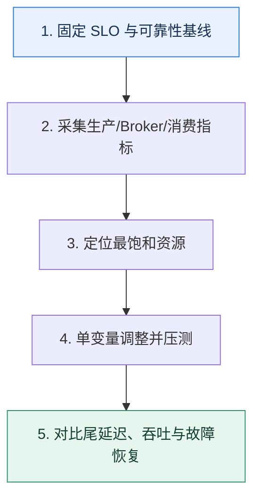

# Kafka 调优｜沿生产、Broker、消费三段寻找真正瓶颈

> 本课只解决一个问题：吞吐不够或延迟升高时，怎样调优而不是盲目改参数？

这不是原页面的缩写，也不是一组孤立结论。下面先建立一个能推演的最小世界，再把状态、数字和失败分支摊开，最后按来源讲解顺序覆盖全部知识线索。读完后，你应当能从 `固定 SLO 与可靠性基线` 一直解释到 `对比尾延迟、吞吐与故障恢复`，并说明中途任意一步失败会留下什么状态。

## 零基础入口：先建立本课的心智画面

调优先固定可靠性和延迟目标，再用指标判断瓶颈在生产者、Broker 资源、复制还是消费者。参数是控制杆，不是答案；一次只改变少量变量并保留回退基线。

先不要急着记组件名。只抓住四个问题：**现在手里有什么输入？下一步只做什么动作？哪个状态发生变化？变化后的结果交给谁？** 之后遇到新框架，只要这四个答案不变，核心机制就没有变。

### 放进一个足够小、可以手算的世界

基线为 80MB/s、P99 180ms，Broker 磁盘仅 35% 但生产者 CPU 95%，平均批次只有 8KB。先把批次目标增至 64KB、等待从 0 调到 5ms并评估压缩；吞吐升到 140MB/s，P99 210ms。若业务预算是 250ms，这个交换可接受；若预算 100ms，就需要降低等待或扩生产端。

这个小世界故意只保留本课必需的对象。生产系统会有更多节点、线程、分片和异常，但数量增加不会改变这里的因果关系。先确认你能手算这个例子，再把数字替换成真实系统数据。

### 先预测，不要马上看结论

**Broker 磁盘利用率不高，增加磁盘数量却没有提高吞吐，下一步应检查什么？**

先写下自己的判断，并指出你依赖的前提。文末自我检查会揭示答案；如果答案不同，回到下面的状态表找出第一个分叉点。

## 本节精讲：让机制一步一步发生

生产端关注批次大小、等待时间、压缩、缓冲与在途请求；Broker 关注分区分布、磁盘与网络、页缓存、请求队列、复制落后；消费端关注每批处理、拉取大小、并发模型、提交语义和下游耗时。若分区热点，增加消费者无效；若磁盘空闲而 CPU 被压缩打满，应调整算法或把成本移到合适一侧；若系统开始交换内存到磁盘，尾延迟通常会恶化，应控制堆与进程内存并保留页缓存。

### 可见状态推进

| 当前步 | 现在发生的动作 | 下一步拿到什么 |
| ---: | --- | --- |
| 1 | 固定 SLO 与可靠性基线 | 采集生产/Broker/消费指标 |
| 2 | 采集生产/Broker/消费指标 | 定位最饱和资源 |
| 3 | 定位最饱和资源 | 单变量调整并压测 |
| 4 | 单变量调整并压测 | 对比尾延迟、吞吐与故障恢复 |
| 5 | 对比尾延迟、吞吐与故障恢复 | 得到可核对的终态 |

图只承担一个任务：让你看清状态如何向前移动。它不意味着每一步必然成功；网络超时、进程退出、重复执行和数据竞争都可能让箭头停在中间，因此后面必须继续讨论失效边界。

### 一次带数字的完整推演

基线为 80MB/s、P99 180ms，Broker 磁盘仅 35% 但生产者 CPU 95%，平均批次只有 8KB。先把批次目标增至 64KB、等待从 0 调到 5ms并评估压缩；吞吐升到 140MB/s，P99 210ms。若业务预算是 250ms，这个交换可接受；若预算 100ms，就需要降低等待或扩生产端。

数字不是装饰。它迫使我们回答容量、顺序、时间窗口或版本选择问题。若换一个数字就得出不同结论，真正的设计依据就是那个阈值，而不是某个中间件名称。

## 按讲解顺序重建知识链：完整来源讲解

下面按来源资料的教学顺序重新编排完整内容。转换页码、来源图片、推广信息、水印、角色化问答和只服务于技术讨论场景的话术已经删除；机制、算法、例子、反例、事故线索、评论补充和限制条件仍然保留。这里的作用是补齐知识覆盖，不取代前面的独立推演。

本节讨论 Kafka 的最后一个话题——怎么在实践中保证 Kafka 高性能？也可以说，怎么在业务里面优化使用 Kafka 的性能。

在前面微服务部分，我就说高并发可遇不可求，而高可用和高性能是可求的。在追求高性能的时候，Kafka 自然也是一个绕不开的环节。那么今天这节课我就带你深入讨论怎么优化发送者和 broker，结合消息积压中优化消费者性能的知识，你就掌握了一条消息从生产出来到消费完成整个环节上优化性能的方法。

### 如何选择压缩算法？

不管是 Kafka 还是别的中间件，你在选择压缩算法的时候，首先要考虑的就是压缩比和压缩速率。压缩比主要是为了节省网络带宽和磁盘存储空间，而压缩速率主要影响吞吐量。

一般来说，压缩比越高，压缩速率越低；压缩比越低，压缩速率越高。

所以选择压缩算法就是看自己的业务场景究竟是偏向压缩比还是偏向压缩速率。不过在真实环境下，一切都要以性能测试为准，而不能仅仅依赖于原理分析。

### 操作系统交换区

在现代操作系统中，基本都支持交换区，也叫做 swap 分区。当操作系统发现可用的物理内存不足的时候，就会把物理内存里的一部分页淘汰出来，放到磁盘上，也就是放到 swap 分区。

你也可以把 swap 分区看作是“虚拟内存”。那么你可以想到，如果触发了这种交换，性能就会显著下降。交换越频繁，下降越快。

在 Linux 中有一个参数，叫做 vm.swappniess，它控制住了使用交换区的积极性。比如说vm.swappniess 在大多数 linux 发行版上默认值都是 60，也就是比较积极地使用交换区。而追求性能的中间件，如消息队列、数据库等都会尽量避免触发交换，也就是把vm.swappniess 调小。

有一种说法是当内存使用率超过 40% 的时候就开始使用 swap 分区，但是这种说法其实不够准确，因为是否交换在 Linux 2.6 以后的版本后还参考了别的因素，如果你有兴趣的话可以自己去深挖一下，技术讨论的时候记住追求性能调小就可以。

### 把知识转成可验证的工程判断

在技术讨论前你需要提前了解清楚一些信息。

你维护的业务在使用消息队列的时候，后面优化措施中提到的参数取值都是多少？你们公司消息队列的各个参数有没有被调过？为什么调？你是否遇到过和消息队列有关的 Bug？如果有，那么怎么解决的？你维护的业务使用消息队列时的 QPS 是多少？

类似于我在 MySQL 中提到的，你可以找你们的运维问一下消息队列的相关配置，然后弄清楚其中每一个配置的含义。同样地，我在后面会提到一些操作系统优化和 JVM 相关的优化，这一类优化你同样可以在别的中间件里面找到，你可以提前了解一部分，然后在技术讨论过程中交叉对比，这样更能凸显你的技术积累。

技术评审者很少会直接问怎么优化 Kafka，但是你和他聊到下面这些话题的时候都可以引导到这里。

1. 性能优化，消息队列相关的优化是其中一个重要的点。
2. TCP 协议，Linux 上的几个 TCP 参数以及如何调整这些参数来优化中间件性能，这里可以举 Kafka 的例子。
3. swap，追求性能的中间件都会尝试优化 vm.swappiness 参数，你可以以 Kafka 为例。
4. 从主从同步引申到 Kafka 主从分区同步，还有批量拉数据模型。

5. 压缩，Kafka 的压缩功能，以及你实际使用的压缩算法。
6. JVM 或者垃圾回收，可以用优化 Kafka 垃圾回收来证明自己的技术实力。
在做好这些准备之后，你就可以开始技术讨论了。

### 基本思路

最佳的技术讨论策略依旧是把消息队列优化作为你优化整个系统的可用性和性能的一个环节。你可以参考这个话术。

我这个系统有一个关键点，就是一个高并发的消息队列使用场景。也就是说，它要求我们做到高效发送、高效消费，不然就会有问题，比如说出现消息积压或者生产者阻塞的问题。那么优化的整体思路就是从消息队列的生产者、broker 和消费者这三方出发。

这里我提到了两个问题：消息积压和生产者阻塞。这两个问题都是跟性能有关的热门问题，所以大概率技术评审者会问，比如说你怎么优化生产者或者 broker。这个时候你就可以用下面的优化措施来解释了。

### 优化措施

我这里给出很多优化方案，你可以根据自己平时使用的消息队列的情况来选择。除了我这里提到的方案，前面我也提过优化 Kafka 的刷盘时机，你同样可以用来技术讨论。

### 优化生产者

优化 acks

在消息不丢失那一节课里面，你已经学过 acks 了。在尝试优化 acks 的时候，如果追求性能，那么就应该把 acks 设置为 0。

之前我们有一个系统在一个高并发场景下会发送消息到 Kafka。后来我们就发现这个接口在业务高峰的时候响应时间很长，客户端经常遇到超时的问题。后来我去排查才知道，写这段代码的人直接复制了已有的发送消息代码，而原本人家的业务追求的是消息不丢，所以acks 设置成了 all。实际上我们这个业务并没有那么严格的消息不丢的要求，完全可以把

acks 设置为 0。这么一调整，整个接口的响应时间就显著下降了，客户端那边也很少再出现超时的问题。

当然这里设置为 1 也可以，就是性能要比 0 差一点。

如果追求消息不丢失，那么就应该把 acks 设置为 all，这部分你已经在消息丢失部分学过了。你可以总结一下，尝试把话题引导到消息丢失和下一个优化批次的措施上。

不过追求消息不丢失的业务场景就不能把 acks 设置为 0 或者 1，这时候就只能考虑别的优化手段，比如说优化批次。

优化批次

优化批次有两个好处，对于生产者本身来说，它发送消息的速率更快；对于 Kafka 来说，同样数量的消息，批次越大，性能越好。

所以当你的发送者遇到瓶颈之后，就可以尝试调大批次的参数来进一步提高发送性能。和批次有关的有两个参数：linger.ms 和 batch.size。前者是凑够一个批次的最大等待时间，后者是一个批次最大能有多少字节。你可以先简单介绍你的优化手段，关键词是调大批次。

我之前遇到过一个生产者发送消息的性能问题。后来我们经过排查之后，发现是因为发送性能太差，导致发送缓冲池已经满了，阻塞了发送者。这个时候我们注意到其实发送速率还没有达到 broker 的阈值，也就是说，broker 其实是处理得过来的。在这种情况下，最直接的做法就是加快发送速率，也就是调大 batch.size 参数，从原本的 100 调到了 500，就没有再出现过阻塞发送者的情况了。

注意，调大批次究竟能有多大的优化效果和调整前后批次大小、消息平均大小、borker 负载有关。好的时候 TPS 可以翻倍，差的时候可能也就是提升 10% 不到。所以你最好亲自动手试一试你的业务调整这个参数性能究竟能提升多少。

你也要指出，批次也不是越大越好。

当然，批次也不是说越大越好。因为批次大了的话，生产者这边丢失数据的可能性就比较大。而且批次大小到了一个地步之后，性能瓶颈就变成了 broker 处理不过来了，再调大批次大小是没有用的。

也别忘了占领“高地”。

最好的策略，还是通过压测来确定合适的批次大小。

然后你可以进一步介绍另外一种优化思路，刷个进阶推导。

发送者被阻塞也可能是因为缓冲池太小，那么只需要调大缓冲池就可以。比如说是因为topic、分区太多，每一个分区都有一块缓冲池装着批量消息，导致缓冲池空闲缓冲区不足，这一类不是因为发送速率的问题导致的阻塞，就可以通过调大缓冲池来解决。

最后你再总结一下，体现你对这个问题的深入思考。

所以发送者阻塞要仔细分析，如果是发送速率的问题，那么调大发送缓冲区是治标不治本的。如果发送速率没什么问题，确实就是因为缓冲池太小引起的，就可以调大缓冲池。如果现实中，也比较难区别这两种情况，就可以考虑先调大批次试试，再调整缓冲池。

当然，提高发送速率还有一个更加简单的手段，也就是启用压缩。

启用压缩

Kafka 默认是不启用压缩的，所以如果你希望进一步提高吞吐量就可以考虑启用压缩。但是这个优化措施很简单，所以你只需要随便提一下就可以。

为了进一步提高 Kafka 的吞吐量，我也开启了 Kafka 的压缩功能，使用了 LZ4 压缩算法。

假设你最开始选择的算法是 Snappy，那么你这么解释。

为了进一步提高 Kafka 的吞吐量，我将压缩算法从 Snappy 换到了 LZ4。

经过验证，我和几个同样做过性能测试的朋友都认为 LZ4 吞吐量最好，你也可以试试。在工程复盘时你还可以介绍一下自己做性能测试的结果。同时也要注意，这样有可能会把话题引导到压缩算法和 Kafka 的压缩机制上。

### 优化 broker

下面的方案中，前三个是比较有进阶推导的优化手段。倒不是说这三个优化手段有多难，而是大部分学习者并不会从操作系统层面上优化。

优化 swap

Kafka 是一个非常依赖内存的应用，所以可以调小 vm.swappniess 参数来优化内存。

为了优化 Kafka 的性能，可以调小 vm.swappiness。比如说调整到 10，这样就可以充分利用内存；也可以调整到 1，这个值在一些 linux 版本上是指进行最少的交换，但是不禁用交换。目前某个线上系统用的就是 10。

技术评审者可能会问，为什么不直接禁用 swap 呢？你就要解释以防万一。

物理内存总是有限的，所以直接禁用的话容易遇到内存不足的问题。我们只是要尽可能优化内存，如果物理内存真的不够，那么使用交换区也比系统不可用好。

优化网络读写缓冲区

Kafka 也是一个网络 IO 频繁的应用，所以调整网络有关的读写缓冲区，效果也会更好。对应的参数有 6 个。

net.core.rmem_default 和 net.core.wmem_default：Socket 默认读写缓冲区大小。net.core.rmem_max 和 net.core.wmem_max：Socket 最大读写缓冲区。

net.ipv4.tcp_wmem 和 net.ipv4.tcp_rmem：TCP 读写缓冲区。它们的值由空格分隔的最小值、默认值、最大值组成。可以考虑调整为 4KB、64KB 和 2MB。

这些参数你记不住没有关系，记住一个点调大读写缓冲区就可以。这里列举的值只是为了举例子，你可以用你们公司实际的值来替代。

另外一个优化方向是调大读写缓冲区。Scoket 默认读写缓冲区可以考虑调整到 128KB；Socket 最大读写缓冲区可以考虑调整到 2MB，TCP 的读写缓冲区最小值、默认值和最大值可以设置为 4KB、64KB 和 2MB。不过这些值究竟多大，还是要根据 broker 的硬件资源来确定。

优化磁盘 IO

Kafka 显然也是一个磁盘 IO 密集的应用。优化磁盘 IO 的两个方向就是调整文件系统，使用XFS，并且禁用 atime。atime 是指文件最后的访问时间，而本身 Kafka 用不上。

Kafka 也是一个磁盘 IO 密集的应用，所以可以从两个方向优化磁盘 IO。一个是使用 XFS作为文件系统，它要比 EXT4 更加适合 Kafka。另外一个是禁用 Kafka 用不上的 atime 功能。

这里，我提到了 XFS 更加适合，但是没有解释。因此技术评审者就可能继续追问为什么要选择XFS。这个时候你就可以解释 XFS 性能更好。

相比于 EXT4，XFS 性能更好。在同等情况下，使用 XFS 的 Kafka 要比 EXT4 性能高 5%左右。

虽然 XFS 还有别的优点，比如说扩展性更好，支持更多、更大的文件，但是这些都不是关键，关键就是 XFS 读写性能要好一点。有机会你也可以尝试自己做一下测试。

如果你技术讨论的是比较基础的岗位，那么大概率技术评审者会把话题引导到操作系统中文件子系统的部分。上面这三个都可以看作是优化操作系统参数，而 Kafka 本身也是可以调整的。

优化主从同步

从分区和主分区数据同步的过程受到了几个参数的影响。

num.replica.fetchers：从分区拉取数据的线程数量，默认是 1。你可以考虑设置成 3。replica.fetch.min.bytes：可以通过调大这个参数来避免小批量同步数据。replica.fetch.max.bytes：这个可以调大，比如说调整到 5m，但是不要小于message.max.byte，也就是不要小于消息的最大长度。replica.fetch.wait.max.ms：如果主分区没有数据或者数据不够从分区的最大等待时间，可以考虑同步调大这个值和 replica.fetch.max.bytes。

这些参数都是跟机器有关的，所以在实践中你需要通过不断测试来确认这些参数的最佳值。如果你记不住细节，那就记住都调大。尤其是后三个，调大它们的效果，就是为了让从分区一批次同步尽可能多的数据。

Kafka 的主从分区同步也可以优化。首先调整从分区的同步数据线程数量，比如说调整到3，这样可以加快同步速率，但是也会给主分区和网络带宽带来压力。其次是调整同步批次的最小和最大字节数量，越大则吞吐量越高，所以都尽量调大。最后也可以调整从分区的等待时间，在一批次中同步尽可能多的数据。

类似于批次大小，也不能一直调大。

不过调大到一定地步之后，瓶颈就变成了从分区来不及处理。或者调大到超过了消息的并发量，那么也没意义了。

你可以进一步总结，类似的批量拉数据场景都可以考虑这一类的优化，包括业务层面上的批量拉数据。

Kafka 这种机制可以看作是典型的批量拉数据模型。在这个模型里面，要着重考虑的就是多久拉一次，没有怎么办，一次拉多少？在实现这种模型的时候，让用户根据自己的需要来设定参数是一个比较好的实践。

优化 JVM

Kafka 是运行在 JVM 上的，所以理论上来说任何优化 Java 性能的措施，对 Kafka 也一样有效果。如果你是技术讨论 Java 岗位，那么这个点会非常适合你，因为你可以同时展示你对 JVM的理解，让你赢得竞争优势。

优化 JVM 首先就是考虑优化 GC，即优化垃圾回收。而优化 GC 最重要的就是避免 full GC。full GC 是指整个应用都停下来等待 GC 完成。它会带来两方面影响。一方面是发送者如果设置 acks 为 1 或者 all，都会被阻塞，Kafka 吞吐量下降。

另一方面是如果 full GC 时间太长，那么主分区可能会被认为已经崩溃了，Kafka 会重新选择主分区；而如果是从分区，那么它会被挪出 ISR，进一步影响 acks 设置为 all 的发送者。

基本的思路就是调大 JVM 的堆，并且在堆很大的情况下，启用 G1 垃圾回收器。

之前我们的 Kafka 集群还出过 GC 引发的性能问题。我们有一个 Kafka 的堆内存很大，有8G，但是垃圾回收器还是用的 CMS。触发了 full GC 之后，停顿时间就会很长，导致Kafka 吞吐量显著下降，并且有时候还会导致 Kafka 认为主分区已经崩溃，触发主从选举。

在这种情况下，有两个优化思路，一个是考虑优化 CMS 本身，比如说增大老年代，但是这个治标不治本，可以缓解问题，但是不能根治问题。所以综合之下我选了另外一个方向，直接切换到 G1 回收器。G1 回收器果然表现得非常好，垃圾回收频率和停顿时间都下降了。

如果你并不会 Java，那么这个点你要慎用，因为 JVM 优化和 GC 优化即便是在 Java 技术讨论里面都是一个难度很高的问题。如果你用了，但是技术评审者追问的时候你答不上来，你就直接认怂，毕竟你不会 Java 不知道细节很正常。

### 技术讨论方案总结

最后我来总结一下这一节课的内容。

1. 当你选择压缩算法的时候，你需要权衡压缩比和压缩速率，根据需求做选择。

2. 操作系统交换区可以看作“虚拟内存”。如果触发交换，性能就会显著下降。
3. 优化生产者有三个措施：优化 acks、优化批次和启用压缩。
4. 优化 broker 有五个措施：优化 swap、优化网络读写缓冲区、优化磁盘 IO、优化主从同步、优化 JVM。
这一节课描述的这些优化都是很容易用于实践中的，所以有机会的话你尽可能用一下，加深理解。包括各种参数设置成什么值最好，都是跟业务、broker 的硬件资源有关的，你自己实践得出的值更有说服力。

同时我也总结一下你平时在技术讨论中间件优化的一般思路。

在操作系统层面上，你优化了什么？目前来说大多数中间件，你都可以调整操作系统上和swap、TCP、IO 有关的参数。中间件本体。比如说调整 Kafka 的刷盘参数，调整主从同步等。并且有很多中间件是基于JVM 的，因此你可以调整 JVM 相关的内容。而调整 JVM，最重要的就是调整垃圾回收相关的参数。客户端参数。在这里是指你引入的依赖，比如说你引入了 Kafka 的客户端依赖，创建生产者的时候，你用了什么参数。

这种套路适用于绝大多数的中间件。其中第一条和第二条，你都不需要费神，直接去问你们公司的运维就好了。如果你在小公司，没有专职的运维，那么你就问一些你在大厂工作的同学朋友，看看他们调整过哪些参数。

### 继续推演

最后请你来思考两个问题。

Kafka 还有一些参数也对性能有影响，你能介绍一下你是如何优化的吗？这节课我提到可以优化 TCP 相关的缓冲区来提高性能，那么你知道哪个中间件也可以这么优化？

### 补充讨论与边界校准

#### 全部留言 (3)

补充讨论：

问题1：这几个参数的修改是指修改 linux 系统的参数吗？net.core.rmem_default 和 net.core.wmem_default：Socket 默认读写缓冲区大小。net.core.rmem_max 和 net.core.wmem_max：Socket 最大读写缓冲区。net.ipv4.tcp_wmem 和 net.ipv4.tcp_rmem：TCP 读写缓冲区。它们的值由空格分隔的最小值、默认值、最大值组成。可以考虑调整为 4KB、64KB 和 2MB。

问题2：Kafka 客户端 receive.buffer.bytes 也是修改 TCP receive buffer 的值，请问一下这个参数的修改和上述 linux 系统的修改是什么关系呢？

谢谢老师

讲解补充：1. 是的。

2. 我个人的看法是，优先修改中间件本身的参数，因为影响面最小。receive.buffer.bytes 控制的是 k afka 自己操作 TCP 的缓冲区，所以你也可以一起调整。

补充讨论： 优化jvm，g1性能好只是因为g1的垃圾回收算法，多cms标记整理吗，还有哪些点呢

讲解补充：最关键的两个点：

- 停顿时间更短，并且更加可控
- G1 更加适合大堆
G1 还有其它的优点，但是我认为这两个优点是它比 CMS 更加适合大内存 JVM 的核心原因

补充讨论：

讲解补充：1. 因为要先放到缓冲池，再聚合发送。你都放不下，那自然就是阻塞了

2. 操作系统层面上禁用
3. 基本上用了 TCP 协议都有关。

## 把完整讲解收束成一条因果链

1. 从端到端延迟分解开始，避免只盯 Broker。
2. 按生产者、Broker、消费者三段列指标和容量。
3. 根据 CPU、磁盘、网络、分区倾斜选择控制杆。
4. 最后用故障与恢复测试验证调优没有破坏确认和重放语义。

把这几步连接起来时，不要省略“为什么”。最终结论只有在前提、状态变化和失败代价都说得清楚时才可靠。

## 误区与失效边界

不要同时修改十几个参数后用一次峰值证明成功。增加分区可能短期提升并行度，却增加复制、文件句柄和恢复时间；关闭可靠确认换来的吞吐必须明确记为可靠性降级。

再加一条通用但必须落实到本课对象上的边界：机制只能处理它看得见的信号。若输入指标失真、状态没有持久化、错误被吞掉，或者补偿没有幂等保护，再成熟的框架也只能基于错误证据作决定。

### 三种故障注入方式

| 故障 | 要观察什么 | 不能接受的解释 |
| --- | --- | --- |
| 在第 2 步前让依赖超时 | 是否停在可重试状态，是否消耗完上游预算 | “框架稍后会处理” |
| 在状态写入后让进程退出 | 重启后能否识别已完成与待继续动作 | “再执行一次应该没事” |
| 对同一输入并发执行两次 | 是否出现重复副作用、顺序颠倒或覆盖 | “概率很低” |

## 工程验证：把理解变成可以复查的证据

维护实验日志：工作负载、消息大小、分区与副本、确认方式、单次改动、吞吐、P99、资源利用率、积压恢复时间。任何优化都要能从前后两行数据中解释。

| 步骤 | 状态或动作 | 最少应留下的证据 |
| ---: | --- | --- |
| 1 | 固定 SLO 与可靠性基线 | 开始时间、结束时间、输入标识、结果状态、异常原因 |
| 2 | 采集生产/Broker/消费指标 | 开始时间、结束时间、输入标识、结果状态、异常原因 |
| 3 | 定位最饱和资源 | 开始时间、结束时间、输入标识、结果状态、异常原因 |
| 4 | 单变量调整并压测 | 开始时间、结束时间、输入标识、结果状态、异常原因 |
| 5 | 对比尾延迟、吞吐与故障恢复 | 开始时间、结束时间、输入标识、结果状态、异常原因 |

验证时同时记录成功路径和失败路径。只证明“正常时能跑通”不能说明设计可靠；至少要让一次超时、一次进程退出和一次重复请求可重现，并能根据日志或指标解释最后状态。

## 学完检查：闭卷画出本课

你现在应该能独立完成四件事：

1. 用自己的话说出本课唯一问题，不使用产品名也能解释。
2. 复算上面的具体例子，并指出哪个输入改变会让结论改变。
3. 沿 Mermaid 图注入一次失败，预测系统停在哪里以及由谁收敛。
4. 说出本课机制不保证什么，并给出一个反例。

## 自我检查

Broker 磁盘利用率不高，增加磁盘数量却没有提高吞吐，下一步应检查什么？

检查生产者批次与 CPU、网络上限、分区热点、复制等待、消费者或下游。磁盘空闲说明它未必是当前约束，扩非瓶颈资源不会提高端到端吞吐。

怎样证明自己不是只记住了名词？

把 `固定 SLO 与可靠性基线` 的一个真实输入写出来，逐步记录到 `对比尾延迟、吞吐与故障恢复`。然后在中间任意一步制造失败；如果你能解释当前状态、下一责任方、可观测证据和恢复边界，就已经拥有可以迁移的工程模型。

## 来源与事实校准

- [查看完整来源稿（本地 16 页资料）](../content/30-kafka-practice.md)

### 当前事实校准

高性能与高可靠不是两套互不相关的开关。acks、批量、压缩、分区、复制、消费并发和 offset 提交共同决定吞吐、延迟、重复与丢失窗口；要在同一压测和故障演练中验证。

- [Apache Kafka · Documentation](https://kafka.apache.org/documentation/)
- [Apache Kafka · Design](https://kafka.apache.org/25/design/design/)

来源稿用于核对覆盖范围，不随公开站点发布。产品默认值和具体内部行为可能随版本变化；落地时应使用目标版本的官方文档、可运行实验和故障演练校准。本学习稿中的零基础入口、状态推演、故障矩阵和工程验证属于编辑补充，不冒充来源讲解者的原话。
