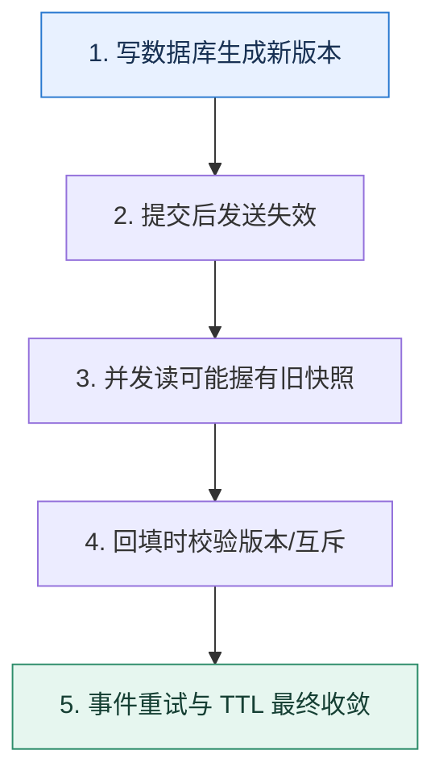

# 缓存一致性｜用时间线找出旧值重新出现的窗口

> 本课只解决一个问题：数据库和缓存无法原子更新时，怎样限制不一致持续时间？

这不是原页面的缩写，也不是一组孤立结论。下面先建立一个能推演的最小世界，再把状态、数字和失败分支摊开，最后按来源讲解顺序覆盖全部知识线索。读完后，你应当能从 `写数据库生成新版本` 一直解释到 `事件重试与 TTL 最终收敛`，并说明中途任意一步失败会留下什么状态。

## 零基础入口：先建立本课的心智画面

一致性问题来自两个独立存储的操作顺序与并发交错。先定义允许的数据陈旧时间，再画读写时间线；没有一致性目标，就无法判断删缓存、更新缓存或版本控制是否足够。

先不要急着记组件名。只抓住四个问题：**现在手里有什么输入？下一步只做什么动作？哪个状态发生变化？变化后的结果交给谁？** 之后遇到新框架，只要这四个答案不变，核心机制就没有变。

### 放进一个足够小、可以手算的世界

初始数据库版本 10、缓存为空。读 R 在写 W 提交前查到版本 10；W 提交版本 11并删除缓存；随后 R 才把版本 10 回填，旧值复活。若缓存写采用“仅当目标版本不大于 10 时写入”仍无法知道数据库已是 11；更稳妥的是回填前二次检查、按键互斥覆盖写，或由版本 11 的变更事件再次失效。

这个小世界故意只保留本课必需的对象。生产系统会有更多节点、线程、分片和异常，但数量增加不会改变这里的因果关系。先确认你能手算这个例子，再把数字替换成真实系统数据。

### 先预测，不要马上看结论

**为什么“先更新数据库，再删除缓存”仍不能单独证明最终不会出现旧缓存？**

先写下自己的判断，并指出你依赖的前提。文末自我检查会揭示答案；如果答案不同，回到下面的状态表找出第一个分叉点。

## 本节精讲：让机制一步一步发生

常见路径是先提交数据库，再失效缓存，因为直接更新缓存容易遗漏多种派生键。失败的失效要进入可靠重试或由 CDC/变更事件补发。并发读可能在写提交前读到旧库值、又在删除缓存后把旧值回填，因此可用带版本的缓存值、延迟二次失效、互斥回填或只允许新版本覆盖旧版本。强一致读应绕过缓存或等待版本，而不是让所有普通读付出同样代价。

### 可见状态推进

| 当前步 | 现在发生的动作 | 下一步拿到什么 |
| ---: | --- | --- |
| 1 | 写数据库生成新版本 | 提交后发送失效 |
| 2 | 提交后发送失效 | 并发读可能握有旧快照 |
| 3 | 并发读可能握有旧快照 | 回填时校验版本/互斥 |
| 4 | 回填时校验版本/互斥 | 事件重试与 TTL 最终收敛 |
| 5 | 事件重试与 TTL 最终收敛 | 得到可核对的终态 |

图只承担一个任务：让你看清状态如何向前移动。它不意味着每一步必然成功；网络超时、进程退出、重复执行和数据竞争都可能让箭头停在中间，因此后面必须继续讨论失效边界。

### 一次带数字的完整推演

初始数据库版本 10、缓存为空。读 R 在写 W 提交前查到版本 10；W 提交版本 11并删除缓存；随后 R 才把版本 10 回填，旧值复活。若缓存写采用“仅当目标版本不大于 10 时写入”仍无法知道数据库已是 11；更稳妥的是回填前二次检查、按键互斥覆盖写，或由版本 11 的变更事件再次失效。

数字不是装饰。它迫使我们回答容量、顺序、时间窗口或版本选择问题。若换一个数字就得出不同结论，真正的设计依据就是那个阈值，而不是某个中间件名称。

## 按讲解顺序重建知识链：完整来源讲解

下面按来源资料的教学顺序重新编排完整内容。转换页码、来源图片、推广信息、水印、角色化问答和只服务于技术讨论场景的话术已经删除；机制、算法、例子、反例、事故线索、评论补充和限制条件仍然保留。这里的作用是补齐知识覆盖，不取代前面的独立推演。

本节讨论一个技术讨论缓存必然会涉及的一个问题：怎么保证数据一致性？

上一节课我详细分析了各个缓存模式，你会发现这些缓存模式要么存在数据丢失的可能，要么在某一段时间内总是会不一致。那么有没有能够彻底解决缓存一致性的方案呢？

这节课我就带你分析各种可行的解决方案，并且告诉你这些方案在保障数据一致性上，究竟能够做到什么地步。

为了方便你理解后面的内容，我们先来看 double-check 模式。

### double-check 模式

double-check 是并发里为了兼顾并发安全和性能经常采用的一种代码模式。它的基本思路可以总结为检查、加锁、检查，所以也叫做 double-check。double-check 经常用在使用读写锁的场景。这里我用伪代码来描述它的基本思路。

复制代码1 func doubleCheck() {2 rlock() // 加读锁3 if !checkSomething() {4 // 执行一些动作5 return 6 }7 runlock() // 释放读锁8 lock()9 if !checkSomething() {10 // 执行一些动作11 return 12 }13 // 执行另外一些动作14 lock()15 }

比如，先加读锁检测数据是否存在，如果存在就直接返回，否则就释放读锁，加写锁，再次检查数据是否存在，存在就直接返回，不存在就根据业务计算数据并返回。

double-check 还有一些变种。第一个变种是在第一次检查的时候，什么锁都不加，这个变种一般用在分布式锁下，因为分布式锁没有读锁。另外一个变种是用原子操作来取代读锁，但是前提是你用原子操作就可以完成检查。

一般来说，你可以把 double-check 作为自己优化并发代码的一个措施，纳入到整个性能优化方案里面。

### 把知识转成可验证的工程判断

这里我先来问你几个问题。

每一个你使用了缓存的地方，你是如何解决一致性问题的？如果没有解决，你能容忍多久不一致？当数据不一致的时候，你多久能发现，多久能修复，有没有自动发现和修复机制？

你看看你是否能答上来，如果答不上来的话，我建议你整理一下。因为当你在简历或者项目里面有任何一个地方提到了缓存，技术评审者都有可能询问数据一致性相关的内容。

实际上很多时候技术评审者也知道越追求严格的数据一致性，代价也就越大。所以你在解释数据一致性的问题的时候，要强调的是你知道数据一致性的问题，而且你不仅知道，你还知道能有多不一致，能在多长时间内达成一致。

并且，数据一致性是一个非常考验分析并发场景的地方，因此你在技术讨论之前，可以试着自己分析一下你使用的缓存方案里面有哪些场景会引起数据不一致。

### 基本思路

### 不一致的根源

在你讲到任何数据不一致的时候，你都可以先揭示两个不一致的来源。

源自操作部分失败源自并发操作

你能讨论到这两个来源，就算是一个进阶推导，因为很少有人能仔细分析这些问题。

要想彻底解决数据一致性问题，就首先要搞清楚数据不一致的两个来源。第一个是操作部分失败，第二个是并发更新。

源自操作部分失败

这个是最难解决的。之前你在分布式事务、消息丢失两节课里面已经看到了类似的问题，也就是在分布式环境下，你很难保证多个操作要么都成功，要么都失败。而在更新数据的时候，即便是最简单的模型，也是要求你更新数据库和更新缓存要么都成功，要么都失败。

显然，这是一个分布式事务问题。那么通过前面的学习，你应该知道已有的分布式事务里面，追求的都是最终一致性。即便你认为 XA 事务能够解决一致性问题，但是缓存基本上没有支持XA 事务的。

好在缓存有点特殊。所以在这节课的后面我给出了一个结合本地事务和分布式锁的无限接近强一致性的方案。所以这里的结论就是，源自部分失败造成的数据不一致是不可避免的。

我举一个例子来说明操作部分失败，在最简单的模型里面，就是更新数据库和更新缓存两个步骤。理论上来说要保证数据一致性，就必须要保证这两个更新要么都成功，要么都失败，不能有中间状态。也就是说，这是一个分布式事务问题。而现在缓存中间件包括 Redis，都不支持分布式事务。因此这个问题就决定了数据不一致是不可避免的。

你可以进一步总结拔高。

在能够彻底解决操作部分失败的问题之前，都只能说尽可能避免不一致，并且尽快达成一致，这也就包括重试失败操作、数据自动校验并修复等措施。

源自并发操作

上一节课我给你分析各种缓存模式遇到的数据不一致的问题，都是从这个角度出发的。源自并发操作的数据不一致，在某种程度上来说，是可以解决的。比如说在缓存模式中提到的 Write Back 模式。

解决这一类的数据不一致，核心是确保同一个时刻只有一个线程在更新数据库和缓存。在分布式环境下，这也就意味着即便你有几百个实例，依旧只能有一个实例上的一个线程在更新数据。

另外一个导致数据不一致的原因是并发操作，比如说多个线程同时更新数据库和缓存，在这种情况下有可能先更新数据库的线程后更新缓存，导致数据不一致。

然后你可以解释这个是可以解决的。

并发操作的数据不一致问题，是可以解决的。比如说在缓存模式里面，Write Back 就可以，虽然它会丢数据。又或者使用分布式锁，也可以控制并发更新。

你在这个解释里面，提到了缓存模式，自然就可以把话题引到上一节课的内容上，记得跟技术评审者深入剖析每一个缓存模式可能存在的数据不一致的场景。

你在这个解释里面还提出了一个解决方案：分布式锁，那么自然也会把话题引导到分布式锁上。

### 解决方案

针对上面两个根源的分析，我想你已经看出来了，要想解决部分失败的问题，你只能考虑分布式事务，而且如果你追求的是强一致性，那么你就需要用强一致性的分布式事务。显然，之前我们就学过，排除 XA 这个存在争议的方案，目前并没有解决方案。

所以你只能考虑解决并发操作带来的不一致问题。

要想解决并发操作带来的问题，可以使用缓存模式、分布式锁、消息队列或者版本号。

分布式锁中有很多细节可以作为你的进阶推导方案，所以我们最后再聊，这里我们先来看消息队列和版本号的方案。

消息队列

既然使用分布式锁是为了保证同一时刻只有一个线程在更新数据，那么为什么不让更新请求都跑到消息队列上排个队呢？

思路也很简单，就是结合之前在有序消息里面讲到的方案，让针对同一个业务的更新请求保持有序。消费者挨个将消息取出来，然后更新数据库和缓存。这种做法一样能够保证在同一时刻对同一个数据只有一个线程在更新。

针对一些可以异步更新数据的场景，可以考虑将更新请求都发送到消息队列上。但是要注意的是，同一个业务的消息必须是有序的，不然更新数据会出错。消费者在取出消息之后，执行更新。而且消费者在更新失败之后，可以多次重试，对业务也没有什么影响。这个方案也是追求最终一致性的，强一致性还是用不了。

这里有一个变种，就是先更新数据库，再发送消息到消息队列，让消费者去更新缓存。

但是如果消费者依赖消息中的数据来更新缓存，那么就会有并发问题，因为先更新数据库的不一定先发消息。

所以最多就是把消息当成一个触发器，收到消息就去更新缓存，但是是查询数据库中的数据来执行更新。但是我个人认为，既然要先更新数据库，为什么不用缓存模式中的 Refresh Ahead，引入 Canal 之类的来更新缓存呢，这样效果更好。

版本号

版本号也能解决并发更新的问题。它的基本思路就是每一次更新版本号都要加一，然后低版本数据不能覆盖高版本的数据。

在这种思路之下，前面在缓存模式里面出现过的很多数据不一致的场景，都能得到解决。比如说在 Cache Aside 里面，加上版本号之后，就不会出现不一致的问题了。

另外一个思路是使用版本号来控制并发更新，每个数据都有一个对应的版本号，在更新的时候版本号都要加一。每一次在更新的时候都要比较版本号，版本号低的数据不能覆盖版本号高的数据。

那么这个方案有没有缺点呢？有，版本号本身是一个比较难维护的东西。

这个方案的缺点是需要维护版本号，最好是在数据库里面增加一个版本字段。那么后面在更新缓存的时候，比如说更新 Redis，就得使用 lua 脚本，先检测缓存的版本号，再执行更新了。不过也可以考虑用更新时间来替代版本号，一样可以。

事实上，在正常的技术讨论中，你能分析清楚数据不一致的两个根源，然后解释出消息队列和版本号两个方案，已经算是答得比较好的了。不过有一个问题，我觉得还是要进一步介绍一下，防止你在工程复盘时被问住，那就是在多级缓存里面怎么更新的问题。

多级缓存

多级缓存是指你在业务中使用了多个缓存，比如说本地缓存 + Redis + 数据库的架构。

在这种架构下，更新数据的时候，需要考虑更新本地缓存、Redis 和数据库的顺序。

首先你可以明确的一点是，数据库是最准确的数据源，所以你肯定是优先更新数据库的。剩下的无非就是先更新本地缓存还是先更新 Redis 的事情了。

坦白说，如果只是考虑数据一致性的问题，你随便更新哪个都会不一致。硬要矮个子里面挑高个的，我认为更新本地缓存应该先于 Redis。

在使用本地缓存和 Redis 缓存的时候，我的更新顺序是，先更新数据库，再更新本地缓存，最后更新 Redis。先更新数据库是因为数据库应该是最准确的数据源。

其次更新本地缓存，理由有三个：一是更新本地缓存几乎不会失败；二是查询的时候是先查询本地缓存的，先更新本地缓存可以确保用户能够拿到最新的数据；三是即便后续 Redis更新失败，因为本地缓存中数据是存在的，所以也不会查询到 Redis 中不一致的数据。

从上面这个图你也可以看出来，引入了本地缓存和 Redis 缓存之后，数据不一致性的概率就更加大了，你可以按照前面几节课我分析各种不一致场景的思路去分析，我就不重复了。

### 进一步推导：怎样把机制用进真实系统

### 一致性哈希和缓存

这个进阶推导方案你在微服务部分已经见过了，这一次是进一步深入讨论。你先回顾一下一致性哈希负载均衡算法和本地缓存的方案。

这个方案主要解决的是并发更新的问题，因为它通过哈希负载均衡算法做到某一个 key 只有一个服务端节点在处理。因此你将本地缓存换成 Redis 也一样可以。

你在技术讨论缓存一致性的时候也不要忘记提起这个方案。但是我没有细说一个点，就是怎么更新数据？因为即便是同一个 key 的请求都落在同一个节点上，依旧存在并发更新的问题。这个时候你就需要使用到缓存模式中的 singleflight 模式了。你在介绍完基本方案之后，要注意提一下这个。

在使用了这种负载均衡算法之后，更新缓存的时候要使用 singleflight 模式，那么就可以做到同一个 key 一定落在同一个节点上，并且这个节点上最多只有一个线程在更新数据。如果有多个更新请求，那么它们会轮流更新数据库和缓存。

此外，当时我也提到一个问题，在节点上线或者下线的时候，就会引起不一致的问题，那么怎么解决呢？

我们先来看节点下线。节点下线其实是最好处理的，因为下线之后，新的请求都会被打到另外一个节点上，也就是只有一个节点在处理某个 key 的请求。但是如果节点上线，也就是扩容的话，就会引起不一致的问题。

解决的思路其实也很简单，既然问题出在新节点加入之后的短时间内，有两个节点在处理写请求，那么停掉一个就可以了。所以你在介绍完基本想法以及可能存在数据不一致的问题之后，补充这个说明。

解决这种数据不一致的思路也很简单，就是在新节点上线的一小段时间内，不要读写缓存，等待老节点上的请求自然返回。你可以预想一下，如果你们公司的响应时间是要求在 1s 以内，那么新节点上来的头 2s，就可以不用读写缓存。虽然这两秒的请求响应时间会很差，但是也能避开数据不一致的问题。

这个方案的好处就是结合了负载均衡、数据一致性、并发场景分析，包括解决方案都很出其不意，非常适合技术讨论的时候展示。

除了这些以外，还有一个分布式锁的进阶推导方案，你也可以进一步聊一聊。

### 分布式锁方案

分布式锁方案很多人用，但是很少有人给你解释清楚里面的弯弯绕绕。这里我先给你解释安全、性能不错，但是一致性比较差的思路，再给你介绍无限接近强一致性、但是隐患比较多的

思路。

思路一：先本地事务，后分布式锁

这个思路是先执行本地事务，然后加分布式锁，删除缓存，释放分布式锁。

显然，如果单纯这样做，肯定会有不一致的问题，你可以看一下示意图。

为了避免这个并发更新的问题，你需要在缓存未命中回查数据库的时候，加上分布式锁。

所以你抓住先本地事务，后分布式锁的顺序来解释。

我之前用过分布式锁来尝试解决并发更新的问题，基本思路是先执行本地事务，在事务提交之后加分布式锁，然后删除缓存。而在读请求来了的时候，先读缓存。如果缓存未命中，再加分布式锁，然后从数据中加载数据回写缓存，再释放分布式锁。

注意这里的关键点是读请求第一次读缓存的时候，没有加分布式锁，这是保证高性能的关键。这里还有一个优化思路是应用 double-check 机制。

当然，这里也可以进一步优化，在读请求缓存未命中加上了分布式锁之后，再次读一下缓存，看看有没有别的线程已经加载好了数据。

显然，这个只解决了并发更新的问题。这里首先要考虑了，既然我有一个本地事务，那么我能不能在本地事务还没提交的时候，就把缓存删除？这也就是我们的第二个思路。

思路二：先删除缓存，再提交事务

这一个思路的核心是把删除缓存的操作放在数据库事务里，你可以看一下基本思路图。

你在工程复盘时先简要介绍思路。

另外一个思路是尝试在数据库提交事务之前就删除缓存。它的思路是先开启本地事务，执行事务操作。然后获取分布式锁，删除缓存。紧接着提交事务，释放分布式锁。当然，在缓存未命中回查的时候，还是要先加分布式锁，避免并发更新的问题。

解释到这里，如果技术评审者反应灵敏，他就可能会追问你删除缓存和提交事务两个动作的失败问题，那么你就解释这两种情况。

有两种主要失败场景。一是删除失败了，那么事务不会提交，数据是一致的。二是删除成功了，事务提交失败了，数据依旧是一致的，也就是多删了一次缓存而已。

那么这个做法是不是强一致性的呢？答案是无限接近强一致性。

这种解决思路已经非常非常接近强一致性了。不过这里有两个条件，如果满足了就可以认为是达成了强一致性的效果。

第一，分布式锁本身必须是可靠的，也就是一个线程拿了分布式锁，其他线程绝对不可能拿到同一个分布式锁。

第二，在删除缓存超时的时候会继续重试直到确认删除成功。

那么这个方案有没有缺点呢？有，而且很大。

这一个方案最大的缺点就是本地事务比较容易超时。比如说分布式锁被人抢占了，那么在等待分布式锁的时候，就可能超时。当然，如果本身网络不稳定导致一直无法删除缓存，也会引起本地事务超时。

超时问题其实有方案来缓解。

可以考虑先加分布式锁，再开启本地事务，然后删除缓存，提交事务，最后释放分布式锁。代价就是分布式锁的持有时间变长了。并且删除缓存本身依旧在本地事务里面，还是可能导致本地事务超时。

整个方案里面，你几乎都是在围绕分布式锁来做文章，所以技术讨论话题十有八九会被引导到分布式锁上，课程后面会有详细分析，你要结合在一起学习。

### 本节原始知识线索收束

这一节课我们介绍了 double-check，然后在技术推理路径里面分析了引起不一致的两个根源：操作部分失败和并发操作。总的来说，并发操作容易解决，比如说使用缓存模式就很容易解决并发更新的问题，除此之外使用消息队列或者版本号也同样可以解决问题。

然后我进一步讨论了负载均衡那一节课里引入的一致性哈希负载均衡算法和缓存结合使用的方案，重点讨论了使用分布式锁来解决一致性问题的两个思路。第一个思路比较中规中矩，先提交本地事务，再加分布式删除缓存。第二个思路能达成一种无限接近强一致性的效果，核心是先删除缓存，再提交事务，但是它严重依赖分布式锁的可靠性。

### 继续推演

最后，请你来思考两个问题。

在分布式方案的思路二里面，我是说先提交事务，再释放分布式锁，那么顺序能不能反过来？有一种使用分布式锁的方案是先加分布式锁，然后执行本地事务并且提交，最后删除缓存，释放分布式锁。这种方案有什么缺点？有没有什么场景可能出现数据不一致？

### 补充讨论与边界校准

#### 全部留言 (5)

补充讨论： Aside 就能满足百分之99的场景了。你们真的会在项目中这样应用嘛？

讲解补充：我从实践和技术讨论上来讲这个问题。实践中用不用？答案是基本不用，你说 99% 的比例我也差不多赞同。但是你说我有没有用过，我确实用过，各种定制化做法。

技术讨论中呢？答案就更加简单了，Cache Aside 大家都会，我凭什么给你 offer 呢？

我个人认为，即便公司用不着，你自己也应该尝试一下，毕竟还是那句话，简单的东西大家都会，你凭什么在技术讨论中拿到 offer 呢？

补充讨论：

讲解补充：嘿嘿，都搞过。

1

补充讨论：

1. 分布式方案的思路二里面，是先提交事务再释放分布式锁，顺序能反过来吗？不可以。释放分布式锁之后，读请求就能直接从数据库加载数据了，此时更新事务可能还没有提交，读到的就会是旧的数据。
2. 有一种使用分布式锁的方案是先加分布式锁，再执行本地事务并提交，最后删除缓存，释放分布式锁。这种方案有什么缺点？有没有可能出现数据不一致？分布式锁的占用时间也会很长，还不能保证一致性。在失败的情况下：如果事务提交失败，不会删除缓存，数据还是一致的；如果事务提交成功，但是缓存删除失败了，那么数据就不一致了。
讲解补充：赞！

1

补充讨论： -》读数据a=2 -》更新缓存a=1这里是不是错了，应该是右边加分布式锁 -》读数据a=2 -》更新缓存a=2这样吧？

讲解补充：嗯嗯，感谢勘误。

补充讨论： key 的请求都落在同一个节点上，依旧存在并发更新的问题”，既然是同一个key的请求，为什么还会有并发问题？

讲解补充：没有 singleflight 的时候，你多个线程更新数据库和缓存这种场景。

## 把完整讲解收束成一条因果链

1. 先画数据库更新与缓存操作的先后，不从口号选方案。
2. 用旧读晚回填复现最隐蔽的竞态。
3. 再组合版本、失效事件、互斥和 TTL 限制窗口。
4. 最后为强一致请求设计绕过或版本等待。

把这几步连接起来时，不要省略“为什么”。最终结论只有在前提、状态变化和失败代价都说得清楚时才可靠。

## 误区与失效边界

延迟双删不是严格证明：延迟多久取决于真实读耗时、队列和故障。TTL 只限定旧值上界，无法满足写后立刻可见。任何方案都应说明失败重试与对账，而不是宣称绝对一致。

再加一条通用但必须落实到本课对象上的边界：机制只能处理它看得见的信号。若输入指标失真、状态没有持久化、错误被吞掉，或者补偿没有幂等保护，再成熟的框架也只能基于错误证据作决定。

### 三种故障注入方式

| 故障 | 要观察什么 | 不能接受的解释 |
| --- | --- | --- |
| 在第 2 步前让依赖超时 | 是否停在可重试状态，是否消耗完上游预算 | “框架稍后会处理” |
| 在状态写入后让进程退出 | 重启后能否识别已完成与待继续动作 | “再执行一次应该没事” |
| 对同一输入并发执行两次 | 是否出现重复副作用、顺序颠倒或覆盖 | “概率很低” |

## 工程验证：把理解变成可以复查的证据

并发测试用屏障精确控制：读到旧数据库值后暂停，写入新值并删除缓存，再释放旧读回填。断言最终缓存不能长期停在旧版本，并记录从写提交到收敛的最大时间。

| 步骤 | 状态或动作 | 最少应留下的证据 |
| ---: | --- | --- |
| 1 | 写数据库生成新版本 | 开始时间、结束时间、输入标识、结果状态、异常原因 |
| 2 | 提交后发送失效 | 开始时间、结束时间、输入标识、结果状态、异常原因 |
| 3 | 并发读可能握有旧快照 | 开始时间、结束时间、输入标识、结果状态、异常原因 |
| 4 | 回填时校验版本/互斥 | 开始时间、结束时间、输入标识、结果状态、异常原因 |
| 5 | 事件重试与 TTL 最终收敛 | 开始时间、结束时间、输入标识、结果状态、异常原因 |

验证时同时记录成功路径和失败路径。只证明“正常时能跑通”不能说明设计可靠；至少要让一次超时、一次进程退出和一次重复请求可重现，并能根据日志或指标解释最后状态。

## 学完检查：闭卷画出本课

你现在应该能独立完成四件事：

1. 用自己的话说出本课唯一问题，不使用产品名也能解释。
2. 复算上面的具体例子，并指出哪个输入改变会让结论改变。
3. 沿 Mermaid 图注入一次失败，预测系统停在哪里以及由谁收敛。
4. 说出本课机制不保证什么，并给出一个反例。

## 自我检查

为什么“先更新数据库，再删除缓存”仍不能单独证明最终不会出现旧缓存？

并发读可能在数据库提交前读到旧值，却在删除发生后才回填。还需要互斥、版本、二次失效或变更事件来封住这个交错。

怎样证明自己不是只记住了名词？

把 `写数据库生成新版本` 的一个真实输入写出来，逐步记录到 `事件重试与 TTL 最终收敛`。然后在中间任意一步制造失败；如果你能解释当前状态、下一责任方、可观测证据和恢复边界，就已经拥有可以迁移的工程模型。

## 来源与事实校准

- [查看完整来源稿（本地 24 页资料）](../content/34-cache-consistency.md)

### 当前事实校准

数据库提交与缓存删除通常不是一个原子事务。先写库再删缓存可以缩小常见窗口，却不能凭口号获得强一致；延迟双删、版本号、CDC 失效与短 TTL 都是在不同成本下促进最终收敛，关键数据仍应从权威存储或版本化状态机判断。

- [Redis · Client-side caching](https://redis.io/docs/latest/develop/clients/client-side-caching/)
- [Redis · Transactions](https://redis.io/docs/latest/develop/using-commands/transactions/)

来源稿用于核对覆盖范围，不随公开站点发布。产品默认值和具体内部行为可能随版本变化；落地时应使用目标版本的官方文档、可运行实验和故障演练校准。本学习稿中的零基础入口、状态推演、故障矩阵和工程验证属于编辑补充，不冒充来源讲解者的原话。
