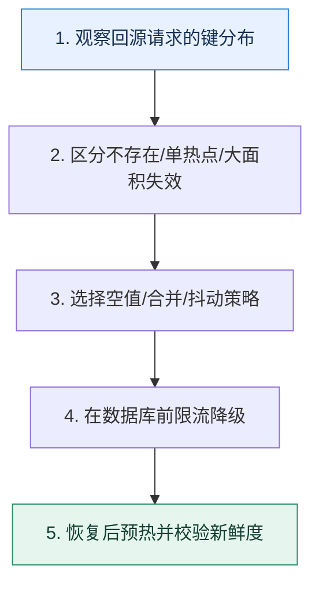

# 缓存三类失效压力｜穿透、热点击穿与雪崩要分开治理

> 本课只解决一个问题：大量请求越过缓存打向数据库时，先判断是哪一种失效模式？

这不是原页面的缩写，也不是一组孤立结论。下面先建立一个能推演的最小世界，再把状态、数字和失败分支摊开，最后按来源讲解顺序覆盖全部知识线索。读完后，你应当能从 `观察回源请求的键分布` 一直解释到 `恢复后预热并校验新鲜度`，并说明中途任意一步失败会留下什么状态。

## 零基础入口：先建立本课的心智画面

三种现象都表现为回源上升，但根因不同：穿透反复查询不存在的数据；击穿是少数热点键同时失效；雪崩是大量键或整个缓存服务在同一窗口失效。治理必须对准请求分布。

先不要急着记组件名。只抓住四个问题：**现在手里有什么输入？下一步只做什么动作？哪个状态发生变化？变化后的结果交给谁？** 之后遇到新框架，只要这四个答案不变，核心机制就没有变。

### 放进一个足够小、可以手算的世界

商品 404 查询每秒 5 万次属于穿透，可缓存 30 秒空结果并限流；超级商品键在 12:00 到期、10 万请求并发属于击穿，只允许一个回填；100 万商品统一 TTL 在 12:00 到期属于雪崩，加入 0–10 分钟抖动并限制回源到数据库安全的 3000 QPS。

这个小世界故意只保留本课必需的对象。生产系统会有更多节点、线程、分片和异常，但数量增加不会改变这里的因果关系。先确认你能手算这个例子，再把数字替换成真实系统数据。

### 先预测，不要马上看结论

**缓存命中率同样从 95% 跌到 20%，为什么不能直接套用同一个修复方案？**

先写下自己的判断，并指出你依赖的前提。文末自我检查会揭示答案；如果答案不同，回到下面的状态表找出第一个分叉点。

## 本节精讲：让机制一步一步发生

穿透用参数校验、空值短缓存、布隆过滤器和频率控制，最终仍以真相源为准；热点击穿用 singleflight、互斥回填、逻辑过期返回旧值或预热；雪崩用 TTL 抖动、多级缓存、集群隔离、回源限流和降级。缓存整体故障时，数据库保护优先于维持全部功能，非核心请求应快速失败或返回可接受的旧快照。

### 可见状态推进

| 当前步 | 现在发生的动作 | 下一步拿到什么 |
| ---: | --- | --- |
| 1 | 观察回源请求的键分布 | 区分不存在/单热点/大面积失效 |
| 2 | 区分不存在/单热点/大面积失效 | 选择空值/合并/抖动策略 |
| 3 | 选择空值/合并/抖动策略 | 在数据库前限流降级 |
| 4 | 在数据库前限流降级 | 恢复后预热并校验新鲜度 |
| 5 | 恢复后预热并校验新鲜度 | 得到可核对的终态 |

图只承担一个任务：让你看清状态如何向前移动。它不意味着每一步必然成功；网络超时、进程退出、重复执行和数据竞争都可能让箭头停在中间，因此后面必须继续讨论失效边界。

### 一次带数字的完整推演

商品 404 查询每秒 5 万次属于穿透，可缓存 30 秒空结果并限流；超级商品键在 12:00 到期、10 万请求并发属于击穿，只允许一个回填；100 万商品统一 TTL 在 12:00 到期属于雪崩，加入 0–10 分钟抖动并限制回源到数据库安全的 3000 QPS。

数字不是装饰。它迫使我们回答容量、顺序、时间窗口或版本选择问题。若换一个数字就得出不同结论，真正的设计依据就是那个阈值，而不是某个中间件名称。

## 按讲解顺序重建知识链：完整来源讲解

下面按来源资料的教学顺序重新编排完整内容。转换页码、来源图片、推广信息、水印、角色化问答和只服务于技术讨论场景的话术已经删除；机制、算法、例子、反例、事故线索、评论补充和限制条件仍然保留。这里的作用是补齐知识覆盖，不取代前面的独立推演。

今天我们再来聊一个缓存中的热门技术讨论话题：怎么解决缓存穿透、击穿和雪崩问题。

这个问题之所以常见，是因为你在使用缓存的过程中一不小心就会遇到它们。比如说在前面的课程里面我给你讲过，如果缓存崩溃，那么大量请求就会落到数据库上，直接把数据库压垮。然而很多新手在刚接触缓存的时候完全意识不到这个问题，只有在出了线上故障之后才会考虑缓存崩溃的事情。因此，技术评审者就倾向于在工程复盘时确认你是否会解决这一类的问题。

这一节课，我就带你综合分析这三种情况，以及其他可能出现的缓存问题。

不得不说的是，缓存穿透、击穿和雪崩是三个很容易搞混的概念，尤其是缓存穿透和击穿。

### 缓存穿透

缓存穿透是指数据既不在缓存中，也不在数据库中。

最常见的场景就是有攻击者伪造了大量的请求，请求某个不存在的数据。这会造成两个后果。

缓存里面没有对应的数据，所以查询会落到数据库上。数据库也没有数据，所以没有办法回写缓存，下一次请求同样的数据，请求还是会落到数据库上。

如果你没有在服务层面上采用熔断、限流之类的措施，那么数据库就可能崩溃。

### 缓存击穿

缓存击穿是指数据不在缓存中，导致请求落到了数据库上。注意，数据这个时候在数据库中是存在的，所以我们可以预计，查询到数据库中的数据之后就会回写缓存。

这看起来并没有问题。但如果请求的是热点数据呢？比如说同一时刻有几百个人请求某个大博主的数据，这些请求都没有命中缓存，那么几百个查询请求都会落到数据库上。

因此，如果请求的数据并不是什么热点数据，那么击穿也没有什么问题，它就是普通的缓存未命中而已。

### 缓存雪崩

缓存雪崩是指缓存里大量数据在同一时刻过期，导致请求都落到了数据库上。

缓存雪崩基本上都是因为一次性加载了很多数据到缓存中，并且都设置为同一个过期时间。比如说在应用启动的时候，提前从数据库里查询数据，然后放到缓存里面，这样这一批数据就会在同一时刻过期。又比如榜单数据计算好了之后加载到缓存里，都是同一个过期时间，导致这一批榜单数据同一时间过期。

### 把知识转成可验证的工程判断

在技术讨论前，你需要在公司里面收集一些信息。

比如：

你用的 Redis 是如何部署的？用的是 Redis Cluster 还是 Redis Sentinel？你们公司有没有出现过 Redis 崩溃的问题？如果有，是什么原因引发的？公司有没有出现过 Redis 连不上的问题？如果有，后面有没有使用什么方案来容错？你有没有遇到过缓存穿透、击穿或者雪崩等问题？如果有，你当时是怎么解决的，有没有可以改进的点？公司有没有保护数据库的措施？比如说防止缓存失效，导致数据库不堪重负直接崩溃。

你可以在简历中或者自我介绍的时候强调自己解决过很多缓存问题，包括缓存穿透、击穿、雪崩等问题。技术评审者多半会对这些点感兴趣，那么你就可以趁机把你前面准备的各种案例说出来。同时，你也可以考虑把各种缓存问题融合到自己的高可用方案里面，作为其中的一个环节。

### 解决缓存穿透

缓存穿透是因为数据本身不存在而引起的，所以我们就要想办法在确认数据不存在之后，避免下一次查询再次落到数据库上。这有两种解决思路。

### 回写特殊值

第一种思路是在缓存未命中，而且数据库里也没有的情况下，往缓存里写入一个特殊的值。这个值就是标记数据不存在，那么下一次查询请求过来的时候，看到这个特殊值，就知道没有必

要再去数据库里查询了。

你可以直接介绍这个方案。

第一种思路是回写特殊值。也就是在第一次查询发现数据库里都没有数据的时候，直接写入一个特殊值。那么下一次查询过来的时候，看到缓存里的特殊值，就知道没有数据，这时候直接返回就可以了。在这种设计之下，数据库只需要支撑住第一次请求就可以。

但是这个方案也是有缺点的。

如果攻击者每次都用不同的且都不存在的 key 来请求数据，那么这种措施毫无效果。并且，因为要回写特殊值，那么这些不存在的 key 都会有特殊值，浪费了 Redis 的内存。这可能会进一步引起另外一个问题，就是 Redis 在内存不足，执行淘汰的时候，把其他有用的数据淘汰掉。这时候你就可以引出下一个点了，考虑使用布隆过滤器。

### 布隆过滤器

既然缓存穿透是因为数据不存在，那么提前用布隆过滤器判断一下不就可以了嘛？

正常请求一个 key 的流程如下：

如果请求一个 key 不存在，那么布隆过滤器会直接说数据不存在，那么就没必要继续往下查询了。

你先简要介绍这个流程。

使用布隆过滤器的流程是业务代码收到请求之后，要先问一下布隆过滤器有没有这个 key。如果说没有，那就不用继续往后执行了。如果布隆过滤器说有，那么就继续往后执行，去查询缓存和数据库，并且在查询到了数据的时候，回写到缓存里面。

然后你要记得介绍假阳性的问题。

但是布隆过滤器本身存在假阳性的问题，所以当攻击者请求一个不存在的 key 的时候，布隆过滤器可能会返回数据存在的假阳性响应。在这种情况下，业务代码依旧会去查询缓存和数据库。不过这个不需要担心，因为假阳性的概率是很低的。假如说假阳性概率是万分之一，那么就算攻击的并发有百万，也只有 100 个查询请求会落到数据库上，这一点查询请求就是毛毛雨了。

这时候，你可以补充一个变种，也就是先查询缓存，缓存中没有数据的时候，再去问布隆过滤器。

也可以考虑先查询缓存，当缓存没有数据的时候，再去查询布隆过滤器。如果布隆过滤器说有数据，再去查询数据库。

然后你对比两者。

这两种模式没有太大的差别。先查询布隆过滤器，保护效果会更好，也就是提前挡住了非法请求。而先查询缓存，对正常请求更加友好，因为正常请求大概率命中缓存，直接返回数据，也就不用查询布隆过滤器了。

不过如果布隆过滤器也是在 Redis 的基础上实现的，两者就基本上没什么区别了。

### 解决缓存击穿

解决缓存击穿是很容易的，只需要用到我们在缓存模式里面提到的 singleflight 模式。也就是说，就算是一个热点数据，当几百个请求缓存未命中的时候，在 singleflight 模式之下，也只有一个请求会真的去查询数据，剩下的都在等着这个请求查询回来的结果。

### 解决缓存雪崩

缓存雪崩也很容易解决。在前置知识里我提到过之所以有雪崩，就是因为一次性加载了一大批数据放到了缓存里面，并且设置了同样的过期时间。

那么解决思路自然就有两个，一个是不允许一次性加载一大批数据到缓存，而这显然不现实，因为批量加载属于业务要求；另外一个思路就是设置不同的过期时间。

最简单的思路，就是在过期时间的基础上加一个偏移量。

要解决缓存雪崩，就是在数据批量加载到缓存的场景中在过期时间的基础上加上一个随机量。比如说，我预计这一批数据的过期时间是 15 分钟。那么我就在设置每一条数据的过期时间的时候，在 15 分钟的基础上加上一个 0～180 秒的偏移量。那么这一批数据就不会在同一时刻过期，也就不存在缓存雪崩的问题了。

这时候，技术评审者可能会问你这个偏移量的范围怎么确定。比如说在你的解释里面，你说的是 0～180 秒的偏移量，那么 0～10 秒的偏移量行不行？

这时候你要抓住核心，偏移量要跟过期时间成正比，不能过低或者过高。

这个随机偏移量应该和过期时间成正比。比如说如果过期时间是 15 分钟，那么随机偏移量在 0～180 秒都可以。如果数据量不多，那么 0～60 秒也可以。而如果过期时间很长，比如说 4 个小时，也可以把偏移量控制在 0～10 分钟。如果过期时间很短，比如说只有10s，这个时候偏移量就只能在 0～3 秒内了。

当然，偏移量这个东西，除了随机生成，也可以有别的算法。比如说第一条数据加上 1 秒偏移量，第二条数据加上 2 秒，以此类推。

### 限流

此外你还要注意一点，就是引发缓存穿透、击穿和雪崩等问题的一个关键是有很多请求落到了数据库上。所以一个最简单的办法就是限制住这些请求，不让它们落到数据库上。所以，限流就可以用在这些场景中。

你可以解释限流的基本思路。

缓存穿透和击穿只有在高并发下才会成为一个问题，所以一个很自然的想法就是使用限流。限流可以考虑在两个地方使用：服务层面和数据库层面。

而在服务层面上限流，是有一个隐含假设的，你可以强调一下这个假设，就是数据库撑得住。

在服务层面上限流的时候，要保证只要 QPS 没有超过这个数值，就算所有的请求都没有命中缓存，直接落到了数据库上，数据库也能撑住这个流量，但是有些时候也难以保证。或者说大多数人在考虑限流阈值，包括使用压测来确定限流阈值的时候，都已经把命中缓存这种情况考虑进去了。所以需要进一步考虑数据库层面上的限流了。

我在降级那节课提到，为了防止数据库崩溃，最好在数据库访问上加一些限流措施。显然，就算数据库没有崩溃，这个限流还是可以保护数据库免遭大流量的冲击。

数据库层面上的限流总的来说是必不可少的。不管是缓存崩溃，还是穿透或者击穿，限流都能保护住数据库。如果使用了数据库代理，并且这些代理支持限流，那么就可以直接在代理上做限流。如果没有使用代理或者代理不支持，那么就可以考虑在 ORM 上做。

### 进一步推导：怎样把机制用进真实系统

到这里，你已经知道不管是缓存穿透、击穿还是雪崩，归根结底就是请求都落到了数据库上。除了这三个异常，Redis 本身也有可能崩溃，又或者因为网络问题连不上这个集群。那么今天我给你准备的进阶推导方案——集群互为备份，就可以很好地解决这个问题。

很多大厂会用一些异地多活的方案，就是使用两个 Redis 集群，然后两个集群之间要保持数据同步。那么其中一个 Redis 集群崩溃的时候，就可以用另外一个 Redis 集群。

但是，这个方案太高端了，不在大厂的话很难接触到。所以我给你准备一个比较低端但是更加容易落地的方案。

这个方案的思路还是用两个或者多个 Redis 集群，但是你不会让这些集群之间保持数据同步。比如说你可以在两个云服务厂商上购买两个不同的 Redis 服务，然后尽可能让核心业务访问不同的集群。

那么你可以这样介绍这个思路。

假设说我有两个业务，那么我准备两个 Redis 集群，业务 1 主要用集群 1，集群 2 作为备份。业务 2 主要使用集群 2，集群 1 作为备份。

具体思路是这样的：

第一，业务 1 会和集群 1 保持心跳。当发现连不上 Redis 之后，就可以执行容错方案，这个时候业务 1 会保持和集群 1 的心跳。

第二，触发容错之后，业务 1 根据流量价值分成两部分。对于非核心业务来说，直接触发熔断，不会查询集群 2，也不会查询数据库，这是舍小保大。对于核心业务来说，按照预先设置的流量比例，查询集群 2，并回查数据库，其余请求一样熔断。如果当前流量比例查询集群 2 没有引起任何的问题，数据库也没有问题，那么就增大流量比例。

第三，当集群 1 重新恢复心跳之后，业务 1 还是逐步把集群 2 上的流量转发到集群 1 上。

你可以进一步总结这个思路的要点，就是渐进式。

在触发容错之后，没有立刻把全部流量转发到集群 2 上，是因为担心集群 2 会撑不住，所以要逐步转发流量，每次转发之后发现没问题就可以调大比例。转发回集群 1 也是这样，因为和集群 1 刚恢复通信的时候，集群 1 上面什么数据都没有，而这个时候集群 2 还能用，所以不着急立刻转发回来，先小规模流量重建集群 1 上的数据。

那么为什么互为备份可行呢？因为正常 Redis 集群都有很大的余量，在遇到问题的时候互为备份顶一下就可以。当技术人员发现问题之后，会紧急采购新的 Redis 服务，或者部署新的集群接替集群 1。所以集群 2 大概率会在高负载状态下运行一段时间。

如果你技术讨论的是比较小型的公司，对成本比较敏感，你就可以补充一个变种，关键词是凑合用便宜货。

如果觉得两个 Redis 集群服务太贵，那么也有一个低成本方案，公司可以自己部署一个小规模的 Redis 集群，甚至单机 Redis 作为所有业务的备份。这个 Redis 集群不要求高可用，对它的唯一要求就是撑住我线上集群的核心流量一段时间就可以。毕竟，不管这个备份集群有多差，都比完全没有要好。

这里还有一些细节问题。第一个是最开始按多少比例转发到集群 2 上比较合适，答案是这个初始流量的大小就是你业务数据库能撑住的流量大小。因为一开始转发到集群 2 上的流量，肯定都是缓存未命中的，也就是要回查数据库，所以数据库决定了这个初始流量。

第二个问题是后续流量要怎么放开。答案是你可以自由选择，按照比例增长、线性增长都可以。但是原则是要保守，因为你万一把集群 2 弄崩溃了，业务损失就更大了。

第三个问题就是怎么判定 Redis 已经崩溃了，或者恢复过来了？这个问题你在微服务部分已经多次遇到了，思路都是一样的，这里我就不重复了。

### 本节原始知识线索收束

今天这节课我给你介绍了缓存穿透、击穿和雪崩三个基本概念，你要注意它们之间的区别，尤其是含义非常接近的穿透和击穿两个概念，穿透是完全没有数据，而击穿是缓存里没有数据。

后面我也提出了具体的解决方案。

解决缓存穿透：回写特殊值和布隆过滤器两个方案解决缓存击穿：singleflight 模式解决缓存雪崩：过期时间增加随机偏移量

还有一个限流，能够彻底保护住数据库，对于穿透、击穿和雪崩等问题都有效果。

最后我给出了一个互为备份的集群容错方案，并且提供了一个经济适用版的变种。这一次的进阶推导方案稍微有点不同，是一个低端一点的方案。但是它更加符合大多数人的实际情况，在实践中落地也不是很难，只需要改造一下缓存客户端代码，加上探活和流量调度的逻辑就可以了。

如果你在大厂工作过，那么你可以考虑深入了解你们公司异地多活方案的细节。就算你没有实际部署实施过，但是技术讨论的时候还是可以拿出来聊一下，凸显一下你的知识面。

### 继续推演

最后，请你来思考两个问题。

能不能考虑在 Redis 崩溃之后启用本地缓存来作为容灾？如果可以，你准备怎么在技术讨论中介绍这个方案？

除了我这里列举的方案，你还有没有别的思路可以解决缓存穿透、击穿和雪崩的问题？

### 补充讨论与边界校准

#### 全部留言 (5)

补充讨论：

讲解补充：没啥太大的问题，就是一瞬间缓存上都没数据，都会落到数据库上。你做好数据库上的保护工作就可以了。等后续缓存重建起来就可以了。

补充讨论：

讲解补充：我还真没用过，但是开源的是有的，你在 github 上线随便搜索就能找到。

补充讨论：

讲解补充：如果你的服务本身，不存在数据库查询扩散的问题，那么服务直接限流就可以了。也就是说，调用你的服务一次，只会读缓存一次。那么有一些批量接口是不满足这个条件的。当然这也是有

前提条件的，就是你的数据库在正常流量全部缓存未命中的时候，能够撑住。但是高并发服务也是不满足这个前提的。

正常来说，我至少会利用 ORM 来搞个限流，直接基于本地内存的限流就够了。只有在一些很罕见的场景我才会用更加复杂的方案。毕竟我也是一个懒人，不出 BUG 谁去管。

补充讨论：

讲解补充：对，整个不可用！

补充讨论：

讲解补充：1. 直接调用 Redis API 就可以，低版本 Redis 就得自己手写了；

2. 这个看你的机器性能
3. 需要，一般都需要。你要相信互联网每一个人都不怀好意。

## 把完整讲解收束成一条因果链

1. 先用键基数与热点集中度给三类问题分类。
2. 分别解释不存在、单键到期和批量失效的压力路径。
3. 为每类选择缓存内策略和数据库保护策略。
4. 最后演练缓存集群不可用，确认系统不会把全部流量直灌数据库。

把这几步连接起来时，不要省略“为什么”。最终结论只有在前提、状态变化和失败代价都说得清楚时才可靠。

## 误区与失效边界

布隆过滤器有误判，不能证明数据存在；空值缓存过长会让刚创建的数据暂时不可见；分布式锁失效时仍要有数据库限流。把所有键设置永不过期会把新鲜度和内存问题转移成更难发现的陈旧数据。

再加一条通用但必须落实到本课对象上的边界：机制只能处理它看得见的信号。若输入指标失真、状态没有持久化、错误被吞掉，或者补偿没有幂等保护，再成熟的框架也只能基于错误证据作决定。

### 三种故障注入方式

| 故障 | 要观察什么 | 不能接受的解释 |
| --- | --- | --- |
| 在第 2 步前让依赖超时 | 是否停在可重试状态，是否消耗完上游预算 | “框架稍后会处理” |
| 在状态写入后让进程退出 | 重启后能否识别已完成与待继续动作 | “再执行一次应该没事” |
| 对同一输入并发执行两次 | 是否出现重复副作用、顺序颠倒或覆盖 | “概率很低” |

## 工程验证：把理解变成可以复查的证据

故障看板同时显示请求总量、缓存命中、唯一未命中键数、Top Key、数据库 QPS 和拒绝量。唯一键数暴涨偏向穿透，单键占比极高偏向击穿，命中率整体骤降偏向雪崩或集群故障。

| 步骤 | 状态或动作 | 最少应留下的证据 |
| ---: | --- | --- |
| 1 | 观察回源请求的键分布 | 开始时间、结束时间、输入标识、结果状态、异常原因 |
| 2 | 区分不存在/单热点/大面积失效 | 开始时间、结束时间、输入标识、结果状态、异常原因 |
| 3 | 选择空值/合并/抖动策略 | 开始时间、结束时间、输入标识、结果状态、异常原因 |
| 4 | 在数据库前限流降级 | 开始时间、结束时间、输入标识、结果状态、异常原因 |
| 5 | 恢复后预热并校验新鲜度 | 开始时间、结束时间、输入标识、结果状态、异常原因 |

验证时同时记录成功路径和失败路径。只证明“正常时能跑通”不能说明设计可靠；至少要让一次超时、一次进程退出和一次重复请求可重现，并能根据日志或指标解释最后状态。

## 学完检查：闭卷画出本课

你现在应该能独立完成四件事：

1. 用自己的话说出本课唯一问题，不使用产品名也能解释。
2. 复算上面的具体例子，并指出哪个输入改变会让结论改变。
3. 沿 Mermaid 图注入一次失败，预测系统停在哪里以及由谁收敛。
4. 说出本课机制不保证什么，并给出一个反例。

## 自我检查

缓存命中率同样从 95% 跌到 20%，为什么不能直接套用同一个修复方案？

要看未命中的键分布和原因。单个热点、海量不存在键、批量 TTL 与缓存集群故障的控制点不同，错误方案可能放大回源。

怎样证明自己不是只记住了名词？

把 `观察回源请求的键分布` 的一个真实输入写出来，逐步记录到 `恢复后预热并校验新鲜度`。然后在中间任意一步制造失败；如果你能解释当前状态、下一责任方、可观测证据和恢复边界，就已经拥有可以迁移的工程模型。

## 来源与事实校准

- [查看完整来源稿（本地 18 页资料）](../content/35-cache-failures.md)

### 当前事实校准

穿透、热点失效与大量键同时失效会把压力以不同形态传给真相源。布隆过滤器、空值、请求合并、TTL 抖动、限流和旧值服务各有误判、新鲜度或可用性代价；治理目标应写成数据库最大可承受回源并发，而不只是缓存命中率。

- [Redis · Key eviction](https://redis.io/docs/latest/develop/reference/eviction/)
- [Redis · Redis pipelining](https://redis.io/docs/latest/develop/using-commands/pipelining/)

来源稿用于核对覆盖范围，不随公开站点发布。产品默认值和具体内部行为可能随版本变化；落地时应使用目标版本的官方文档、可运行实验和故障演练校准。本学习稿中的零基础入口、状态推演、故障矩阵和工程验证属于编辑补充，不冒充来源讲解者的原话。
