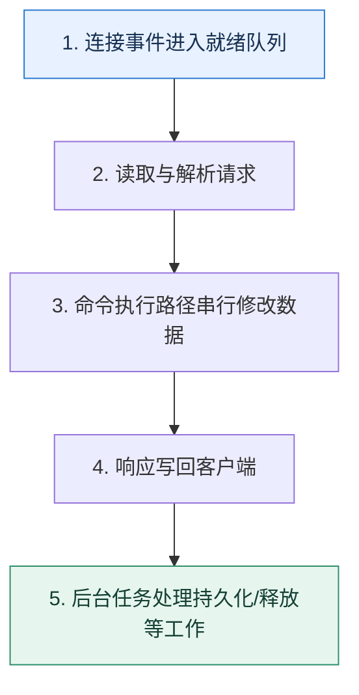

# Redis 执行模型｜命令串行不等于整个进程只有一个线程

> 本课只解决一个问题：Redis 常被称为单线程，它究竟串行了什么，又为什么仍会出现阻塞？

这不是原页面的缩写，也不是一组孤立结论。下面先建立一个能推演的最小世界，再把状态、数字和失败分支摊开，最后按来源讲解顺序覆盖全部知识线索。读完后，你应当能从 `连接事件进入就绪队列` 一直解释到 `后台任务处理持久化/释放等工作`，并说明中途任意一步失败会留下什么状态。

## 零基础入口：先建立本课的心智画面

对经典 Redis 工作负载，关键数据结构操作主要在一个命令执行路径中串行，避免了大量细粒度锁；但网络 I/O、持久化、异步释放等能力可使用其他线程或子进程，具体边界随版本和配置变化。

先不要急着记组件名。只抓住四个问题：**现在手里有什么输入？下一步只做什么动作？哪个状态发生变化？变化后的结果交给谁？** 之后遇到新框架，只要这四个答案不变，核心机制就没有变。

### 放进一个足够小、可以手算的世界

每秒 8 万个 GET 平均 50 微秒时，执行路径可顺畅轮转；若一个集合运算持续 200 毫秒，这期间到达的约 1.6 万个请求都会等待，P99 突然升高。把大集合拆批、改异步释放或预计算，往往比盲目增加客户端连接更有效。

这个小世界故意只保留本课必需的对象。生产系统会有更多节点、线程、分片和异常，但数量增加不会改变这里的因果关系。先确认你能手算这个例子，再把数字替换成真实系统数据。

### 先预测，不要马上看结论

**为什么把客户端连接从 100 增加到 1000，未必能解决单个 Redis 分片 CPU 已满的问题？**

先写下自己的判断，并指出你依赖的前提。文末自我检查会揭示答案；如果答案不同，回到下面的状态表找出第一个分叉点。

## 本节精讲：让机制一步一步发生

事件循环监听连接、读取请求、执行就绪命令并写回响应。内存访问快、数据结构经过优化，加上少锁竞争，使短命令吞吐很高；多路复用只是让一个执行路径同时管理很多连接，不会让一条慢命令自动并行。大键删除、复杂集合操作、长 Lua 脚本、阻塞式系统调用或内存换页都会占住执行路径，让其他请求排队。性能诊断应看命令耗时、慢日志、大键、事件循环延迟和 CPU，而不是背“单线程所以快”。

### 可见状态推进

| 当前步 | 现在发生的动作 | 下一步拿到什么 |
| ---: | --- | --- |
| 1 | 连接事件进入就绪队列 | 读取与解析请求 |
| 2 | 读取与解析请求 | 命令执行路径串行修改数据 |
| 3 | 命令执行路径串行修改数据 | 响应写回客户端 |
| 4 | 响应写回客户端 | 后台任务处理持久化/释放等工作 |
| 5 | 后台任务处理持久化/释放等工作 | 得到可核对的终态 |

图只承担一个任务：让你看清状态如何向前移动。它不意味着每一步必然成功；网络超时、进程退出、重复执行和数据竞争都可能让箭头停在中间，因此后面必须继续讨论失效边界。

### 一次带数字的完整推演

每秒 8 万个 GET 平均 50 微秒时，执行路径可顺畅轮转；若一个集合运算持续 200 毫秒，这期间到达的约 1.6 万个请求都会等待，P99 突然升高。把大集合拆批、改异步释放或预计算，往往比盲目增加客户端连接更有效。

数字不是装饰。它迫使我们回答容量、顺序、时间窗口或版本选择问题。若换一个数字就得出不同结论，真正的设计依据就是那个阈值，而不是某个中间件名称。

## 按讲解顺序重建知识链：完整来源讲解

下面按来源资料的教学顺序重新编排完整内容。转换页码、来源图片、推广信息、水印、角色化问答和只服务于技术讨论场景的话术已经删除；机制、算法、例子、反例、事故线索、评论补充和限制条件仍然保留。这里的作用是补齐知识覆盖，不取代前面的独立推演。

今天我们来探讨一下 Redis 高性能的原因。

这个问题在技术讨论中还是很常见的，原因也很简单，除了 Redis 你基本上没有听过其他采用单线程模型的中间件，所以这就凸显了 Redis 的与众不同。

而且这个问题也很有现实意义。大部分时候对 Redis 的一些高级应用，比如前面提到的利用Redis 实现一个分布式锁，其中有一个很重要的假设就是 Redis 是线程安全的，没有并发问题。而 Redis 是单线程的这一点就保证了线程安全的特性。

那么今天我就带你来看一下，Redis 的高性能究竟是怎样做到的。

### Redis 是单线程的含义

你在学习 Redis 的时候，肯定听过一句话，Redis 是单线程的。而实际上，Redis 并不是单线程的。业界说 Redis 是单线程的，是指它在处理命令的时候，是单线程的。在 Redis 6.0 之前，Redis 的 IO 也是单线程的，但是在 6.0 之后也改成了多线程。

但是其他部分，比如说持久化、数据同步之类的功能，都是由别的线程来完成的。因此严格来说，Redis 其实是多线程的。

### 把知识转成可验证的工程判断

这一部分的技术讨论内容基本上都是纯理论的，所以你需要做几件事情。

了解你使用的其他中间件，在 IO 上是否使用了 epoll，以及是否使用了 Reactor 模式。了解你们公司有没有使用 Redis 的多线程，如果用了，那么弄清楚最开始的决策理由以及相比单线程性能究竟提升了多少。了解清楚你使用的 Redis 的性能瓶颈。

如果你用的 Redis 真的启用了多线程模式，你就可以将这一点纳入到你的性能优化方案中。有关 Redis 的线程模型技术讨论是纯理论技术讨论，所以你需要记忆的东西很多。有时间的话可以把Redis 的源码下载下来，看看和网络 IO 处理有关的部分，加深印象。

当你和技术评审者聊到了这些话题的时候，你就可以用这节课的知识来解释。

网络 IO 问题。其他也用 epoll 的中间件。多线程的 Memcache，Memcache 用了多线程，但是 Redis 用了单线程。Redis 的性能问题。

### 技术推理路径

一般来说，技术评审者都会问你“为什么 Redis 是单线程的，但是又能做到高性能？”很多人会下意识地解释：“因为 Redis 是完全内存操作的。”这个理由很关键，但是这并不是技术评审者想要

的答案，他希望你解释的是 Redis 的 IO 模型。

所以要解释这个问题，你首先要澄清 Redis 单线程的含义。

我们通常说的 Redis 单线程，其实是指处理命令的时候 Redis 是单线程的。但是 Redis 的其他部分，比如说持久化其实是另外的线程在处理。因此本质上，Redis 是多线程的。特别是 Redis 在 6.0 之后，连 IO 模型都改成了多线程的模型，进一步发挥了多核 CPU 的优势。

然后你先点明两个关键点：内存操作和高效 IO 模型。

Redis 的高性能源自两方面，一方面是 Redis 处理命令的时候，都是纯内存操作。另外一方面，在 Linux 系统上 Redis 采用了 epoll 和 Reactor 结合的 IO 模型，非常高效。

这个时候他肯定就会问你，什么是 epoll，什么是 Reactor 模式。

### epoll 模型

简单来说就是 epoll 会帮你管着一大堆的套接字。每次你需要做啥的时候，就问问哪些套接字可用。读数据，就是找出那些已经收到了数据的套接字；写数据，就是找出那些可以写入数据的套接字。

而在 Linux 系统里面，套接字就是一个普通的文件描述符，因此 epoll 本质上是管着一堆文件描述符。

你记住：epoll = CRUD 文件描述符。

Redis 使用的是 epoll 来处理 IO。在 Linux 里面，万物都是文件，和网络 IO 有关的套接字也是文件。所以 epoll 要做的事情，就是管理这些文件描述符。或者用一句话来描述：epoll 就是增删改查文件描述符。

你再介绍一下 epoll 的基本结构和系统调用。

epoll 里面有两个关键结构。一个是红黑树，每一个节点都代表了一个文件描述符。另外一个是双向链表，也叫做就绪列表。

为了维护 epoll 的结构，有三个关键的系统调用。

1. epoll_create：也就是创建一个 epoll 结构
2. epoll_ctl：管理 epoll 里面的那些文件描述符，简单说就是增删改 epoll 里面的文件描述符。
3. epoll_wait：根据你的要求，返回符合条件的文件描述符，也就是查。

那么显然你可以猜到，如果你写一个从网络中读取数据的程序，看起来应该是这样的。

复制代码1 epoll = epoll_create();2 // fd 是一个套接字对应的文件描述符，并且告诉它，你关心读事件3 // 你可以加很多个4 epoll_ctl(epoll, ADD, fd, READ)5 while true {6 // 你需要可读数据的套接字，等待时间是 1000 毫秒7 fds = epoll_wait(epoll, READ, 1000)8 // 一步步处理9 }

你可以进一步补充 epoll 是怎么把文件描述符挪到就绪列表的。

需要注意的是，epoll 并不是在我发起 epoll 调用的时候才把文件描述符挪到就绪列表的。而是在 epoll 创建之后，不管你有没有发起 epoll_wait 调用，只要文件描述符满足条件了，就会被挪到就绪列表。

### 发起 epoll 调用

因此，当你发起 epoll_wait 的时候，有两种情况。第一种情况是就绪列表里面有符合条件的套接字，直接给你。

第二种情况就是就绪列表里面没有符合条件的套接字，这时候传入不同的超时时间，会有不同的响应。记住关键词，-1 永远阻塞，0 立刻返回，正数等待直到超时。

如果在发起超时调用的时候，传入的超时时间是 -1，那么调用者会被阻塞，直到有满足条件的文件描述符。如果传入的超时时间是 0，那么会立刻返回，不管有没有满足条件的文件描述符。如果传入的是正数 N，那么就会等待最多 N 毫秒，直到有数据或者超时。

### 进阶推导：epoll 与中断

紧接着，你可以刷一个进阶推导，就是 epoll 怎么知道数据来了？又或者 epoll 怎么知道超时了？答案是中断，也就是你在操作系统基本原理里面学到的中断。

每一个和 IO 有关的文件描述符都有一个对应的驱动，这个驱动会告诉 epoll 发生了什么。比如说，当有数据发送到网卡的时候，会触发一个中断。借助这个中断，网卡的驱动会告诉epoll，这里有数据了。而超时也是利用了中断，不过是时钟中断。时钟中断之后，内核会去检查发起 epoll_wait 的线程有没有超时，如果超时了就会唤醒这个线程。调用者就会得到超时响应。

这部分内容我建议你主动提起，因为很少有技术评审者会在技术讨论中追问到这里。而且，你可以将比较上层的应用原理和底层的中断机制关联在一起，能体现你计算机基础很扎实。

### epoll、poll 和 select

在技术讨论中，epoll、poll 和 select 有时候会一起问。也就是让你分析这三种模型，并且解释三者的优劣。

前面你已经掌握了最难的 epoll 了，而 poll 和 select 比 epoll 简单多了。

我们先来看 select。你发起 select 调用的时候会传给 select 一堆代表连接的文件描述符，内核会帮你检查这些文件描述符。

它和 epoll 的区别是，你必须要发起 select 调用，内核才会一个个帮你问。也就是说，select调用缺乏 epoll 那种即便你不调用 epoll_wait，epoll 也会把准备好的文件描述符放到就绪列表的机制。一句话来说，就是 epoll 会提前帮你准备好符合条件的文件描述符，但是 select不会。

select 用起来的伪代码就像这样：

复制代码1 readfds = [] // 一堆文件描述符，作为候选2 writefds = [] // 也是一堆文件描述符，作为候选3 execpfds = [] // 还是一堆文件描述符，作为候选4 select(readfds, writefds, excepfds) // 从这些描述符里面挑出符合条件的

在 select 方法内部，内核会遍历你传入的这些候选文件描述符，找出你要的。poll 和 select的基本原理一样。

三者的区别我列了一个表格，你在工程复盘时可以强调一下和性能有关的几个点。

在技术讨论中你主要面 epoll 的细节，poll 和 select 你大概提一下就可以。一般情况下你能解释清楚 epoll，就能赢得竞争优势了。

在搞清楚了 Redis 使用的系统调用之后，还有一个技术讨论的点，就是 Redis 使用的 Reactor 模式。

### Reactor 模式

Reactor 模式也是广泛使用的 IO 模式，它的性能很好，Redis 也用了 Reactor 模式。

用一句话来说明 Reactor 模式：一个分发器 + 一堆处理器。

一般来说，客户端和服务端的 IO 交互主要有两类事件：连接事件和读写事件。那么 Reactor里面的分发器就是把连接事件交给 Acceptor，把读写事件交给对应的 Handler。这些Handler 最终会调用到你真正需要读写数据的业务代码。

结合前面讲的 epoll，你基本上就能猜到，Redis 的 Reactor 就是调用了 epoll，拿到创建连接的套接字，或者可读写的套接字，转发给后面的 Acceptor 或者 Handler。

在搞清楚这一点之后，接下来你就能够理解各种 Reactor 的变种了。变种基本上可以分成三类。

把 Accetor 做成多线程。把 Handler 做成多线程。

把 Reactor 做成多线程。Reactor 的主线程只监听连接创建的事件，监听到了就交给其他线程处理。其他线程则是监听读写事件，然后调用对应的 Handler 处理。

Redis 的特殊之处在于，Redis 是单线程的。也就是说，Reactor、Handler、Acceptor 都只是一个逻辑上的区分，实际上都是同一个线程。

所以当技术评审者问到的时候，你就把这两者结合在一起解释。

为了保证性能最好，Redis 使用的是基于 epoll 的 Reactor 模式。

Reactor 模式可以看成是一个分发器 + 一堆处理器。Reactor 模式会发起 epoll 之类的系统调用，如果是读写事件，那么就交给 Handler 处理；如果是连接事件，就交给 Acceptor处理。

然后强调一下单线程的 Redis 是怎么使用这个 Reactor 模式的。

Redis 是单线程模型，所以 Reactor、Handler 和 Acceptor 其实都是这个线程。

整个过程是这样的：

1. Redis 中的 Reactor 调用 epoll，拿到符合条件的文件描述符。
2. 假如说 Redis 拿到了可读写的描述符，就会执行对应的读写操作。
3. 如果 Redis 拿到了创建连接的文件描述符，就会完成连接的初始化，然后准备监听这个连接上的读写事件。
后面在 6.0 的时候，Redis 改成了多线程模型，但是基本原理还是 Reactor + epoll。

最后，你提到了 Redis 的 6.0 新模型，那么技术评审者就可能会问你两个问题。

同样是基于内存的缓存中间件，为什么 Memcache 用的是多线程模型，而 Redis 用的是单线程模型？Redis 为什么最终又引入了多线程模型？和原本的单线程模型比起来，区别在哪里？

### 进阶推导一：为什么 Memcache 使用多线程？

坦白来说，我个人认为这就是一个设计者的偏好问题，因为两者的优缺点都是很明显的。

你在解释的时候，也就是解释两者的优缺点，再随便补充一点个人理解就可以了。你可以先解释 Redis 使用单线程模式的原因。

Redis 使用单线程模式的理由有很多。首先有两个显著的优点：不会引入上下文切换的开销，也没有多线程访问资源的竞争问题。其次 Redis 是一个内存数据库，操作很快，所以它的性能瓶颈只可能出现在网络 IO 和内存大小上，是不是多线程影响不大。最后，单线程模式比较好理解，调试起来也容易。

紧接着解释 Memcache 的设计。

Memcache 采用了多线程设计，那么带来的后果就是会有线程上下文切换的开支，并且多线程模式下需要引入锁来保护共享资源。优点则是 Memcache 会比 Redis 更充分地利用多核 CPU 的性能。

毕竟我们都不是 Redis 的设计者，也难以说清楚究竟是什么因素促使设计者下定决心使用单线程模型。下面的这一段话是我的个人理解，你可以替换成你自己的思考。

我之前注意到有些人在网上发布了 Redis 和 Memcache 的性能对比。基本上就是有些时候Redis 好一点，有些时候 Memcache 好一点。

我就觉得既然 Redis 用单线程模型都能取得这种不相上下的性能表现，就说明 Redis 的选择还是很正确的。即便如此，后面 Redis 在 6.0 的时候，还是引入了多线程模型，期望进一步利用多核 CPU 的优势。

### 进阶推导二：Redis 为什么引入多线程？

引入多线程的原因只有一个，那就是性能。

Redis 在 6.0 引入多线程的原因只有一个，在高并发场景下可以利用多个线程并发处理 IO任务、命令解析和数据回写。这些线程也被叫做 IO 线程。默认情况下，多线程模式是被禁用了的，需要显式地开启。

当然要想答好这个问题，你不能只解释为什么引入多线程，还要结合 Reactor 和 epoll 来解释在启用了多线程模型之后，Redis 是如何运作的。

如果刨除 Redis 主线程和 IO 线程之间的交互细节，那么多线程模式下的 Redis 的 Reactor和 epoll 结合在一起的形式就是像图片里展示的这样。

你这样介绍整个设计。

当 Redis 启用了多线程之后，里面的主线程就要负责接收事件、创建连接、执行命令。Redis 的 IO 线程就负责读写数据。

我用一个请求的处理过程来解释一下整个设计。当客户端发出请求的时候，主线程会收到一个可读的事件，于是它把对应的客户端丢到可读的客户端列表。一个 IO 线程会被安排读写这个客户端发过来的命令，并且解析好。紧接着主线程会执行 IO 线程解析好的命令，并且把响应放回到可写客户端列表里面。IO 线程负责写回响应。整个过程就结束了。

所以整个 Redis 在多线程模式下，可以看作是单线程 Reactor、单线程 Acceptor 和多线程Handler 的 Reactor 模式。只不过 Redis 的主线程同时扮演了 Reactor 中分发事件的角色，也扮演了接收请求的角色。同时多线程 Handler 在 Redis 里面仅仅是读写数据，命令的执行还是依赖于主线程来进行的。

紧接着你要补充一个业界比较多人认同的观点，就是不到逼不得已不要启用 Redis 多线程模型。

虽然说现在 Redis 的 IO 改成多线程之后能够有效利用多核性能，但是大部分情况下都是不推荐使用多线程模式的。道理很简单，Redis 在单线程模式下的性能就足以满足绝大多数使用场景了，那么用不用多线程已经无所谓了。

接下来，你根据你们公司的实际情况来选择一个解释。

第一个解释是介绍你们公司使用了多线程模型。

我司的 Redis 早期的时候就触及了单线程的性能瓶颈，后来在开启了多线程之后，能支撑的 QPS 大概提升了 50%，效果还是很不错的。

你最好在自己公司里面测试一下性能提升的幅度。有些时候技术评审者可能会问你用了几个线程，你解释公司的实际情况就行。

另外一个解释是你们公司没有用多线程模型。

早期某个线上系统虽然遇到过 Redis 的性能瓶颈，但还是没有启用多线程模型，而是改成了使用 Redis Cluster（或者扩大了 Redis Cluster 规模）。我个人认为，Redis Cluster 一样能够解决性能瓶颈问题，而且相比多线程模式，Redis Cluster 的可用性更好，解决性能问题的效果也更好。

### 本节原始知识线索收束

这一节课，我首先澄清了一个观点“Redis 是单线程的”，实际上强调的是命令的执行过程是单线程的。

在技术讨论过程中，Redis 的高性能主要分成两个部分：epoll 和 Reactor 模式。你要注意在解释的时候解释清楚 Redis 究竟是怎么把这两者结合在一起的。简单来说就是 Reactor 通过 epoll这个调用知道发生了什么，然后分发给后面的 Acceptor 和 Handler。

记住，在单线程里面，Reactor 模式里面各个组件实际上都是同一个线程。那么相应的 epoll结构、基本原理以及和中断的关系，你也需要记住。

最后，我们讨论了两个问题。

为什么 Memcache 使用多线程？虽然明面上你可能也认为就是设计者的偏好而已，但是你在解释的时候还是要分析单线程多线程的优劣，最后讲一下自己的体会。Redis 为什么引入多线程？核心还是为了充分利用多核性能。要想在这个问题里面赢得优势，你需要说清楚在多线程模式下，Redis 中的 Reactor 模式是如何运作的。

要强调的一点就是，今天这部分内容用于技术讨论应该是够了，毕竟在工程复盘时很少有技术评审者会要求你答出 Redis 的源码究竟是怎么实现的。不过我还是建议你如果有时间的话，去看看Redis 的底层源码，这样会对这节课的内容有更深刻的理解。。

### 继续推演

最后请你来思考两个问题。

我在 Memcache 里面吐槽说为什么它用多线程而 Redis 用单线程，可能就是设计者的偏好问题，你是如何看待这个问题的？

你认为在 Redis 遇到性能瓶颈的时候，是应该优先考虑使用多线程模式还是应该考虑Redis Cluster 增加新节点来解决？

### 补充讨论与边界校准

#### 全部留言 (3)

补充讨论： Memcache 里面吐槽说为什么它用多线程而 Redis 用单线程，可能就是设计者的偏好问题，你是如何看待这个问题的？redis虽然是单线程，但也只是网络io+内存操作是单线程，其他涉及文件io，数据同步等耗时操作都是多线程。当然涉及耗时读写操作，redis会造成阻塞。另外缓存本来就是读多写少的操作。从上述两点个人倾向于多线程模型。你认为在 Redis 遇到性能瓶颈的时候，是应该优先考虑使用多线程模式还是应该考虑 Redis Cl uster 增加新节点来解决？大部分的情况新增节点提升高，除非是单个热key或crc相同的热key，在不改动代码的情况下，新增节点无用，需要开启多线程

讲解补充：赞！第二个点考虑一语中的！

2

补充讨论： Linux 系统上 Redis 采用了 epoll 和 Reactor 结合的 IO 模型”，那么，Redis在windows下也是这样的IO模型吗？Q3：普通的文件描述符也叫“套接字”吗？我把“套接字”理解成socket了，用于网络通信的了。文中说的“套接字”好像范围很广，即包括s

ocket，也包括其他类型的文件描述符了。Q4：Redis用的epoll是借用Linux的epoll吗？Epoll_create是一个系统调用，从这里看，应该是借用Linux本身的epoll特性。Q5：Memcache是内存数据库吗？Q6：Redis多线程模式下，主线程收到请求后，哪个IO线程来处理是怎么决定的？随机选一个吗？还是事先绑定好了？

讲解补充：1. 不能，我记得 linux 没这种系统调用，但是有点不太确定

2. 不是，但是是类似的机制，不需要了解，因为很少用到
3. 不，套接字是文件描述符，但是文件描述符不是套接字
4. Redis 调用的就是 Linux 的，除非你的 redis 都没部署在 linux 上
5. 可以这么说
6. 命令肯定是主线程来执行

补充讨论：

## 把完整讲解收束成一条因果链

1. 先限定“单线程”指的执行边界，避免绝对化。
2. 再解释事件循环和内存操作为何适合短命令。
3. 用一个 200ms 慢命令推导所有连接的排队。
4. 最后列出大键、慢脚本、换页和后台任务的观测方法。

把这几步连接起来时，不要省略“为什么”。最终结论只有在前提、状态变化和失败代价都说得清楚时才可靠。

## 误区与失效边界

单命令原子只覆盖该实例内该命令的执行，不等于跨多个命令、多个键槽或外部数据库的业务事务原子。连接越多也不会突破单个热点分片的 CPU 上限，反而可能增加排队和内存。

再加一条通用但必须落实到本课对象上的边界：机制只能处理它看得见的信号。若输入指标失真、状态没有持久化、错误被吞掉，或者补偿没有幂等保护，再成熟的框架也只能基于错误证据作决定。

### 三种故障注入方式

| 故障 | 要观察什么 | 不能接受的解释 |
| --- | --- | --- |
| 在第 2 步前让依赖超时 | 是否停在可重试状态，是否消耗完上游预算 | “框架稍后会处理” |
| 在状态写入后让进程退出 | 重启后能否识别已完成与待继续动作 | “再执行一次应该没事” |
| 对同一输入并发执行两次 | 是否出现重复副作用、顺序颠倒或覆盖 | “概率很低” |

## 工程验证：把理解变成可以复查的证据

实验分别执行短 GET、渐增集合运算和大键删除，记录事件循环延迟与 P99。若单个命令耗时与全局延迟峰值同步，就能直接看到串行路径的队头阻塞。

| 步骤 | 状态或动作 | 最少应留下的证据 |
| ---: | --- | --- |
| 1 | 连接事件进入就绪队列 | 开始时间、结束时间、输入标识、结果状态、异常原因 |
| 2 | 读取与解析请求 | 开始时间、结束时间、输入标识、结果状态、异常原因 |
| 3 | 命令执行路径串行修改数据 | 开始时间、结束时间、输入标识、结果状态、异常原因 |
| 4 | 响应写回客户端 | 开始时间、结束时间、输入标识、结果状态、异常原因 |
| 5 | 后台任务处理持久化/释放等工作 | 开始时间、结束时间、输入标识、结果状态、异常原因 |

验证时同时记录成功路径和失败路径。只证明“正常时能跑通”不能说明设计可靠；至少要让一次超时、一次进程退出和一次重复请求可重现，并能根据日志或指标解释最后状态。

## 学完检查：闭卷画出本课

你现在应该能独立完成四件事：

1. 用自己的话说出本课唯一问题，不使用产品名也能解释。
2. 复算上面的具体例子，并指出哪个输入改变会让结论改变。
3. 沿 Mermaid 图注入一次失败，预测系统停在哪里以及由谁收敛。
4. 说出本课机制不保证什么，并给出一个反例。

## 自我检查

为什么把客户端连接从 100 增加到 1000，未必能解决单个 Redis 分片 CPU 已满的问题？

连接增加的是排队与并发请求来源，不会让串行命令执行路径获得更多核心。应减少单命令成本、拆热点或水平分片。

怎样证明自己不是只记住了名词？

把 `连接事件进入就绪队列` 的一个真实输入写出来，逐步记录到 `后台任务处理持久化/释放等工作`。然后在中间任意一步制造失败；如果你能解释当前状态、下一责任方、可观测证据和恢复边界，就已经拥有可以迁移的工程模型。

## 来源与事实校准

- [查看完整来源稿（本地 19 页资料）](../content/36-redis-single-thread.md)

### 当前事实校准

Redis 官方把命令执行描述为 mostly single-threaded，同时明确后台 I/O、持久化等工作可能使用其他线程或进程。单条慢命令会阻塞其他客户端，所以应关注命令复杂度、网络往返、fork、swap、持久化与内存过期造成的尾延迟，而不是把“单线程”直接等同于慢或绝对无并发。

- [Redis · Diagnosing latency issues](https://redis.io/docs/latest/operate/oss_and_stack/management/optimization/latency/)
- [Redis · Latency monitoring](https://redis.io/docs/latest/operate/oss_and_stack/management/optimization/latency-monitor/)

来源稿用于核对覆盖范围，不随公开站点发布。产品默认值和具体内部行为可能随版本变化；落地时应使用目标版本的官方文档、可运行实验和故障演练校准。本学习稿中的零基础入口、状态推演、故障矩阵和工程验证属于编辑补充，不冒充来源讲解者的原话。
