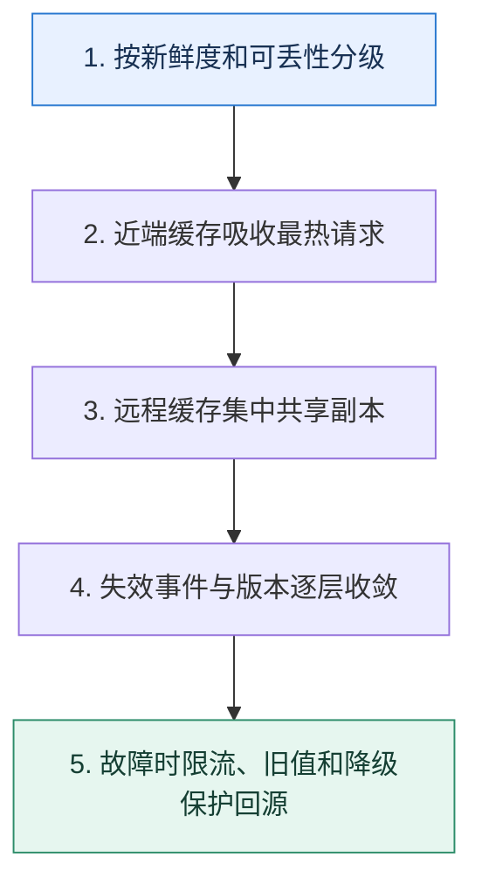

# 缓存架构全景｜按数据新鲜度与故障半径设计多级防线

> 本课只解决一个问题：从进程本地到 Redis 集群，怎样组合多级缓存而不让一致性失控？

这不是原页面的缩写，也不是一组孤立结论。下面先建立一个能推演的最小世界，再把状态、数字和失败分支摊开，最后按来源讲解顺序覆盖全部知识线索。读完后，你应当能从 `按新鲜度和可丢性分级` 一直解释到 `故障时限流、旧值和降级保护回源`，并说明中途任意一步失败会留下什么状态。

## 零基础入口：先建立本课的心智画面

多级缓存把热点挡在更靠近请求的位置，但每多一层就多一个副本、失效路径和容量边界。先给数据分类：是否可丢、最大陈旧时间、热点分布、对象大小和回源代价。

先不要急着记组件名。只抓住四个问题：**现在手里有什么输入？下一步只做什么动作？哪个状态发生变化？变化后的结果交给谁？** 之后遇到新框架，只要这四个答案不变，核心机制就没有变。

### 放进一个足够小、可以手算的世界

商品详情允许旧 10 秒：进程本地缓存 TTL 2 秒，Redis TTL 60 秒并带版本，数据库是真相源。更新后发送版本 18 的失效事件；本地层最晚 2 秒自然收敛，Redis 删除失败由事件重试。Redis 全部不可用时，网关把回源限制到 3000 QPS，热点可返回带“数据可能稍旧”标记的快照。

这个小世界故意只保留本课必需的对象。生产系统会有更多节点、线程、分片和异常，但数量增加不会改变这里的因果关系。先确认你能手算这个例子，再把数字替换成真实系统数据。

### 先预测，不要马上看结论

**为什么增加进程本地缓存后，远程缓存 QPS 降了，一致性却可能更难？**

先写下自己的判断，并指出你依赖的前提。文末自我检查会揭示答案；如果答案不同，回到下面的状态表找出第一个分叉点。

## 本节精讲：让机制一步一步发生

请求可依次经过浏览器/CDN、网关、进程本地缓存和远程缓存，再回到数据库。近端层延迟低但副本多，本地失效通常依赖短 TTL 或广播；远程层便于集中治理，可用分片和副本扩展。读路径要防穿透与击穿，写路径用版本/失效事件收敛；集群故障时由限流、旧值降级和非核心功能关闭保护数据库。预热只加载真正热点，并设置容量水位，避免启动时制造雪崩。

### 可见状态推进

| 当前步 | 现在发生的动作 | 下一步拿到什么 |
| ---: | --- | --- |
| 1 | 按新鲜度和可丢性分级 | 近端缓存吸收最热请求 |
| 2 | 近端缓存吸收最热请求 | 远程缓存集中共享副本 |
| 3 | 远程缓存集中共享副本 | 失效事件与版本逐层收敛 |
| 4 | 失效事件与版本逐层收敛 | 故障时限流、旧值和降级保护回源 |
| 5 | 故障时限流、旧值和降级保护回源 | 得到可核对的终态 |

图只承担一个任务：让你看清状态如何向前移动。它不意味着每一步必然成功；网络超时、进程退出、重复执行和数据竞争都可能让箭头停在中间，因此后面必须继续讨论失效边界。

### 一次带数字的完整推演

商品详情允许旧 10 秒：进程本地缓存 TTL 2 秒，Redis TTL 60 秒并带版本，数据库是真相源。更新后发送版本 18 的失效事件；本地层最晚 2 秒自然收敛，Redis 删除失败由事件重试。Redis 全部不可用时，网关把回源限制到 3000 QPS，热点可返回带“数据可能稍旧”标记的快照。

数字不是装饰。它迫使我们回答容量、顺序、时间窗口或版本选择问题。若换一个数字就得出不同结论，真正的设计依据就是那个阈值，而不是某个中间件名称。

## 按讲解顺序重建知识链：完整来源讲解

下面按来源资料的教学顺序重新编排完整内容。转换页码、来源图片、推广信息、水印、角色化问答和只服务于技术讨论场景的话术已经删除；机制、算法、例子、反例、事故线索、评论补充和限制条件仍然保留。这里的作用是补齐知识覆盖，不取代前面的独立推演。

今天我们来讨论一个话题——怎么优雅地使用缓存来提高整个应用的性能。

早在微服务部分，我就和你说过，技术讨论中比较好用的就是高可用方案和高性能方案。那么在高性能方案里面，缓存就是一个绕不过的坎。

但是大部分人在工程复盘时，缓存方案都比较朴素，没有什么突出之处。比如说也就是用用Redis，使用 Redis 的确能够提高性能，但毕竟使用 Redis 是一个入行三个月就能溜得飞起的技能，并不能凸显你的能力。

所以今天我就给你准备了一些比较有特色的缓存方案，让你在技术讨论中赢得竞争优势。

### 把知识转成可验证的工程判断

看看你所维护的业务有没有可以使用请求级别缓存或者会话级别缓存的场景。如果有，可以在公司尝试优化一下，并且注意比较优化前后的性能。你有没有使用过什么与众不同的缓存方案？如果没有的话，可以尝试根据公司的业务特征来设计一些有特色的缓存方案。你的业务里面有没有可能引入本地缓存的，并且可以进一步引入一致性哈希负载均衡策略来提高缓存命中率和性能。

记住在技术讨论缓存的时候，你除了要掌握前面的那些知识点以外，还要有非常具体的缓存方案。

很多时候，你出去技术讨论缓存的时候显得干巴巴的，就是因为你在工程复盘时缺乏具体的案例支撑或者细节不够。就算是缓存里非常基础的知识，你都要有案例来支撑。

你的最佳技术讨论策略就是将缓存方案作为你提高整个系统性能中的关键一环。然后你要围绕这个缓存方案讲清楚几点。

为什么这么设计？缓存命中率多少？一致性问题你是怎么解决的？缓存命中的性能和未命中的性能差异是多少？实施这个缓存方案前的性能数据和实施这个方案之后的性能数据是多少？和业界的一般方案比起来，这个方案有没有什么独特之处？

最后一点也就是缓存技术讨论中的难点，因为常规方案技术评审者已经见得太多了，所以要想加深印象，就得出奇制胜。所以你尽可能根据自己公司的业务特征，在缓存上搞点不一样的东西出来。

### 缓存方案

### 一致性哈希 + 本地缓存 + Redis 缓存

经过前面的学习，你已经看到了一致性哈希和本地缓存结合的巨大威力，我也相信你至少听过本地缓存和 Redis 缓存结合使用的案例。所以这个一致性哈希 + 本地缓存 + Redis 缓存的方案就显得比较平庸了，不过你在工程复盘时还是可以提一下的，毕竟你的竞争对手的方案可能就是简单的本地缓存 + Redis 缓存的方案。

我有一个接口，性能要求十分苛刻。最开始的时候，只用了 Redis 缓存，性能其实也还说得过去。但是后面想要进一步提升性能的时候，我就只能考虑引入本地缓存。而为了避免本地缓存命中率不高还有内存浪费的问题，我就进一步在客户端利用一致性哈希负载均衡算法，确保同一个业务的请求总是落到同一个节点上。经过改进之后，性能果然提高了40%。而且，因为使用一致性哈希负载均衡，所以本地缓存的命中率也很高。

这个方案的好处就是适用性广泛，基本上你只要使用了本地缓存和 Redis，就可以在前面加一个一致性哈希负载均衡。

在使用这个方案的时候，要记得深入讨论一下数据一致性的问题，尤其是上线新节点会发生什么。这个问题在前面的内容里面已经讨论过了，我就不再重复了。

### Redis 缓存降级成本地缓存

在第 35 讲那里，我提到过一个案例，是使用一个廉价的 Redis 来作为备份。一旦生产用的Redis 崩溃了就直接替换到备份上。实际上，你直接用本地缓存也可以。但是这个本地缓存并不是为了性能，而是在 Redis 崩溃之后作为容错。也就是在正常的情况下，如果 Redis 运作良好，那么查询的都是 Redis，如果 Redis 里没有数据，那就查询数据库。

但是如果 Redis 崩溃了，或者说因为网络问题长时间连不上去，就会启用本地缓存。这时候，查询会先查询本地缓存，本地缓存中没有数据，就会查询数据库。

正常用法都是先查询本地缓存，再查询 Redis，而这个方案反其道而行之，能够达到出其不意的效果。

所以你可以这样来介绍这个方案。

我之前维护了一个强调高可用和高性能的服务。这个服务最开始使用的缓存方案是比较典型的，就是访问 Redis，然后访问数据库。后来有一次我们这边网络出了问题，连不上Redis，导致压力瞬间都到了数据库上，数据库崩溃。

我后面做了两个事情，防止再一次出现类似的问题。第一个事情就是在数据库查询上加上了限流。另外一个事情就是引入了本地缓存。但是本地缓存一开始是没有启用的。我会实时监控 Redis 的状态，一旦发现 Redis 已经崩溃，就会启用本地缓存。启用本地缓存之后，好处是保住了数据库，并且响应时间还是很好。缺点就是本地缓存会面临更加严重的数据一致性问题。

这时候你就会发现，这个方案好像又可以和哈希一致性负载均衡联系在一起。

为了缓解这种数据不一致性的问题，我进一步引入了一致性哈希负载均衡算法，确保同一个业务的请求肯定落到同一个服务端节点上，这样就可以提高本地缓存的命中率，并且降低本地缓存的消耗。

而怎么发现 Redis 崩溃了的问题，你同样可以借鉴在微服务部分判断节点健康与否的内容，比如说收到了大量的 Redis 超时响应，就可以认为 Redis 已经崩溃。当然在启用了本地缓存之后，也要考虑实时监控 Redis 的情况，一旦 Redis 恢复过来，就要逐步放弃本地缓存。

在启用了本地缓存之后，还要监控 Redis 的状态。当 Redis 恢复过来，就可以逐步将本地缓存上的流量转发到 Redis 上。之所以不是立刻全部转发过去，是因为刚恢复的时候Redis 上面可能什么数据都没有，导致缓存未命中，回查数据库。这可能会引起数据库的问题。

这两个方案说到底就是 Redis 和本地缓存的灵活运用而已。接下来我们看两个奇诡的方法：请求级别缓存和会话级别缓存。

### 请求级别缓存

所谓的请求级别缓存是指当请求返回响应的时候，缓存也就失效了。

我来给你解释一下这种缓存的基本原理。使用这种缓存方案的前提是，你在一个请求里面会反复查询同一个数据多次。比如说，因为模块划分之后要恪守边界，所以每个模块都会自己去调用接口来获得同一份数据。

那么你就可以考虑将数据和请求关联在一起，做成一个在请求生命周期内有效的缓存。

举例来说，你有两个模块，一个是订单模块，一个是支付模块。这两个模块因为封装得都非常好，所以它们都只需要你传入一个 user_id，这两个模块拿着 user_id 去查询对应的用户信息，完成对应的业务。

当你没有使用请求级别缓存的时候，它们一共发出两次数据库查询。当你用了请求级别缓存的时候，订单模块查询到之后，支付模块只需要直接用就可以。

这个东西一般是需要特殊的中间件来支持的。比如说在 Java 里面可以直接借助 Request-Scope 的 Bean 来缓存数据。而在 Go 里面可以借助 context.Context 来完成。

这时候你可能会问，为什么不直接使用缓存呢？比如说本地缓存。因为和本地缓存之类的方案比起来，请求级别的缓存不需要考虑一致性的问题。因为你的缓存数据在请求返回响应之后就无效了，撑死了就是有人在你处理这个请求的过程中修改了数据，但是你并不知道。而大多数的时候，你可能并不在意这么一点不一致。

不过总的来说，这个方案的应用面还是比较狭窄的。你可以考虑在自己的业务里面找到了真实场景之后再来使用这个方案技术讨论。

另一个方法是在请求级别上扩大了缓存的作用范围，就是会话级别缓存。相比之下，这个级别要更加实用一些。

### 会话级别缓存

类似于请求级别缓存，这个级别的缓存是在用户和系统的会话结束之后，就失效了。

简单来说，就是你把缓存做成类似于登录态里 Session 那种东西，Session 结束了，那么缓存的数据也失效了。

这个在 Java 里面也很好落地，因为 Java 的 Spring 支持 Session-Scope 的 Bean。你只需要把数据放到这种 Bean 里面就可以。

它的好处同样是数据一致性问题没那么严重。它相当于在用户和你的系统保持会话的期间，使用的数据始终是同一份。比如说用户权限信息，它对一致性的要求很高，但是使用又非常频繁。

你可以参考这段话，然后根据自己的业务实际情况替换就可以。

我在做系统性能优化的时候，发现了我们的系统有一个共同点，就是经常需要查询权限信息，来做鉴权。但是经过分析，我发现权限之类的信息在一个会话期间基本不可能修改。

于是我就引入了一个会话级别的缓存，系统先查询会话中缓存的权限信息，找不到就去查询权限模块。

同时，监听对用户权限信息的修改，在发生修改之后，直接清空会话中缓存的权限数据。

### 客户端缓存

在微服务架构里面，有些时候性能要求非常苛刻，又或者你对一致性要求不是特别高，于是你就会想在调用别人的微服务的时候把结果缓存下来。等到下一次有类似的请求过来，就可以直接用自己缓存的数据了。

你可以沿用优化性能的思路。

之前我还优化过一个服务的接口。这个服务有很多接口，但是大部分接口都需要用到用户的信息，所以我就做了一个客户端缓存。思路是这样的，每次我发起调用查询了用户的信息之后，我就会把它缓存起来，设置一个比较短的过期时间，比如说一分钟。后续如果需要这个数据的时候，我就先从缓存里拿数据，如果缓存里没有数据，再调用用户服务的接口。这种做法最大好处的是省了一次微服务调用的开销。

这里我用的是用户信息作为例子，你可以换成你的实际业务。

紧接着你可以说一个技术评审者绝对想不到的进阶推导：自己缓存的话，淘汰策略对自己的业务更加友好。

和服务端缓存比起来，我这个方案还有一个意想不到的优点，就是服务端的淘汰策略不会影响到我。

我举个例子，虽然服务端也缓存了数据，但是因为服务端是给很多业务提供服务的。那么就可能出现这种问题：某个业务的查询相对我的业务的查询来说，非常高频，或者优先级更高，导致服务端在淘汰键值对的时候，总是优先淘汰我用的键值对。

那么就会出现，服务端整体上缓存命中率很高，但是我这个特定的业务方，缓存命中率很低的问题。而我自己缓存的话，淘汰的肯定就是我这个业务不怎么需要的。

总的来说，客户端缓存是一种反范式的用法，因为它会加剧数据一致性的问题。

这种用法也是一种反范式的用法。因为按照正统的微服务理论来说，应该是服务端缓存数据，而不是在客户端缓存数据。否则的话，如果服务端接收到了请求，修改了数据，客户端这边是没有感知的。

为了解决这个问题，我们又引入了一个变种，也是在客户端这边缓存，但这个缓存是服务端提供的依赖来管理的。比如说在 Java 这边，引入服务端的 Jar 包，服务端的 Jar 包会自己先查询缓存，当缓存没有数据的时候，才会真的发出请求到服务端。

正常来说，除非你同时是服务端的研发，不然很难要求别的组或者别的部门给你提供这样一个依赖。

客户端缓存还可以利用业务相关性来进一步提升缓存的命中率和接口的性能。

### 业务相关缓存预加载

所谓的业务相关缓存预加载是指如果从业务上来看，用户调用了 A 接口之后会很快调用 B 接口，那么我就可以在 A 接口调用的时候把 B 接口用得上的数据缓存起来，又或者在调用 A 接口的时候，提前加载 B 接口的缓存。

早期我还利用业务的关联性来优化过系统的性能。在我的系统里面，用户调用 A 接口之后，大概率会调用 B 接口。所以我就做了两件事，A 接口和 B 接口都需要的数据，我直接缓存起来。如果 B 接口还需要一些额外的数据，那么我可以提前发起微服务调用，拿到数据之后一起缓存起来。

后续用户真的调用了 B 接口，就直接从缓存里拿数据，性能很好。就算没有调用 B 接口，我在缓存的时候，设置的过期时间也很短，也不会有什么问题。

你可以进一步谈谈个人理解。

我个人认为，利用业务之间的关联性来缓存、或者提前加载缓存数据，是很好的优化性能的手段。

你这里提到了缓存预加载，那么技术评审者就可以继续追问下去。

### 缓存预热和预加载

缓存预热或者说预加载有两种思路。

在启动的时候，就直接把缓存加载到缓存中。可以全量加载，也可以只加载热点数据。在使用这种策略的时候，就要小心缓存雪崩的问题。启动之后，不是立刻就打过来 100% 的流量，而是先小比例地把流量打过来，在处理这些请求的过程中，缓存中的数据会慢慢加载好。

你可以这么介绍这个方案。

之前我使用的本地缓存来优化性能的时候，为了防止在节点刚启动的时候本地缓存中还没有数据，导致性能抖动，我引入了缓存预热的机制。

在节点刚启动的时候，它的权重会很低。这个时候基于权重的负载均衡就只会把少量流量转发过来。而后在运行了一段时间之后，这个节点的权重就会提高到正常数值。这个时候负载均衡就会把正常水平的流量打过来。

这个方案用于技术讨论中的优点是它结合了基于权重的负载均衡策略，所以你就可以把话题引导到负载均衡那边。

### 本节原始知识线索收束

在讨论系统性的缓存方案的时候，你可以按照从前端到后端，从微服务到数据库，每一个环节你在缓存上做了些什么的思路来技术讨论。

在前端部分，你用了什么和缓存有关的技术来提高性能？比如说缓存静态资源，或者设置更长的缓存过期时间。在 BFF 层，也就是接入层，你可以利用 Session 这种东西来维持一个会话级别的缓存，提高性能。在你发起微服务调用的时候，你可以考虑应用客户端缓存。具体到某个服务上，你可以使用一致性哈希负载均衡策略 + 本地缓存 + Redis 缓存。但是在工程复盘时要注意准备数据一致性的解决方案。在任何第三方中间件上，你都可以通过调整它们的缓存设置来提高性能。比如说在 MySQL你已经学到了通过调整 InnoDB 引擎里 buffer pool 的配置来提升性能了。

你要在技术讨论之前，把整个方案好好整理出来。这样技术讨论就能做到有备无患，解释也能做到井井有条。

### 继续推演

最后请你来思考两个问题。

你平时有没有用过一些更加有特色的方案？根据你的业务特征，如果让你设计一个从前端到后端的，每一个环节都用了缓存的技术讨论方案，你会怎么设计？

### 补充讨论与边界校准

#### 全部留言 (3)

补充讨论：

讲解补充：这个简单，你可以在 Cache 里面维持住标记位，标记位 = 0 就是不用 Redis，用本地缓存，标记位 > 0，比如说 80，就是 80% 到 Redis。类似这样就可以的。

1

3. 0的A7 2023-10-08 来自北京关于缓存命中率的统计，老师有什么好的方案吗？
讲解补充：如果你们公司规模比较大的话，可以考虑二次封装查询缓存的客户端。比如说在 GO 里面封装 redis.Cmdable 接口，在这里上报每次访问 Redis 是否命中了缓存的信息。

又或者说，你可以考虑刷个 KPI，就是在公司提供一致的缓存的接口，然后提供不同的实现，并且使用装饰器来提供一个上报缓存是否命中的实现。

如果没有这种统一的机制，可以考虑业务方自己记录，也就是每次调用缓存接口的时候，自己记录一下。

补充讨论：

请教老师几个问题：Q1：订单请求返回以后，缓存已经失效了，支付请求怎么获取？Q2：对“会话”一直理解不太到位，“会话”什么时候算结束？Q3：客户端采用服务端的jar包，怎么就能够解决“服务端修改数据后客户端没有感知”的问题？

讲解补充：1. 它们是在一个请求内，是一个请求的两个步骤。

2. 你可以理解为，用户登录了就是一个会话，退出了就是结束了，但是你也可以自由控制这个粒度。
3. 服务端要通知各个 Jar 包，或者 Jar 包里面有一些监听机制去监听服务端的变更。

## 把完整讲解收束成一条因果链

1. 先按数据语义分层，而不是按中间件堆叠。
2. 逐层计算延迟、容量、命中与最大陈旧窗口。
3. 把更新事件、TTL 和版本串成失效路径。
4. 最后演练某一层和全缓存故障，验证回源限流与降级。

把这几步连接起来时，不要省略“为什么”。最终结论只有在前提、状态变化和失败代价都说得清楚时才可靠。

## 误区与失效边界

多级命中率不能简单相加，也不能只看总体命中率；本地层可能长期保存旧值，Redis 热点分片可能单点饱和。缓存中若混入不可丢状态，需要拆分故障域和淘汰策略。

再加一条通用但必须落实到本课对象上的边界：机制只能处理它看得见的信号。若输入指标失真、状态没有持久化、错误被吞掉，或者补偿没有幂等保护，再成熟的框架也只能基于错误证据作决定。

### 三种故障注入方式

| 故障 | 要观察什么 | 不能接受的解释 |
| --- | --- | --- |
| 在第 2 步前让依赖超时 | 是否停在可重试状态，是否消耗完上游预算 | “框架稍后会处理” |
| 在状态写入后让进程退出 | 重启后能否识别已完成与待继续动作 | “再执行一次应该没事” |
| 对同一输入并发执行两次 | 是否出现重复副作用、顺序颠倒或覆盖 | “概率很低” |

## 工程验证：把理解变成可以复查的证据

架构表为每层填写 `容量、P99、命中率、TTL、可接受旧值、淘汰策略、故障回退、所有者`。再计算在各层同时失效时数据库接到的最大 QPS，必须小于压测安全水位。

| 步骤 | 状态或动作 | 最少应留下的证据 |
| ---: | --- | --- |
| 1 | 按新鲜度和可丢性分级 | 开始时间、结束时间、输入标识、结果状态、异常原因 |
| 2 | 近端缓存吸收最热请求 | 开始时间、结束时间、输入标识、结果状态、异常原因 |
| 3 | 远程缓存集中共享副本 | 开始时间、结束时间、输入标识、结果状态、异常原因 |
| 4 | 失效事件与版本逐层收敛 | 开始时间、结束时间、输入标识、结果状态、异常原因 |
| 5 | 故障时限流、旧值和降级保护回源 | 开始时间、结束时间、输入标识、结果状态、异常原因 |

验证时同时记录成功路径和失败路径。只证明“正常时能跑通”不能说明设计可靠；至少要让一次超时、一次进程退出和一次重复请求可重现，并能根据日志或指标解释最后状态。

## 学完检查：闭卷画出本课

你现在应该能独立完成四件事：

1. 用自己的话说出本课唯一问题，不使用产品名也能解释。
2. 复算上面的具体例子，并指出哪个输入改变会让结论改变。
3. 沿 Mermaid 图注入一次失败，预测系统停在哪里以及由谁收敛。
4. 说出本课机制不保证什么，并给出一个反例。

## 自我检查

为什么增加进程本地缓存后，远程缓存 QPS 降了，一致性却可能更难？

每个进程多了一份独立副本，集中删除 Redis 不能自动清掉它们。需要短 TTL、版本校验或可靠广播，并接受明确的新鲜度窗口。

怎样证明自己不是只记住了名词？

把 `按新鲜度和可丢性分级` 的一个真实输入写出来，逐步记录到 `故障时限流、旧值和降级保护回源`。然后在中间任意一步制造失败；如果你能解释当前状态、下一责任方、可观测证据和恢复边界，就已经拥有可以迁移的工程模型。

## 来源与事实校准

- [查看完整来源稿（本地 17 页资料）](../content/38-cache-architecture.md)

### 当前事实校准

多级缓存会增加独立副本和失效路径。Sentinel 或 Cluster 能改善 Redis 节点故障恢复，却不会自动保证本地缓存、数据库和远程缓存的一致性；设计必须同时给出每层新鲜度、故障半径、回源上限、版本/失效协议和绕过缓存时的数据库保护。

- [Redis · Client-side caching](https://redis.io/docs/latest/develop/clients/client-side-caching/)
- [Redis · High availability with Sentinel](https://redis.io/docs/latest/operate/oss_and_stack/management/sentinel/)

来源稿用于核对覆盖范围，不随公开站点发布。产品默认值和具体内部行为可能随版本变化；落地时应使用目标版本的官方文档、可运行实验和故障演练校准。本学习稿中的零基础入口、状态推演、故障矩阵和工程验证属于编辑补充，不冒充来源讲解者的原话。
