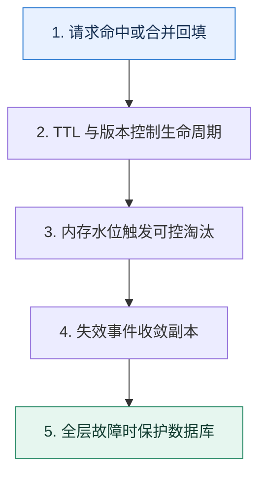

# 缓存专题复盘｜从一次热点失效推演到数据库保护

> 本课只解决一个问题：怎样把过期、淘汰、读写模式、一致性和故障治理连成一次完整推演？

这不是原页面的缩写，也不是一组孤立结论。下面先建立一个能推演的最小世界，再把状态、数字和失败分支摊开，最后按来源讲解顺序覆盖全部知识线索。读完后，你应当能从 `请求命中或合并回填` 一直解释到 `全层故障时保护数据库`，并说明中途任意一步失败会留下什么状态。

## 零基础入口：先建立本课的心智画面

缓存专题的主线不是命令，而是副本生命周期：何时创建、何时过期、内存不足时谁被牺牲、写入后怎样失效、缓存不可用时谁保护真相源。

先不要急着记组件名。只抓住四个问题：**现在手里有什么输入？下一步只做什么动作？哪个状态发生变化？变化后的结果交给谁？** 之后遇到新框架，只要这四个答案不变，核心机制就没有变。

### 放进一个足够小、可以手算的世界

商品 S9 平时 50k QPS，Redis TTL 到期时 2 万并发到达。singleflight 只允许一个数据库查询，其他请求最多等 100ms 后读取上一版；更新事件版本 31 到达后，只允许 31 或更高版本写缓存。此时 Redis 节点又触发淘汰，监控发现大对象挤压，团队将不可丢锁状态迁出缓存实例并限制对象大小。

这个小世界故意只保留本课必需的对象。生产系统会有更多节点、线程、分片和异常，但数量增加不会改变这里的因果关系。先确认你能手算这个例子，再把数字替换成真实系统数据。

### 先预测，不要马上看结论

**缓存专题中最先要确定的为什么不是 TTL 应设多少秒？**

先写下自己的判断，并指出你依赖的前提。文末自我检查会揭示答案；如果答案不同，回到下面的状态表找出第一个分叉点。

## 本节精讲：让机制一步一步发生

读请求先经过近端与 Redis，未命中由合并回填控制并发；TTL 加随机抖动，淘汰策略只作用在明确可丢的缓存实例。更新先提交数据库并发出版本化失效事件，失败可重试。热点过期时允许一个请求回源，其他请求等待或读旧值；集群故障时限流、降级和静态快照共同保护数据库。

### 可见状态推进

| 当前步 | 现在发生的动作 | 下一步拿到什么 |
| ---: | --- | --- |
| 1 | 请求命中或合并回填 | TTL 与版本控制生命周期 |
| 2 | TTL 与版本控制生命周期 | 内存水位触发可控淘汰 |
| 3 | 内存水位触发可控淘汰 | 失效事件收敛副本 |
| 4 | 失效事件收敛副本 | 全层故障时保护数据库 |
| 5 | 全层故障时保护数据库 | 得到可核对的终态 |

图只承担一个任务：让你看清状态如何向前移动。它不意味着每一步必然成功；网络超时、进程退出、重复执行和数据竞争都可能让箭头停在中间，因此后面必须继续讨论失效边界。

### 一次带数字的完整推演

商品 S9 平时 50k QPS，Redis TTL 到期时 2 万并发到达。singleflight 只允许一个数据库查询，其他请求最多等 100ms 后读取上一版；更新事件版本 31 到达后，只允许 31 或更高版本写缓存。此时 Redis 节点又触发淘汰，监控发现大对象挤压，团队将不可丢锁状态迁出缓存实例并限制对象大小。

数字不是装饰。它迫使我们回答容量、顺序、时间窗口或版本选择问题。若换一个数字就得出不同结论，真正的设计依据就是那个阈值，而不是某个中间件名称。

## 按讲解顺序重建知识链：完整来源讲解

下面按来源资料的教学顺序重新编排完整内容。转换页码、来源图片、推广信息、水印、角色化问答和只服务于技术讨论场景的话术已经删除；机制、算法、例子、反例、事故线索、评论补充和限制条件仍然保留。这里的作用是补齐知识覆盖，不取代前面的独立推演。

恭喜你学完第四章的内容，又到了要验收成果的时刻了。缓存这一章的内容很重要，知识也很系统，所以为了帮助你更好地掌握这部分内容，我们在这里设置了工程问题。

你在解释的时候，最好是能够写成一个个文档，至少也要口头上说一遍。千万不要仅仅在脑海里面回忆一遍。因为在真正技术讨论的时候，脑海中的记忆到嘴里说出的话，还需要一个转换。

### 31 为什么 Redis 不立刻删除已经过期的数据？

1. Redis 是怎么删除过期 key 的？
2. Redis 为什么不立刻删除已经过期的 key？
3. Redis 为什么不每个 key 都启动一个定时器，监控过期时间？
4. Redis 是如何执行定期删除的？

5. 为什么 Redis 在定期删除的时候不一次性把所有的过期 key 都删除掉？
6. 当你从 Redis 上查询数据的时候，有可能查询到过期的数据吗？
7. 当 Redis 生成 RDB 文件的时候，会怎么处理过期的 key？
8. 当 Redis 重写 AOF 文件的时候，会怎么处理过期的 key？
9. Redis 定期删除的循环是不是执行得越频繁就越好？
10. 如果设计一个本地缓存，你会怎么实现删除过期 key 的功能？
11. 你是怎么确定过期时间的？过期时间太长会怎样，太短又会怎样？
### 32 缓存淘汰策略：怎么淘汰缓存命中率才不会下降？

1. 你知道什么是 LFU，什么是 LRU 吗？可不可以手写一个？
2. 什么情况下使用 LFU，什么情况下使用 LRU？
3. Redis 支持哪些淘汰策略？你们公司的 Redis 上的淘汰策略使用了哪个？为什么用这个？
4. 你使用的本地缓存是如何控制内存使用量的？
5. 你业务里面的缓存命中率有多高？还能不能进一步提高？怎么进一步提高？
6. 假如说 A 和 B 两个业务共用一个 Redis，那么有办法控制 A 业务的 Redis 内存使用量吗？怎么控制？
7. 现在我的业务里面有普通用户和 VIP 用户。现在我希望在缓存内存不足的时候，优先淘汰普通用户的数据，该怎么做？
### 33 缓存模式：缓存模式能不能解决缓存一致性问题？

1. 什么是 Cache Aside，它能不能解决数据一致性问题？
2. 什么是 Read Through，它能不能解决数据一致性问题？
3. 什么是 Write Through，它能不能解决数据一致性问题？
4. 什么是 Write Back，它有什么缺点，能不能解决一致性问题？
5. 什么是 Refresh Ahead，它能不能解决一致性问题？

6. 什么是 Singleflight 模式？你用它解决过什么问题？
7. 在具体的工作场景中，你是怎么更新数据的？会不会有数据不一致的问题？怎么解决？
8. 什么是延迟双删，使用延迟双删能不能解决数据一致性问题？
9. 你知道哪些缓存模式，用过哪些模式？
### 34 缓存一致性问题：高并发服务如何保证缓存一致性？

1. 为什么会有数据不一致的问题？
2. 你在使用缓存的时候怎么解决数据不一致的问题？
3. 当你的数据不一致的时候，你多久能够发现？
4. 如果你使用了本地缓存和 Redis，那么更新数据的时候你怎么更新？
5. 使用分布式锁能不能解决数据一致性问题，有什么缺点？
6. 你能保证更新数据库和更新缓存同时成功吗？如果不能，你怎么解决？
7. 你有什么方法可以解决并发更新导致的数据不一致性问题？
### 35 缓存问题：怎么解决缓存穿透、击穿和雪崩问题？

1. 什么是缓存穿透、击穿和雪崩？
2. 你平时遇到过缓存穿透、击穿和雪崩吗？什么原因引起的？最终是怎么解决的？
3. 你还遇到过什么跟缓存有关的事故？最终都是怎么解决的？
4. 在你的系统里面，如果 Redis 崩溃了会发生什么？
5. 怎么在 Redis 崩溃之后保护好数据库？
### 36 Redis 单线程：为什么 Redis 用单线程而 Memcached 用多线程？

1. 操作系统中的上下文切换有什么开销？
2. Redis 真的是单线程的吗？
3. Redis 为什么后面又引入了多线程？

4. Redis 后面的引入的多线程模型是怎么运作的？相比原本的单线程模型有什么改进？
5. 同样是缓存，为什么 Memcached 使用了多线程？
6. 什么是 epoll？和 poll、select 比起来，有什么优势？
7. 什么是 Reactor 模式？
8. 为什么 Redis 的性能那么好？
9. 你可以说说 Redis 的 IO 模型吗？
10. 为什么 Redis 可以用单线程，但是 Kafka 之类的中间件确不能使用单线程呢？
### 37 分布式锁：如何保证 Redis 分布式锁的高可用和高性能？

1. 什么是分布式锁？你用过分布式锁吗？
2. 你使用的分布式锁性能如何，可以优化吗？
3. 怎么用 Redis 来实现一个分布式锁？
4. 怎么确定分布式锁的过期时间？
5. 如果分布式锁过期了，但是业务还没有执行完毕，怎么办？
6. 加锁的时候得到了超时响应，怎么办？
7. 加锁的时候如果锁被人持有了，这时候怎么办？
8. 分布式锁为什么要续约？续约失败了怎么办？如果重试一直都失败，怎么办？
9. 怎么减少分布式锁竞争？
10. 你知道 redlock 是什么吗？
### 38 缓存综合应用：怎么用缓存来提高整个应用的性能？

1. 你是如何利用缓存来提高系统性能的？
2. 当你的缓存崩溃了的时候，你的系统会怎么样？
3. 你们公司的 Redis 是如何部署的，性能怎么样？

4. 假如说有一个服务 A 要调用服务 B，那么能不能让 A 把 B 的结果缓存下来，这样下次就不用调用了？这种做法有什么优缺点？
5. 为什么要做缓存预加载，怎么做预加载？
### 缓存技术讨论一图懂

### 补充讨论与边界校准

#### 全部留言 (1)

补充讨论：

讲解补充：1. 这个是语言专属概念，一些语言是没有的，所以我没有加餐讲这个的计划。

2. 可以先自己部署，云服务太贵了！
3. 有现成的，基本上所有的语言都有！

## 把完整讲解收束成一条因果链

1. 先跟踪一个键从数据库回填到过期或淘汰。
2. 插入并发更新，画出旧值晚回填的竞态。
3. 再注入热点过期和缓存节点故障，说明合并、旧值与限流。
4. 最后检查关键状态是否被错误放入可淘汰域。

把这几步连接起来时，不要省略“为什么”。最终结论只有在前提、状态变化和失败代价都说得清楚时才可靠。

## 误区与失效边界

复盘不能把所有保护都默认开启。互斥会增加等待，旧值会牺牲新鲜度，空值可能遮住新建数据，短 TTL 会增加回源；每个选择都要对应具体 SLO。

再加一条通用但必须落实到本课对象上的边界：机制只能处理它看得见的信号。若输入指标失真、状态没有持久化、错误被吞掉，或者补偿没有幂等保护，再成熟的框架也只能基于错误证据作决定。

### 三种故障注入方式

| 故障 | 要观察什么 | 不能接受的解释 |
| --- | --- | --- |
| 在第 2 步前让依赖超时 | 是否停在可重试状态，是否消耗完上游预算 | “框架稍后会处理” |
| 在状态写入后让进程退出 | 重启后能否识别已完成与待继续动作 | “再执行一次应该没事” |
| 对同一输入并发执行两次 | 是否出现重复副作用、顺序颠倒或覆盖 | “概率很低” |

## 工程验证：把理解变成可以复查的证据

选择一个 Top Key 做演练，收集每层命中、回源并发、锁等待、缓存版本、淘汰原因和数据库 QPS。只有当缓存完全旁路时数据库仍被限制在安全水位，故障预案才算闭环。

| 步骤 | 状态或动作 | 最少应留下的证据 |
| ---: | --- | --- |
| 1 | 请求命中或合并回填 | 开始时间、结束时间、输入标识、结果状态、异常原因 |
| 2 | TTL 与版本控制生命周期 | 开始时间、结束时间、输入标识、结果状态、异常原因 |
| 3 | 内存水位触发可控淘汰 | 开始时间、结束时间、输入标识、结果状态、异常原因 |
| 4 | 失效事件收敛副本 | 开始时间、结束时间、输入标识、结果状态、异常原因 |
| 5 | 全层故障时保护数据库 | 开始时间、结束时间、输入标识、结果状态、异常原因 |

验证时同时记录成功路径和失败路径。只证明“正常时能跑通”不能说明设计可靠；至少要让一次超时、一次进程退出和一次重复请求可重现，并能根据日志或指标解释最后状态。

## 学完检查：闭卷画出本课

你现在应该能独立完成四件事：

1. 用自己的话说出本课唯一问题，不使用产品名也能解释。
2. 复算上面的具体例子，并指出哪个输入改变会让结论改变。
3. 沿 Mermaid 图注入一次失败，预测系统停在哪里以及由谁收敛。
4. 说出本课机制不保证什么，并给出一个反例。

## 自我检查

缓存专题中最先要确定的为什么不是 TTL 应设多少秒？

应先确定数据所有权、允许陈旧时间、峰值回源能力和故障回退。TTL 只是这些约束下的一根控制杆，脱离语义没有统一正确值。

怎样证明自己不是只记住了名词？

把 `请求命中或合并回填` 的一个真实输入写出来，逐步记录到 `全层故障时保护数据库`。然后在中间任意一步制造失败；如果你能解释当前状态、下一责任方、可观测证据和恢复边界，就已经拥有可以迁移的工程模型。

## 来源与事实校准

- [查看完整来源稿（本地 6 页资料）](../content/38a-mock-cache.md)

### 当前事实校准

缓存专题最终要通过一次全链路故障演练验收：热点键过期、Redis 不可达、本地副本陈旧和数据库变慢同时发生时，回源并发仍应受控，而权威数据、允许陈旧窗口和恢复顺序都能从指标与版本信息中解释。

- [Redis · Documentation](https://redis.io/docs/latest/)
- [Redis · Key eviction](https://redis.io/docs/latest/develop/reference/eviction/)

来源稿用于核对覆盖范围，不随公开站点发布。产品默认值和具体内部行为可能随版本变化；落地时应使用目标版本的官方文档、可运行实验和故障演练校准。本学习稿中的零基础入口、状态推演、故障矩阵和工程验证属于编辑补充，不冒充来源讲解者的原话。
