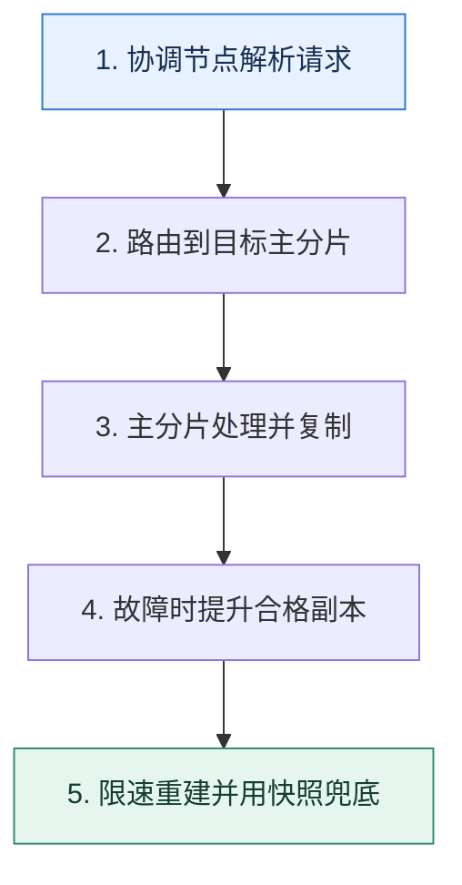

# Elasticsearch 高可用｜让分片副本、写入确认与恢复策略互相匹配

> 本课只解决一个问题：节点故障时，Elasticsearch 怎样继续读写，并避免恢复流量拖垮在线请求？

这不是原页面的缩写，也不是一组孤立结论。下面先建立一个能推演的最小世界，再把状态、数字和失败分支摊开，最后按来源讲解顺序覆盖全部知识线索。读完后，你应当能从 `协调节点解析请求` 一直解释到 `限速重建并用快照兜底`，并说明中途任意一步失败会留下什么状态。

## 零基础入口：先建立本课的心智画面

索引被拆成主分片和副本分片，节点承载分片，集群管理角色维护元数据与分配。高可用不是多放几台机器，而是让副本分散、选主可达、确认语义和容量余量同时成立。

先不要急着记组件名。只抓住四个问题：**现在手里有什么输入？下一步只做什么动作？哪个状态发生变化？变化后的结果交给谁？** 之后遇到新框架，只要这四个答案不变，核心机制就没有变。

### 放进一个足够小、可以手算的世界

一个索引 6 个主分片、每个 1 个副本，均匀分布在 3 个数据节点。节点 N2 故障后，其上的主分片由其他节点副本接替，但副本数暂时不足，集群处于可服务却冗余降低的状态。若立刻全速重建 2TB 数据，磁盘和网络可能挤压查询，因此按在线负载限速，并先恢复关键索引。

这个小世界故意只保留本课必需的对象。生产系统会有更多节点、线程、分片和异常，但数量增加不会改变这里的因果关系。先确认你能手算这个例子，再把数字替换成真实系统数据。

### 先预测，不要马上看结论

**为什么一个索引配置了副本，仍必须做快照？**

先写下自己的判断，并指出你依赖的前提。文末自我检查会揭示答案；如果答案不同，回到下面的状态表找出第一个分叉点。

## 本节精讲：让机制一步一步发生

请求先到协调节点，写入按路由找到主分片；主分片处理后复制到副本，并按确认条件回复。节点离开后，符合条件的副本可提升，集群重新分配缺失副本。跨可用区部署要平衡故障隔离与网络延迟，专用管理节点避免数据压力干扰集群决策。恢复时应限制作业并发和带宽，优先保持搜索与写入 SLO；快照用于应对误删和集群级灾难，因为副本会同步逻辑错误。

### 可见状态推进

| 当前步 | 现在发生的动作 | 下一步拿到什么 |
| ---: | --- | --- |
| 1 | 协调节点解析请求 | 路由到目标主分片 |
| 2 | 路由到目标主分片 | 主分片处理并复制 |
| 3 | 主分片处理并复制 | 故障时提升合格副本 |
| 4 | 故障时提升合格副本 | 限速重建并用快照兜底 |
| 5 | 限速重建并用快照兜底 | 得到可核对的终态 |

图只承担一个任务：让你看清状态如何向前移动。它不意味着每一步必然成功；网络超时、进程退出、重复执行和数据竞争都可能让箭头停在中间，因此后面必须继续讨论失效边界。

### 一次带数字的完整推演

一个索引 6 个主分片、每个 1 个副本，均匀分布在 3 个数据节点。节点 N2 故障后，其上的主分片由其他节点副本接替，但副本数暂时不足，集群处于可服务却冗余降低的状态。若立刻全速重建 2TB 数据，磁盘和网络可能挤压查询，因此按在线负载限速，并先恢复关键索引。

数字不是装饰。它迫使我们回答容量、顺序、时间窗口或版本选择问题。若换一个数字就得出不同结论，真正的设计依据就是那个阈值，而不是某个中间件名称。

## 按讲解顺序重建知识链：完整来源讲解

下面按来源资料的教学顺序重新编排完整内容。转换页码、来源图片、推广信息、水印、角色化问答和只服务于技术讨论场景的话术已经删除；机制、算法、例子、反例、事故线索、评论补充和限制条件仍然保留。这里的作用是补齐知识覆盖，不取代前面的独立推演。

今天开始我们要学习一个新的主题——NoSQL。在这个主题里面，我们先从 Elasticsearch 开始学起。

Elasticsearch 从技术讨论的热度上来说，肯定是比不过数据库、缓存和消息队列。但是Elasticsearch 在中大型公司里面又非常常用，这意味着如果你希望跳槽到一些比较大型的公司，那么 Elasticsearch 还是有比较大的概率考到的。

就像我之前说的，目前互联网行业技术讨论中间件的话，就是高可用和高性能。而具体到每一个点，又可以拆成两个方向。

1. 中间件是如何做到高可用 / 高性能的？
2. 你在实践中怎么做到高可用 / 高性能？
那么这一节课我们就先来看高可用这一个点，并给出几个有进阶推导的提高可用性的方案，让你在工程复盘时赢得竞争优势。在这里我就不严格区分 Elasticsearch 还是 Lucene，统一使用

Elasticsearch。我们先来看看 Elasticsearch 中的节点角色。

### Elasticsearch 节点角色

Elasticsearch 的节点可以分成很多种角色，并且一个节点可以扮演多种角色。这里我列举几种主要的。

候选主节点（Master-eligible Node)：可以被选举为主节点的节点。主节点主要负责集群本身的管理，比如说创建索引。类似的还有仅投票节点（Voting-only Node），这类节点只参与主从选举，但是自身并不会被选举为主节点。协调节点（Coordinating Node）：协调节点负责协调请求的处理过程。一个查询请求会被发送到协调节点上，协调节点确定数据节点，然后让数据节点执行查询，最后协调节点合并数据节点返回的结果集。大多数节点都会兼任这个角色。数据节点（Data Node）：存储数据的节点。当协调节点发来查询请求的时候，也会执行查询并且把结果返回给协调节点。类似的还有热数据节点（Hot Data Node）、暖数据节点（Warm Data Node）、冷数据节点（Cold Data Node），你从名字就可以看出来，它们只是用于存储不同热度的数据。

给节点设置不同的角色的原则就一条：有钱就专款专用，没钱就兼任。兼任就是指你一个节点扮演了多个角色。意思是，如果有钱有足够的资源，那么你就不要让节点兼任。如果没钱，那么就可以考虑兼任。但是不管怎样，兼任都有可能引起性能问题。

因此，如果真的追求高性能高可用，就还是让节点只扮演一个角色比较好。

### 写入数据

在 Elasticsearch 中，写入数据整体上是这样的：

我们来简单描述一下这个过程。

1. 文档首先被写入到 Buffer 里面，这个是 Elasticsearch 自己的 Buffer。
2. 定时刷新到 Page Cache 里面。这个过程叫做 refresh，默认是 1 秒钟执行一次。
3. 刷新到磁盘中，这时候还会同步记录一个 Commit Point。
你在图里面还可以注意到，在写入到 Page Cache 之后会产生很多段（Segment），一个段里面包含了多个文档。文档只有写到了这里之后才可以被搜索到，因此从支持搜索的角度来

说，Elasticsearch 是近实时的。

不断写入会不断产生段，而每一个段都要消耗 CPU、内存和文件句柄，所以需要考虑合并。但是你也注意到了，这些段本身还在支持搜索，因此在合并段的时候，不能对已有的查询产生影响。

看到这里你应该觉得很熟悉，因为在数据迁移里面你也面临着同样的困难。所以，即便不看源码你都能猜到基本的过程。

1. 已有的段不动。
2. 创建一个新的段，把已有段的数据写过去，标记为删除的文档就不会写到段里面。
3. 告知查询使用新的段。
4. 等使用老的段的查询都结束了，直接删掉老的段。
那么查询怎么知道应该使用合并段了呢？这都依赖于一个统一的机制，就是 Commit Point。你可以理解成，它里面记录了哪些段是可用的。所以当合并段之后，产生一个新的 Commit Point，里面有合并后的段，但是没有被合并的段，就相当于告知了查询使用新的段。

### Translog

实际上，Elasticsearch 在写入的时候，还要写入一个东西，也就是 Translog。直观来说，你可以把这个看成是 MySQL 里和 redo log 差不多的东西。也就是如果宕机了，Elasticsearch可以用 Translog 来恢复数据。

你可以对比一下 MySQL 的写入过程和 Elasticsearch 的写入过程。

MySQL 写入的时候，其实只是修改了内存里的值，然后记录了日志，也就是 binlog、redo log 和 undo log。Elasticsearch 写入的时候，也是写到了 Buffer 里，然后记录了 Translog。

不同的是，Translog 是固定间隔刷新到磁盘上的，默认情况下是 5 秒。

类似于在 MySQL 里讨论的，Translog 是只追加的，也就是顺序写的，所以效率非常高。它只有在刷新到磁盘上的时候，才会非常慢。

这时候你就会注意到，就算有 Translog，还是有数据丢失的可能。最差的情况下，会丢失 5s的数据。

### Elasticsearch 索引与分片

在一般的语境下，一个 Elasticsearch 的索引并不仅仅指倒排索引，还包括了对应的文档。这个和关系型数据库下的语义是不同的。

Elasticsearch 的一个索引有多个分片，每个分片又有主从结构。这种结构相信你已经很熟悉了，它类似于分库分表。作为类比，你可以这样理解。

一个索引就是一个逻辑表。分片就是分库分表。每个分片都有主从结构，在分库分表里面，一般也是用主从集群来存储数据。

Elasticsearch 会尽量把分片分散在不同的节点上，这一点和 Kafka 尽量把分区分散在不同的broker 上是一样的，都是为了保证在节点崩溃的时候将影响最小化。

那么主分片崩溃之后，是怎么选出新的主分片呢？答案是主节点选择一个分片作为主分片。这有点类似于 Redis Sentinel 里面的机制，如果主节点宕机了，那么 Sentinel 会从从节点里面挑出来一个作为主节点。

### 把知识转成可验证的工程判断

你在技术讨论前，应该在公司内部收集好这些信息。

你们公司有没有使用 Elasitcsearch？用来解决什么问题？你用的 Elasticsearch 的性能怎么样？读写流量多大？存储的数据量又有多大？你创建的索引有多大？多少个分片？你是怎么确定分片数量的？你们公司有没有使用一些措施来保证 Elasticsearch 的可用性？有没有用过 Elasticsearch的网关？你们公司的 Elasticsearch 有没有出过问题？出了什么问题？最终又是怎么解决的？

如果你在一个小公司，并且公司没有使用 Elasticsearch，那么你可以通过各种途径收集一些使用 Elasticsearch 的基本案例，这样在技术讨论讲到一些理论的时候，你可以用这些案例来佐证。不过还是建议优先使用自己公司的例子。

因为这节课具体讨论的是提高 Elasticsearch 的可用性，所以你可以考虑把它纳入到你提高整个系统可用性方案中，做成其中的一环。你可以在项目介绍的时候强调一下你的项目可用性的一个关键点就是 Elasticsearch，从而打开话题。

和 Elasticsearch 相关的工程问题目有很多，比如：

你有没有用过 Elasticsearch？用来解决什么问题？你用 Elasticseach 的过程中，有没有遇到什么问题？最终是如何解决的？为什么说 Elasticsearch 是近实时的？Elasticsearch 的 flush 是指什么？refresh 又是指什么？Elasticsearch 的写入过程是怎样的？

### 基本思路

如果你是业务开发，而且技术讨论的不是什么架构师之类的岗位，那么 Elasticsearch 的技术讨论会简单很多，基本上就是问一下 Elasticsearch 的基础知识。比较关键的一部分我已经在前置知识里面写了，还有一部分和倒排索引有关的内容，下节课我会仔细讲一讲。

Elasticsearch 最基本的可用性保障就是分片，而且是主从分片。所以在遇到 Elasticsearch 是如何做到高可用这个问题的时候，你要先提到这一点。

Elasticsearch 高可用的核心是分片，并且每个分片都有主从之分。也就是说，万一主分片崩溃了，还可以使用从分片，从而保证了最基本的可用性。

然后你要接着补充第二个 Translog 的作用。

而且 Elasticsearch 在写入数据的过程中，为了保证高性能，都是写到自己的 Buffer 里面，后面再刷新到磁盘上。所以为了降低数据丢失的风险，Elasticsearch 还额外写了一个Translog，它就类似于 MySQL 里的 redo log。后面 Elasticsearch 崩溃之后，可以利用Translog 来恢复数据。

如果技术评审者追问分片和写入过程，你就可以根据前置知识里面的内容来解释。

紧接着你可以尝试把话题引导到你准备的高可用方案中。

我维护的业务对可用性的要求比较高，所以在 Elasticsearch 的基础上，我还做了一些额外的优化，来保证 Elasticsearch 的高可用。

### Elasticsearch 高可用方案

这里我给出几个可行的实践方案，让你进一步给出有证据的判断。

### 限流保护节点

限流算是一个治标的策略，但是它能够保证你的 Elasticsearch 不会因为突发大流量而直接崩溃。

你可以通过 Elasticsearch 的插件机制来实现自定义的限流策略。注意 Elasticsearch 集群本身提供了限流的功能，并且你也可以通过控制线程池大小和队列大小来间接实现限流的功能。

因此如果你打算利用插件来提供限流功能的时候，就一定要有特殊之处。比如说你可以考虑结合 Elasticsearch 的内存使用率和 CPU 使用率设计一个限流策略。这个限流策略在微服务部分我也提到过了，你可以复习一下。

之前我用 Elasticsearch 的插件机制，设计过一个限流插件。这个限流插件的功能还是很简单的，就是根据 Elasticsearch 当前的内存使用率和 CPU 使用率来判断是否需要执行限流。不管是内存使用率还是 CPU 使用率，只要超过阈值一段时间，就触发限流。

这里技术评审者也会考察你怎么确定限流的阈值，超过阈值多久才会触发限流，限流之后怎么恢复等问题。

当然，如果你会研发限流插件，你也可以用插件来实现熔断、降级。熔断比较好处理，就是直接拒绝新的查询请求，但是降级这个就要考虑怎么降级了。如果你能够知道不同查询的业务价值，那么你就可以考虑触发降级的时候优先保障核心业务的请求，但是把非核心的请求拒绝了。

总而言之，你之前在微服务学习到的熔断、限流、降级的思想，在这里一样适用。

如果你从来没有研发过 Elasticsearch 插件，那么也可以考虑其他两种策略，一种是在Elasticsearch 之前加一个网关，查询经过网关的时候会被限流、熔断或者降级。当然，引代理也可以。

目前市面上的这方面的产品不多，比较成熟的就是极限网关。所以我建议你用一种自己了解但是没有实践过的话术来说。

我还了解过 Elasticsearch 网关或者代理，希望能够借助这些产品来做 Elasticsearch 的治理。比如说借助网关来做熔断、限流、降级这种，但是市面上相关的产品比较少，也担心引入网关之后的性能损耗，所以最终并没有实施这个方案。

另外一种是在客户端这边限流。也就是各个业务方需要限制住自己的查询频率，防止把整个Elasticsearch 打崩。相比之下，这种方式是最好落地的。

我们这边为了保护 Elasticsearch，在客户端这边都是做了限流的。比如说某个业务的查询都比较慢，对 Elasticsearch 的压力很大，那么限流的阈值就比较小。

不过 Elasticsearch 设计之初就是为了支持高并发大数据的，所以最佳方式还是要考虑扩容。

不管如何，限流都只能算是治标。如果经常触发限流，或者发现 Elasticsearch 有性能问题，那么还是要及时扩容的。

### 利用消息队列削峰

在一些对数据实时性要求不高的场景下，完全可以考虑在业务方和 Elasticsearch 中间加入一个消息队列。

你可以抓住关键字削峰和限流来解释。

之前我优化过我们业务的架构，就是在数据同步到 Elasticsearch 之前，加入一个消息队列来削峰。在早期的时候，我们都是双写，一方面写数据库，一方面写 Elasticsearch。那么在业务高峰期，Elasticsearch 就会有性能瓶颈。

而实际上，我们的业务对实时性的要求不高。在这种情况下，我引入了消息队列。业务方只是写入数据库就返回。然后我们监听 binlog，并且生成消息丢到 Kafka 上。在这种情况下，Elasticsearch 空闲的话，消费速率就高；如果 Elasticsearch 性能比较差，那么消费就比较慢。这样就起到了削峰和限流的效果。

在这个架构的基础上，还可以考虑引入降级，也就是在 Elasticsearch 真的有性能问题的时候，关闭一部分消费者。

而在这个架构的基础上，我还做了一个简单的降级。也就是我有两类消费者写入数据到Elasticsearch。一类是核心数据消费者，一类是非核心数据消费者。

那么如果我在监控到 Elasticsearch 性能已经比较差了，比如说写入的时候会遇到超时问题，那么我就把非核心数据消费者停下来。等 Elasticsearch 恢复过来再启动。

甚至更加极端一点，如果是在大促或者秒杀这种活动中，你可以把整个数据同步都停掉，让Elasticsearch 只支持查询操作。如果你所在的业务是电商类的，那么你可以考虑使用这个策略。

### 保护协调节点

在 Elasticsearch 里，比较容易出现问题的还有协调节点。协调节点就类似于分库分表代理，它负责分发请求，然后处理结果集。

那么你可以预计到，如果一个查询需要消耗非常多的资源，就有可能把协调节点搞崩溃。举个简单的例子，假如说你有一个查询命中了十个分片，并且每个分片都返回了几万条数据，那么协调节点本身的资源使用量一下就会上去，甚至出现 CPU 100% 或者 OOM 等问题。

因此要保证 Elasticsearch 高可用就要考虑防止突发大请求打崩协调节点的问题。

整个技术推理路径是层层递进的。首先你可以指出如果公司内部资源比较多，那么可以考虑部署纯粹的协调节点。

要想提高 Elasticsearch 的可用性，就要想办法防止协调节点在遇到大请求的时候崩溃。最简单的做法就是使用纯粹的协调节点。比如说专门部署一批节点，只扮演协调节点的角色。

这个思路总体上属于钞能力的范畴，所以你可以接着补充怎么用好这些协调节点，关键词就是隔离。

如果整个 Elasticsearch 除了这种纯粹的协调节点，还有一些兼任多个角色的协调节点，那么就还可以考虑使用隔离策略。也就是说，如果客户端能够判定自己是大请求，就将请求发送到纯粹的协调节点上，否则发送到其他兼任的协调节点上。

这种做法的好处就是，大请求即便把协调节点打崩了，也只会影响到其他大请求。但是占据绝大多数的普通请求，并不会受到影响。

这种做法的好处是和隔离结合在了一起，因此你可以尝试把话题引导到隔离策略上。

在一些技术实力很强的大厂，它们还会对 Elasticsearch 进行二次开发。可以修改协调节点的逻辑，让协调节点在资源快不足的时候，直接拒绝这种大请求。如果你在大厂，可以了解一下自己公司有没有在这方面做优化。

你可以在这个基础上进一步总结，就是只使用单一角色的节点以提高可用性。

在资源足够的情况下，我是建议所有的节点都只扮演单一角色。这样做不仅仅能够带来可用性的提升，也能带来性能的提升。

### 双集群

双集群算是一个很高级，投入也很大的高可用方案。

最简单的方案就是直接使用付费的 CCR 跨集群复制，这个基本上就不需要你操心。不过这个也属于钞能力，技术讨论的时候简单提一下就可以。

提高 Elasticsearch 可用性还有一个方法，就是使用双集群。比如说直接使用付费的 CCR功能，不过我司比较穷，肯定是不愿意买的。

在不使用这种付费功能的情况下，就只能考虑自己做了。这里有一个比较简单的方案，假如说有 A 和 B 两个集群，那么基本思路就是这样的：

使用消息队列来保持双写。在查询的时候，优先使用 A 集群，当确认 A 集群出了问题的时候，切换到 B 集群。

你抓住关键词消息队列双写解释。

我们采用的是一个比较简单的双集群方案。就是写入的时候并不是直接写入到Elasticsearch，而是写入到消息队列，而后启动两个消费者，分别消费消息，然后写到两个集群 AB 里面。关键在于查询的时候，要判断集群 A 有没有出问题，出了问题就切换到集群 B。

而怎么判断集群 A 是否已经出问题，你一样可以参考微服务中判断节点是否健康的部分，思路都是类似的，这里我就不重复了。

具体怎么切换，有两种思路。一种是你使用的客户端切换，一种是利用 DNS 机制切换。也就是说，正常情况下，你使用的 Elasticsearch 的连接信息，DNS 解析的时候返回的是集群 A的 IP。但是当触发了容灾切换的时候，DNS 解析得到的是集群 B 的地址。

你在解释的时候可以选择其中任意一种，这里我以客户端为例来说一说。

为了实现自动切换的效果，我们对 Elasticsearch 的客户端进行了二次封装。在封装之后，正常情况下，会访问集群 A。同时客户端监控集群 A 的响应时间。如果响应时间超出预期，又或者返回了比较多超时响应，客户端就会自动切换到集群 B 上。

### 本节原始知识线索收束

这一节课我们讨论的是 Elasticsearch 的高可用问题。首先我给你介绍了 Elasticsearch 中的节点角色、Elasticsearch 的写入过程，以及 Elasticsearch 索引与分片的关系。

然后我讲了四个提高 Elasticsearch 可用性的方案。

限流保护节点：你可以考虑使用 Elasticsearch 的插件机制、网关或者在客户端限流。也不仅仅是限流，你也可以用来熔断或者降级。

利用消息队列削峰：这个案例你也可以用在消息队列的技术讨论中。保护协调节点：因为查询总是先到协调节点，而后协调节点再分发个数据节点执行。并且协调节点自己还要处理结果集，所以它也是可用性的瓶颈。最佳策略就是让部分节点只充当协调节点。在这个基础上可以考虑根据请求大小、业务价值来对协调节点进行分组与隔离双集群：大部分时候，只有不差钱的公司才会考虑为了一点点的可用性提升而引入双集群，这里我介绍了钞能力 CCR 方案和使用消息队列完成双写的双集群方案。

### 继续推演

最后请你来思考两个问题。

### 补充讨论与边界校准

#### 全部留言 (4)

补充讨论：

讲解补充：里面有合并后的段，但是没有被合并的段。就相当于告知了....

就是只有合并好了的，没有等待合并的。

补充讨论：

讲解补充：嘿嘿，如果技术讨论问到怎么确定这个值，反正就是答压测。

我之前就是不断调整这个值，调大调小，然后确定一个比较合适的值，都是经验主义。

补充讨论：

请教老师几个问题：Q1：投票节点只用来投票岂不是极大的浪费？Q2：ES角色的划分，是逻辑划分吗？还是操作层面上的划分？比如在ES上进行某个设置就可以确定角色。Q3：“分片”是指对数据的分片，不是针对节点（机器），对吗？Q4：ES能够控制Page Cache吗？ 文中提到ES将数据写到Page Cache，数据写到Page Cach e，这个是可以控制的吗？如果Linux下可以控制，Windows下是否也可以控制？

讲解补充：1. 不浪费，你可以部署到一些很弱的机器上。也可以和别的服务一起部署

2. 是逻辑划分，就是你给每个节点配置角色，接近你说的在 ES 进行某个设置。
3. 对。
4. Windows 下不叫 Page Cache，但是也有类似的机制。实际上，这是系统调用的问题，正常我们调用 Write 的系统调用，就是写到了 Page Cache。而后你可以考虑再调用 fsync 之类的调用，刷新到磁盘上，

补充讨论： ter ping不到其他节点，或者其他节点ping不到master的时候，他们之间就会互相判断，是否大多数都连不到主节点上了，如果大多数都连不上，那么就开始重新进行master选举。

讲解补充：赞！这里你还可以进一步补充 master 选举，选谁，以及具体的投票过程——技术讨论偶尔用得上。

## 把完整讲解收束成一条因果链

1. 先建立集群、节点、索引、分片四层关系。
2. 沿一次写入说明路由、主分片与副本确认。
3. 再推演节点故障、分片提升和冗余恢复。
4. 最后加入容量余量、恢复限速、跨区延迟和快照。

把这几步连接起来时，不要省略“为什么”。最终结论只有在前提、状态变化和失败代价都说得清楚时才可靠。

## 误区与失效边界

有副本不等于任何故障都不丢数据；确认边界、节点同时故障和未完成复制都影响结果。把管理、协调和数据角色绝对固定也不是通用答案，应按规模和负载决定。副本更不是防误删备份。

再加一条通用但必须落实到本课对象上的边界：机制只能处理它看得见的信号。若输入指标失真、状态没有持久化、错误被吞掉，或者补偿没有幂等保护，再成熟的框架也只能基于错误证据作决定。

### 三种故障注入方式

| 故障 | 要观察什么 | 不能接受的解释 |
| --- | --- | --- |
| 在第 2 步前让依赖超时 | 是否停在可重试状态，是否消耗完上游预算 | “框架稍后会处理” |
| 在状态写入后让进程退出 | 重启后能否识别已完成与待继续动作 | “再执行一次应该没事” |
| 对同一输入并发执行两次 | 是否出现重复副作用、顺序颠倒或覆盖 | “概率很低” |

## 工程验证：把理解变成可以复查的证据

演练关停一个数据节点，记录集群状态、不可分配分片、写入/查询 P99、提升时间和恢复带宽。验收不仅是“最终变绿”，还要确认故障窗口无超出目标的数据损失和在线延迟。

| 步骤 | 状态或动作 | 最少应留下的证据 |
| ---: | --- | --- |
| 1 | 协调节点解析请求 | 开始时间、结束时间、输入标识、结果状态、异常原因 |
| 2 | 路由到目标主分片 | 开始时间、结束时间、输入标识、结果状态、异常原因 |
| 3 | 主分片处理并复制 | 开始时间、结束时间、输入标识、结果状态、异常原因 |
| 4 | 故障时提升合格副本 | 开始时间、结束时间、输入标识、结果状态、异常原因 |
| 5 | 限速重建并用快照兜底 | 开始时间、结束时间、输入标识、结果状态、异常原因 |

验证时同时记录成功路径和失败路径。只证明“正常时能跑通”不能说明设计可靠；至少要让一次超时、一次进程退出和一次重复请求可重现，并能根据日志或指标解释最后状态。

## 学完检查：闭卷画出本课

你现在应该能独立完成四件事：

1. 用自己的话说出本课唯一问题，不使用产品名也能解释。
2. 复算上面的具体例子，并指出哪个输入改变会让结论改变。
3. 沿 Mermaid 图注入一次失败，预测系统停在哪里以及由谁收敛。
4. 说出本课机制不保证什么，并给出一个反例。

## 自我检查

为什么一个索引配置了副本，仍必须做快照？

副本面向节点故障并同步当前索引状态，误删、错误写入或整个集群损坏可能传播到所有副本；快照提供独立恢复点。

怎样证明自己不是只记住了名词？

把 `协调节点解析请求` 的一个真实输入写出来，逐步记录到 `限速重建并用快照兜底`。然后在中间任意一步制造失败；如果你能解释当前状态、下一责任方、可观测证据和恢复边界，就已经拥有可以迁移的工程模型。

## 来源与事实校准

- [查看完整来源稿（本地 19 页资料）](../content/39-elasticsearch-ha.md)

### 当前事实校准

Elasticsearch 的主分片是索引操作入口，副本既提供冗余也能服务读取；节点故障后合格副本可被提升，随后通过恢复重新建立缺失副本。副本会同步逻辑删除和错误写入，因此不能代替快照；恢复带宽与并发也要受控，避免重建流量挤压在线搜索和写入。

- [Elastic · Shard allocation, relocation, and recovery](https://www.elastic.co/docs/deploy-manage/distributed-architecture/shard-allocation-relocation-recovery)
- [Elastic · Snapshot and restore](https://www.elastic.co/docs/deploy-manage/tools/snapshot-and-restore)

来源稿用于核对覆盖范围，不随公开站点发布。产品默认值和具体内部行为可能随版本变化；落地时应使用目标版本的官方文档、可运行实验和故障演练校准。本学习稿中的零基础入口、状态推演、故障矩阵和工程验证属于编辑补充，不冒充来源讲解者的原话。
