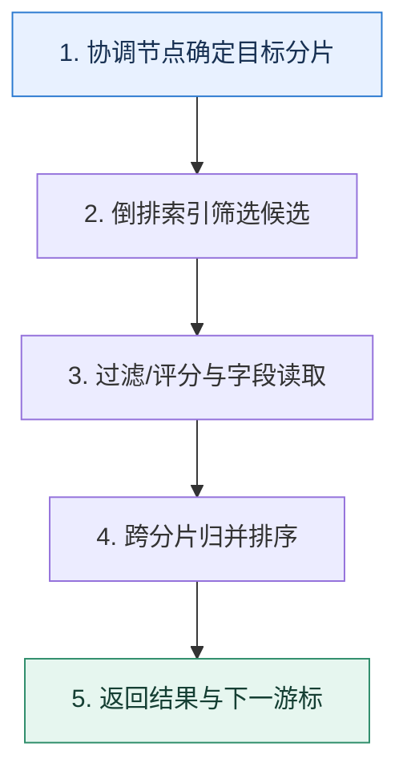

# Elasticsearch 查询优化｜从倒排索引、分片扇出到深分页成本

> 本课只解决一个问题：搜索变慢时，怎样判断问题在映射、查询、分片还是资源？

这不是原页面的缩写，也不是一组孤立结论。下面先建立一个能推演的最小世界，再把状态、数字和失败分支摊开，最后按来源讲解顺序覆盖全部知识线索。读完后，你应当能从 `协调节点确定目标分片` 一直解释到 `返回结果与下一游标`，并说明中途任意一步失败会留下什么状态。

## 零基础入口：先建立本课的心智画面

搜索请求先被协调节点拆到相关分片，每个分片用倒排索引找候选、计算过滤或相关性，再归并结果。慢查询可能来自单分片做太多，也可能来自分片太多导致扇出与归并。

先不要急着记组件名。只抓住四个问题：**现在手里有什么输入？下一步只做什么动作？哪个状态发生变化？变化后的结果交给谁？** 之后遇到新框架，只要这四个答案不变，核心机制就没有变。

### 放进一个足够小、可以手算的世界

20 个分片查询第 5001 页，每页 20 条，朴素方式每片可能保留 100020 个候选，协调层面对约 200 万候选再归并。改为按 `(event_time,_id)` 使用上一页游标，每片只取下一小批候选，成本不再与页码线性增长。若只查一个租户，写入时使用路由还能减少扇出。

这个小世界故意只保留本课必需的对象。生产系统会有更多节点、线程、分片和异常，但数量增加不会改变这里的因果关系。先确认你能手算这个例子，再把数字替换成真实系统数据。

### 先预测，不要马上看结论

**为什么把索引从 5 个分片增加到 50 个，查询不一定更快？**

先写下自己的判断，并指出你依赖的前提。文末自我检查会揭示答案；如果答案不同，回到下面的状态表找出第一个分叉点。

## 本节精讲：让机制一步一步发生

字段映射先决定哪些内容需要分词、精确过滤、排序或聚合；精确条件优先放过滤上下文以复用结果并避免无谓评分。只取所需字段，批量写入并设置符合新鲜度要求的 refresh 策略。深分页若用 `from+size`，每个分片都要保留大量候选；稳定遍历更适合 `search_after` 配合唯一排序键，强一致翻页可结合 PIT 等机制。分片大小、数量、堆、页缓存和禁止 swap 共同影响尾延迟。

### 可见状态推进

| 当前步 | 现在发生的动作 | 下一步拿到什么 |
| ---: | --- | --- |
| 1 | 协调节点确定目标分片 | 倒排索引筛选候选 |
| 2 | 倒排索引筛选候选 | 过滤/评分与字段读取 |
| 3 | 过滤/评分与字段读取 | 跨分片归并排序 |
| 4 | 跨分片归并排序 | 返回结果与下一游标 |
| 5 | 返回结果与下一游标 | 得到可核对的终态 |

图只承担一个任务：让你看清状态如何向前移动。它不意味着每一步必然成功；网络超时、进程退出、重复执行和数据竞争都可能让箭头停在中间，因此后面必须继续讨论失效边界。

### 一次带数字的完整推演

20 个分片查询第 5001 页，每页 20 条，朴素方式每片可能保留 100020 个候选，协调层面对约 200 万候选再归并。改为按 `(event_time,_id)` 使用上一页游标，每片只取下一小批候选，成本不再与页码线性增长。若只查一个租户，写入时使用路由还能减少扇出。

数字不是装饰。它迫使我们回答容量、顺序、时间窗口或版本选择问题。若换一个数字就得出不同结论，真正的设计依据就是那个阈值，而不是某个中间件名称。

## 按讲解顺序重建知识链：完整来源讲解

下面按来源资料的教学顺序重新编排完整内容。转换页码、来源图片、推广信息、水印、角色化问答和只服务于技术讨论场景的话术已经删除；机制、算法、例子、反例、事故线索、评论补充和限制条件仍然保留。这里的作用是补齐知识覆盖，不取代前面的独立推演。

今天我们学习 Elasticsearch 的另外一个关键主题——高性能。

如果你经常和 Elasticsearch 打交道，你十有八九遇到过 Elasticsearch 的性能问题。这也就是为什么在技术讨论中我们经常会遇到 Elasticsearch 性能优化相关的问题。 那么今天我就带你看看怎么优化 Elasticsearch 的性能，在技术讨论中赢得竞争优势。

我们先来看 Elasticsearch 的索引机制，它是我们理解 Elasticsearch 原理的关键。

### Elasticsearch 的索引机制

Elasticsearch 的索引和之前你已经学习过的数据库索引比起来，还是有很大不同的，它使用的是倒排索引。所谓的倒排索引是相对于“正排”索引而言的。在一般的文件系统中，索引是文档映射到关键字，而倒排索引正相反，是从关键字映射到了文档。

所以你可以想到，假如说没有倒排索引，你想要找到包含关键字“Elasticsearch”的文档，那么你需要遍历所有的文档，然后筛选出包含了“Elasticsearch”关键字的文档。而有了倒排索引，你就可以直接从关键字出发，找到“Elasticsearch”关键字对应的文档。

Elasticsearch 依赖于 Lucene 来维护索引，它的基本原理也很简单。

每当写入一个新的文档的时候，根据文档的每一个字段，Elasticsearch 会使用分词器，把每个字段的值切割成一个个关键词，每一个关键词也叫做 Term。切割之后，Elasticsearch 会统计每一个关键词出现的频率，构建一个关键词到文档 ID、出现频率、位置的映射，这个也叫做 posting list。

从图片里你可以看出来几个关键点。

每个字段其实是分散统计的。Elasticsearch 记录了两个位置信息，一个位置是指它是第几个词，另外一个偏移量是指整个关键词的起始位置。

你可以想到，存在 Elasticsearch 里的文档数不胜数，那么就意味着一个字段会有非常多的关键词。比如说图片里的 desc 字段，如果你的系统有一亿用户，每个人写的内容都不一样，关键词就会非常多。

假如说你要查询的是 desc 里包含 Hello 这个关键字的文档，你首先就要在关键词表格里面找到 Hello 这一条。如果关键词都是随机的，那么肯定很难找。如果让你来设计，你肯定会让Elasticsearch 把这些关键词排序，比如说按照字母来排序。

当然，Elasticsearch 的设计者明显要高明很多。这种类似于查找单词的东西，在业界早就有成熟的方案，那就是前缀树（Trie Tree），也叫做字典树，而这个“关键词表格”在Elasticsearch 里面叫做 Term Dictionary。它们的目标是尽可能地把全部关键词组成的索引整个装进内存里。之所以是尽可能，而不是一定，是因为部分字段的关键词会非常多，确实装不进去。所以连前缀树都觉得这样的空间开销受不了。

而 Elastiscearch 更进一步，用了一个优化，就是所谓的 FST（Finite State Transducers）。这个 FST 的核心思想是连公共前缀、后缀也一并压缩了。真正的 FST 原理还是相当复杂的，但是我能给你一个非常直观的例子，让你秒懂它最基本的概念。

假如说你现在有两个关键词 cat 和 ct，两种数据结构看起来是这样的。

这个图更加接近真实数据结构的定义，所以有点难以理解。你可以认为当你找到 3 的时候，如果是经过 0-1-3，那么你知道前缀是 ct，并且你能够得到 ct 在 Term Dictionary 的位置。

这个位置，就是这个 ct 所在的 Block。但是你也可以想到，可能还有别的关键词 cta、ctb 等等，都是使用这个前缀的。如果几千个关键词都共享某个前缀，在一个 Block 内部怎么找？

其实 Elasticsearch 会在 Block 内部有很多的关键词的时候，进一步切割成所谓的 Floor Block。每个 Floor Block 使用第一个关键词的首字母来加快查找。

而在 Block 或者 Floor Block 内部，都是通过遍历来查找对应的关键词的。因此整个结构看起来是下面这样的。

因此你可以把这个查找关键词的过程理解成两步。

1. 根据 FST 找到 Block。
2. 在 Block 里面遍历找到关键词。如果 Block 进一步细分为 Floor Block，就先根据前缀找到Floor Block，然后再去遍历 Floor Block。
找到了关键词，也就找到了这个关键词对应的 posting list，那么就可以根据文档 ID 来找到具体的文档了。

### 把知识转成可验证的工程判断

除了刚刚我们说的这些基础知识，你还要了解清楚公司内部一些和 Elasticsearch 有关的数据。

你们公司 Elasticsearch 是如何部署的，有几个节点，每个节点上面的内存有多大，这些内存是怎么分配的？你们公司 Elasticsearch 上 JVM 的配置是什么，垃圾回收用的是哪个，垃圾回收停顿的时间有多长？

你们公司 Elasticsearch 的哪些配置和默认值不一样，为什么修改？你们公司 Elasticsearch 的性能怎么样，能撑住多大的读写流量？

如果你本身对 Elasticsearch 性能优化不是很了解的话，我不是特别建议你在简历或者自我介绍的时候提起 Elasticsearch 性能优化。但是如果你很擅长，那么你就可以特意强调一下，因为这足以成为你竞争优势。

应该说，能用好数据库、Redis 和消息队列的人很多，但是能用好 Elasticsearch 的人就很少。如果你非常了解怎么优化 Elasticsearch，平时也做过一些优化，在工程复盘时就一定要提起这一点，这是非常大的竞争优势。

### 优化方案

你在工程复盘时并不需要记住全部的优化方案，而是可以尝试记住里面几个典型的，或者根据我在这里写出来的思路，结合自己的业务设计几个技术讨论方案。

实际上，Elasticsearch 里可以优化的点非常多，这里我筛选出了比较适合技术讨论的方案。有一些优化的点就是简单调整一下参数，又不能引导到别的话题，这里我就没有罗列出来。你有兴趣可以自己进一步了解。

### 优化分页查询

这个优化思路是很好的技术讨论点，因为它可以和分库分表结合在一起。在分库分表的那一节课我深入讨论了分页查询为什么性能那么差，而在 Elasticsearch 里面也一样有这个问题。在Elasticsearch 里面，当你执行分页查询的时候，是使用 FROM X SIZE Y 的语法，基本等同于SQL 里的 OFFSET X LIMIT Y。

也就是说，如果你的查询命中了 Elasticsearch 的 N 个分片，那么最终查询的数据量是 N *(X + Y）。如果你已经忘了，记得回去复习一下。

在 Elasticsearch 里面，也有两种可行的优化手段。

1. Scroll 和 Scroll Scan：这种方式适合一次性查询大量的数据，比如说导出数据之类的场景。这种用法更加接近你在别的语言或者中间件里面接触到的游标的概念。
2. Search After：也就是翻页，你在查询的时候需要在当次查询里面带上上一次查询中返回的search_after 字段。
在工程复盘时，我建议你使用 Search After 来解释，因为 Search After 适用的场景更加广泛。

我还优化过 Elasticsearch 的分页查询，也就是用 Search After 来优化的。Search After就有点类似于分库分表中使用的禁用跳页查询的方案，也就是不支持随机翻页。每次查询都带上上一次查询的 search_after 字段。

它的优点就是查询的数据量不再和偏移量有关，只和每一页的大小，以及命中的分片数量有关。之前我在分库分表里面也优化过类似的分页查询，不过分库分表本身没有search_after 之类的字段，只能是我自己在业务层面上搞出来一个类似的 search_after。

注意，这里的 search_after 就类似于分库分表中禁用跳页查询里面加入的 WHERE id >$max_id 这种极值过滤条件。

### 增大刷新间隔

上一节课你已经学到了数据最开始是写入到 Buffer 中，然后经过 refresh 才被写入到 Page Cache。那么你基本上可以预计，如果频繁地把数据刷新到 Page Cache 里，性能会有损耗。因此一个比较简单的优化方案就是调大这个刷新间隔。

之前我优化 Elasticsearch 的时候，把 index.refresh_interval 调大到了 30。调整之后，性能大概提升了 20%。

你可以尝试在自己的业务里面调整这个参数，看看性能提升的幅度。

### 批量提交

这也是你在前面的内容里面见过的优化手段，你记得复习一下之前对批量提交为什么能提高性能的分析，你在技术讨论 Elasticsearch 的时候一样用得到。

批量提交也有两种策略。第一种策略是化单个为批量。

早期我有一个业务，就是把数据库里的数据同步到 Elasticsearch。最开始的时候是每次用户更新了数据，就直接更新 Elasticsearch。但是这样效果很不好，因为用户基本上都是一条条数据更新。

后来我考虑到这个业务对数据一致性的要求不是很高，我就把实时同步修改成了异步同步，也就是定时扫描数据库中发生变化的数据，然后批量提交变更数据到 Elasticsearch。这个异步任务我设置的是每秒钟同步一次，和原来每一次写请求都要操作 Elasticsearch 比起来，压力小多了。同时业务方的响应时间也下降了 50%。

这种单个转批次的方案还可以用在 Kafka 和 Elasticsearch 结合使用的方案中。也就是有些公司的架构把数据写入到 Elasticsearch 的时候，并不是直接写入的，而是统一写入到 Kafka，然后再由一些消费者把 Kafka 里的数据写入到 Elasticsearch。

那么这里你就可以给出一个利用批量提交来解决消息积压问题的方案。

某个线上系统的很多业务都不是直接同步数据到 Elasticsearch，而是要经过一个 Kafka，然后由 Kafka 的消费者把数据写入到 ElasticSearch。但是随着业务的增长，越来越多的数据要写入到 Elasticsearch，尤其是在业务高峰期，很容易产生消息积压的问题。

为了解决这个问题，我做了一个优化，就是批量消费，批量提交到 Elasticsearch。也就是说，早期 Kafka 的消费者是每次消费一条消息，就写一条数据到 Elasticsearch。而我现在改成了一次拉取 100 条消息（这个应该是可配置的），做成一个批次，提交给Elasticsearch，就解决了消息积压的问题。

这个方案的好处就是你能够把消息积压和 Elasticsearch 的知识点联系在一起，能够从这个案例里看出你的思维很灵活。当然，这也会将话题引导到 Kafka 或者消息积压上，你要记得复习。

另外一个是调整批次。这一类手段非常适合用在日志同步中，我这里给出一个调整批次和降级的方案。

某个线上系统的日志都是要利用 Logstash 直接同步到 Elasticsearch 的。那么在业务繁忙的时候，日志就有可能同步得很慢，或者 Elasticsearch 压力很大。在这种情况下，我把日志同步到 Elasticsearch 的批次调大了一些，显著降低了 Elasticsearch 的负载。

而且，我还引入了一个降级机制。正常某个线上系统的日志是全量同步的，但是如果发现Elasticsearch 有问题，就会触发降级，触发降级的时候就会先丢弃 INFO 级别的日志。运行一段时间之后，如果 Elasticsearch 还是没能恢复正常，就把 WARN 级别的也丢弃。

这一个方案进阶推导在于你把调整批次和降级结合在一起，能体现你综合运用各种手段解决实际问题的能力。

### 优化不必要字段

有些时候，最开始设计索引的人可能没有注意，就把一些根本不会搜索到的字段也存储到了Elasticsearch。更加可怕的是还使用了动态的 mapping，这可能无意间索引了很多新字段。

在实践中最常见的错误，就是把数据库里存储的数据全量同步到 Elasticsearch 上。但是其实根本没有必要。所以这种优化手段就是只把要被查询的字段同步到 Elasticsearch 上，而把数据的主体部分留在原本的数据库里。

之前我接手的一个历史系统需要把数据同步到 Elasticsearch 上支持搜索。但是最开始的时候数据量并不是很大，所以是直接把全量数据同步到了 Elasticsearch 上的。后面业务起来之后，就发现我这个业务的数据占据了大量的内存和磁盘空间。

我在梳理了业务之后发现其实不用全部同步过去的，因为要被搜索的字段只是其中的一小部分，而另外一些字段同步过去只是白白加重了 Elasticsearch 的负担。所以我后面就修改了同步的过程，那一部分数据就直接传入 null 了。查询过程就相当于在 Elasticsearch 上根据

各种输入查到业务的主键，如果还需要 Elasticsearch 中没有的字段，就回数据库再次查询。

当然，这样做的代价就是有一些查询需要再次查询数据库。但是我评估过这个，受影响的请求不足 10%，所以这个结果还是可以接受的。

少同步一些数据，就意味着你的索引所需的内存、磁盘更少，所以查询速度也会更快。紧接着补充一个 reindex 的改进计划。

不过后续我也在考虑重新创建一个索引，现在这种有字段但是不同步数据的方式不太优雅。

这种同步部分数据的手段，在日志检索中也很常见。毕竟日志一般都非常长，而搜索一般都是根据业务 ID 之类的来查询。

你还可以尝试在这个地方把话题引导到分库分表中间表上。

这种二次查询类似于分库分表中利用中间表来支持一些无分库分表键查询的解决方案，都是要先在一个地方用查询条件拿到主键或者分库分表键，然后再到具体的数据库上查询到完整

的数据。

如果你不记得了，记得回去复习一下。

### 冷热分离

冷热分离应该算是一个业界非常常用的方案了。它的基本思路是同一个业务里面数据也有冷热之分。对于冷数据来说，可以考虑使用运行在廉价服务器上的 Elasticsearch 来存储；而对于热数据来说，就可以使用运行在昂贵的高性能服务器上的 Elasticsearch。

之前我在公司的时候做过一个 Elastisearch 优化，就是冷热数据分离存储。我们的数据最开始都是存在统一规格的 Elasticsearch 上，然后这两年经济不太好，就想着降本增效，于是我们就决定试试业界用得比较多的冷热分离方案。

基本的思路是整个 Elasticsearch 的节点分成冷热两类，数据最开始都是写入到热节点上。等过一段时间之后，数据已经不热了，就迁移到冷节点上。

这部分我们是借助了新出来的索引生命周期特性来实现的。比如说我们的日志，就是三天内的数据都在热节点上，三天之后就是迁移到了冷节点上。这个过程都是自动的，不需要人工介入。

利用生命周期管理功能实现冷热数据分离操作起来还是很简单的，你可以考虑通过 Kibana 来直接在界面傻瓜式操作。而且一些云服务厂商也提供了这种功能，使用起来都很便捷。

我建议你在实践中操作一下再出去技术讨论，最好是根据自己的业务来定制。比如说我在前面的解释里面用的是日志的例子，那么你可以把它替换成你的业务数据。

这种冷热分离的思路不仅仅可以在 Elasticsearch 中使用，我在微服务治理、缓存中也多次提到过类似的思路，所以如果你有机会，可以尝试引导话题。

### 其他常规优化

这部分之所以叫做常规优化，是因为正常生产环境上的 Elasticsearch 都优化过了，因此你可以简要说明一下。

### 优化垃圾回收

如果你本身是 Java 开发，那么非常建议你使用这个优化。就像我在 Kafka 里面提到的，你出去技术讨论 Java 岗位，很重要的一点就是展示你在 JVM 上的深厚功力。

一般 Elasticsearch 优化垃圾回收的第一个思路就是调整垃圾回收算法。Elasticsearch 需要一个很大的堆，那么 CMS 是肯定撑不住的，停顿时间会非常长。

所以你可以考虑把垃圾回收算法换成 G1，或者更加激进的 ZGC。现在用 G1 比较多，所以你可以尝试用 G1 来解释。

长期以来我们使用 Elasticsearch 有一个很大的问题，就是触发垃圾回收的时候，停顿时间比较长，会有一百多毫秒。这主要是因为我们的 Elasicsearch 用的都还是非常古老的CMS，而 CMS 在超过 8G 的堆上面，表现就比较差。

所以后面我就尝试将 Elasticsearch 换成了 G1，换了之后效果是非常不错，现在停顿时间都可以控制在 15ms 以内。不过我也在调研 ZGC，ZGC 在特大堆上的表现比 G1 还要好。不过目前这方面业界的实践不多，所以我也没有进一步优化。

使用这个方案的核心就是把话题引导到垃圾回收这个主题上。

### 优化 swap

之前我们在讨论 Kafka 的时候就提到过优化 swap 这个措施，想必你对 swap 应该感觉非常熟悉了。

Elasticsearch 也是一个内存依赖非常严重的中间件，在触发了 swap 的时候，性能下降得很快。你有两种做法，第一种做法是在操作系统层面上直接禁用了 swap，或者把vm.swappness 设置成一个非常小的值。第二种做法是在 Elasticsearch 里把bootstrap.memory_lock 设置成 true。

在工程复盘时你要注意把 Elasticsearch 和其他中间件联系在一起，这里我们以 Kafka 为例来说一说。

使用 Elasticsearch 的时候要把 swap 禁用，或者把 vm.swappness 设置得很小，也可以把 bootstrap.memory_lock 设置成 true。所有类似于 Elasticsearch 的中间件都可以采用这种优化手段，比如说 Kafka。

### 文件描述符

Elasticsearch 需要非常多的文件描述符，所以正常来说都需要把文件描述符的数量调大，比如说调到 65536，甚至更多。

你可以用解决 Bug 的思路来技术讨论，比如说技术评审者问到你遇到过 Elasticsearch 什么 Bug 的时候，就可以用这个来解释。

之前我们在使用 Elasticsearch 的时候，还遇到过文件描述符耗尽的问题。这是因为我们用的是一个非常大的 Elasticsearch，很多业务共用，导致 Elasticsearch 打开的文件描述符非常多。

那一次的故障之后，一方面我们是调大了最大文件描述符的数量，另外一方面也是考虑把业务逐步迁移到不同的 Elasticsearch 上。毕竟这一次故障，直接导致了我们好几个核心业务

都出问题了，足以说明还是要考虑隔离的。

这个解释你还提到了隔离，如果技术评审者感兴趣，你就可以把话题引导到微服务的隔离上去。

### 本节原始知识线索收束

经过前面 MySQL 优化、Redis 优化、Kafka 优化，再加上这节课的 Elasticsearch 优化，你其实可以总结出一般性的性能优化方案。

实际上任何查询，不管是关系型数据库还是非关系型数据的查询，优化起来就是这几个方向。

优化查询本身：这可能涉及到改写 SQL、优化索引等。优化中间件本身：通常也就是调整一下中间件的各种参数，只有一些大厂在具备足够强的实力的情况下，会考虑二次开发。如果中间件本身是基于 JVM 的，那么也可以优化 JVM。优化操作系统：目前你接触到的大多数中间件应该都是对内存、网络 IO 和磁盘 IO 有很强依赖，那么优化也就是调整跟这三个方面有关的参数。

如果你的工作经历里面出现了这个课程里没有讨论过的中间件，你也可以按照类似的思路去准备技术讨论用的性能优化方案。当然，要是你所在公司的运维团队非常强，你就直接问他们是如何优化性能的就可以，在技术讨论中你同样用得上。

### 继续推演

最后请你来思考两个问题。

我在这节课里面列出了很多优化方案，你还知道别的优化方案吗？如果你出去技术讨论，你准备用什么话术来介绍你的优化方案？在冷热分离中，一般冷数据我们的都是用机械硬盘，而热数据就是用固态硬盘，你知道这是为什么吗？

### 补充讨论与边界校准

#### 全部留言 (3)

补充讨论： list 其中的 Hello 单词在文档0、文档1都出现，为什么posting list 中只记录了文档0的信息，没有文档1的信息的呢？

讲解补充：原文哪里？

补充讨论：

讲解补充：1. ES 的应用非常广泛，不仅仅是日志处理。基本上涉及到一些近似于 SQL 模糊搜索的地方，用 ES 效果都很好。

2. 值得，但是我建议你成为高级工程师之后再去研究。

补充讨论：

讲解补充：赞！很不错的补充！

## 把完整讲解收束成一条因果链

1. 先沿查询执行路径定位单分片计算和跨分片扇出。
2. 再从 mapping、filter、字段读取和聚合减少工作量。
3. 用候选量公式解释深分页，并替换为稳定游标。
4. 最后检查分片布局、堆、页缓存、写入刷新和资源竞争。

把这几步连接起来时，不要省略“为什么”。最终结论只有在前提、状态变化和失败代价都说得清楚时才可靠。

## 误区与失效边界

`search_after` 适合顺序浏览，不支持低成本任意跳页；PIT 也有资源成本和生存时间。把所有字段都设为可聚合会放大索引与内存，分片过小同样会增加元数据和协调开销。

再加一条通用但必须落实到本课对象上的边界：机制只能处理它看得见的信号。若输入指标失真、状态没有持久化、错误被吞掉，或者补偿没有幂等保护，再成熟的框架也只能基于错误证据作决定。

### 三种故障注入方式

| 故障 | 要观察什么 | 不能接受的解释 |
| --- | --- | --- |
| 在第 2 步前让依赖超时 | 是否停在可重试状态，是否消耗完上游预算 | “框架稍后会处理” |
| 在状态写入后让进程退出 | 重启后能否识别已完成与待继续动作 | “再执行一次应该没事” |
| 对同一输入并发执行两次 | 是否出现重复副作用、顺序颠倒或覆盖 | “概率很低” |

## 工程验证：把理解变成可以复查的证据

为慢查询保存查询体、命中分片数、每分片耗时、候选量、返回字段大小和 profile 结果。优化前后同时比较 P50/P99 与资源，避免平均值掩盖某个热点分片。

| 步骤 | 状态或动作 | 最少应留下的证据 |
| ---: | --- | --- |
| 1 | 协调节点确定目标分片 | 开始时间、结束时间、输入标识、结果状态、异常原因 |
| 2 | 倒排索引筛选候选 | 开始时间、结束时间、输入标识、结果状态、异常原因 |
| 3 | 过滤/评分与字段读取 | 开始时间、结束时间、输入标识、结果状态、异常原因 |
| 4 | 跨分片归并排序 | 开始时间、结束时间、输入标识、结果状态、异常原因 |
| 5 | 返回结果与下一游标 | 开始时间、结束时间、输入标识、结果状态、异常原因 |

验证时同时记录成功路径和失败路径。只证明“正常时能跑通”不能说明设计可靠；至少要让一次超时、一次进程退出和一次重复请求可重现，并能根据日志或指标解释最后状态。

## 学完检查：闭卷画出本课

你现在应该能独立完成四件事：

1. 用自己的话说出本课唯一问题，不使用产品名也能解释。
2. 复算上面的具体例子，并指出哪个输入改变会让结论改变。
3. 沿 Mermaid 图注入一次失败，预测系统停在哪里以及由谁收敛。
4. 说出本课机制不保证什么，并给出一个反例。

## 自我检查

为什么把索引从 5 个分片增加到 50 个，查询不一定更快？

并行度增加的同时，每次查询的网络扇出、分片固定开销和协调归并也增加；小数据集或全索引搜索可能更慢。

怎样证明自己不是只记住了名词？

把 `协调节点确定目标分片` 的一个真实输入写出来，逐步记录到 `返回结果与下一游标`。然后在中间任意一步制造失败；如果你能解释当前状态、下一责任方、可观测证据和恢复边界，就已经拥有可以迁移的工程模型。

## 来源与事实校准

- [查看完整来源稿（本地 19 页资料）](../content/40-elasticsearch-query.md)

### 当前事实校准

官方文档明确不应使用 from/size 做过深分页，因为每个分片需要保留当前页及之前页面的候选。超过结果窗口的顺序遍历应优先用 search_after，需要固定索引视图时结合 PIT，并使用唯一且稳定的排序边界；过滤条件不需要相关性评分时应放入 filter context。

- [Elastic · Paginate search results](https://www.elastic.co/docs/reference/elasticsearch/rest-apis/paginate-search-results)
- [Elastic · Query and filter context](https://www.elastic.co/docs/reference/query-languages/query-dsl/query-filter-context)

来源稿用于核对覆盖范围，不随公开站点发布。产品默认值和具体内部行为可能随版本变化；落地时应使用目标版本的官方文档、可运行实验和故障演练校准。本学习稿中的零基础入口、状态推演、故障矩阵和工程验证属于编辑补充，不冒充来源讲解者的原话。
