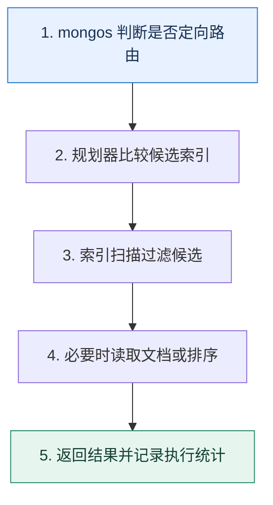

# MongoDB 查询优化｜让索引顺序服务真实的等值、排序与范围访问

> 本课只解决一个问题：复合索引字段应该怎样排序，查询为什么仍可能回表或广播？

这不是原页面的缩写，也不是一组孤立结论。下面先建立一个能推演的最小世界，再把状态、数字和失败分支摊开，最后按来源讲解顺序覆盖全部知识线索。读完后，你应当能从 `mongos 判断是否定向路由` 一直解释到 `返回结果并记录执行统计`，并说明中途任意一步失败会留下什么状态。

## 零基础入口：先建立本课的心智画面

查询先经过路由，再由目标分片的规划器选择索引，扫描键并在需要时读取文档。优化要同时减少目标分片数、扫描索引键数、读取文档数和排序工作。

先不要急着记组件名。只抓住四个问题：**现在手里有什么输入？下一步只做什么动作？哪个状态发生变化？变化后的结果交给谁？** 之后遇到新框架，只要这四个答案不变，核心机制就没有变。

### 放进一个足够小、可以手算的世界

查询 `{tenant:7, status:'PAID', created_at:{$gt:T}}`，按 amount 排序并取 20 条。若大多数记录都很新但 amount 排序必须稳定，可评估 `(tenant,status,amount,created_at)`；若时间范围只命中万分之一，`(tenant,status,created_at,amount)` 扫描更少但可能需要排序。用 explain 比较 keysExamined、docsExamined 与是否出现阻塞排序，而不是机械套公式。

这个小世界故意只保留本课必需的对象。生产系统会有更多节点、线程、分片和异常，但数量增加不会改变这里的因果关系。先确认你能手算这个例子，再把数字替换成真实系统数据。

### 先预测，不要马上看结论

**为什么复合索引设计不能永远机械地按 Equality→Sort→Range 排列？**

先写下自己的判断，并指出你依赖的前提。文末自我检查会揭示答案；如果答案不同，回到下面的状态表找出第一个分叉点。

## 本节精讲：让机制一步一步发生

常用 ESR 思路把等值字段放前面，再按工作负载在排序与范围之间选择。若避免内存排序更重要，可用 Equality→Sort→Range；若范围条件极具选择性，Equality→Range→Sort 可能扫描更少，但排序可能另行完成。覆盖查询只从索引返回所需字段，减少文档读取。分片查询包含分片键可定向路由，否则 mongos 可能广播。大数组、无限增长文档和过多索引会放大写入与搬迁成本，应按访问模式建模。

### 可见状态推进

| 当前步 | 现在发生的动作 | 下一步拿到什么 |
| ---: | --- | --- |
| 1 | mongos 判断是否定向路由 | 规划器比较候选索引 |
| 2 | 规划器比较候选索引 | 索引扫描过滤候选 |
| 3 | 索引扫描过滤候选 | 必要时读取文档或排序 |
| 4 | 必要时读取文档或排序 | 返回结果并记录执行统计 |
| 5 | 返回结果并记录执行统计 | 得到可核对的终态 |

图只承担一个任务：让你看清状态如何向前移动。它不意味着每一步必然成功；网络超时、进程退出、重复执行和数据竞争都可能让箭头停在中间，因此后面必须继续讨论失效边界。

### 一次带数字的完整推演

查询 `{tenant:7, status:'PAID', created_at:{$gt:T}}`，按 amount 排序并取 20 条。若大多数记录都很新但 amount 排序必须稳定，可评估 `(tenant,status,amount,created_at)`；若时间范围只命中万分之一，`(tenant,status,created_at,amount)` 扫描更少但可能需要排序。用 explain 比较 keysExamined、docsExamined 与是否出现阻塞排序，而不是机械套公式。

数字不是装饰。它迫使我们回答容量、顺序、时间窗口或版本选择问题。若换一个数字就得出不同结论，真正的设计依据就是那个阈值，而不是某个中间件名称。

## 按讲解顺序重建知识链：完整来源讲解

下面按来源资料的教学顺序重新编排完整内容。转换页码、来源图片、推广信息、水印、角色化问答和只服务于技术讨论场景的话术已经删除；机制、算法、例子、反例、事故线索、评论补充和限制条件仍然保留。这里的作用是补齐知识覆盖，不取代前面的独立推演。

今天我们来学习 MongoDB 的另外一个热点技术讨论主题——优化 MongoDB的查询性能。

就像之前我多次提到的，任何中间件的技术讨论说到底就是以高可用、高性能和高并发为主。高性能和高并发可以说是孪生兄弟，你做到了高性能，基本上就做到了高并发。

在技术讨论中，性能优化一直被看作是一个高级技术讨论点，因为只有对原理了解得很透彻的人，在实践中才能找准性能问题的关键点，从而通过各种优化手段解决性能问题。

在这之前，我们先来看看 MongoDB 的查询过程，这样方便你理解后面的优化手段。

### MongoDB 的查询过程

MongoDB 在分片之后肯定会有一些机制来保证查询能够准确找到数据。说到这里，你肯定想到了分库分表的查询过程。在分库分表中，查询的执行过程中最重要的一步，就是计算数据

可能在哪个目标表上。如果实在计算不出来，那么只能考虑使用广播。

而 MongoDB 也需要考虑类似的问题。在 MongoDB 里面，有一类实例叫做 mongos，这些实例就是负责路由查询到目标表上，还有合并结果集。

而在分库分表中，计算目标表是分库分表中间件或者分库分表代理完成的。

### MongoDB 的 ESR 规则

在 MongoDB 里面设计索引的时候就要考虑所谓的 ESR 规则。ESR 代表的是 E（Equality）、S（Sort）和 R（Range），也就是相等、排序和范围。你在设计索引的时候，按照 ESR 规则来排列你的索引列。

比如说，你用 A 进行等值查找，用 B 进行排序，用 C 进行范围查询，那么就应该是 ABC。如果你是 BAC，那么就违背了 ESR 规则。

而且 ESR 的三个元素是可以重复的，只要相对顺序不变就可以。

EESR：两个等值列是可以的。

ESSR：两个排序列也是可以的。ER：没有排序列也是可以的。ERR：两个范围列也是可以的。

因此你在设计索引、优化索引的时候就是要让索引尽可能符合 ESR 规则。

### 把知识转成可验证的工程判断

除了上面的这些基础知识，在技术讨论前你还需要在公司内部收集一些信息。

你们公司有没有遇到过 MongoDB 慢查询的问题？如果有，那么引发慢查询的原因是什么？最终又是怎么解决的？你有没有优化过 MongoDB 的索引？如果有，是怎么优化的？你们公司 MongoDB 的参数有没有调整过？如果调整过，调过哪些？为什么调整？你们公司 MongoDB 的平均查询时间多长？99 线以及 999 线是多少？

你可以把 MongoDB 的性能优化、MySQL 查询性能优化、Elasticsearch 性能优化三个合并在一起。也就是说你整个技术推理路径就是讨论它们三个的性能优化手段。

比如：

在讨论到 MySQL 索引优化的时候，提起优化 MongoDB 的索引。在讨论到分库分表分页查询的时候，提起 MongoDB 里的 mongos。在讨论 Elasticsearch 分片的时候，也可以提起 MongoDB 的分片。

你可以通过这样的横向对比，树立起一个掌握了各种中间件性能优化方法论的形象，从而加深技术评审者对你的印象，赢得竞争优势。

### 优化 MongoDB 查询

### 方案 1：使用覆盖索引

这里我是借鉴了 MySQL 里的说法。你应该知道，在 MySQL 上使用覆盖索引的最大好处就是不需要回表，从索引里就可以直接拿到你需要的数据。

在 MongoDB 里也可以用这样的手段。也就是说，如果有一个索引上有你要查询的全部数据，那么 MongoDB 就不用把整个文档加载出来。最直观的做法就是在查询中使用projection 方法指定字段，而且这些字段都是索引字段。

这算是最基本的优化手段，在真实的工作场景里也很常见。因为最开始开发者为了省事，通常都是直接把所有的字段都查询出来，后续随着数据量增长才会遇到性能问题。

之前我做过一个很简单的优化。我们早期有一个业务查询，就是把整个文档都加载起来。后面我发现，这个查询的调用者大部分其实不需要整个文档，只需要里面的几个字段。所以我就额外提供了一个新的查询接口，这个查询接口只会返回部分字段。这样优化之后，大部分查询都是改用新接口，MongoDB 也不需要把整个文档都加载出来，性能提升了至少30%。

你可以进一步总结升华一下。

也不仅仅是查询，就算是在更新的时候，也要尽可能做到只更新必要的字段。比如说在一些业务场景下，出于快速研发的角度，我们可能会考虑前端把整个文档传过来，后端就直接更新整个文档。但是如果能够做到只传来修改过的字段，那么就可以只更新必要的字段了。这样性能也更好。

### 方案 2：优化排序

这又是一个你在 MySQL 里见过的优化手段。在 MongoDB 里面，如果能够利用索引来排序的话，那么直接按照索引顺序加载数据就可以了。而如果不能利用索引来排序的话，就必须在加载了数据之后，再次进行排序，也就是进行内存排序。

可想而知，如果内存排序，再叠加分页查询的话，性能就会更差。比如说你要查询skip(100000).limit(100)，那么最坏的情况下，MongoDB 要把所有的文件都加载到内存里进行排序，然后找到从 100000 开始的 100 条数据。

优化的思路也类似于之前在 MySQL 里面讲的。第一种是把查询优化成利用索引来排序，可以考虑修改查询，也可以考虑修改索引。比如说你可以新建索引。

我还优化过一个分页查询。早期的时候，有一个查询是需要排序加分页的，但是最开始数据量不多，所以随便写了也没问题。但是后面数据量上来之后，这个地方查询就越来越慢。看到这个排序加分页的查询，我的第一个想法就是这个查询肯定是内存排序，不然不会那么

慢。我一排查，还真是这样。后来我就创建了一个新的索引，确保排序的时候可以直接利用索引来排序。

另外一种优化思路是借鉴我们在分库分表里面提到的禁止跨页查询，也就是说每次查询带上上一次查询的极值作为查询条件。

MongoDB 的分页查询还有一种优化方式，但是这种优化方式需要业务折中。也就是原本分页向后翻页是通过偏移量来进行的，那么现在可以通过修改查询条件，在查询语句里带上前一页的排序字段的极值。比如说我们的查询是根据创建时间 create_time 倒序排序，那么就可以优化成查询条件里上一批最小的 create_time，接近于 WHERE create_time<= $last_min_create_time 的语义。

注意，这里的极值是最大值还是最小值，跟你的排序有关。

另外你可以进一步把这个话题引导到 MySQL 和分库分表上。

总体来说，MongoDB 的分页查询面临的问题和关系型数据库分页查询面临的问题差不多，而在分片集合上进行分页查询面临的问题，也和分库分表的问题差不多。总之，分页查询如果不小心的话，是比较容易出现性能问题的。

既然 MongoDB 会有这种分页的问题，那么分片情况下处理分页的 mongos 岂不是就容易成为瓶颈吗？

是的，所以你就可以考虑增加 mongos 的数量。

### 方案 3：增加 mongos 数量

在前置知识里面你已经知道了，如果是分片集合的话，查询都要靠 mongos 来执行路由，并且合并结果集。

换一句话来说，mongos 就是查询的性能瓶颈，它可能是 CPU 瓶颈，可能是内存瓶颈，也可能是网络带宽瓶颈。我举一个例子你就知道了，比如说你有分页查询，那么 mongos 就必须要求各个分片查询到结果之后，自己再排序，选出全局分页里对应的数据。

因此，在实践中你要密切关注查询性能，并且在发现查询很慢的时候，就要去看看是不是mongos 引起的。

之前我还优化过 mongos。不过 mongos 实例能优化的不多，主要就是增加 mongos 实例。而且最好是独立部署 mongos，独享系统的 CPU 和内存资源。

另外一种技术讨论的思路是隔离。也就是考虑到 mongos 本身容易成为性能瓶颈，并且你也不能无限增加 mongos 实例，所以如果公司资源足够，你应该让核心业务使用独立的 mongos 实例，或者说独立的 MongoDB 集群。

并且，为了保证核心服务的查询效率和稳定性，我都是单独准备了一个集群给核心服务，这样可以保证核心服务的 mongos 互相之间没有影响。

### 方案 4：拆分大文档

这算是很常见的一种优化手段了。在一些特定的业务场景中，你会有一些很大的文档，这些文档有很多字段，并且有一些特定的字段还特别大。

那么你就可以考虑拆分这些文档。

大文档对 MongoDB 的性能影响还是很大的。就我的个人经验来说，我认为可以考虑从两个角度出发去拆分大文档。

1. 按照字段的访问频率拆分。也就是访问频繁的放一个文档，访问不频繁的拆出去，作为另外一个文档。
2. 按照字段的大小来拆分。也就是小字段放在一个文档，大字段拆出去，作为另外一个文档。
之前我就拆分过一个文档，非常庞大。而且在业务中，有一些庞大的字段根本用不上。在这种情况下，我一次拆出了三个文档。

3. 访问频繁的小字段放在一起，作为一个文档。

4. 把访问不频繁的大字段拆出去，作为一个文档。这个地方我觉得可以进一步优化为特定的巨大的字段可以直接拿出去，作为一个单独的文档。
5. 剩余的合并在一起，作为一个文档。
这样做的优点很明显，比较多的业务查询其实只需要第一种文档，极少数会需要第二种文档。但是缺点也同样明显，如果调用者需要整个文档，也就意味着我需要查询三次，再合并组成一个业务上完整的文档。

你还可以升华一下。

当然，拆分终究是下策，最好还是在一开始使用 MongoDB 的时候就约束住文档的大小。

不过还有一个和这种策略完全相反的优化手段：嵌入文档。

### 方案 5：嵌入文档

所谓的嵌入文档是指如果 A 文档和 B 文档有关联关系，那么就在 A 文档里面嵌入 B 文档，做成一个大文档。

相当于原本 A 文档和 B 文档都是单独存储的，可能在 A 文档里面有一个 B 文档的 ID 字段，又或者在 B 文档里有 A 的文档 ID。那么你可以考虑合并这两个文档。

你可以这么介绍你的方案。

早前我们有一个过度设计的场景，就是有两个文档 A 和 B。其中 A 里面有一个 B 的文档ID，建立了一对一的映射关系。但是实际上，业务查询的时候，基本上都是分成两次查询，先把 A 查询出来，再根据 A 里面的文档 ID 把 B 也查出来。

后面这个地方慢慢成为了性能瓶颈，我就尝试了优化这个地方。我的想法是既然 A 和 B 在业务上联系那么紧密，我可以直接把它们整合成一个文档。整合之后，一次查询就能拿到所有需要的数据了，直接节约了一个 MongoDB 查询，业务响应时间提高了，而且MongoDB 的压力也变小了。

那么如果技术评审者问你怎么直接整合成一个文档呢？你就可以考虑说你采用的是懒惰的、渐进式的整合方案。

我采用的是懒惰策略来整合文档。也就是说，如果我先查询 A 文档之后发现 A 文档还没有嵌入 B 文档，那么我就查询 B 文档，嵌入进 A 文档之后，直接更新 A 文档。在更新 A 文档的时候，要采用乐观锁策略，也就是在更新的条件里面，加上 A 文档不包含 B 文档这个条件。

我这个业务有一个好处，就是没有直接更新 B 文档的场景，都是通过 A 来操作 B 文档，所以并不需要考虑其他的并发问题。

这种懒惰更新策略里的最后一步更新动作，实际上就是一个乐观锁。所以你可以尝试把话题引导到乐观锁上。

不过，嵌入整个文档是很罕见的优化手段。更加常用的是嵌入部分字段，也叫做冗余字段。这种优化手段在关系型数据库里也很常见。比如说 A 经常使用 B 的某几个字段，那么就可以在A 里面冗余一份。不过这种冗余的方案会有比较严重的数据一致性问题。只有在你能够容忍这种数据不一致的时候，才可以应用这个方案。

在现实中最常见的场景就是在别的模块的文档里面冗余用户的昵称、头像，这样可以避免再次去用户文档里查询昵称或者头像。毕竟昵称和头像在很多时候，都不是什么关键字段。

### 方案 6：操作系统优化

前面提到的都是查询本身的优化，那么根据之前我们在 Kafka、Elasticsearch 里准备技术讨论的思路，我们也需要为 MongoDB 准备一些操作系统优化的点。这里我列出来一些简单的、你之前接触过的点。

首先就是内存优化。

在 MongoDB 里，索引对性能的影响很大，所以你应该尽可能保证有足够的物理内存来存放所有的索引。这个类似于前面 MySQL 里讨论索引的时候说到的，预估查询的耗时有一个基本的假设，就是索引都是放在内存里的。所以优化内存差不多就是使用钞能力，加大内存。

进一步，你也能够想到，swap 对 MongoDB 的影响也很大。你同样需要避免触发交换，也就是可以调小 vm.swappiness 这个参数。

### 本节原始知识线索收束

这一节课，我们先分析了 MongoDB 的查询过程，目的是让你知道 mongos 在其中的关键作用。在设计索引的过程中要注意遵循 ESR 规则。

后面我列举了覆盖索引、优化排序、增加 mongos 数量、拆分大文档、嵌入文档和操作系统优化几个性能优化方案。不过我知道业界肯定还有很多其他精妙绝伦的方案，你有兴趣可以进一步去搜集。

我想再强调一次，不管是 SQL 查询优化、Elasticsearch 查询优化，还是这里的 MongoDB查询优化，都有非常多的手段可以考虑，我们没办法全部列举出来，课程中没有提到的方案，就需要靠你自己去探索了。不过也

最后还是想要再叮嘱你一下，在工程复盘时要提前准备好优化方案，在技术讨论过程中注意引导。不然如果技术评审者自由发挥，手写一个查询让你优化，撞上你不知道的手段或者你没有见过的案例，你就解释不出来了。

### 继续推演

最后请你来思考两个问题。

在操作系统优化的时候，我并没有提到网络和磁盘 IO 方面的优化，那么你认为这两个角度可以怎么优化？对 MongoDB 的效果好不好？MongoDB 性能优化还有很多手段，你有没有用过什么很有特色的方案或者说让你印象深刻的方案？

### 补充讨论与边界校准

#### 全部留言 (1)

补充讨论：

讲解补充：我的理解是，放了一个指向数据的指针，并咩有存储真实的数据。

## 把完整讲解收束成一条因果链

1. 先从查询形状与分片键确定会访问多少分片。
2. 再按等值、排序、范围分析复合索引顺序。
3. 用 explain 的扫描量和排序验证 ESR 或 ERS 选择。
4. 最后治理覆盖查询、大文档、数组和索引写放大。

把这几步连接起来时，不要省略“为什么”。最终结论只有在前提、状态变化和失败代价都说得清楚时才可靠。

## 误区与失效边界

ESR 是指南，不是不可变定律；低选择性、排序方向、多键索引和分片路由都会改变结果。索引越多读选择越丰富，写入和缓存成本也越高。把 MongoDB 当作关系数据库逐表照搬，常会错失按聚合边界嵌入文档的优势。

再加一条通用但必须落实到本课对象上的边界：机制只能处理它看得见的信号。若输入指标失真、状态没有持久化、错误被吞掉，或者补偿没有幂等保护，再成熟的框架也只能基于错误证据作决定。

### 三种故障注入方式

| 故障 | 要观察什么 | 不能接受的解释 |
| --- | --- | --- |
| 在第 2 步前让依赖超时 | 是否停在可重试状态，是否消耗完上游预算 | “框架稍后会处理” |
| 在状态写入后让进程退出 | 重启后能否识别已完成与待继续动作 | “再执行一次应该没事” |
| 对同一输入并发执行两次 | 是否出现重复副作用、顺序颠倒或覆盖 | “概率很低” |

## 工程验证：把理解变成可以复查的证据

保存 Top 查询形状及 `nReturned、keysExamined、docsExamined、executionTime、targetedShards、hasSortStage`。每次加索引还要记录写入耗时、索引大小和构建影响，避免只优化一条读路径。

| 步骤 | 状态或动作 | 最少应留下的证据 |
| ---: | --- | --- |
| 1 | mongos 判断是否定向路由 | 开始时间、结束时间、输入标识、结果状态、异常原因 |
| 2 | 规划器比较候选索引 | 开始时间、结束时间、输入标识、结果状态、异常原因 |
| 3 | 索引扫描过滤候选 | 开始时间、结束时间、输入标识、结果状态、异常原因 |
| 4 | 必要时读取文档或排序 | 开始时间、结束时间、输入标识、结果状态、异常原因 |
| 5 | 返回结果并记录执行统计 | 开始时间、结束时间、输入标识、结果状态、异常原因 |

验证时同时记录成功路径和失败路径。只证明“正常时能跑通”不能说明设计可靠；至少要让一次超时、一次进程退出和一次重复请求可重现，并能根据日志或指标解释最后状态。

## 学完检查：闭卷画出本课

你现在应该能独立完成四件事：

1. 用自己的话说出本课唯一问题，不使用产品名也能解释。
2. 复算上面的具体例子，并指出哪个输入改变会让结论改变。
3. 沿 Mermaid 图注入一次失败，预测系统停在哪里以及由谁收敛。
4. 说出本课机制不保证什么，并给出一个反例。

## 自我检查

为什么复合索引设计不能永远机械地按 Equality→Sort→Range 排列？

如果范围条件极具选择性，把它提前可能大幅减少扫描；代价是排序可能无法完全由索引满足。应按实际数据分布与 explain 结果在 ESR 和 ERS 间选择。

怎样证明自己不是只记住了名词？

把 `mongos 判断是否定向路由` 的一个真实输入写出来，逐步记录到 `返回结果并记录执行统计`。然后在中间任意一步制造失败；如果你能解释当前状态、下一责任方、可观测证据和恢复边界，就已经拥有可以迁移的工程模型。

## 来源与事实校准

- [查看完整来源稿（本地 13 页资料）](../content/42-mongodb-performance.md)

### 当前事实校准

MongoDB 当前官方 ESR 指南并非机械定律：等值字段通常在前；若避免内存排序最重要可选 ESR，若范围极具选择性可考虑 ERS。复合索引前缀、分片定向路由、keysExamined、docsExamined 和阻塞排序必须用 explain 与真实分布共同验证。

- [MongoDB · ESR Guideline](https://www.mongodb.com/docs/manual/tutorial/equality-sort-range-guideline/)
- [MongoDB · Compound Indexes](https://www.mongodb.com/docs/manual/core/indexes/index-types/index-compound/)

来源稿用于核对覆盖范围，不随公开站点发布。产品默认值和具体内部行为可能随版本变化；落地时应使用目标版本的官方文档、可运行实验和故障演练校准。本学习稿中的零基础入口、状态推演、故障矩阵和工程验证属于编辑补充，不冒充来源讲解者的原话。
