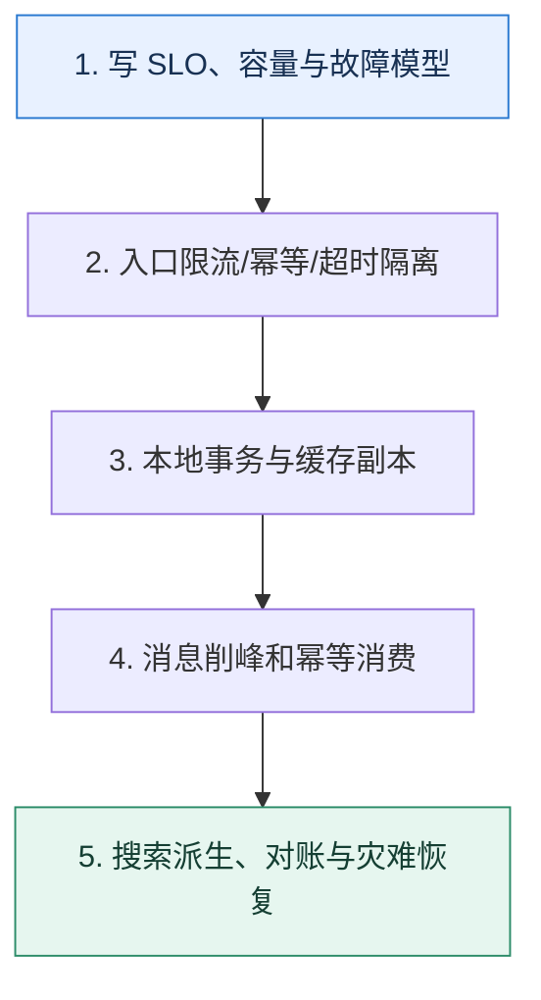

# 综合演练｜用一场流量突增验证整条后端链路

> 本课只解决一个问题：如何把服务治理、数据库、消息、缓存和 NoSQL 放进同一个可验证方案？

这不是原页面的缩写，也不是一组孤立结论。下面先建立一个能推演的最小世界，再把状态、数字和失败分支摊开，最后按来源讲解顺序覆盖全部知识线索。读完后，你应当能从 `写 SLO、容量与故障模型` 一直解释到 `搜索派生、对账与灾难恢复`，并说明中途任意一步失败会留下什么状态。

## 零基础入口：先建立本课的心智画面

综合题的价值不是堆中间件，而是从 SLO 和故障模型出发，让每一层只解决明确问题，并交代新增状态、降级方式、恢复步骤和验证指标。

先不要急着记组件名。只抓住四个问题：**现在手里有什么输入？下一步只做什么动作？哪个状态发生变化？变化后的结果交给谁？** 之后遇到新框架，只要这四个答案不变，核心机制就没有变。

### 放进一个足够小、可以手算的世界

大促峰值 100k 请求/秒，数据库安全写入 8k/秒。网关先把无资格请求挡掉，库存令牌只放 12k/秒进入队列；订单消费者按 7k/秒落库，差速可控。缓存故障时回源被限制到 3k/秒；支付服务 300ms 超时后不盲目重试扣款，而是按支付单号查询结果。搜索索引延迟 5 秒可接受，订单详情则回真相源。

这个小世界故意只保留本课必需的对象。生产系统会有更多节点、线程、分片和异常，但数量增加不会改变这里的因果关系。先确认你能手算这个例子，再把数字替换成真实系统数据。

### 先预测，不要马上看结论

**综合架构中为什么要先写 SLO 和安全容量，再选择中间件？**

先写下自己的判断，并指出你依赖的前提。文末自我检查会揭示答案；如果答案不同，回到下面的状态表找出第一个分叉点。

## 本节精讲：让机制一步一步发生

先写峰值流量、用户延迟、正确性、RPO/RTO 和成本边界；入口用限流与幂等令牌保护核心链路，服务调用分配超时预算并隔离外部依赖。数据库以本地事务保存事实与 Outbox，缓存只作为可失效副本，消息队列削峰并以业务键维持实体内顺序，消费者幂等。搜索索引从事件派生，允许明确延迟并可重建。每个异步状态都有查询、重试、死信和对账入口。

### 可见状态推进

| 当前步 | 现在发生的动作 | 下一步拿到什么 |
| ---: | --- | --- |
| 1 | 写 SLO、容量与故障模型 | 入口限流/幂等/超时隔离 |
| 2 | 入口限流/幂等/超时隔离 | 本地事务与缓存副本 |
| 3 | 本地事务与缓存副本 | 消息削峰和幂等消费 |
| 4 | 消息削峰和幂等消费 | 搜索派生、对账与灾难恢复 |
| 5 | 搜索派生、对账与灾难恢复 | 得到可核对的终态 |

图只承担一个任务：让你看清状态如何向前移动。它不意味着每一步必然成功；网络超时、进程退出、重复执行和数据竞争都可能让箭头停在中间，因此后面必须继续讨论失效边界。

### 一次带数字的完整推演

大促峰值 100k 请求/秒，数据库安全写入 8k/秒。网关先把无资格请求挡掉，库存令牌只放 12k/秒进入队列；订单消费者按 7k/秒落库，差速可控。缓存故障时回源被限制到 3k/秒；支付服务 300ms 超时后不盲目重试扣款，而是按支付单号查询结果。搜索索引延迟 5 秒可接受，订单详情则回真相源。

数字不是装饰。它迫使我们回答容量、顺序、时间窗口或版本选择问题。若换一个数字就得出不同结论，真正的设计依据就是那个阈值，而不是某个中间件名称。

## 综合演练场：从一张空白纸设计大促下单链路

这里不提供“标准架构图”让你照抄，而是给出一组会互相冲突的约束。你的任务是先算清楚，再决定同步、异步、缓存和降级边界。

### 约束一：先把数字钉在桌面上

| 约束 | 数值 | 它会限制什么 |
| --- | ---: | --- |
| 活动页峰值访问 | 100,000 QPS | 网关、静态资源与缓存入口 |
| 真正提交订单 | 12,000 QPS | 库存资格校验与消息入口 |
| 订单库安全写入 | 8,000 TPS | 同步写入或消费速率上限 |
| 支付接口 P99 | 220 ms | 同步超时预算与未知结果窗口 |
| 用户下单响应目标 | P99 ≤ 500 ms | 同步关键路径总预算 |
| 允许库存展示陈旧 | 3 s | 缓存 TTL 与失效传播窗口 |
| 订单事实 RPO | 0 | 本地事务、日志确认与备份策略 |
| 故障后核心下单恢复 | 10 min | RTO、演练和恢复优先级 |

第一步不是选 Redis、Kafka 或 Elasticsearch，而是检查约束是否自洽：入口允许 12,000 个下单请求进入，但订单库只能稳定写 8,000 条/秒。如果峰值持续 10 分钟，差速是 `12,000 - 8,000 = 4,000 条/秒`，累计积压就是 `4,000 × 600 = 2,400,000 条`。若活动结束后消费者能提升到 10,000 条/秒，而新请求仍有 2,000 条/秒，则净清理速度为 8,000 条/秒，理论上还需 300 秒才能清空。

这组数字揭示两个事实：消息队列只能把压力改成积压，不会扩大数据库容量；系统必须同时规定最大积压、活动后的追平能力，以及积压过大时减少哪些非核心工作。

### 约束二：沿一次请求分配 500 ms 预算

假设用户请求经过网关、资格服务、库存令牌和订单受理四段：

| 阶段 | 预算 | 超时或拒绝后的承诺 |
| --- | ---: | --- |
| 网关认证与限流 | 30 ms | 明确拒绝，不进入下游 |
| 活动资格读取 | 80 ms | 可读 3 秒内旧缓存；无缓存则降级 |
| 库存令牌 | 120 ms | 返回售罄或稍后重试，不绕过令牌直写数据库 |
| 订单受理事务 | 170 ms | 保存订单事实与 Outbox 后返回“已受理” |
| 网络与应用余量 | 100 ms | 吸收抖动，不能被前面各段重复花掉 |

预算总和正好是 500 ms，但这并不意味着每一段都把本段预算耗尽后再重试。若资格服务在 80 ms 末尾重试一次 80 ms，下游已经无预算可用。正确做法是传播同一个截止时间，让每一跳根据剩余时间决定是否还有资格开始下一次尝试。

### 约束三：明确每份状态的唯一所有者

| 状态 | 权威位置 | 可失效副本或派生物 | 收敛方式 |
| --- | --- | --- | --- |
| 订单状态 | 订单数据库 | 用户查询缓存、搜索索引 | Outbox 事件、版本号、对账 |
| 库存事实 | 库存数据库/令牌状态机 | 商品页展示缓存 | 条件更新、事件失效、周期校准 |
| 支付结果 | 支付单状态机 | 前端展示、通知记录 | 幂等支付单号、主动查询、回调去重 |
| 搜索文档 | 不作为订单真相 | Elasticsearch 索引 | 版本化事件、重放、全量重建 |

如果一份状态找不到唯一所有者，就无法判断冲突时相信谁。缓存与搜索都可以比权威存储更快，但它们必须允许删除、重建和暂时落后；否则派生副本会反过来绑架核心事务。

## 连续注入五种故障

不要分别背五套方案。把它们按时间压到同一次活动中，观察保护是否会互相抵消。

### 故障 A：缓存集群完全不可用

活动页仍有 100,000 QPS，而数据库只能承受 3,000 QPS 的读回源。若所有请求直接穿透，数据库会在核心订单写入到来之前被读请求压垮。恢复动作应按顺序发生：先用网关限制回源并返回静态快照或旧值，再让一个受控回填通道恢复热点，最后逐步放量。验收指标不是“缓存恢复了”，而是故障期间数据库读 QPS 从未超过安全水位，订单写入 P99 仍在预算内。

### 故障 B：支付请求超时，但调用方不知道是否扣款

支付调用在 300 ms 处超时，可能是请求没到，也可能是对方已扣款但响应丢失。此时直接生成新支付单再次扣款会制造重复副作用。系统应使用同一业务支付单号查询或重试，由对方幂等约束收敛；本地状态保留 `PROCESSING/UNKNOWN`，由查询任务和回调共同推进，不能把网络超时等同于业务失败。

### 故障 C：消费者处理成功后、提交位置前崩溃

消息会再次到达。订单消费者应在同一本地事务中写业务结果和事件幂等键，第二次处理读取既有结果。若去重只写 Redis，Redis 标记与数据库事务之间仍有崩溃空隙。验证方法是把进程分别杀在事务前、提交后和 offset 提交前，最终都只能产生一次订单状态转换。

### 故障 D：数据库延迟从 20 ms 升到 400 ms

连接池中的慢请求会让排队时间继续放大。熔断器看到的失败率只是结果，真正保护动作还包括缩短入口许可、隔离非核心消费者、暂停搜索派生和通知、限制恢复重试。此时扩消息消费者会更糟，因为它们争抢同一个已饱和数据库。

### 故障 E：搜索索引落后 15 分钟

若订单详情依赖搜索结果，用户会看到“订单不存在”；若搜索只服务模糊检索，详情页仍可回权威订单库。系统应展示索引延迟并暂停依赖新鲜索引的功能，对落后版本重放事件或全量重建。恢复完成必须通过版本对账证明，而不是只看集群状态变绿。

## 你的结课交付物

完成本节不是读到页面底部，而是独立提交以下四份材料：

1. 一张同步关键路径图：每条边标注截止时间、重试条件和幂等键。
2. 一张状态所有权表：每份事实、缓存、消息位置和搜索文档都写明所有者与收敛方式。
3. 一张容量表：给出峰值、下游安全水位、积压增长速度和清空时间。
4. 一张故障矩阵：覆盖缓存全挂、数据库变慢、消息重复、支付未知和索引落后，写清用户体验、自动动作、数据风险、恢复步骤和责任人。

### 自评分标准（100 分）

| 项目 | 分值 | 满分条件 |
| --- | ---: | --- |
| 约束与容量 | 20 | 有明确 SLO、RPO/RTO、峰值和安全水位，并能手算积压 |
| 状态与一致性 | 25 | 权威状态唯一，异步边界、幂等键和对账闭环清楚 |
| 故障保护 | 25 | 超时、隔离、限流和降级不会把压力转移到同一瓶颈 |
| 恢复与证据 | 20 | 每种故障都有指标、日志、演练步骤和可验证终态 |
| 取舍表达 | 10 | 能说明至少两个备选方案及其代价，而非堆产品名 |

少于 80 分时，不必回去从第一页重读。找到失分最多的一行，回到对应专题，用同一组业务数字重新推演；只有推演结果能写进这四份材料，知识才真正连接起来。

## 按讲解顺序重建知识链：完整来源讲解

下面按来源资料的教学顺序重新编排完整内容。转换页码、来源图片、推广信息、水印、角色化问答和只服务于技术讨论场景的话术已经删除；机制、算法、例子、反例、事故线索、评论补充和限制条件仍然保留。这里的作用是补齐知识覆盖，不取代前面的独立推演。

本套后端工程学习资料的更新告一段落，非常开心能和你交流技术、共同进步，为认真学习的你点赞！为了帮你检验自己的学习成果，我特意准备了一套期末测试题。题目共有 20道，11 道单选题，9 道多选题，满分 100 分，快来挑战一下吧！

### 精选留言

由作者筛选后的优质留言将会公开显示，欢迎踊跃留言。

## 把完整讲解收束成一条因果链

1. 从用户动作画同步关键路径与异步旁路。
2. 为每一跳标注超时、容量、重试和幂等键。
3. 依次注入下游超时、数据库变慢、消息积压、缓存全挂和索引落后。
4. 最后用 RPO/RTO、业务对账与降级体验评价方案。

把这几步连接起来时，不要省略“为什么”。最终结论只有在前提、状态变化和失败代价都说得清楚时才可靠。

## 误区与失效边界

任何“自动扩容、最终一致、高可用”都必须落成数字与状态机。若数据库已满，单纯把入口改异步只会积压；若幂等键定义错，重试会重复副作用；若恢复没有优先级，重建流量可能压垮在线服务。

再加一条通用但必须落实到本课对象上的边界：机制只能处理它看得见的信号。若输入指标失真、状态没有持久化、错误被吞掉，或者补偿没有幂等保护，再成熟的框架也只能基于错误证据作决定。

### 三种故障注入方式

| 故障 | 要观察什么 | 不能接受的解释 |
| --- | --- | --- |
| 在第 2 步前让依赖超时 | 是否停在可重试状态，是否消耗完上游预算 | “框架稍后会处理” |
| 在状态写入后让进程退出 | 重启后能否识别已完成与待继续动作 | “再执行一次应该没事” |
| 对同一输入并发执行两次 | 是否出现重复副作用、顺序颠倒或覆盖 | “概率很低” |

## 工程验证：把理解变成可以复查的证据

提交一张架构图和一张故障表。故障表每行包括 `故障、检测信号、自动动作、用户看到什么、数据是否会丢、恢复步骤、负责人`；再用压测数据证明各限流阈值小于下游安全容量。

| 步骤 | 状态或动作 | 最少应留下的证据 |
| ---: | --- | --- |
| 1 | 写 SLO、容量与故障模型 | 开始时间、结束时间、输入标识、结果状态、异常原因 |
| 2 | 入口限流/幂等/超时隔离 | 开始时间、结束时间、输入标识、结果状态、异常原因 |
| 3 | 本地事务与缓存副本 | 开始时间、结束时间、输入标识、结果状态、异常原因 |
| 4 | 消息削峰和幂等消费 | 开始时间、结束时间、输入标识、结果状态、异常原因 |
| 5 | 搜索派生、对账与灾难恢复 | 开始时间、结束时间、输入标识、结果状态、异常原因 |

验证时同时记录成功路径和失败路径。只证明“正常时能跑通”不能说明设计可靠；至少要让一次超时、一次进程退出和一次重复请求可重现，并能根据日志或指标解释最后状态。

## 学完检查：闭卷画出本课

你现在应该能独立完成四件事：

1. 用自己的话说出本课唯一问题，不使用产品名也能解释。
2. 复算上面的具体例子，并指出哪个输入改变会让结论改变。
3. 沿 Mermaid 图注入一次失败，预测系统停在哪里以及由谁收敛。
4. 说出本课机制不保证什么，并给出一个反例。

## 自我检查

综合架构中为什么要先写 SLO 和安全容量，再选择中间件？

同一技术在不同延迟、一致性和故障要求下取舍不同。没有数字就无法确定限流、超时、缓存陈旧窗口、消息积压上限和恢复优先级。

怎样证明自己不是只记住了名词？

把 `写 SLO、容量与故障模型` 的一个真实输入写出来，逐步记录到 `搜索派生、对账与灾难恢复`。然后在中间任意一步制造失败；如果你能解释当前状态、下一责任方、可观测证据和恢复边界，就已经拥有可以迁移的工程模型。

## 来源与事实校准

- [查看完整来源稿（本地 2 页资料）](../content/43-final-test.md)

### 当前事实校准

综合架构没有脱离目标的标准答案。限流阈值、超时预算、消息积压上限、缓存陈旧窗口、复制确认和恢复优先级，都必须由用户 SLO、下游安全容量、RPO/RTO 与故障演练数据共同决定。

- [Google SRE · Monitoring Distributed Systems](https://sre.google/sre-book/monitoring-distributed-systems/)
- [OpenTelemetry · Traces](https://opentelemetry.io/docs/concepts/signals/traces/)

来源稿用于核对覆盖范围，不随公开站点发布。产品默认值和具体内部行为可能随版本变化；落地时应使用目标版本的官方文档、可运行实验和故障演练校准。本学习稿中的零基础入口、状态推演、故障矩阵和工程验证属于编辑补充，不冒充来源讲解者的原话。
