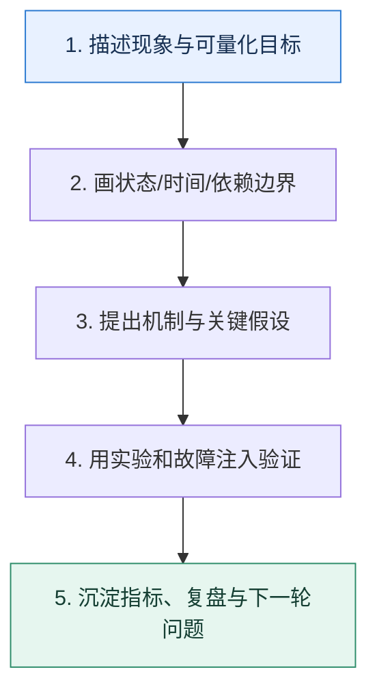

# 学习收束｜把知识点沉淀成可复用的工程判断

> 本课只解决一个问题：学完 50 篇后，怎样避免只记住术语，却不会定位真实问题？

这不是原页面的缩写，也不是一组孤立结论。下面先建立一个能推演的最小世界，再把状态、数字和失败分支摊开，最后按来源讲解顺序覆盖全部知识线索。读完后，你应当能从 `描述现象与可量化目标` 一直解释到 `沉淀指标、复盘与下一轮问题`，并说明中途任意一步失败会留下什么状态。

## 零基础入口：先建立本课的心智画面

可迁移能力来自一套稳定推理顺序：先描述现象与目标，再追踪状态和时间线，量化容量，识别故障边界，选择机制，最后用实验和监控反证。产品会升级，这套方法比参数记忆更耐久。

先不要急着记组件名。只抓住四个问题：**现在手里有什么输入？下一步只做什么动作？哪个状态发生变化？变化后的结果交给谁？** 之后遇到新框架，只要这四个答案不变，核心机制就没有变。

### 放进一个足够小、可以手算的世界

遇到缓存旧值：先画数据库提交、缓存失效、并发回填时间线；遇到消息积压：先算生产减消费的差速与清空时间；遇到服务雪崩：先画调用链、超时预算和共享资源池；遇到查询变慢：先看访问路径、扫描量和数据分布。四个问题使用的是同一套证据驱动方法。

这个小世界故意只保留本课必需的对象。生产系统会有更多节点、线程、分片和异常，但数量增加不会改变这里的因果关系。先确认你能手算这个例子，再把数字替换成真实系统数据。

### 先预测，不要马上看结论

**判断自己真正掌握一个机制，最可靠的标准是什么？**

先写下自己的判断，并指出你依赖的前提。文末自我检查会揭示答案；如果答案不同，回到下面的状态表找出第一个分叉点。

## 本节精讲：让机制一步一步发生

每个专题都可以归到四类控制：流量控制决定多少工作进入系统；状态控制决定事实写在哪里、如何并发与复制；时间控制处理超时、过期、延迟和重试；故障控制负责隔离、降级、恢复与对账。复习时不要问“某组件有什么特性”，而要问“它在哪个边界承诺了什么，失败后剩下什么状态，谁来收敛”。

### 可见状态推进

| 当前步 | 现在发生的动作 | 下一步拿到什么 |
| ---: | --- | --- |
| 1 | 描述现象与可量化目标 | 画状态/时间/依赖边界 |
| 2 | 画状态/时间/依赖边界 | 提出机制与关键假设 |
| 3 | 提出机制与关键假设 | 用实验和故障注入验证 |
| 4 | 用实验和故障注入验证 | 沉淀指标、复盘与下一轮问题 |
| 5 | 沉淀指标、复盘与下一轮问题 | 得到可核对的终态 |

图只承担一个任务：让你看清状态如何向前移动。它不意味着每一步必然成功；网络超时、进程退出、重复执行和数据竞争都可能让箭头停在中间，因此后面必须继续讨论失效边界。

### 一次带数字的完整推演

遇到缓存旧值：先画数据库提交、缓存失效、并发回填时间线；遇到消息积压：先算生产减消费的差速与清空时间；遇到服务雪崩：先画调用链、超时预算和共享资源池；遇到查询变慢：先看访问路径、扫描量和数据分布。四个问题使用的是同一套证据驱动方法。

数字不是装饰。它迫使我们回答容量、顺序、时间窗口或版本选择问题。若换一个数字就得出不同结论，真正的设计依据就是那个阈值，而不是某个中间件名称。

## 按讲解顺序重建知识链：完整来源讲解

下面按来源资料的教学顺序重新编排完整内容。转换页码、来源图片、推广信息、水印、角色化问答和只服务于技术讨论场景的话术已经删除；机制、算法、例子、反例、事故线索、评论补充和限制条件仍然保留。这里的作用是补齐知识覆盖，不取代前面的独立推演。

历经几个月，这门课程终于要完结了，感谢你一路的支持与相伴。这段时间我总是能在评论区看到各种各样有意思的问题、观点和分享，甚至里面有一些我都没有想到的解决方案，真真的应了那句“教学相长”。

这段时间，也一直有训练营的学员找我反馈，说这门课程切实帮助到了他们，在工程复盘时顺利了不少，甚至有些人还能结合自己工作内容设计出一些精巧的方案，拿出去技术讨论的时候给技术评审者留下了很不错的印象。

当然，你可能好奇我究竟是怎么想到这些方案的，毕竟有一些方案确实称得上是不走寻常路的“定制化做法”。你可能也在想，什么时候自己也能轻松设计出类似的甚至更好的方案，但其实我并不鼓励你一开始就去追求这种奇技淫巧。

相反，我更加希望你能先夯实基础，而后博闻广识，进而创新。等你能够结合实践自由创新的时候，各种“定制化做法”就自然而然地出现了。

### 夯实基础：万丈高楼平地起

第一步也是非常重要的一步就是打好基础，基础是构筑高楼大厦的基石。这意味着你要理解和掌握编程语言的基础知识，如语法、数据类型、控制结构等 。没有这些基础，你很难理解框架为什么这么设计，方案为什么要这么设计。

此外，基础决定了你的上限。在我们这个行业，一个大家普遍认同的观点就是，那些在编程领域取得突出成就的人，往往都是那些能够深入理解基础概念，并能够灵活运用这些知识解决实际问题的人。所以无论你选择学习哪种编程语言或技术，都需要有一定的编程基础和算法基础。这些基础知识和技能是你的“学习工具箱”，无论走到哪里，都能帮助你快速理解和掌握新的知识和技术。

基础知识的重要性在我们的课程里面也体现得淋漓尽致。比如说每次讲到性能优化的时候，我都会提及的操作系统优化，实际上就是操作系统原理的简单应用而已。

虽然我出这门课程是为了帮助你快速通过技术讨论，但这只是我们追求的最终结果之一。基本功打好了，offer 也就不愁了。所以我在设计这门课程的时候也在尽力地为你铺垫好基础知识，搭起一座桥梁。这也就导致我们这门课几乎每一讲都是六七千字，音频都超过了 20 分钟，几乎是别的课程 2 倍的体量。

因此，如果你寻求“定制化做法”，首先应该做的是夯实基础。只有当你的基础足够扎实，才能更好地理解和掌握新技术，才能在编程的道路上走得更高、更远。

### 博闻广识：眼界决定边界

在当今技术日新月异的时代，你必须不断拓展自己的知识领域，以适应不断变化的市场需求。

了解多个领域的知识有助于开拓思维。通过学习其他领域的知识，你可以从中汲取新的思路和想法，并将其应用到自己的工作中。这不仅可以提高你的创新能力，还可以帮助你从更广阔的

视角看待问题，从而更好地解决问题。正如同你在课程里面看到我设计的各种方案，其实都借鉴了已有开源框架的思想、解决思路。

此外，拓宽知识面还有助于提高解决问题的能力，可以让你深刻理解这些方案背后一脉相承的思想。并且这些技术、解决方案各有优缺点，通过总结这些优缺点，你更加能够理解在什么场景下应该使用什么样的方案，并反哺到自己的工作中。

总而言之，你只有看得多了，想得多了，才能拉开和别人的差距，才能实现创新，给未来的自己争取更多选择的权利。

### 创新：立于不败之地

如果你想要在未来的工作生涯中，跨过 35 岁职业危机，保持竞争力甚至更进一步，那么创新精神是必不可少的。

创新可以帮助你满足不断变化的市场需求。在技术快速发展的今天，市场需求也在不断变化。你需要具备创新精神，不断探索新技术、新方法和新思路，提供更加高效、灵活、安全的解决方案，为公司赢得竞争优势。

此外，创新还可以帮助你提高个人竞争力。在竞争激烈的职场中，具备创新精神和创新能力是你脱颖而出的关键。只有具备创新精神，你才能在职场中不断推出新的想法和解决方案，获得更好的职业发展和薪资待遇。同时你也更容易获得领导和同事的认可和信任，从而在职场中获得更多的机会和资源。

不过创新也会遇到重重阻碍，比如组织关系上、团队协作上，都很容易推进不下去，让方案夭折。我们的课程提到的基本都是技术面可能出现的问题及应对之策，但有些职业可能还会考察你的软实力，不免会出现一些非技术类的问题，不过和这门课程方向相左，我也没有详细聊这方面的内容，不过如果你感兴趣的话，可以在评论区分享你的故事和困境，我们一起帮你出谋划策。

### 最后的话

现在的你决定了以后的你。只要你能够静下心，花上几年的时间去夯实基础，不断学习好的框架、好的方案和好的实践，肯定能够脱胎换骨。我这里也提前预祝你在后续的求职技术讨论中能够顺利过关，获得理想的薪资和岗位。

虽然课程结束了，但学习的脚步不会停止，我们的课程始终都在，我也会一直在，如果你在学习的课程中遇到任何问题，欢迎随时向我提问。最后我准备了一份结课问卷，希望你花几分钟的时间填写一下，期待听到你对课程的反馈！

### 补充讨论与边界校准

#### 全部留言 (2)

补充讨论：

讲解补充：加油加油！

1

补充讨论：

讲解补充：加油！

## 把完整讲解收束成一条因果链

1. 从五个专题各选一个真实问题，不看标题重新推导。
2. 给每个方案写出前提、收益、代价和失效边界。
3. 用一个最小实验或故障演练验证最关键假设。
4. 把结果更新到自己的运行手册，而不是停在概念笔记。

把这几步连接起来时，不要省略“为什么”。最终结论只有在前提、状态变化和失败代价都说得清楚时才可靠。

## 误区与失效边界

完整学习不等于每项都自行实现，也不等于一次读完。某些机制受版本、部署和业务语义影响，必须回到官方文档、压测和故障演练校准；对不确定结论保留条件比给出绝对答案更专业。

再加一条通用但必须落实到本课对象上的边界：机制只能处理它看得见的信号。若输入指标失真、状态没有持久化、错误被吞掉，或者补偿没有幂等保护，再成熟的框架也只能基于错误证据作决定。

### 三种故障注入方式

| 故障 | 要观察什么 | 不能接受的解释 |
| --- | --- | --- |
| 在第 2 步前让依赖超时 | 是否停在可重试状态，是否消耗完上游预算 | “框架稍后会处理” |
| 在状态写入后让进程退出 | 重启后能否识别已完成与待继续动作 | “再执行一次应该没事” |
| 对同一输入并发执行两次 | 是否出现重复副作用、顺序颠倒或覆盖 | “概率很低” |

## 工程验证：把理解变成可以复查的证据

建立个人工程判断卡：正面写问题与约束，背面写状态流、容量公式、三个故障点、两个可替代方案和一个验证实验。每周抽取一张，用新案例重做，答案应随证据而不是随记忆更新。

| 步骤 | 状态或动作 | 最少应留下的证据 |
| ---: | --- | --- |
| 1 | 描述现象与可量化目标 | 开始时间、结束时间、输入标识、结果状态、异常原因 |
| 2 | 画状态/时间/依赖边界 | 开始时间、结束时间、输入标识、结果状态、异常原因 |
| 3 | 提出机制与关键假设 | 开始时间、结束时间、输入标识、结果状态、异常原因 |
| 4 | 用实验和故障注入验证 | 开始时间、结束时间、输入标识、结果状态、异常原因 |
| 5 | 沉淀指标、复盘与下一轮问题 | 开始时间、结束时间、输入标识、结果状态、异常原因 |

验证时同时记录成功路径和失败路径。只证明“正常时能跑通”不能说明设计可靠；至少要让一次超时、一次进程退出和一次重复请求可重现，并能根据日志或指标解释最后状态。

## 学完检查：闭卷画出本课

你现在应该能独立完成四件事：

1. 用自己的话说出本课唯一问题，不使用产品名也能解释。
2. 复算上面的具体例子，并指出哪个输入改变会让结论改变。
3. 沿 Mermaid 图注入一次失败，预测系统停在哪里以及由谁收敛。
4. 说出本课机制不保证什么，并给出一个反例。

## 自我检查

判断自己真正掌握一个机制，最可靠的标准是什么？

能在给定约束下从状态与时间线推导它，说明适用边界和代价，并设计实验或故障注入验证；仅能复述定义还不够。

怎样证明自己不是只记住了名词？

把 `描述现象与可量化目标` 的一个真实输入写出来，逐步记录到 `沉淀指标、复盘与下一轮问题`。然后在中间任意一步制造失败；如果你能解释当前状态、下一责任方、可观测证据和恢复边界，就已经拥有可以迁移的工程模型。

## 来源与事实校准

- [查看完整来源稿（本地 5 页资料）](../content/44-closing.md)

### 当前事实校准

产品参数会变化，稳定能力是从现象出发画状态与时间线、量化容量、说明失效边界，再用指标和故障注入反证。复习应持续回到目标版本官方资料与可重复实验，而不是把本稿当成永久不变的配置清单。

- [Google SRE · Monitoring Distributed Systems](https://sre.google/sre-book/monitoring-distributed-systems/)
- [OpenTelemetry · Traces](https://opentelemetry.io/docs/concepts/signals/traces/)

来源稿用于核对覆盖范围，不随公开站点发布。产品默认值和具体内部行为可能随版本变化；落地时应使用目标版本的官方文档、可运行实验和故障演练校准。本学习稿中的零基础入口、状态推演、故障矩阵和工程验证属于编辑补充，不冒充来源讲解者的原话。
